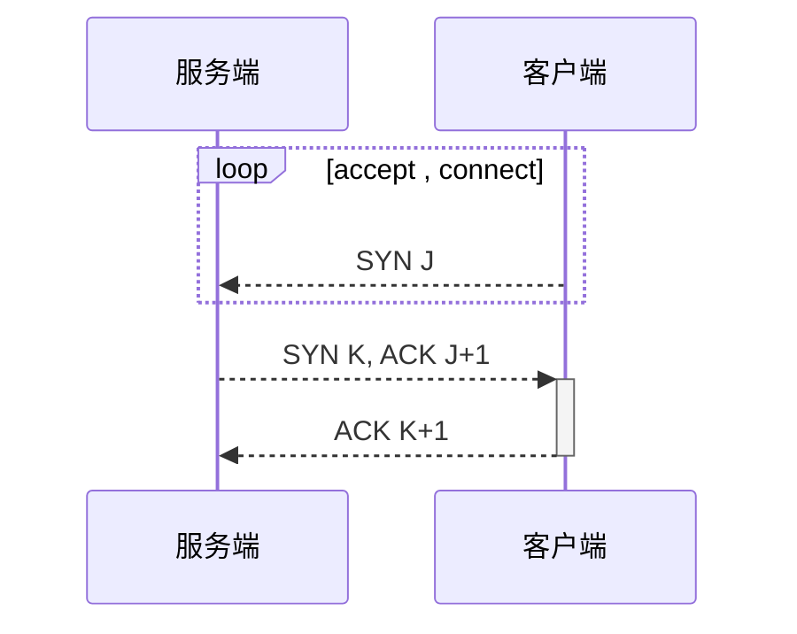
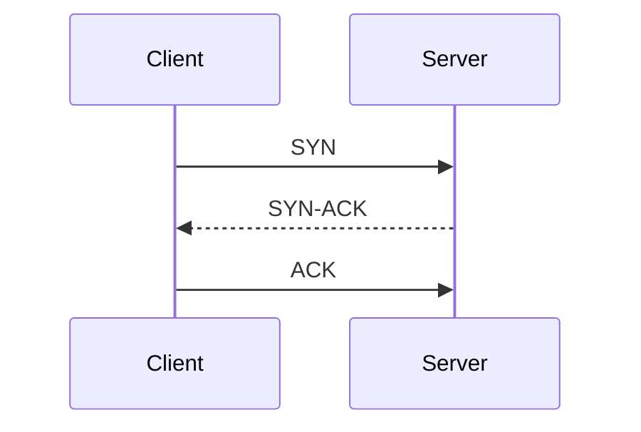
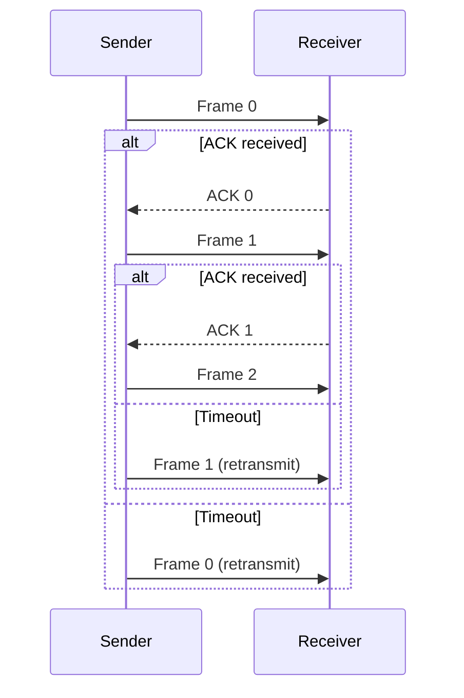

# TCP与UDP实现

发送管道和接收管道。

## 疑问

1. 一个端口是否可以接收多个套接字并发送数据？

服务端监听一个端口的时候，如果收到了 TCP 连接，还可以继续调用 Accept 进行监听。服务端接收到之后会分配一个端口用以进行通信。
此时，服务端和客户端相当于只是占用了一个可知的端口，就是服务端用于监听连接请求的端口。客户端和服务端的通信端口是使用的分配的端口？？？
这种通信方式和指定绑定端口进行通信有差别吗？？？

理论上理解：按上述方式，服务端只使用了一个端口进行通信，但是维持了多个 socket ，包括用于监听的 socket。客户端使用的端口是建立连接之后系统分配的端口。这些通信的 socket 性能不会受太大的影响。

所以如果可以的话，约定一定的协议，服务端只需要开启一个端口，就可以给 m 个客户端，发送不同的数据。
甚至支持对于"第二层协议"的支持，那么就可以对协议进行解析，并且使用该协议进行通信。

## 测试

1. 阻塞情况下的测试
2. 大数据传输测试
3. 接口攻击.

## TCP方式

请求连接时需要三次握手。
结束时需要四次挥手。

TCP是可靠的连接,协议里已经处理了丢包/误包重发的机制。

服务端初始化之后，bind一个自己的addr，设置为listen，阻塞到accept。accept接收到数据之后返回一个socket，此时已经建立了TCP可靠连接，使用该socket可以send到地址。

客户端，connect到服务端所bind的套接字，超时后继续connect，此过程发送SYN J请求连接，之后接收服务端返回的确认SYN K和ACK J+1包，connect将ACK K+1包返回，之后即可开始recv()阻塞等待接收数据。



首先设置版本和lib库
```C++
//socket 需要
#pragma comment(lib,"ws2_32.lib")

WSADATA wsaData;
WORD socketVersion = MAKEWORD(2, 0);
if (WSAStartup(socketVersion, &wsaData) != 0)
{
    printf("Init socket dll error!");
    return -1;
}
```

Client:主动连接并接收数据
```C++

	WSADATA wsaData;
	WORD socketVersion = MAKEWORD(2, 0);
	if (WSAStartup(socketVersion, &wsaData) != 0)
	{
		printf("Init socket dll error!");
		return -1;
	}

	struct sockaddr_in address;//发送套接字
	SOCKET sockfd = 0;
	int port = 9999;
	char ip[16] = "127.0.0.1";
	
	char buffer[1024] = { 0 };

	int ret = 0;

	sockfd = socket(AF_INET, SOCK_STREAM, 0);
	if (sockfd == -1) {
		printf("Error socket\n");
	}

	int nSendBuf = 1024;
	setsockopt(sockfd , SOL_SOCKET , SO_SNDBUF , (const char*) &nSendBuf, sizeof(int));

	//套接字，连接到指定ip端口
	address.sin_family = AF_INET;
	address.sin_port = htons(port);
	address.sin_addr.s_addr = inet_addr(ip);

	ret = ::connect(sockfd, (struct sockaddr*)&address, sizeof(address));
	while (ret == -1 && swi == 1) {
		ret = ::connect(sockfd, (struct sockaddr*)&address, sizeof(address));
	}

	for (int i = 0;;i++) {
		ret = recv(sockfd, buffer, 1024, 0);//阻塞点
		if (ret == -1)
		{
			printf("Error recv\n");
		}
		printf("%s \n" , buffer);
	}
```

Server:监听连接并发送数据。
```C++
DWORD WINAPI CommunicationThread(LPVOID args)
{
	WSADATA wsaData;
	WORD socketVersion = MAKEWORD(2, 0);
	if (WSAStartup(socketVersion, &wsaData) != 0)
	{
		printf("Init socket dll error!");
		return -1;
	}

	struct sockaddr_in address;//发送套接字
	SOCKET sockfd = 0;
	int port = 9999;
	char ip[16] = { 0 };

	char buffer[1024] = { 0 };

	int ret = 0;

	sockfd = socket(AF_INET, SOCK_STREAM, IPPROTO_TCP);
	if (sockfd == -1) {
		printf("Error socket\n");
	}

	int nSendBuf = 1024;
	setsockopt(sockfd, SOL_SOCKET, SO_SNDBUF, (const char*)&nSendBuf, sizeof(int));

	//绑定端口套接字
	sockaddr_in InetAddr;
	InetAddr.sin_family = AF_INET;
	InetAddr.sin_addr.s_addr = INADDR_ANY;//IP问题
	InetAddr.sin_port = htons(port);

	//绑定端口
	ret = bind(sockfd, (SOCKADDR*)&InetAddr, sizeof(InetAddr));
	if (SOCKET_ERROR == ret)
	{
		printf("Error bind\n");
		closesocket(sockfd);
	}
	ret = listen(sockfd, 5);
	if (SOCKET_ERROR == ret)
	{
		printf("Error listen\n");
		::closesocket(sockfd);
	}

	//监听
	SOCKET hClient = 0;
	SOCKADDR_IN localAddr;
	int iaddrSize = sizeof(SOCKADDR_IN);

	hClient = accept(sockfd, (struct sockaddr*)&localAddr, &iaddrSize);//阻塞
	if (INVALID_SOCKET == hClient) {
		//fail
		printf("Error accept\n");
	}

	for (int i = 0; ;i++) {
		memset(buffer, '\0' , 1024);
		memcpy( buffer, &i, 1);
		strcat(buffer, "Hello world");
		if (send(hClient, (char*)buffer, strlen(buffer), 0) < 0) {
			printf("Error send\n");
		}
		else {
			printf("%s \n", buffer);
		}
		Sleep(1000);
	}

	return 1;
}
```

## UDP方式

UDP实际上是最简单的IP协议通信方式，除了少量的差错控制等，与IP协议没有差别。
同时UDP也可以实现可靠传输，如果按照此法实现，则对比于 TCP 不需要受拥塞控制的影响，主动降低传输速率。
有两种逻辑方式。

1. 服务端知道客户端、多个客户端的地址IP和端口，那么不需要做任何事，直接sendto套接字地址addr即可。
    客户端需要bind自身IP和端口，recvfrom接收即可，此时recvfrom不需要记录源的地址信息。
2. 服务端不知道客户端的地址，但是客户端知道服务端的地址。服务端bind自身地址之后，recvfrom阻塞等待。接收到客户端的第一个信息之后，recvfrom保存返回的address，之后使用该套接字地址进行sendto发送。
    客户端需要类似请求的方式进行发送sendto到服务端所bind的套接字地址，之后recvfrom即可。此方法可以使用心跳的间歇性sendto的方式进行连接。

## 最大传输单元 MTU

首先要搞清楚，分片和分包的区别：
* 分片（Fragmentation）：这是指在网络层将一个大的数据包分成多个较小的数据包，以适应底层网络的最大传输单元（ MTU ）。分片通常由 IP 协议处理。
* 分包（Segmentation）：这是指在传输层将较大的数据块分成多个较小的部分，以便更容易进行传输和处理。分包通常由 TCP 协议处理。

然后是网路层次：

| 层次 | 层名称     | 功能描述                                      | 示例协议                               |
| :--: | :--------- | :-------------------------------------------- | :------------------------------------- |
|  7   | 应用层     | 提供网络服务给应用程序，如HTTP、FTP、SMTP。   | HTTP, FTP, SMTP, DNS, Telnet           |
|  6   | 表示层     | 数据格式化、加密、解密、压缩。                | SSL, TLS, JPEG, ASCII                  |
|  5   | 会话层     | 建立、管理、终止会话。                        | PPTP, NetBIOS                          |
|  4   | 传输层     | 端到端传输、错误检测与纠正（如TCP、UDP）。    | TCP, UDP                               |
|  3   | 网络层     | 路由选择、逻辑地址寻址（如IP）。              | IP, ICMP, IGMP, OSPF, EIGRP            |
|  2   | 数据链路层 | 链路建立、维护与断开、物理地址寻址（如MAC）。 | Ethernet, PPP, Wi-Fi, SLIP, CSLIP, MTU |
|  1   | 物理层     | 比特流传输、物理媒介连接。                    | RJ45, 802.11, USB                      |

以太网(Ethernet)数据帧的长度必须在`46-1500`字节之间，这是由以太网的物理特性决定的。这个1500字节被称为链路层的`MTU(最大传输单元)`。因特网协议允许`IP分片`，这样就可以将数据包分成足够小的片段以通过那些最大传输单元小于该数据包原始大小的链路了。这一分片过程发生在网络层，它使用的是将分组发送到链路上的网络接口的最大传输单元的值。这个最大传输单元的值就是MTU（Maximum Transmission Unit）。它是指一种通信协议的某一层上面所能通过的最大数据包大小（以字节为单位）。最大传输单元这个参数通常与通信接口有关（网络接口卡、串口等）。
即MTU（Maximum Transmission Unit）为1500；

在网络层，因为IP包的首部要占用 0字节，所以这的 MTU为 1500－20＝1480；
在传输层，对于UDP包的首部要占用 8字节，所以这的 MTU为 1480－8＝1472；
所以，在应用层， Data 最大长度为 1472 。

## 组包拆包的必要性

拆包：
1. 要发送的数据大于TCP发送缓冲区剩余空间大小，将会发生拆包。
2. 待发送数据大于MSS(最大报文长度)，TCP在传输前将进行拆包。

TCP底层已经完成了拆包的工作。一个包大小默认为 64*1024。

## 粘包

粘包：
1. 发送端多次发送数据，服务端如果没有及时接收将无法判断是否为同一个数据包。
2. 接收数据端的应用层没有及时读取接收缓冲区中的数据，将发生粘包。

如果数据没有及时读取，那么将出现取数据时一次取多个包的情况。
这就是粘包。

其实要处理粘包问题，要么就取定长，或者通过读取协议进行判断。
这个是上层完成的内容。
read 和 write 读取的长度内容就是可以控制的地方。

在流传输中出现，UDP不会出现粘包，因为它有消息边界(参考Windows 网络编程)

## 分包问题

从三次握手可得知的：


基于停等协议(Stop-and-wait Protocol)：


## 阻塞模式

创建套接字的时候默认时阻塞模式。

connect() 函数其实是阻塞的，因为其寻址过程的原因所以有一个时间长度。确定了连接成功或连接失败才会返回结果。

通过函数 ioctlsocket 设置为非阻塞模式。

非阻塞模式下，connect() 函数将直接返回，但是返回 -1 并非连接错误，调用 select() 函数可以判断 socket 是否可写。


## 缓冲区

每建立一个套接字，操作系统将分配两个缓冲区，接收缓冲区和发送缓冲区。缓冲区的概念表明，接收数据、发送数据并不受函数 recv() 和 send() 的直接控制，这两个函数实际上是对缓冲区做一个写入和读取数据的操作。一般是 8k ， 可以通过 getsockopt() 获取。通过 setsockopt() 进行设置。

三个地方设置了大小。

```C++
sendto();//发送数据的大小
rev();//接收窗口的大小
setsockopt(*sockfd, SOL_SOCKET, SO_SNDBUF, (const char*)&nSendBuf, sizeof(int));//设置SO_SNDBUF大小
```

send的作用是将数据拷贝进入socket的内核发送缓冲区之中，然后send便会在上层返回。
也就是说send()方法返回之时，数据不一定会发送到对端即服务器上去(和write写文件有点类似)，send()仅仅是把应用层buffer的数据拷贝进socket的内核发送buffer中，发送是TCP的事情，和send其实没有太大关系。

接收缓冲区把数据缓存入内核，等待recv()读取，recv()所做的工作，就是把内核缓冲区中的数据拷贝到应用层用户的buffer里面，并返回。若应用进程一直没有调用recv()进行读取的话，此数据会一直缓存在相应socket的接收缓冲区内。对于TCP，如果应用进程一直没有读取，接收缓冲区满了之后，发生的动作是：收端通知发端，接收窗口关闭(win=0)。这个便是滑动窗口的实现。保证TCP套接口接收缓冲区不会溢出，从而保证了TCP是可靠传输。因为对方不允许发出超过所通告窗口大小的数据。 这就是TCP的流量控制，如果对方无视窗口大小而发出了超过窗口大小的数据，则接收方TCP将丢弃它。

rev()函数所表达的buf：每次读取的长度。
send()可以理解为拷贝的长度，这个长度最好就是数据的长度。
setsockopt()所设置的长度是？
在send()的时候，返回的是实际发送出去的字节(同步)或发送到socket缓冲区的字节(异步)；系统默认的状态发送和接收一次为8688字节(约为8.5K)；在实际的过程中如果发送或是接收的数据量比较大，可以设置socket缓冲区，避免send(),recv()不断的循环收发。SO_RCVBUF接收buffer空间，SO_SNDBUF发送buffer空间。

## 数据表

端口 |
ip地址 | INADDR_ANY转换过来就是0.0.0.0，泛指本机的意思

## 函数工具

端口和IP信息

    #define POST 4567
    #define BUFFER_SIZE  1024    //缓冲区大小
缓冲区的设定

    char  receBuf[BUFFER_SIZE]; //发送数据的缓冲区
    char  sendBuf[BUFFER_SIZE]; //接受数据的缓冲区
版本设定：WSADATA，用来设定Winsock动态库支持的最高版本，存储相关信息。

    WSADATA WSAData;//用来存储被WSAStartup函数调用后返回的Windows Sockets数据
    WSAStartup(MAKEWORD(2,2),&WSAData)==0;//设定版本号
    if (WSAStartup(socketVersion, &wsaData) != 0)
    {
        //cout << ("Init socket dll error!");
        return -1;
    }
初始化套接字，是双向通信的端点的抽象：

    SOCKET sock_Client; //用于通信的Socket
初始化通信套接字，SOCK_DGRAM(数据报套接字/无连接的套接字)UDP的Socket.

    sock_Client=socket(AF_INET,SOCK_DGRAM,IPPROTO_UDP);//参数3可以指定为0，表示缺省，自动选择是TCP或者UDP。
    sock_Client == INVALID_SOCKET//初始化失败条件
套接字地址

    SOCKADDR_IN addr_server; //服务器的地址数据结构
    addr_server.sin_family=AF_INET;//IP 地址类型
    addr_server.sin_port=htons(POST);//端口号
    addr_server.sin_addr.S_un.S_addr=inet_addr(ip);//ip地址 //inet_addr计算机函数，功能是将一个点分十进制的IP转换成一个长整数型数，htonl()函数为新版函数。
向指定套接字ip发送数据，相对简洁的是send()

    sendto(sock_Client,sendBuf,strlen(sendBuf),0,(SOCKADDR*)&addr_server,sizeof(SOCKADDR));
接收一个数据报并保存源地址到sock，相对简单的是recv()，该套接字socket如果没有设置不阻塞那么该函数将会阻塞。recv将会把接收源的地址存放到sockaddr中。

    int last=recvfrom(sock_Client,receBuf,1024,0,(SOCKADDR*)&sock,&len);
绑定一个套接字地址：使得其他的程序可以通过此套接字地址寻找到该程序。

    int ret = bind(Socket, (SOCKADDR*)&InetAddr, sizeof(SOCKADDR));
    SOCKET_ERROR == ret//错误代码
设置该套接字为监听：参数二为队列数量。

    ret = listen(socket, 5);//SOCKET_ERROR == ret
接收一个请求，多用于TCP：接收connect的请求。这两个函数都会阻塞，用于开始三次握手，返回一个套接字socket，可以使用此进行对请求方send()传递数据

    hClient = accept(hListenSocket, (struct sockaddr*)&localAddr, &iaddrSize);
向某个套接字地址请求连接:
    
    ret = ::connect(*sockfd, (struct sockaddr*)&address, sizeof(address));
    ret == -1 ;

## 如何判断连接断开？

1. send 空字符返回-1。send空内容会返回0，并且不会在链路种发送任何数据。
2. 对于 send 而言，无论连接是释放还是断开，都会返回 -1。


## TCP端口一对多还是一对一？

很奇怪的一件事。
首先有两个现象：
1. 一个服务器可以响应上万个连接，甚至更多。但是一个服务器可用的端口号上限为65535。
2. 我们默认为一个端口连接一个响应的时候。其他连接也能连接到已经被连接上的端口。

经过测试发现，一个TCP端口可以响应不止一个连接。
为什么呢，首先，当server accept()阻塞时，并处于监听状态，等待连接。连接成功后我们将保留socket套接字，并且用此进行send通信。同时经过connect()函数 ，client也可以根据定义的socket进行收发。
而server的rec()函数进行接收数据时，一直都时通过自己本身定义的socket进行接收的。
多个client发送数据也是同一个套接字。

所以一个端口，是可以响应多个连接的。只要保存了响应者的套接字，那么就可以实现在同一个端口发送给多个TCP请求。
限制的就是server的TCP recv()窗口大小是有限的。另者就是运行速度了。

## 监听多个端口

据资料初步显示，可以使用一些网络模型，socket的I/O模型等等。这里提供一个最简单的方法。日后需要学习网络编程，那可以从这个点出发，学习网络模型，最后使用完成端口。

[参考连接](https://www.jb51.net/article/207159.htm)

实现方法有些曲折，需要一步一步分析；基本的原理就是将socket句柄与事件(event)相关联。Windows有相关的函数可以对多个事件监听，当某个事件被触发，就知道相应的socket有事件到达。可以对该socket做accept，因为已经确定该socket有事件了，所以accept函数会立即返回。这样就达到对多个端口同时监听的目的。

```C++
struct LISTEN_SOCKET_INFO
{
 UINT16 listenPort; //监听端口
 SOCKET listenSocket;//句柄
 WSAEVENT netEvent; //socket对应事件
};

int IocpAccept::CreateListenInfo()
{
 //m_listListenPort存储要监听的端口；总个数不超过64个
 std::vector<UINT16>::iterator pos = m_listListenPort.begin();
 for (;pos != m_listListenPort.end();++pos)
 {
  //生成socket
  UINT16 listenPort = *pos;
  LISTEN_SOCKET_INFO socketInfo;
  socketInfo.listenSocket = socket(AF_INET, SOCK_STREAM, IPPROTO_TCP);
  socketInfo.listenPort = listenPort;

  //绑定端口
  sockaddr_in InetAddr;
  InetAddr.sin_family = AF_INET;
  InetAddr.sin_addr.s_addr = htonl(INADDR_ANY);
  InetAddr.sin_port = htons(listenPort);

  int ret = bind(socketInfo.listenSocket, (SOCKADDR *)&InetAddr, sizeof(InetAddr));
  if (SOCKET_ERROR == ret)
  {
   ::closesocket(socketInfo.listenSocket);
   //绑定失败
   continue;
  }

  //生成事件
  socketInfo.netEvent = WSACreateEvent();

  //将socket句柄与事件关联起来。只监视socket的accept和close消息
  ret = WSAEventSelect(socketInfo.listenSocket, socketInfo.netEvent, FD_ACCEPT | FD_CLOSE);
  if (SOCKET_ERROR == ret)
  {
   ::closesocket(socketInfo.listenSocket);
   continue;
  }

  // 启动监听
  ret = listen(socketInfo.listenSocket, 1000);
  if (SOCKET_ERROR == ret)
  {
   ::closesocket(socketInfo.listenSocket);
   continue;
  }

  m_listListenInfo.push_back(socketInfo);
 }
 return 0;
}
```

    DWORD WSAAPI WSAWaitForMultipleEvents( DWORD cEvents, const WSAEVENT *lphEvents, BOOL fWaitAll, DWORD dwTimeout, BOOL fAlertable );

```C++
//生成事件地址指针
 int nEventTotal;
 WSAEVENT* pEventArray = CreateNetEventArray(&nEventTotal);
 if (nEventTotal == 0)
  return 0;
 assert(nEventTotal <= WSA_MAXIMUM_WAIT_EVENTS);

 MSG msg;
 while (m_bServerStart)
 {
  // 同时对多个事件做监听
  DWORD index = WSAWaitForMultipleEvents(nEventTotal,
   pEventArray,
   FALSE,
   10000,
   FALSE);
  if (!m_bServerStart)
   return 0;

  //查看是哪个事件触发函数返回
  index = index - WSA_WAIT_EVENT_0;
  //客户端连接事件
  if ((index != WSA_WAIT_FAILED) && (index != WSA_WAIT_TIMEOUT))
  {
   //pEventArray排序与m_listListenInfo一样，所以可以根据index找到对应的socket。
   //就是该socket导致函数返回
   LISTEN_SOCKET_INFO socketInfo = m_listListenInfo[index];

   //查看具体是什么事件导致函数返回
   WSANETWORKEVENTS NetworkEvents;
   WSAEnumNetworkEvents(socketInfo.listenSocket, pEventArray[index], &NetworkEvents);

   //如果是accept事件，说明有客户端连接此端口
   if (NetworkEvents.lNetworkEvents == FD_ACCEPT
    && NetworkEvents.iErrorCode[FD_ACCEPT_BIT] == 0)
   {
    //这时调用accept函数，会立即返回
    AcceptListenPort(socketInfo.listenSocket, socketInfo.listenPort);
   }
   if (NetworkEvents.lNetworkEvents == FD_CLOSE
    && NetworkEvents.iErrorCode[FD_CLOSE_BIT] == 0)
   {
    assert(false);
   }

  }
  else
  {
   //因为超时等其他原因引起函数返回
  }
 }
```

```C++
UINT IocpAccept::AcceptListenPort(SOCKET hListenSocket, UINT16 nListenPort)
{
 SOCKET hClient = 0;
 SOCKADDR_IN localAddr;
 int iaddrSize = sizeof(SOCKADDR_IN);

 hClient = accept(hListenSocket, (struct sockaddr *)&localAddr, &iaddrSize);
 if (INVALID_SOCKET == hClient)
 {
  int nAccepetError = WSAGetLastError();
  if (nAccepetError == WSAECONNRESET)
  {
   return 1;
  }
  else
  {
   return 0;
  }
 }
 else
 {
  //获取了一个客户端连接
  OnAcceptClient(hClient, nListenPort);
 }
 return 0;
}
```

## 网络模型

基本上都是用于解决如何处理 I/O 通路中的请求的问题。

一、select模型

使用该模型时，在服务端我们可以开辟两个线程，一个线程用来监听客户端的连接

请求，另一个用来处理客户端的请求。主要用到的函数为select函数。

该模型有个最大的缺点就是，它需要一个死循环不停的去遍历所有的客户端套接字集合，询问是否有数据到来，这样，如果连接的客户端很多，势必会影响处理客户端请求的效率，但它的优点就是解决了每一个客户端都去开辟新的线程与其通信的问题。如果有一个模型，可以不用去轮询客户端套接字集合，而是等待系统通知，当有客户端数据到来时，系统自动的通知我们的程序，这就解决了select模型带来的问题了。

二、WsaAsyncSelect模型

WsaAsyncSelect模型就是这样一个解决了普通select模型问题的socket编程模型。它是在有客户端数据到来时，系统发送消息给我们的程序，我们的程序只要定义好消息的处理方法就可以了，用到的函数只要是WSAAsyncSelect。

可以看到WsaAsyncSelect模型是非常简单的模型，它解决了普通select模型的问题，但是它最大的缺点就是它只能用在windows程序上，因为它需要一个接收系统消息的窗口句柄，那么有没有一个模型既可以解决select模型的问题，又不限定只能是windows程序才能用呢？下面我们来看看WsaEventSelect模型。

三、WsaEventSelect模型

WsaEventSelect模型是一个不用主动去轮询所有客户端套接字是否有数据到来的模型，它也是在客户端有数据到来时，系统发送通知给我们的程序，但是，它不是发送消息，而是通过事件的方式来通知我们的程序，这就解决了WsaAsyncSelect模型只能用在windows程序的问题。

该模型通过一个死循环里面调用WSAWaitForMultipleEvents函数来等待客户端套接字对应的Event的到来，一旦事件通知到达，就通过该套接字去接收数据。虽然WsaEventSelect模型的实现较前两种方法复杂，但它在效率和兼容性方面是最好的。

以上三种模型虽然在效率方面有了不少的提升，但它们都存在一个问题，就是都预设了只能接收64个客户端连接，虽然我们在实现时可以不受这个限制，但是那样，它们所带来的效率提升又将打折扣，那又有没有什么模型可以解决这个问题呢？我们的下一篇重叠I/0模型将解决这个问题

## socket模型I/O重叠

    typedef struct _WSAOVERLAPPED {

      DWORD Internal;

      DWORD InternalHigh;

      DWORD Offset;

      DWORD OffsetHigh;

      WSAEVENT hEvent;      // 唯一需要关注的参数，用来关联WSAEvent对象
    } WSAOVERLAPPED, *LPWSAOVERLAPPED;

我们需要把WSARecv等操作投递到一个重叠结构上，而我们又需要一个与重叠结构“绑定”在一起的事件对象来通知我们操作的完成，看到了和hEvent参数，不用我说你们也该知
道如何来来把事件对象绑定到重叠结构上吧？

WSAEVENT event;                   // 定义事件
WSAOVERLAPPED AcceptOverlapped ; // 定义重叠结构
event = WSACreateEvent();         // 建立一个事件对象句柄
ZeroMemory(&AcceptOverlapped, sizeof(WSAOVERLAPPED)); // 初始化重叠结构
AcceptOverlapped.hEvent = event;    // Done !！

## select模型

select() 函数和 WSAEventSelec() 函数都声明在 <WinSock2.h> 中。

## Overlapped I/O 事件通知模型

比起select、WSAAsyncSelect以及WSAEventSelect等模型，重叠I/O（OverlappedI/O）模型使应用程序能达到更佳的系统性能。因为使用重叠模型的应用程序通知缓冲区收发系统直接使用数据，也就是说，如果应用程序投递了一个10KB大小的缓冲区来接收数据，且数据已经到达套接字，则该数据将直接被拷贝到投递的缓冲区。而这4种模型种需要调用接收函数之后，数据才从单套接字缓冲区拷贝到应用程序的缓冲区，差别就体现出来了。

1.事件对象通知（event object notification）

2.完成例程（completion routines）

## 完成端口 IOCP

IOCP（I/O Completion Port，I/O完成端口）是性能最好的一种I/O模型。它是应用程序使用线程池处理异步I/O请求的一种机制。在处理多个并发的异步I/O请求时，以往的模型都是在接收请求是创建一个线程来应答请求。这样就有很多的线程并行地运行在系统中。而这些线程都是可运行的，Windows内核花费大量的时间在进行线程的上下文切换，并没有多少时间花在线程运行上。再加上创建新线程的开销比较大，所以造成了效率的低下。

### 数据结构 OVERLAPPED

```C++
typedef struct _OVERLAPPED {
  ULONG_PTR Internal;
  ULONG_PTR InternalHigh;
  union {
    struct {
      DWORD Offset;
      DWORD OffsetHigh;
    } DUMMYSTRUCTNAME;
    PVOID Pointer;
  } DUMMYUNIONNAME;
  HANDLE    hEvent;
} OVERLAPPED, *LPOVERLAPPED;
```

Contains information used in asynchronous (or overlapped) input and output (I/O).

一个存储着用于异步输入输出(I/O)信息的结构体。

### CreateIoCompletionPort

    CreateIoCompletionPort((HANDLE)sClient,CompletionPort, (DWORD)PerHandleData, 0);

### GetQueuedCompletionStatus

    GetQueuedCompletionStatus(CompletionPort,&BytesTransferred, (LPDWORD)&PerHandleData,(LPOVERLAPPED*)&PerIoData, INFINITE)


[完成端口](https://blog.csdn.net/baidu_39511645/article/details/78283550)

## epoll系统调用、poll、select

三者是基于linux的系统调用。

## windows事件函数

### WSACreateEvent()

创建一个事件

### WSAWaitForMultipleEvents()

对事件链进行监听。接收其消息。

    WSAWaitForMultipleEvents( 
    DWORD	cEvents,
    const 	WSAEVENTFAR * lphEvents, 
    BOOL	fWaitAll,
    DWORD	dwTimeout,
    BOOL	fAlertable );

cEvents：指出lphEvents所指数组中事件对象句柄的数目。事件对象句柄的最大值为WSA_MAXIMUM_WAIT_EVENTS(64)。
lphEvents：指向一个事件对象句柄数组的指针。
fWaitAll：指定等待类型。若为真TRUE，则当lphEvents数组中的所有事件对象同时有信号时，函数返回。
		 若为假FALSE，则当任意一个事件对象有信号时函数即返回。在后一种情况下，返回值指出是哪一个事件对象造成函数返回。
dwTimeout：指定超时时间间隔(以毫秒计)。当超时间隔到，函数即返回，不论fWaitAll参数所指定的条件是否满足。
		  如果dwTimeout为零，则函数测试指定的时间对象的状态，并立即返回。如果dwTimeout是WSA_INFINITE，
		  则函数的超时间隔永远不会到。	
fAlertable：指定当系统将一个输入/输出完成例程放入队列以供执行时，函数是否返回。若为真TRUE，则函数返回且执行完成例程。
		   若为假FALSE，函数不返回，不执行完成例程。请注意在Win16中忽略该参数。
返回值
如果函数成功，返回值指出造成函数返回的事件对象。

如果函数失败，返回值为WSA_WAIT_FAILED。可调用WSAGetLastError()来获取进一步的错误信息。

错误代码：

WSANOTINITIALISED         在调用本API之前应成功调用WSAStartup()。
WSAENETDOWN               网络子系统失效。
WSA_NOT_ENOUGH_MEMORY     无足够内存完成该操作。
WSA_INVALID_HANDLE        lphEvents数组中的一个或多个值不是合法的事件对象句柄。			
WSA_INVALID_PARAMETER     cEvents参数未包含合法的句柄数目。

简述：只要指定事件对象中的一个或全部处于有信号状态，或者超时间隔到，则返回。

### WSAEnumNetworkEvents()

WSAEnumNetworkEvents()是一种检测所指定的套接口上网络事件发生的命令。
简述：检测所指定的套接口上网络事件的发生。

    int WSAAPI WSAEnumNetworkEvents ( SOCKET s,
    WSAEVENT hEventObject, LPWSANETWORKEVENTS
    lpNetworkEvents, LPINT lpiCount);

s：标识套接口的描述字。
hEventObject：(可选)句柄，用于标识需要复位的相应事件对象。
lpNetworkEvents：一个WSANETWORKEVENTS结构的数组，每一个元素记录了一个网络事件和相应的错误代码。
lpiCount：数组中的元素数目。在返回时，本参数表示数组中的实际元素数目；如果返回值是WSAENOBUFS，则表示为获取所有网络事件所需的元素数目。
返回值：
如果操作成功则返回0。否则的话，将返回SOCKET_ERROR错误，应用程序可通过WSAGetLastError()来获取相应的错误代码。
错误代码：
WSANOTINITIALISED 在调用本API之前应成功调用WSAStartup()。
WSAENETDOWN 网络子系统失效。
WSAEINVAL 参数中有非法值。
WSAEINPROGRESS 一个阻塞的WinSock调用正在进行中，或者服务提供者仍在处理一个回调函数WSAENOBUFS 所提供的缓冲区太小。

## TCP参数参数调优

三次握手建立连接的首要目的是「同步序列号」。

[参考链接](https://zhuanlan.zhihu.com/p/622683704)

## 函数储备

[官方文档](https://docs.microsoft.com/en-us/windows/win32/api/winsock/nf-winsock-setsockopt)

### socket()

    int socket(int af, int type, int protocol);

1) [af] 为地址族(Address Family)，也就是 IP 地址类型，常用的有 AF_INET 和 AF_INET6。AF 是“Address Family”的简写，INET是“Inetnet”的简写。AF_INET 表示 IPv4 地址，例如 127.0.0.1；AF_INET6 表示 IPv6 地址，例如 1030::C9B4:FF12:48AA:1A2B。
你也可以使用 PF 前缀，PF 是“Protocol Family”的简写，它和 AF 是一样的。例如，PF_INET 等价于 AF_INET，PF_INET6 等价于 AF_INET6。

2) [type] 为数据传输方式/套接字类型，常用的有 ` SOCK_STREAM (流格式套接字/面向连接的套接字)` 和 ` SOCK_DGRAM (数据报套接字/无连接的套接字)`
SOCK_STREAM	Tcp连接，提供序列化的、可靠的、双向连接的字节流。支持带外数据传输
SOCK_DGRAM	支持UDP连接(无连接状态的消息)
SOCK_SEQPACKET	序列化包，提供一个序列化的、可靠的、双向的基本连接的数据传输通道，数据长度定常。每次调用读系统调用时数据需要将全部数据读出
SOCK_RAW	RAW类型，提供原始网络协议访问
SOCK_RDM	提供可靠的数据报文，不过可能数据会有乱序
SOCK_PACKET	这是一个专用类型，不能呢过在通用程序中使用
并不是所有的协议族都实现了这些协议类型，例如，AF_INET协议族就没有实现SOCK_SEQPACKET协议类型。

3) [protocol] 表示传输协议，常用的有 IPPROTO_TCP 和 IPPTOTO_UDP ，分别表示 TCP 传输协议和 UDP 传输协议。如果指定为0,那么系统就会根据地址格式和套接类别,自动选择一个合适的协议.这是推荐使用的一种选择协议的方法.

[返回值]若无错误发生，socket()返回引用新套接口的描述字。否则的话，返回INVALID_SOCKET错误，应用程序可通过WSAGetLastError()获取相应错误代码。

### ioctlsocket()

设置socket的模式。

    int ioctlsocket( int s, long cmd, u_long * argp);

s：一个标识套接口的描述字。
cmd：对套接口s的操作命令。
argp：指向cmd命令所带参数的指针。

cmd：

* FIONBIO：
允许或禁止套接口s的非阻塞模式。argp指向一个无符号长整型，如允许非阻塞模式则非零，如禁止非阻塞模式则为零。当创建一个套接口时，它就处于阻塞模式(也就是说非阻塞模式被禁止)。这与BSD套接口是一致的。WSAAsyncSelect()函数将套接口自动设置为非阻塞模式。如果已对一个套接口进行了WSAAsyncSelect() 操作，则任何用ioctlsocket()来把套接口]重新设置成阻塞模式的试图将以WSAEINVAL失败。为了把套接口重新设置成阻塞模式，应用程序必须首先用WSAAsyncSelect()调用(IEvent参数置为0)来禁止WSAAsyncSelect()。
* FIONREAD：
确定套接口s自动读入的数据量。argp指向一个无符号长整型，其中存有ioctlsocket()的返回值。如果s是SOCKET_STREAM类型，则FIONREAD返回在一次recv()中所接收的所有数据量。这通常与套接口中排队的数据总量相同。如果S是SOCK_DGRAM 型，则FIONREAD返回套接口上排队的第一个数据报大小。
* SIOCATMARK：
确认是否所有的带外数据都已被读入。这个命令仅适用于SOCK_STREAM类型的套接口，且该套接口已被设置为可以在线接收带外数据(SO_OOBINLINE)。如无带外数据等待读入，则该操作返回TRUE真。否则的话返回FALSE假，下一个recv()或recvfrom()操作将检索“标记”前一些或所有数据。应用程序可用SIOCATMARK操作来确定是否有数据剩下。如果在“紧急”(带外)数据[前有常规数据，则按序接收这些数据(请注意，recv()和recvfrom()操作不会在一次调用中混淆常规数据与带外数]据)。argp指向一个BOOL型数，ioctlsocket()在其中存入返回值。

设置非阻塞：

	int sockfd = socket(AF_INET, SOCK_STREAM, 0);
	u_long mode = 1;
	ioctlsocket(sockfd, FIONBIO, &mode);//设置非阻塞

### setsockopt()

设置套接口的选项。
    #include <sys/types.h>
    #include <sys/socket.h>

    int setsockopt(int sockfd, int level, int optname,const void *optval, socklen_t optlen);

sockfd：标识一个套接口的描述字。
level：选项定义的层次；支持SOL_SOCKET、IPPROTO_TCP、IPPROTO_IP和IPPROTO_IPV6。
optname：需设置的选项。
optval：指针，指向存放选项待设置的新值的缓冲区。
optlen：optval缓冲区长度。

level= SOL_SOCKET

价值|类型|描述
:-|:-:|:-|
SO_BROADCAST|布尔|配置用于发送广播数据的套接字。
SO_CONDITIONAL_ACCEPT|布尔|启用传入连接将被应用程序接受或拒绝，而不是协议栈。
SO_DEBUG|布尔|启用调试输出。Microsoft提供程序当前不输出任何调试信息。
SO_DONTLINGER|布尔|不阻止关闭等待发送未发送的数据。设置此选项等效于将l_onoff设置为零的SO_LINGER 。
SO_DONTROUTE|布尔|设置是否应该在套接字绑定到的接口上发送传出数据，而不是在其他某个接口上路由。ATM套接字不支持此选项(导致错误)。
SO_GROUP_PRIORITY|整型|预订的。
SO_KEEPALIVE|布尔|启用发送套接字连接的保持活动数据包的功能。ATM套接字不支持(导致错误)。
SO_LINGER|LINGER|如果存在未发送的数据，则保持关闭状态。
SO_OOBINLINE|布尔|指示应该与常规数据内联返回超出范围的数据。该选项仅对支持带外数据的面向连接的协议有效。有关此主题的讨论，请参阅 协议无关带外数据。
SO_RCVBUF|整型|指定为接收保留的每个套接字的总缓冲区空间。
SO_REUSEADDR|布尔|允许套接字绑定到已经使用的地址。有关更多信息，请参见 bind。不适用于ATM插座。
SO_EXCLUSIVEADDRUSE|布尔|使套接字可以绑定以进行独占访问。不需要管理特权。
SO_RCVTIMEO|双字|设置用于阻止接收呼叫的超时(以毫秒为单位)。
SO_SNDBUF|整型|指定为发送保留的每个套接字的总缓冲区空间。
SO_SNDTIMEO|双字|阻止发送呼叫的超时(以毫秒为单位)。
SO_UPDATE_ACCEPT_CONTEXT|整型|用侦听套接字的上下文更新接受套接字。
PVD_CONFIG|取决于服务提供商|该对象存储与套接字s关联的服务提供者的配置信息。此数据结构的确切格式是特定于服务提供商的。

设置接收超时时间：
```C++
	int nNetTimeout = 500;
	//设置接收超时
	setsockopt(hClient ,SOL_SOCKET, SO_RCVTIMEO , (char*) & nNetTimeout, sizeof(int));
```

### sendto()

    int sendto(int s, const void * msg, int len, unsigned int flags, const struct sockaddr * to, int tolen);

函数说明：sendto() 用来将数据由指定的socket 传给对方主机. 参数s 为已建好连线的socket, 如果利用UDP协议则不需经过连线操作. 参数msg 指向欲连线的数据内容, 参数flags 一般设0, 详细描述请参考send(). 参数to 用来指定欲传送的网络地址, 结构sockaddr 请参考bind(). 参数tolen 为sockaddr 的结果长度.

返回值：成功则返回实际传送出去的字符数, 失败返回－1, 错误原因存于errno 中.

错误代码：

    1、EBADF 参数s 非法的socket 处理代码.
    2、EFAULT 参数中有一指针指向无法存取的内存空间.
    3、WNOTSOCK canshu s 为一文件描述词, 非socket.
    4、EINTR 被信号所中断.
    5、EAGAIN 此动作会令进程阻断, 但参数s 的soket 为补课阻断的.
    6、ENOBUFS 系统的缓冲内存不足.
    7、EINVAL 传给系统调用的参数不正确.

### send()

    int send(int s, const void * msg, int len, unsigned int falgs);

函数说明：send()用来将数据由指定的socket 传给对方主机. 参数s 为已建立好连接的socket. 参数msg 指向欲连线的数据内容, 参数len 则为数据长度. 参数flags 一般设0, 其他数值定义如下：
   MSG_OOB 传送的数据以out-of-band 送出.
   MSG_DONTROUTE 取消路由表查询
   MSG_DONTWAIT 设置为不可阻断运作
   MSG_NOSIGNAL 此动作不愿被SIGPIPE 信号中断.

返回值：成功则返回实际传送出去的字符数, 失败返回-1. 错误原因存于 errno

错误代码：

    EBADF 参数s 非合法的socket 处理代码.
    EFAULT 参数中有一指针指向无法存取的内存空间
    ENOTSOCK 参数s 为一文件描述词, 非socket.
    EINTR 被信号所中断.
    EAGAIN 此操作会令进程阻断, 但参数s 的socket 为不可阻断.
    ENOBUFS 系统的缓冲内存不足
    ENOMEM 核心内存不足
    EINVAL 传给系统调用的参数不正确.

send()用于TCP SOCK_STREAM,sendto()用于UDP SOCK_DGRAM, send支持flags:
MSG_OOB:send as "Out of Band" data.该数据包优先，可以先接受到,对端会收到SIGURG信号
MSG_DONTROUTE:不用路由，只在本地
MSG_DONTWAIT:允许让它返回EAGAIN
MSG_NOSIGNAL:对方不接收时不会有SIGPIPE信号
socket不管在哪端被关闭，send()端都会捕获SIGPIPE信号(除非设置MSG_NOSIGNAL)

### bind()

    int bind(int sockfd, const struct sockaddr *addr,socklen_t *addrlen);

功能描述
通常，在一个SOCK_STREAM套接字`接收`连接之前，必须通过bind()函数用本地地址为套接字命名。

调用bind()函数之后，为socket()函数创建的套接字关联一个相应地址，`发送到这个地址的数据可以通过该套接字读取与使用`。

当用socket()函数创建套接字以后，套接字在名称空间(网络地址族)中存在，但没有任何地址给它赋值。
bind()把用addr指定的地址赋值给用文件描述符代表的套接字sockfd。addrlen指定了以addr所指向的地址结构体的字节长度。一般来说，该操作称为“给套接字命名”。

备注：
bind()函数并不是总是需要调用的，只有用户进程想与一个具体的地址或端口相关联的时候才需要调用这个函数。如果用户进程没有这个需要，那么程序可以依赖内核的自动的选址机制来完成自动地址选择，而不需要调用bind()函数，同时也避免不必要的复杂度。在一般情况下，对于`服务器进程问题`需要调用bind()函数，对于客户进程则不需要调用bind()函数。

套接字的命名规则在不同的网络协议族中有所不同。对于AF_INET参看ip()，对于AF_INET6参看ipv6()，对于AF_INET6参看unix()，对于AF_APPLETALK参看ddp()，对于AF_APPLETALK参看packet()，对于AF_X25参看x25()，对于AF_NETLINK参看netlink()。

传送给参数addr的实际结构依赖于网络协议族。sockaddr结构定义为如下格式：

struct sockaddr {
    sa_family_t     sa_family;
    char            sa_data[14];
}
该结构的唯一目的是强制结构指针在addr参数中传送，以避免编译过程出现warning。
返回值
成功，返回0；出错，返回－1，相应地设定全局变量errno。

错误
EACCESS : 地址空间受保护，用户不具有超级用户的权限。
EADDRINUSE : 给定的地址正被使用。

### listen()

listen函数使用主动连接套接口变为被连接套接口，使得一个进程可以`接受其它进程的请求`，从而成为一个`服务器进程`。在TCP服务器编程中listen函数把进程变为一个服务器，并指定相应的套接字变为被动连接。

listen函数在一般在调用bind之后-调用accept之前调用，它的函数原型是：

    int listen(int sockfd, int backlog)

返回：0──成功， -1──失败
 
参数sockfd
被listen函数作用的套接字，sockfd之前由socket函数返回。在被socket函数返回的套接字fd之时，它是一个主动连接的套接字，也就是此时系统假设用户会对这个套接字调用connect函数，期待它主动与其它进程连接，然后在服务器编程中，用户希望这个套接字可以接受外来的连接请求，也就是被动等待用户来连接。由于系统默认时认为一个套接字是主动连接的，所以需要通过某种方式来告诉系统，用户进程通过系统调用listen来完成这件事。
参数backlog
这个参数涉及到一些网络的细节。在进程正理一个一个连接请求的时候，可能还存在其它的连接请求。因为TCP连接是一个过程，所以可能存在一种半连接的状态，有时由于同时尝试连接的用户过多，使得服务器进程无法快速地完成连接请求。如果这个情况出现了，服务器进程希望内核如何处理呢？*内核会在自己的进程空间里维护一个队列以跟踪这些完成的连接但服务器进程还没有接手处理或正在进行的连接*，这样的一个队列内核不可能让其任意大，所以必须有一个大小的上限。这个backlog告诉内核使用这个数值作为上限。
毫无疑问，服务器进程不能随便指定一个数值，内核有一个许可的范围。这个范围是实现相关的。很难有某种统一，一般这个值会小30以内。

### accept() 会阻塞

SOCKET accept(int sockfd, struct sockaddr *addr, socklen_t *addrlen);

参数：
sockfd：套接字描述符，该*套接口在listen()后监听连接*。
addr：(可选)指针，指向一缓冲区，其中接收为*通讯层所知的连接实体的地址*。Addr参数的实际格式由套接口创建时所产生的地址族确定。
addrlen：(可选)指针，输入参数，配合addr一起使用，指向存有addr地址长度的整型数。

本函数从`sockfd的等待连接队列中抽取第一个连接，创建一个与sockfd同类的新的套接口并返回句柄`。*如果队列中无等待连接，且套接口为阻塞方式，则accept()阻塞调用进程直至新的连接出现。如果套接口为非阻塞方式且队列中无等待连接，则accept()返回一错误代码*。已接受连接的套接口不能用于接受新的连接，原套接口仍保持开放。
addr参数为一个返回参数，其中填写的是为通讯层所知的连接实体地址。addr参数的实际格式由通讯时产生的地址族确定。addrlen参数也是一个返回参数，在调用时初始化为addr所指的地址空间；在调用结束时它包含了实际返回的地址的长度(用字节数表示)。该函数与SOCK_STREAM类型的面向连接的套接口一起使用。如果addr与addrlen中有一个为零NULL，将不返回所接受的套接口远程地址的任何信息。

返回值：
如果没有错误产生，则accept()返回一个描述所接受包的SOCKET类型的值。否则的话，返回INVALID_SOCKET错误，应用程序可通过调用 WSAGetLastError() 来获得特定的错误代码。
如果非阻塞没有接收到将返回 <TODO>。

addrlen所指的整形数初始时包含addr所指地址空间的大小，在返回时它包含实际返回地址的字节长度

### sockaddr和sockaddr_in详解

二者长度一样，都是16个字节，即占用的内存大小是一致的，因此可以互相转化。二者是并列结构，指向sockaddr_in结构的指针也可以指向sockaddr。

sockaddr常用于bind、connect、recvfrom、sendto等函数的参数，指明地址信息，是一种通用的*套接字地址*。
sockaddr_in 是internet环境下套接字的地址形式。所以在网络编程中我们会对sockaddr_in结构体进行操作，使用sockaddr_in来建立所需的信息，最后使用类型转化就可以了。一般先把sockaddr_in变量赋值后，强制类型转换后传入用sockaddr做参数的函数：sockaddr_in用于socket定义和赋值；sockaddr用于函数参数。

```C++
typedef struct sockaddr_in {

#if(_WIN32_WINNT < 0x0600)
    short   sin_family;
#else //(_WIN32_WINNT < 0x0600)
    ADDRESS_FAMILY sin_family;
#endif //(_WIN32_WINNT < 0x0600)

    USHORT sin_port;
    IN_ADDR sin_addr;
    CHAR sin_zero[8];
} SOCKADDR_IN, *PSOCKADDR_IN;
```

```C++
struct sockaddr
  {
    __SOCKADDR_COMMON (sa_);	/* Common data: address family and length.  协议族*/
    char sa_data[14];		/* Address data.  地址+端口号*/
  };

/* Structure describing an Internet socket address.  */
struct sockaddr_in
  {
    __SOCKADDR_COMMON (sin_);           /* 协议族 */
    in_port_t sin_port;			/* Port number. 端口号 */
    struct in_addr sin_addr;		/* Internet address. IP地址 */

    /* Pad to size of `struct sockaddr'.  用于填充的0字节 */
    unsigned char sin_zero[sizeof (struct sockaddr) -
			   __SOCKADDR_COMMON_SIZE -
			   sizeof (in_port_t) -
			   sizeof (struct in_addr)];
  };

/* Internet address. */
typedef uint32_t in_addr_t;
struct in_addr
  {
    in_addr_t s_addr;
  };
```

### connect()

函数原型:
    
    int connect(SOCKET s, const struct sockaddr * name, int namelen);
参数:
s：标识一个未连接socket
name：指向要连接套接字的sockaddr结构体的指针
namelen：sockaddr结构体的字节长度

定义函数：int connect(int sockfd, struct sockaddr * serv_addr, int addrlen);
EBADF 参数sockfd 非合法socket处理代码
EFAULT 参数serv_addr指针指向无法存取的内存空间
ENOTSOCK 参数sockfd为一文件描述词，非socket。
EISCONN 参数sockfd的socket已是连线状态
ECONNREFUSED 连线要求被server端拒绝。
ETIMEDOUT 企图连线的操作超过限定时间仍未有响应。
ENETUNREACH 无法传送数据包至指定的主机。
EAFNOSUPPORT sockaddr结构的sa_family不正确。
EALREADY socket为不可阻塞且先前的连线操作还未完成。

该过程是否会改变 s？<TODO>

### recv()

    int recv(SOCKET s, charFAR* buf, int len, int flags);

不论是客户还是服务器应用程序都用recv函数从TCP连接的另一端接收数据。该函数的第一个参数指定接收端套接字描述符；
第二个参数指明一个缓冲区，该缓冲区用来存放recv函数接收到的数据；
第三个参数指明buf的长度；
第四个参数一般置0。
这里只描述同步Socket的recv函数的执行流程。当应用程序调用recv函数时，
(1)recv先等待s的发送缓冲中的数据被协议传送完毕，如果协议在传送s的发送缓冲中的数据时出现网络错误，那么recv函数返回SOCKET_ERROR，
(2)如果s的发送缓冲中没有数据或者数据被协议成功发送完毕后，recv先检查套接字s的接收缓冲区，如果s接收缓冲区中没有数据或者协议正在接收数据，那么recv就`一直等待`，直到协议把数据接收完毕。当协议把数据接收完毕，recv函数就把s的接收缓冲中的数据copy到buf中(注意协议接收到的数据可能大于buf的长度，所以在这种情况下要调用几次recv函数才能把s的接收缓冲中的数据copy完。recv函数仅仅是copy数据，真正的接收数据是协议来完成的) [1]  。
recv函数返回其实际copy的字节数。如果recv在copy时出错，那么它返回SOCKET_ERROR；如果recv函数在等待协议接收数据时网络中断了，那么它返回0。
注意：在Unix系统下，如果recv函数在等待协议接收数据时网络断开了，那么调用recv的进程会接收到一个SIGPIPE信号，进程对该信号的默认处理是进程终止。

第四个参数可以使用0或者以下类型的组合：置0是不需要使用特殊功能,疑似是阻塞。可以通过setsockopt来设置非阻塞。

MSG_DONTROUTE：send函数使用，告诉IP协议，目的主机在本地网络上，不需要查找路由表。
MSG_OOB：可以接收和发送带外数据，没记错的话TCP的数据包中六个标记位中就有这样一个标记位，即URG。
MSG_PEEK：表示只是从缓冲区读取内容而不清除缓冲区，也就是说下次读取还是相同的内容，多进程需要读取相同数据的时候可以使用。
MSG_WAITALL ： 表示收到了所有数据的时候才从阻塞中返回，使用这个参数的时候，如果没有收到的数据没有达到我们的需求，就会一直阻塞，直到条件满足。

### recvfrom

    ssize_t recvfrom(int sockfd,void *buf,size_t len,unsigned int flags, struct sockaddr *from,socklen_t *fromlen); 

接收一个数据报并保存源地址。
ssize_t 相当于 long int，socklen_t 相当于int ，这里用这个名字为的是提高代码的自说明性。

sockfd ：标识一个已连接套接口的描述字。
buf ：接收数据缓冲区。
len ：缓冲区长度。
flags ：调用操作方式。是以下一个或者多个标志的组合体，可通过“ | ”操作符连在一起:
    MSG_DONTWAIT ：操作不会被阻塞。
    MSG_ERRQUEUE ： 指示应该从套接字的错误队列上接收错误值，依据不同的协议，错误值以某种辅佐性消息的方式传递进来，使用者应该提供足够大的缓冲区。导致错误的原封包通过msg_iovec作为一般的数据来传递。导致错误的数据报原目标地址作为msg_name被提供。错误以sock_extended_err结构形态被使用，定义如下

    #define SO_EE_ORIGIN_NONE 0
    #define SO_EE_ORIGIN_LOCAL 1
    #define SO_EE_ORIGIN_ICMP 2
    #define SO_EE_ORIGIN_ICMP6 3
    struct sock_extended_err
    {
        u_int32_t ee_errno;
        u_int8_t ee_origin;
        u_int8_t ee_type;
        u_int8_t ee_code;
        u_int8_t ee_pad;
        u_int32_t ee_info;
        u_int32_t ee_data;
    };
    MSG_PEEK：指示数据接收后，在接收队列中保留原数据，不将其删除，随后的读操作还可以接收相同的数据。
    MSG_TRUNC：返回封包的实际长度，即使它比所提供的缓冲区更长， 只对packet套接字有效。
    MSG_WAITALL：要求阻塞操作，直到请求得到完整的满足。然而，如果捕捉到信号，错误或者连接断开发生，或者下次被接收的数据类型不同，仍会返回少于请求量的数据。
    MSG_EOR：指示记录的结束，返回的数据完成一个记录。
    MSG_TRUNC：指明数据报尾部数据已被丢弃，因为它比所提供的缓冲区需要更多的空间。
    MSG_CTRUNC：指明由于缓冲区空间不足，一些控制数据已被丢弃。
    MSG_OOB：指示接收到out-of-band数据(即需要优先处理的数据)。
    MSG_ERRQUEUE：指示除了来自套接字错误队列的错误外，没有接收到其它数据。

from ：(可选)指针，指向装有源地址的缓冲区。
fromlen ：(可选)指针，指向from缓冲区长度值。

若from非零，且套接口为SOCK_DGRAM类型，则发送数据源的地址被复制到相应的sockaddr结构中。fromlen所指向的值初始化时为这个结构的大小，当调用返回时按实际地址所占的空间进行修改。
如果没有数据待读，那么除非是非阻塞模式，不然的话套接口将一直等待数据的到来，此时将返回SOCKET_ERROR错误，错误代码是WSAEWOULDBLOCK。用select()或WSAAsynSelect()可以获知何时数据到达。

如果正确接收返回接收到的字节数，失败返回-1.
相关函数 recv，recvmsg，send，sendto，socket
函数说明:recvfrom()用来接收远程主机经指定的socket传来的数据,并把数据传到由参数buf指向的内存空间,参数len为可接收数据的最大长度.参数flags一般设0,其他数值定义参考recv().参数from用来指定欲传送的网络地址,结构sockaddr请参考bind()函数.参数fromlen为sockaddr的结构长度.
返回值:成功则返回接收到的字符数,失败返回-1.

错误代码

    EBADF 参数s非合法的socket处理代码
    EFAULT 参数中有一指针指向无法存取的内存空间。
    ENOTSOCK 参数s为一文件描述词，非socket。
    EINTR 被信号所中断。
    EAGAIN 此动作会令进程阻断，但参数s的socket为不可阻断。
    ENOBUFS 系统的缓冲内存不足
    ENOMEM 核心内存不足
    EINVAL 传给系统调用的参数不正确。

### htons()

    #include <arpa/inet.h>　
    uint16_t htons(uint16_t hostshort);　

htons的功能：
将一个无符号[短整型]数值转换为网络字节序，即大端模式(big-endian)
参数u_short hostshort: 16位无符号整数　返回值:

    TCP / IP网络字节顺序.

htons是把你机器上的整数转换成“网络字节序”， 网络字节序是 big-endian，也就是整数的高位字节存放在内存的低地址处。 而我们常用的 x86 CPU (intel, AMD) 电脑是 little-endian,也就是整数的低位字节放在内存的低字节处。
举个例子：
假定你的 port 是 0x1234 ,在网络字节序里 这个port放到内存中就应该显示成
    
    addr addr+1
    0x12 0x34
而在x86电脑上，0x1234放到内存中实际是：

    addr addr+1
    0x34 0x12
htons 的用处就是把实际内存中的整数存放方式调整成“网络字节序”的方式。

比如我们在输入端口时，参数 hostshort = 3306 ，如下：
    
    00001100 11101010 : 3306
经过该函数后就变成了 59916：

    11101010 00001100 : 59916

### htonl()

简述：将主机的无符号[长整形]数转换成网络字节顺序。　

    #include <arpa/inet.h>
    uint32_t htonl(uint32_t hostlong);

hostlong：主机字节顺序表达的32位数。
注释：
  本函数将一个32位数从主机字节顺序转换成网络字节顺序。
返回值：　
      　htonl()返回一个网络字节顺序的值。

### inet_ntoa()

网络地址转换成“.”点隔的字符串格式

    char FAR* PASCAL FAR inet_ntoa( struct in_addr in);
MSDN上本函数的原型描述为：unsigned long inet_addr( __in const char *cp);
in：一个表示Internet主机地址的结构。

本函数将一个用in参数所表示的Internet地址结构转换成以“.” 间隔的诸如“a.b.c.d”的字符串形式。请注意inet_ntoa()返回的字符串存放在WINDOWS套接口实现所分配的内存中。应用程序不应假设该内存是如何分配的。在同一个线程的下一个WINDOWS套接口调用前，数据将保证是有效。
返回值：
若无错误发生，inet_ntoa()返回一个字符指针。否则的话，返回NULL。其中的数据应在下一个WINDOWS套接口调用前复制出来。

### getpeername()

The getpeername function retrieves the address of the peer to which a socket is connected.

```C++
#include<winsock.h>

int getpeername(
  SOCKET   s,
  sockaddr *name,
  int      *namelen
);
```

Parameters

s:
A descriptor identifying a connected socket.

name:
The SOCKADDR structure that receives the address of the peer.

namelen:
A pointer to the size, in bytes, of the name parameter.

Return value

If no error occurs, getpeername returns zero. Otherwise, a value of SOCKET_ERROR is returned, and a specific error code can be retrieved by calling WSAGetLastError.

### socketpair

Linux下的建立流管道通信。

### shutdown()

int shutdown(int sock, int howto);  //Linux
int shutdown(SOCKET s, int howto);  //Windows

sock 为需要断开的套接字，howto 为断开方式。

howto 在 Linux 下有以下取值：
SHUT_RD：断开输入流。套接字无法接收数据（即使输入缓冲区收到数据也被抹去），无法调用输入相关函数。
SHUT_WR：断开输出流。套接字无法发送数据，但如果输出缓冲区中还有未传输的数据，则将传递到目标主机。
SHUT_RDWR：同时断开 I/O 流。相当于分两次调用 shutdown()，其中一次以 SHUT_RD 为参数，另一次以 SHUT_WR 为参数。

howto 在 Windows 下有以下取值：
SD_RECEIVE：关闭接收操作，也就是断开输入流。
SD_SEND：关闭发送操作，也就是断开输出流。
SD_BOTH：同时关闭接收和发送操作。

至于什么时候需要调用 shutdown() 函数，下节我们会以文件传输为例进行讲解。
close()/closesocket()和shutdown()的区别
确切地说，close() / closesocket() 用来关闭套接字，将套接字描述符（或句柄）从内存清除，之后再也不能使用该套接字，与C语言中的 fclose() 类似。应用程序关闭套接字后，与该套接字相关的连接和缓存也失去了意义，TCP协议会自动触发关闭连接的操作。

shutdown() 用来关闭连接，而不是套接字，不管调用多少次 shutdown()，套接字依然存在，直到调用 close() / closesocket() 将套接字从内存清除。

调用 close()/closesocket() 关闭套接字时，或调用 shutdown() 关闭输出流时，都会向对方发送 FIN 包。FIN 包表示数据传输完毕，计算机收到 FIN 包就知道不会再有数据传送过来了。

默认情况下，close()/closesocket() 会立即向网络中发送FIN包，不管输出缓冲区中是否还有数据，而shutdown() 会等输出缓冲区中的数据传输完毕再发送FIN包。也就意味着，调用 close()/closesocket() 将丢失输出缓冲区中的数据，而调用 shutdown() 不会。

Once the shutdown function is called to disable send, receive, or both, there is no method to re-enable send or receive for the existing socket connection.

# EOF