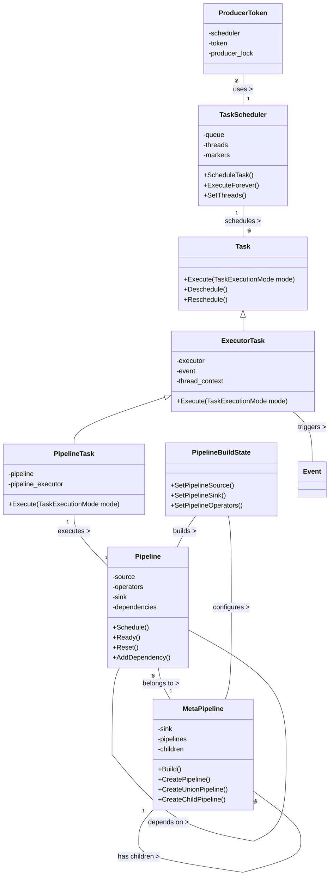

# DuckDB 并行处理框架分析

基于对 DuckDB 并行处理相关文件的分析，我将全面介绍 DuckDB 的并行处理框架，包括其类结构、关系和功能。

## 核心类及其关系

### 类图

### 1. 任务系统

#### Task 类
- **功能**：抽象的任务基类，定义了任务执行的基本接口
- **关键方法**：
  - `Execute(TaskExecutionMode mode)`：执行任务
  - `Deschedule()`：取消任务调度
  - `Reschedule()`：重新调度任务

#### ExecutorTask 类
- **继承自**：Task
- **功能**：查询执行器内的任务，包含异常处理
- **关键成员**：
  - `executor`：执行器引用
  - `event`：关联的事件
  - `thread_context`：线程上下文

#### PipelineTask 类
- **继承自**：ExecutorTask
- **功能**：执行查询管道的任务
- **关键成员**：
  - `pipeline`：关联的管道
  - `pipeline_executor`：管道执行器

### 2. 调度系统

#### TaskScheduler 类
- **功能**：管理任务和线程，是并行执行的核心
- **关键成员**：
  - `queue`：任务队列
  - `threads`：后台工作线程
  - `markers`：线程控制标记
- **关键方法**：
  - `ScheduleTask()`：调度任务
  - `ExecuteForever()`：线程持续执行任务
  - `SetThreads()`：设置线程数量

#### ProducerToken 类
- **功能**：任务生产者令牌，用于提交任务
- **关键成员**：
  - `scheduler`：调度器引用
  - `token`：队列生产者令牌
  - `producer_lock`：生产者锁

### 3. 管道系统

#### Pipeline 类
- **功能**：表示查询执行的一个管道，从源到目的地的操作链
- **关键成员**：
  - `source`：数据源算子
  - `operators`：中间操作符链
  - `sink`：数据目的地算子
  - `dependencies`：依赖的其他管道
- **关键方法**：
  - `Schedule()`：调度管道执行
  - `Ready()`：准备管道执行
  - `Reset()`：重置管道状态

#### MetaPipeline 类
- **功能**：表示共享相同 sink 的一组管道
- **关键成员**：
  - `sink`：共享的目标算子
  - `pipelines`：包含的所有管道
  - `children`：子 MetaPipeline
- **关键方法**：
  - `Build()`：构建管道
  - `CreatePipeline()`：创建新管道
  - `CreateUnionPipeline()`：创建联合管道
  - `CreateChildPipeline()`：创建子管道

#### PipelineBuildState 类
- **功能**：管理管道构建状态
- **关键方法**：
  - `SetPipelineSource()`：设置管道源
  - `SetPipelineSink()`：设置管道目标
  - `SetPipelineOperators()`：设置管道操作符

### 4. 事件系统

#### Event 类 (从引用中推断)
- **功能**：表示异步事件，用于协调任务执行
- **使用场景**：管道完成、初始化等事件通知

## 工作流程

1. **查询计划转换为管道**：
   - 查询计划被转换为一系列 MetaPipeline，每个 MetaPipeline 包含多个 Pipeline
   - 每个 Pipeline 包含一个源操作符、多个中间操作符和一个目标操作符

2. **管道调度与执行**：
   - Pipeline 通过 `Schedule()` 方法被调度执行
   - 创建 PipelineTask 并提交到 TaskScheduler
   - TaskScheduler 将任务分配给工作线程执行

3. **并行执行模型**：
   - **任务并行**：不同的独立任务可以并行执行
   - **管道并行**：独立的管道可以并行执行
   - **数据并行**：单个管道内的数据处理可以并行化（如并行扫描）

4. **依赖管理**：
   - Pipeline 之间的依赖关系通过 `AddDependency()` 方法建立
   - MetaPipeline 管理复杂的依赖关系，如连接操作的构建侧和探测侧

5. **批处理索引**：
   - 使用批处理索引 (batch_index) 跟踪并行执行的进度
   - 通过 `RegisterNewBatchIndex()` 和 `UpdateBatchIndex()` 方法管理

## 特殊功能

1. **自适应并行度**：
   - 根据系统资源和查询特性动态调整线程数

2. **内存管理**：
   - 通过 `allocator_flush_threshold` 控制内存分配器刷新
   - 支持后台分配器线程优化内存管理

3. **查询进度跟踪**：
   - 通过 `GetProgress()` 方法报告查询执行进度

4. **顺序保证**：
   - 通过 `IsOrderDependent()` 检查是否需要保持数据顺序

5. **任务阻塞与恢复**：
   - 支持任务的取消调度和重新调度
   - 处理阻塞在结果上的任务

## 总结

DuckDB 的并行处理框架是一个复杂而精心设计的系统，它通过任务调度器、管道执行和事件系统的紧密协作实现高效的并行查询执行。该框架的核心是灵活的任务抽象和管道模型，允许查询执行器根据查询计划和系统资源自适应地调整并行度。

这种设计使 DuckDB 能够有效地利用多核处理器，在保持简单嵌入式数据库接口的同时，提供出色的查询性能。框架的模块化结构也使其易于扩展和维护，能够适应不同的工作负载和执行环境。