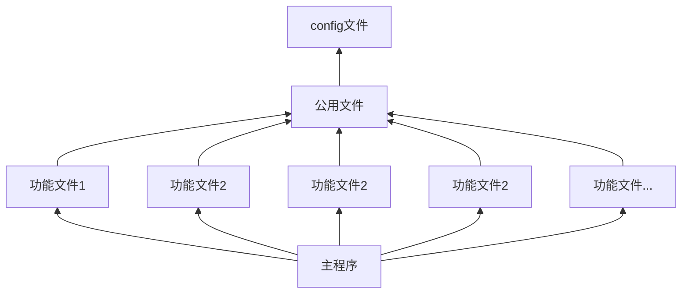
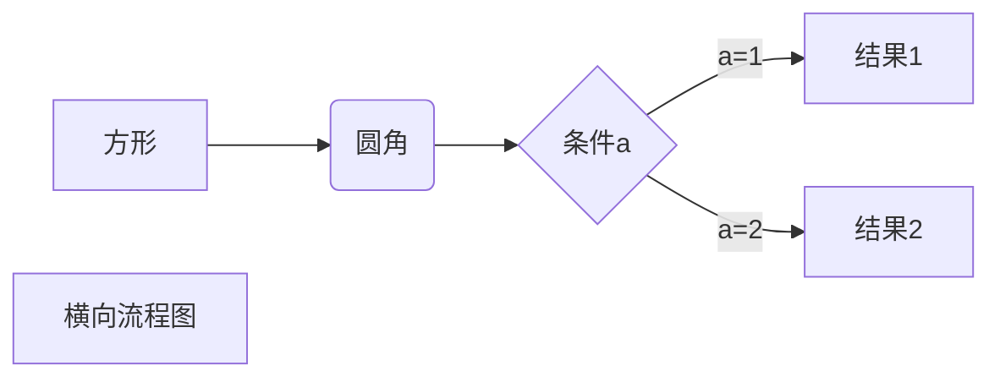
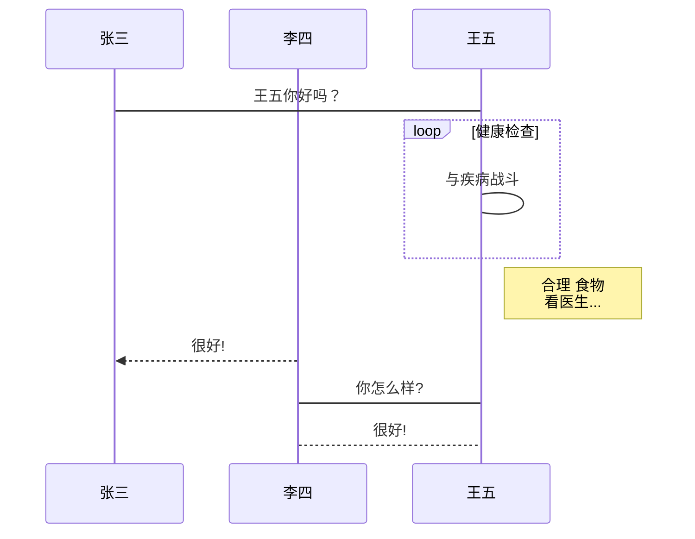
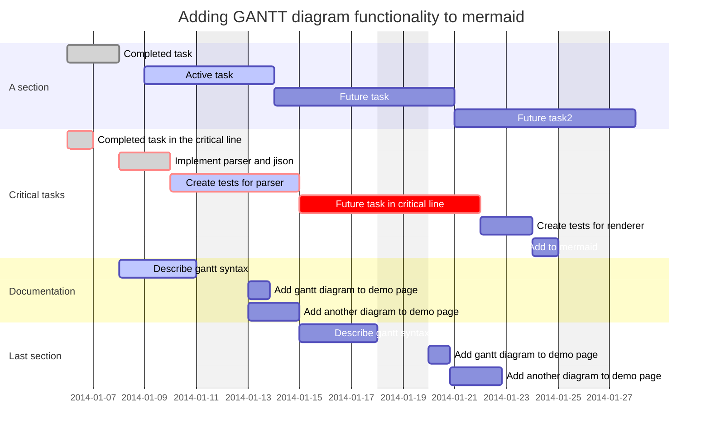
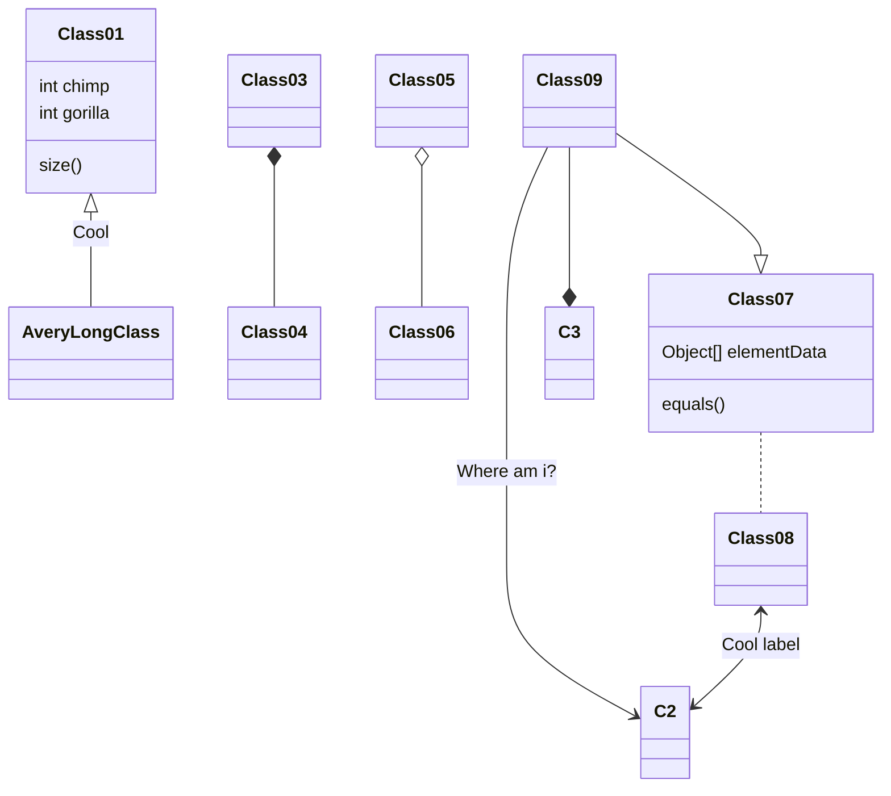

# Markdown语法说明

markdowm是非常强大的关于文本显示性编辑语言。可以快速排版。
markdown是有严格的代码规范的，但是同时，它的容错方案也是非常的强大的。

> 块级定义

```
一级标题 
======================

二级标题
---------------------
```

```
# h1
## h2
### h3
#### h4
##### h5
###### h6
```

最多到6级

## 标签

标签:markdown

- [x] ok
- [ ] no

## 表格范例

- :--- 代表左对齐
- :--: 代表居中对齐
- ---: 代表右对齐

| Tables        | Are           | Cool  |
| ------------- |:-------------:| -----:|
| col 3 is      | right-aligned | $1600 |
| col 2 is      | centered      |   $12 |
| zebra stripes<bgcolor=color"> | are neat      |    $1 |

接受源码
```html
<table>
  <tr>
    <th width=10%, bgcolor=yellow >参数</th>
    <th width=40%, bgcolor=yellow>详细解释</th>
    <th width="50%", bgcolor=yellow>备注</th>
  </tr>
  <tr>
    <td bgcolor=#eeeeee> -l </td>
    <td> use a long listing format  </td>
    <td> 以长列表方式显示（显示出文件/文件夹详细信息）  </td>
  </tr>
  <tr>
    <td bgcolor=#00FF00>-t </td>
    <td> sort by modification time </td>
    <td> 按照修改时间排序（默认最近被修改的文件/文件夹排在最前面） </td>
  <tr>
    <td bgcolor=rgb(0,10,0)>-r </td>
    <td> reverse order while sorting </td>
    <td>  逆序排列 </td>
  </tr>
</table>
```

## 图片


有文字说明：

```

```

相对路径hexo：

```

> Omitted unresolved image: test1 (img/http.png "img/http.png")

```

可以使用如下格式进行居中：
```css
<center><figcaption>图 1. TDengine 技术生态图</figcaption></center>
</figure>
```

## 链接

[百度](http://www.baidu.com/")

## 公式

$fx$

公式就是Latex格式，https://private.codecogs.com/网站可以速写。
pandoc等软件也提供。其中word中内置疑似有转换方法。
https://www.codecogs.com/latex/eqneditor.php?lang=zh-cn亦可

## 流程图

vscode 需要插件 Markdown Preview Enhanced

[mermaid说明文档](https://mermaid-js.github.io/mermaid/#/)

[在线测试](https://mermaid-js.github.io/mermaid-live-editor/#/edit/eyJjb2RlIjoiZ3JhcGggVERcbiAgICBBW0NocmlzdG1hc10gLS0-fEdldCBtb25leXwgQihHbyBzaG9wcGluZylcbiAgICBCIC0tPiBDe0xldCBtZSB0aGlua31cbiAgICBDIC0tPnxPbmV8IERbTGFwdG9wXVxuICAgIEMgLS0-fFR3b3wgRVtpUGhvbmVdXG4gICAgQyAtLT58VGhyZWV8IEZbZmE6ZmEtY2FyIENhcl0iLCJtZXJtYWlkIjp7InRoZW1lIjoiZGVmYXVsdCJ9LCJ1cGRhdGVFZGl0b3IiOmZhbHNlfQ)

@此处粘有[菜鸟教程](https://www.runoob.com/markdown/md-advance.html)内容

1. 竖向流程图源码格式：



TB - top to bottom
TD - top-down/ same as top to bottom
BT - bottom to top
RL - right to left
LR - left to right

2. 横向流程图源码格式：



3. 标准流程图源码格式：

```flow
st=>start: Start
op=>operation: Your Operation
cond=>condition: Yes or No?
e=>end
st->op->cond
cond(yes)->e
cond(no)->op
```

4. 标准流程图源码格式（横向）：

```flow
st=>start: 开始框
op=>operation: 处理框
cond=>condition: 判断框(是或否?)
sub1=>subroutine: 子流程
io=>inputoutput: 输入输出框
e=>end: 结束框
st(right)->op(right)->cond
cond(yes)->io(bottom)->e
cond(no)->sub1(right)->op
```
5. UML时序图源码样例：

```sequence
对象A->对象B: 对象B你好吗?（请求）
Note right of 对象B: 对象B的描述
Note left of 对象A: 对象A的描述(提示)
对象B-->对象A: 我很好(响应)
对象A->对象B: 你真的好吗？
```
6. UML时序图源码复杂样例：

```sequence
Title: 标题：复杂使用
对象A->对象B: 对象B你好吗?（请求）
Note right of 对象B: 对象B的描述
Note left of 对象A: 对象A的描述(提示)
对象B-->对象A: 我很好(响应)
对象B->小三: 你好吗
小三-->>对象A: 对象B找我了
对象A->对象B: 你真的好吗？
Note over 小三,对象B: 我们是朋友
participant C
Note right of C: 没人陪我玩
```
7. UML标准时序图样例：


8. 甘特图样例：



9. Class diagram



## 特殊符号

符号 | 说明 | 编码（实际使用中需要去掉加号）
|:-:|:-:|:-:|
← | 左箭头 | &+larr;
→ | 右箭头 | &+rarr;
↑ | 上箭头 | &+uarr;
↓ | 下箭头 | &+darr;
↔ | 水平箭头 | &+harr;
↕ | 竖直箭头 | &+varr;
⇐ | 双线左箭头 | &+lArr;
⇒ | 双线右箭头 | &+rArr;
⇑ | 双线上箭头 | &+uArr;
⇓ | 双线上箭头 | &+dArr;
⇔ | 双线水平双箭头 | &+hArr;
⇕ | 双线竖直箭头 | &+vArr;

## 隐藏你想隐藏的

```txt
[^_^]: <> (hhh 你输了 哈哈哈)
```

[^_^]: <> (hhh 你输了 哈哈哈)

[???]: <> (
<###
<```
<```
)

参考链接：

* [markdowm语法](https://www.jianshu.com/p/b03a8d7b1719)

## 锚点

[ODBC调研](#ODBC调研)

## 扩展功能

### 导出为word

  pandoc -s 文件名.md -o 文件名.docx

### 更改主题

只能手动更改markdown preview Enhanced主题。
路径为
```C++
C:\Users\Lenovo\.vscode\extensions\shd101wyy.markdown-preview-enhanced-0.5.22\node_modules\@shd101wyy\mume\styles\preview_theme\
```
