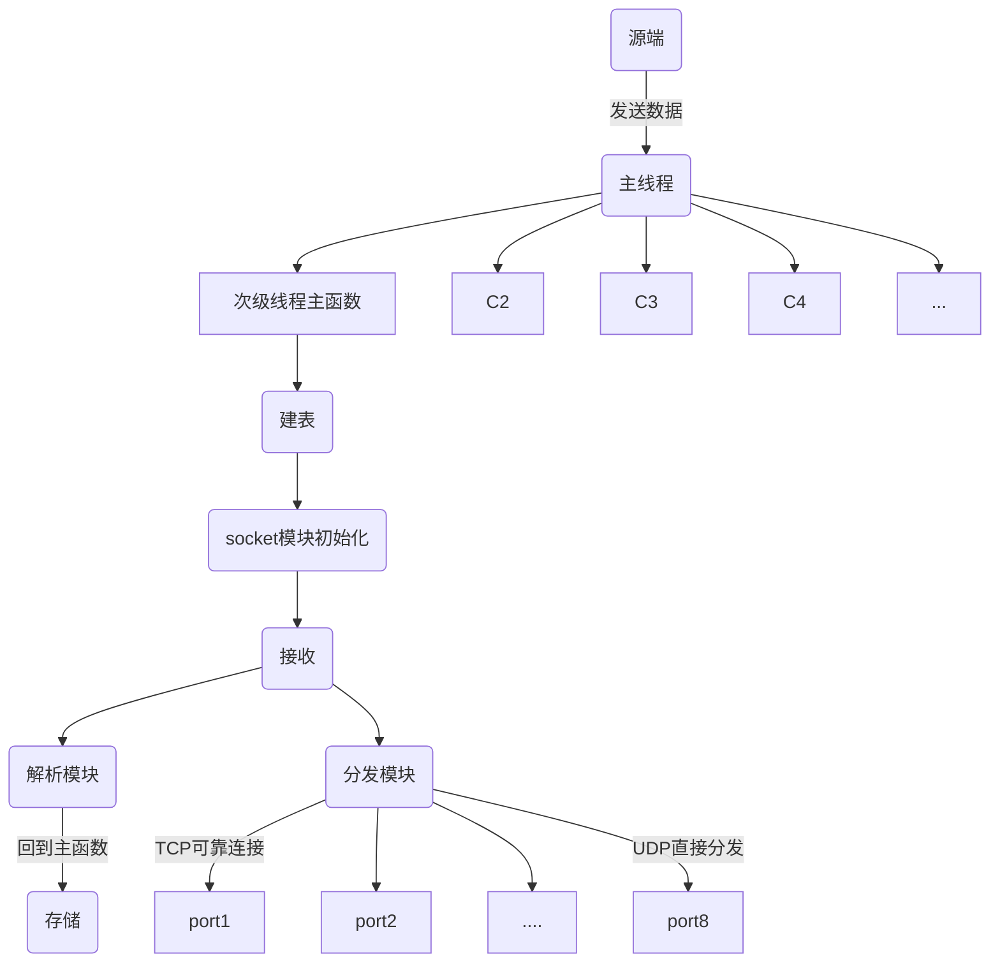

# 0411work_data

有个船舶的项目需要使用咱们数据库记录船舶数据
我们需要根据船舶数据解析标准解析数据入库 ，并将解析数据分发到各应用
明天上午9:00 我们开会讨论一下 
我把大体情况说一下 9:30雷达组的同事会过来在和我们交流一下

项目关键字： 
	RecAIS_GPS_HDT

## 整体内容

1. 数据接收

TCP，UDP

2. 数据解析

3. 数据存储

EDB

4. 分发

Kafka

F:\project\TZDB-Dev\Code\win\agilore\GNTEST

## 工作内容

- [x] 8个多线程，有自己的库和表

建立8个表，进行运行。创建，插入数据。

- [x] 使用void* 进行指向不同的结构体

- [x] 完成单个数据的接收，解析和存储

- [ ] 分发模块
分发模块TCP：
1. 程序等待源端来进行连接，连接之后再进行连接
2. 程序一直向上询问，连接成功之后向下监听连接。关键是连接之后丢数据的过程依然需要重新绑定和监听。

- [ ] config文件设计

- [ ] 优化config文件，优化代码，主参数重定义

- [ ] 测试痛一个tcp，建立连接后关闭再打开。
	接收端acept是否可以通过这种方式重新连接


## 模块明细

1. 程序结构设计完成。

1. 主模块。负责数据库创建 - 接收数据 - 存储数据

    - [x] 已完成。目前只需要传递指令结构体void*指针。

2. socket模块。初始化，与源端取得连接

    - [x] TCP方式已完成。

3. 解析模块。与数据项数相同，负责解析 - 分配内存空间

    - [x] 完成了三个数据的解析模块。

4. 分发模块。发送到8个不同端口

    - [x] 初步完成TCP端设计和原始代码。
    - [ ] 需要后续优化。

## 后续工作

1. 优化分发模块TCP方式。TCP方式中，考虑并试验socket是否可以公用的情况。

2. 整合之后的两个数据，plot与track。

3. 优化Config文件结构，代码规范性优化

### 程序设计

逻辑说明：??
1. TCP向上连接未成功将会一直等带。
2. TCP向上连接后断开，线程将关闭

方案2：
1. TCP连接的时候一直等待下层请求连接，处于Listen状态。
	取决于，下层请求数据之前，上层发送的数据是否需要存储到数据库中。

优化：
1. 分发模块和接收模块独立组成一个模块。
2. 查询模块代码重复量高，只是需要强制转换相关类型，疑似可做选择器。

四个模块

主模块 负责 数据库创建 - 接收数据 - 存储数据
socket模块 连接 
解析模块 与数据项数相同，负责解析 - 分配内存孔吉安
分发模块 发送到8个不同端口

程序流程



项目结构：
包名： db_Mem
文件名：
	公用文件：
		db_RecAIS_GPS_HDT.cpp
		db_RecAIS_GPS_HDT.h
	配置文件：
		dbconfig.h
	数据体下的文件： ais_table.cpp
	数据体下的文件： ...
函数名 ：
	主线程函数 | db_main() | 
	次级线程函数 | DWORD WINAPI db_Storage(LPVOID args) | 主要负责建表，接收，以及存储
	Socket初始化与连接 ：  
		init_socket
	*分析函数，数据解析：  
		ais_table_trans(_AISData aisData, AIS_table ais) 
	分发函数：  

结构体 ：
	判断结构体标识枚举： Data_type
	指令集合： thread_data
	各个数据结构体： AIS_table
	结构体描述： ais_descriptor

说明：
1 .64个端口，并且优化选项
2 .IP地址预留优化

socket 接收数据的时候需要connect，不需要额外bind；发送数据时需要bind，但是并没有写connect。

#### 分发模块

分发模块，TCP中，接收到数据后，第一次分发，下端如果没有请求连接，将会一直阻塞。需要测试连接后是否能够适应两个端口发送和接收。

核心问题：在接收端接收数据之前的数据是否需要存入表中。

如果需要：??
1. 寻找参数中是否有不阻塞的设置选项。跳过等待，直接存储。

如果不需要：
1. 连接处进行优化，先等连接成功后再向上请求输入。

##### UDP

初始化socket，
设置缓冲区内存，
bing一个套接字。有点感觉时绑定了一个端口，之后可以从这个address中接收数据。
sendto根据一个套接字进行发送。发送数据到指定address。

```C++
int sockfd = socket(AF_INET, SOCK_DGRAM, 0);

int nRecvBuf = 1 * 1024 * 1024;//设置为1MB
int setoptret = setsockopt(sockfd, SOL_SOCKET, SO_SNDBUF, (const char*)&nRecvBuf, sizeof(int));
setoptret = setsockopt(sockfd, SOL_SOCKET, SO_RCVBUF, (const char*)&nRecvBuf, sizeof(int));

struct sockaddr_in peeraddr;
memset(&peeraddr, 0, sizeof(struct sockaddr_in));
peeraddr.sin_family = AF_INET;
//注意：linux要bind组播地址,而不是自己网卡的地址
peeraddr.sin_addr.s_addr = htonl(INADDR_ANY); 
peeraddr.sin_port = htons(udpReturnSrcPort);

int bindRet = ::bind(sockfd, (struct sockaddr *)(&peeraddr), sizeof(struct sockaddr));
//
struct sockaddr_in address0;
address0.sin_family = AF_INET;
address0.sin_port = htons(7777);//端口号
address0.sin_addr.s_addr = inet_addr("127.0.0.1"); //inet_addr("239.192.43.77");//inet_addr("192.168.0.103");

//UDP发送 24+final_packet_size
sendto(sockfd, (char *)return_data, data_len, 0, (struct sockaddr*)&address0, sizeof(address0));
```

##### TCP

建立线程

bind一个IP.
listen此IP.
accept返回一个socket.建立连接,之后则send(),

```C++
int bindRet = ::bind(sockfd, (struct sockaddr *)(&peeraddr), sizeof(struct sockaddr));
if (-1 == bindRet)
{
	printf("bind port error INADDR_ANY:%d\n", udpReturnSrcPort);
	return ;
}

bindRet = listen(sockfd, 5);
if (bindRet == -1)
{
	cout << "listen error\n" << endl;
	return ;
}
cout << "GPS wait for client linked in  " << udpReturnSrcPort<<"\n"<< endl;
int lenaccept = sizeof(struct sockaddr_in);
struct sockaddr_in c_address;
int c_sockfd = accept(sockfd, (sockaddr *)(&c_address), &lenaccept);
printf("tcp GPS init success\n");
send(*sockfd, (char*)buffer, sizeof(buffer), 0);
```

#### 接收程序

##### TCP

初始化.
设置.
connect指定IP.
循环接收,并接收返回值

```C++
struct sockaddr_in address;
struct sockaddr_in address1;
sockfd = socket(AF_INET, SOCK_STREAM, 0);

int nSendBuf = 32 * 1024;//设置为32K
setsockopt(sockfd, SOL_SOCKET, SO_SNDBUF, (const char*)&nSendBuf, sizeof(int));

address.sin_family = AF_INET;
address.sin_port = htons(5381);//4013
//address.sin_addr.s_addr = inet_addr("127.0.0.1");//"192.168.1.254"
address.sin_addr.s_addr = inet_addr("127.0.0.1");
ret = ::connect(sockfd, (struct sockaddr *)&address, sizeof(address));

while (1)
{
	memset(buffer, 0, 8192);
	ret = recv(sockfd, buffer, 1024, 0);
	if (ret == -1)
	{
		cout << "step1 is failed " << endl;
		cout << "wait for client linked in" << endl;
		ret = sizeof(struct sockaddr_in);
		ret = accept(sockfd, (sockaddr *)(&address1), &ret);
		continue;
	}
}
```

##### UDP

初始化.
设置缓存.
bind本地.
循环接收

```C++
int sockfd = socket(AF_INET, SOCK_DGRAM, 0);
if (sockfd == -1)
{
	printf("socket error\n");
	return -1;
}

int nRecvBuf = 1 * 1024 * 1024;//设置为1MB
int setoptret = setsockopt(sockfd, SOL_SOCKET, SO_SNDBUF, (const char*)&nRecvBuf, sizeof(int));
setoptret = setsockopt(sockfd, SOL_SOCKET, SO_RCVBUF, (const char*)&nRecvBuf, sizeof(int));
if (-1 == setoptret)
{
	perror("return setsockopt SO_RCVBUF fail!\n");
	return -1;
}

peeraddr.sin_family = AF_INET;
//注意：linux要bind组播地址,而不是自己网卡的地址
peeraddr.sin_addr.s_addr = htonl(INADDR_ANY); 
peeraddr.sin_port = htons(7777);

int bindRet = ::bind(sockfd, (struct sockaddr *)(&peeraddr), sizeof(struct sockaddr));

while (1)
{
	recvMsgSize = recvfrom(sockfd, recvBuf, 1024 * 10, 0, (SOCKADDR *)&addrSever, &nServerAddrLen);
}
```

#### 结构体

//线程指令集合
struct thread_data {
	int id;
	int count;

	char* dbname;//数据库名
	char* fname;//文件名
	char* tablename;//表名

	void* table;//表的数据结构
	void* descriptor;//预留字段描述项
};

## 需求完善

1. 分发模块是UDP还是TCP，socket需不需要Listen。

	- UDP:2 polt,track
	- TCP: 其余6个。

即使listen也不用阻塞。

2. IP问题，接收数据的IP需要多少个，端口是8个。
	发送数据的时候IP需要多少个，端口需要多少个。

UDP数据使用的是相同的IP，其他几个是不同的IP
分发模块，确定要绑的发送端口和IP，发送的端口是不一样的，IP也可能是不一样的。

3. 数据项，目前有三个，共8个。

完善剩余的两个数据。
还剩三个数据.

4. 配置文件怎么弄比较便于测试。

## Recording

GNTEST = dbNumTest.exe testcase15.exe

testcase15.obj: GNTEST/testcase15.cpp $(INCS)
	$(CC) $(CFLAGS) GNTEST/testcase15.cpp

testcase15.exe: testcase15.obj $(AGILORE_LIB)
	$(LD) $(LDFLAGS) testcase15.obj $(AGILORE_LIB) $(STDLIBS)

## 问题索引

- [ ] 详细统计程序空间与时间环境

- [ ] 调试时如何查看内存内数值

- [ ] free使用场景测试，malloc在函数中的调用测试

- [X] 指针结构体在函数中改变值并且赋值

- [x] void*指针转换成结构体的用法

- [x] 内存残留的问题
编程习惯，内存更新

- [x] aeci_create(_T("test"), _T("test.fdb"), 0, 0, 4 * 1024 * 1024, 4 * 1024 * 1024, 512 * 1024, 0);//数据放在文件里？文件存放在第二参数中

- [x] 数据库是在什么地方建立，或者说就是以一个文件的形式存在
一个文件一个数据库

- [ ] 如何测试数据，通过输出调试信息，查看文件。

## 报错解析


## 代码分析

aeci_oid_t oid1 =NULL;
aeci_transaction_context_t ctx;

HANDLE
WINAPI
CreateThread(
    _In_opt_ LPSECURITY_ATTRIBUTES lpThreadAttributes,
    _In_ SIZE_T dwStackSize,
    _In_ LPTHREAD_START_ROUTINE lpStartAddress,
    _In_opt_ __drv_aliasesMem LPVOID lpParameter,
    _In_ DWORD dwCreationFlags,
    _Out_opt_ LPDWORD lpThreadId
    );

### 函数分析

```C++
	threads[i] = CreateThread(NULL, 0, dbThreadRead, &td[i], 0, NULL);

创建一个会话

/*********************************************************************
* 描述：aeci_create
*     连接到数据库
* 参数：
*     【IN】databaseName - 数据库名
*     【IN】fileName - 文件名
*     【IN】transactionCommitDelay - 事务延时提交 (0 ：不延时提交)
*     【IN】openAttr - 打开数据库模式掩码
*     【IN】initDatabaseSize - 初始数据库大小
*     【IN】extensionQuantum - 数据库扩展量
*     【IN】initIndexSize - 初始索引个数
*     【IN】fileSizeLimit - 文件大小限制
* 返回值：
*     >= 0 - 连接句柄
*     <  0 - 返回错误码，AeCIResultCode枚举中定义
*/

	session1 = aeci_create(_T("test"),  _T("test.fdb"), 0, 0x04, 4*1024*1024, 4*1024*1024, 512*1024, 0);
    int aeci_create(
        char_t const* databaseName, /*数据库名称*/
        char_t const* filePath, /*文件地址*/
        unsigned transactionCommitDelay, 
        int openAttr, 
        size_t initDatabaseSize,
        size_t extensionQuantum, 
        size_t initIndexSize, 
        size_t fileSizeLimit)

/*********************************************************************
 * 描述：aeci_create_table
 *     创建表
 * 参数：
 *     【IN】session   - 会话句柄，该句柄由aeci_open接口返回
 *     【IN】tableName - 表名
 *     【IN】nFields   - 表中的字段数
 *     【IN】fields    - 字段描述符数组
 * 返回值：
 *     返回错误码，AeCIResultCode枚举中定义
 */
int AGILORE_DLL_ENTRY aeci_create_table(int session, char const* tableName, int nFields, aeci_field_descriptor* fields);

	rc1 = aeci_create_table(session1, "testcase2", sizeof(test_descriptor)/sizeof(aeci_field_descriptor),test_descriptor);
	ctx = aeci_create_transaction_context();//后面线程共享此事务上下文
```

## 代码存留

#define SND_POST_1 8888

#define SND_POST_2 8888

#define SND_POST_3 8888

#define SND_POST_4 8888

#define SND_POST_5 8888

#define SND_POST_6 8888

#define SND_POST_7 8888

#define SND_POST_8 8888

### 结构体

//AIS
typedef struct _AISData{
	aeci_int4_t nType;		//信号类型
	aeci_int4_t nShipType;	//船只和货物类型
	aeci_int4_t nMmsi;		//船舶识别号
	aeci_int4_t nImo;		//Imo编号
	aeci_int4_t nState;		//航行状态
	aeci_int4_t nTimestamp; //时间标记

	aeci_int4_t nLatitude;  //需要除以600000 = 纬度
	aeci_int4_t nLongitude; //需要除以600000 = 经度
	aeci_int4_t nSpeed;		//行驶速度
	aeci_int4_t nCourse;	//对地航向
	aeci_int4_t nHeading;	//船头航向 相对于正北方的顺时针度数
	aeci_int4_t nROT;		//转向率

	aeci_int4_t nYear;		//时间
	aeci_int4_t nMonth;
	aeci_int4_t nDay;
	aeci_int4_t nHour;
	aeci_int4_t nMinute;
	aeci_int4_t nSecond;
	char szShipname[32];//name

	aeci_int4_t nShipSizeA; //中心到船头
	aeci_int4_t nShipSizeB; //中心到船尾
	aeci_int4_t nShipSizeC; //中心到左舷
	aeci_int4_t nShipSizeD; //中心到右舷
}

### 测试

/*cout << "-----------------------------------" << endl;
cout <<  "," << aisData.nType <<  "," << aisData.nShipType <<  "," << aisData.nMmsi <<  "," << aisData.nImo <<  "," << aisData.nState <<  "," << aisData.nTimestamp  <<  "," << endl;
cout <<  "," << aisData.nLatitude <<  "," << aisData.nLongitude <<  "," << aisData.nSpeed <<  "," << aisData.nCourse <<  "," << aisData.nHeading <<  "," << aisData.nROT <<  "," << endl;
cout <<  "," << aisData.nYear <<  "," << aisData.nMonth <<  "," << aisData.nDay <<  "," << aisData.nHour <<  "," << aisData.nMinute <<  "," << aisData.nSecond <<  "," << aisData.szShipname <<  "," << endl;

cout <<  "," << aisData.nShipSizeA <<  "," << aisData.nShipSizeB <<  "," << aisData.nShipSizeC <<  "," << aisData.nShipSizeD <<  "," << endl;*/

### 创建表


session = aeci_create(databaseName, filePath, 0, 0x04, 4 * 1024 * 1024, 4 * 1024 * 1024, 512 * 1024, 0);
if (session >= 0)
{
	printf("AgilorE version 2.0.1\n");
	printf("Create database test successful!\n");
	rc = aeci_create_table(session, "testcase1", sizeof(gps_descriptor) / sizeof(aeci_field_descriptor), gps_descriptor);
	if (rc >= 0)
	{
		printf("Create table testcase1 successful\n");
	}
	else if (rc == -19)
	{
		printf("Table has already created\n");
	}
	else
	{
		fprintf(stderr, "Create table failed with code %d\n", rc);
	}
}


	/*session = aeci_create((char_t*)data->dbname, (char_t*)data->fname, 0, 0, 4 * 1024 * 1024, 4 * 1024 * 1024, 512 * 1024, 0);
	rc1 = aeci_create_table(session, data->tablename, sizeof(*(aeci_field_descriptor*)data->descriptor) / sizeof(aeci_field_descriptor), (aeci_field_descriptor*)data->descriptor);*/

### 主要代码

```C++
//AIS - 解析模块
AIS_table * ais_table_trans(char * buffer)
{
	// 数据分析
	//以符号','进行切割生成string动态数组
	vector<string> res = splitWithStl(string(buffer), ",");

	//简单收容数据到_AISData
	_AISData aisData;
	AIS_table *p = (AIS_table*)malloc(sizeof(AIS_table));
	if (AISDecodeInfo((char*)res[5].data(), res[5].length(), &aisData) == 1)
	{
		//test ， 解码函数
		float _lat = aisData.nLatitude * 1.0 / 600000;
		float _lon = aisData.nLongitude * 1.0 / 600000;
		cout << "1.ais 经纬度：" << _lat << "," << _lon << endl;
		if (proce_NewPack(aisData) == 1)
		{
			cout << "ais 经纬度：" << _lat << "," << _lon << endl;
		}
	}

	//解析
	ais_table_insert(aisData, p);//结构体转换函数
	cout << p->nCourse <<" , " << p->nLatitude << " , " << p->nLongitude << endl;
	//cout << table->nCourse << " , " << p.nLatitude << " , " << p.nLongitude << endl;
	return p;
}

//查询测试模块
void ais_query_test(int session  , void* data, char* dbname)
{
	int rc;//查询会话
	int statement;//预查询会话
	AIS_table tmp;
	AIS_table* tmp2 = (AIS_table*)data;

	//char* query_sql = "select * from Test";
	char* text = "select * from ";
	char query_sql[30];
	strcpy(query_sql,text);
	strcat(query_sql, dbname);

	statement = aeci_prepare_query(session, query_sql);//预查询
	rc = aeci_execute_query(statement, aeci_view_only, &tmp);
	while (aeci_get_next(statement) == rc_ok)
	{
		//输出函数，解析未知结构体
		printf("Thread : %d\t%d\t%d\t%d\n", tmp2->nLatitude, tmp2->nLongitude , tmp.nLongitude,  tmp.nLatitude);
	}

	//free(query_sql);
}

void gps_query_test(int session, void* data , char* dbname)
{
	int rc;//查询会话
	int statement;//预查询会话
	GPS_table tmp;

	char* text = "select * from ";
	char query_sql[30];
	strcpy(query_sql, text);
	strcat(query_sql, dbname);

	statement = aeci_prepare_query(session, query_sql);//预查询
	rc = aeci_execute_query(statement, aeci_view_only, &tmp);
	while (aeci_get_next(statement) == rc_ok)
	{
		//输出函数，解析未知结构体
		std::cout << "gps_data.m_dLatitude=" << tmp.m_dLatitude << ",gps_data.m_dLatitude=" << tmp.m_dLongitude << std::endl;
	}

	//aeci_get_last(statement);
	//std::cout << "gps_data.m_dLatitude=" << tmp.m_dLatitude << ",gps_data.m_dLatitude=" << tmp.m_dLongitude << std::endl;
}
```


session = aeci_create( 0, 0x04, 4 * 1024 * 1024, 4 * 1024 * 1024, 512 * 1024, 0);
session = aeci_create( 0, 0x04, 4 * 1024 * 1024, 4 * 1024 * 1024, 512 * 1024, 0);

	time_t			m_timeGGA;												///< Time in GGA sentence
	int				m_nHour;												///< hour
	int				m_nMinute;												///< Minute
	int				m_nSecond;												///< Second
	double			m_dSecond;												///< Fractional second
	double			m_dLatitude;											///< Latitude (Decimal degrees, S < 0 > N)
	double			m_dLongitude;											///< Longitude (Decimal degrees, W < 0 > E)
	double			m_dAltitudeMSL;											///< Altitude (Meters)
	char            m_nStatus;												///< Status
	double			m_dSpeedKnots;											///< Speed over the ground in knots
	double			m_dTrackAngle;											///< Track angle in degrees True North
	int				m_nMonth;												///< Month
	int				m_nDay;													///< Day
	int				m_nYear;												///< Year
	double			m_dMagneticVariation;									///< Magnetic Variation
