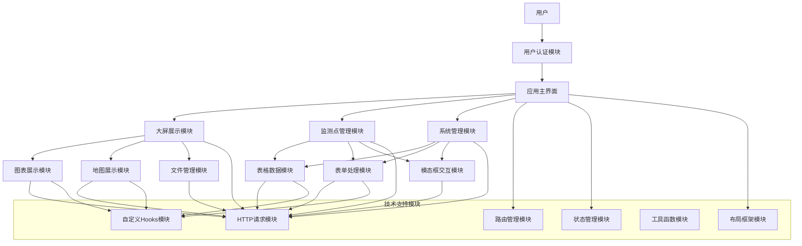
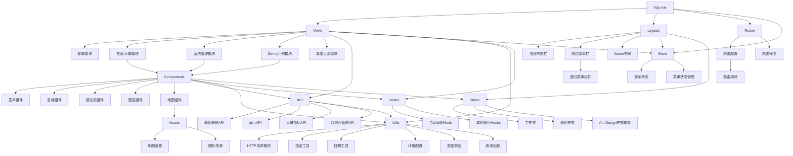
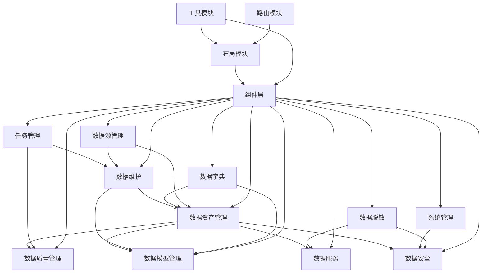

包括项目的技术栈、代码量、模块内容的简报。

该文档整理的是农业项目中的盐碱地重大病虫害监测预警平台相关建设内容，作为附录保留，不再单独作为 overview 项目介绍。

| 项目名称                                   | 代码量    | 主要模块                                                          | 技术栈                                                     |
|:---------------------------------------|--------|---------------------------------------------------------------|---------------------------------------------------------|
| 盐碱地重大盐碱地重大病虫害监测预警平台的多源异构数据管理系统-大屏可视化源码 | 6310   | 用户认证、大屏展示、监测点管理、系统管理、表单处理、表格数据、图表展示、地图展示                      | vue3、vite、Ant-Design-Vue、less、WindiCss、pinia、vue-router |
| 盐碱地重大病虫害监测预警平台的多源异构数据管理系统-数据中台源码       | 185783 | 数据资产管理、数据质量管理、数据模型管理、数据服务、数据安全、数据维护、系统管理、任务管理、数据字典、数据源管理、数据脱敏 |                                                         |

## 盐碱地重大盐碱地重大病虫害监测预警平台的多源异构数据管理系统-大屏可视化源码

Date : 2025-03-13 14:26:11

Directory /home/ithedslonnie/Projects/tmp/盐碱地重大盐碱地重大病虫害监测预警平台的多源异构数据管理系统-大屏可视化源码

### 技术栈

技术栈:vue3、vite、Ant-Design-Vue、less、WindiCss、pinia、vue-router

### 模块组成

#### 模块结构

##### 核心模块

- **视图层 (Views)**
    - 登录模块 (Login)
    - 首页/大屏模块 (Index)
    - 系统管理模块 (System-Manage)
    - Demo示例模块 (Demo)
    - 异常页面模块 (Exception)

- **组件层 (Components)**
    - 表单组件 (Form)
    - 表格组件 (Table)
    - 模态框组件 (Modal)
    - 图表组件 (Chart)
    - 地图组件 (Map)

- **布局模块 (Layouts)**
    - 主布局 (Index)
    - 顶部导航栏 (Header)
    - 侧边菜单栏 (Sider)
    - 递归菜单组件 (RecursiveMenu)
    - iframe布局 (IframeIndex)

#### 功能模块

- **API接口模块 (API)**
    - 基础表格API (baseTable)
    - 演示API (demo)
    - 大屏指标API (largeScreenIndex)
    - 监测点管理API (monitorPointManage)

- **路由模块 (Router)**
    - 路由配置 (routes)
    - 路由守卫 (guard)
    - 路由模块 (modules)

- **状态管理模块 (Store)**
    - 演示状态 (demo)
    - 菜单状态管理 (menu)

- **工具类模块 (Utils)**
    - HTTP请求模块 (axios)
    - 加密工具 (cipher)
    - 日期工具 (dateUtil)
    - 环境配置 (env)
    - 类型判断 (is)
    - 通用函数 (index)

- **Hooks模块 (Hooks)**
    - 自动适配Hook (useAutoFit)
    - 其他通用Hooks (index)

- **样式模块 (Styles)**
    - 主样式 (main)
    - 通用样式 (common)
    - Ant Design样式覆盖 (ant_design_overwrite)

- **构建配置模块 (Build)**
    - Vite插件配置 (plugin)
    - 构建脚本 (script)
    - 工具函数 (utils)

- **资源模块 (Assets)**
    - 地图资源 (map_resources)
    - 图标资源 (icons)

#### 模块关系图

##### 业务模块图

##### 编程模块图

### 代码量

Total : 83 files, 5302 codes, 578 comments, 430 blanks, all 6310 lines

#### Languages

| language       | files |  code | comment | blank | total |
|:---------------|------:|------:|--------:|------:|------:|
| JavaScript     |    50 | 2,704 |     399 |   292 | 3,395 |
| Vue            |    22 | 2,362 |     164 |    96 | 2,622 |
| Less           |     5 |   109 |       8 |    12 |   129 |
| Markdown       |     1 |    55 |       0 |    22 |    77 |
| JavaScript JSX |     1 |    43 |       0 |     0 |    43 |
| Django HTML    |     1 |    13 |       0 |     1 |    14 |
| JSON           |     1 |     8 |       0 |     0 |     8 |
| Properties     |     1 |     7 |       7 |     6 |    20 |
| SVG            |     1 |     1 |       0 |     1 |     2 |

各文件代码量详情见附件1.

## 盐碱地重大病虫害监测预警平台的多源异构数据管理系统-数据中台源码

### 技术栈

- **Vue 3**: 采用Vue 3作为核心框架，使用Composition API进行组件开发
- **Vite**: 项目构建工具，提供快速的开发环境和优化的生产构建
- **TypeScript**: 大部分代码使用TypeScript编写，提供类型检查和更好的开发体验
- **Pinia/Vuex**: 状态管理库，管理应用的全局状态

#### UI组件库

- **Ant Design Vue**: 主要UI组件库，提供丰富的UI组件
- **自定义组件**: 系统包含大量自定义组件，如表格、表单、模态框等

#### 数据可视化

- **ECharts**: 用于数据统计图表展示
- **G6**: 用于数据地图和关系图展示

#### 工具库

- **Axios**: HTTP请求库，封装了请求拦截、响应拦截等功能
- **dayjs**: 日期处理库
- **lodash**: 工具函数库
- **mitt**: 事件总线，用于组件间通信

#### 编辑器

- **Tinymce**: 富文本编辑器
- **CodeMirror**: 代码编辑器，用于SQL编辑等功能

#### 文件处理

- **PDF.js**: PDF文件预览
- **file-saver**: 文件下载
- **xlsx**: Excel文件处理

#### 流程图

- **JSPlumb**: 用于流程图和关系图的绘制

#### 国际化

- **vue-i18n**: 国际化解决方案，支持中英文切换

### 模块结构

#### 视图层 (Views)

- **数据资产管理模块 (data-assets-manage)**
    - 资产全景 (asset-panorama)
    - 资产列表 (assets-list)
    - 元数据管理 (assets-metadata)
    - 数据地图 (data-map)
    - 数据视图 (data-view)
    - SQL搜索 (sqlsearch)
    - 统计分析 (statistics)

- **数据质量管理模块 (data-quality)**
    - 异常数据 (abnormaldata)
    - 质量规则 (quality-rules)
    - 质量评估 (quality-evaluation)
    - 质量报告 (quality-report)
    - 质量统计 (quality-statistics)
    - 质量验证结果 (quality-verify-result)
    - 告警管理 (warn-current, warn-history, warn-user)

- **数据模型管理模块 (data-model)**
    - 数据模型管理 (data-model-manage)
    - 数据标签 (data-tag)
    - 识别模型 (identify-model)
    - 版本对比 (data-model-version-contrast)

- **数据服务模块 (data-service)**
    - 数据目录 (data-catalog)
    - 数据申请 (data-apply)
    - 数据发布 (data-publish)
    - 数据分析 (data-analysis)
    - 数据统计 (data-statistics)
    - 接口管理 (interface)

- **数据安全模块 (data-security)**
    - 用户管理 (user-manage)
    - 权限管理 (permission-manage)
    - 数据备份 (data-backup)
    - 备份文件管理 (backup-file-manage)
    - 操作日志 (operation-log)
    - 审计日志 (audit-log)
    - API日志 (api-log)

- **数据维护模块 (data-maintenance)**
    - 业务数据 (business)
    - 数据标签 (data-label)
    - 主数据维护 (data-master-maintenance)
    - 主数据模型 (data-master-model)
    - 文件管理 (file-manage)
    - 操作日志 (operation-log)

- **系统管理模块 (system-manage)**
    - 用户管理 (user-manage)
    - 角色管理 (role-manage)
    - 菜单管理 (menu-manage)
    - 服务管理 (service-manage)
    - 授权管理 (empower-manage)
    - 网关配置 (gateway-config-manage)
    - 接口URL管理 (interface-url-manage)

- **任务管理模块 (task-manage)**
    - 任务信息 (task-info)
    - 任务列表 (task-list)

- **数据字典模块 (dictionary)**
    - 业务字典 (business)
    - 代码规则 (code-rules)
    - 数据元素管理 (data-element-manage)
    - 领域管理 (domain)
    - 元数据管理 (metadata)
    - 参数设置 (param-setting)

- **模型标准模块 (modelStandards)**
    - 集成数据 (integratedData)
    - 参数标准 (parameterStandards)

- **标准设计模块 (standardDesign)**
    - 算法设计 (algorithmDesign)
    - 标准化文档 (standardizedDocuments)

- **系统页面模块 (sys)**
    - 错误日志 (error-log)
    - 异常页面 (exception)
    - iframe页面 (iframe)
    - 锁屏页面 (lock)
    - 登录页面 (login)
    - 重定向页面 (redirect)

#### 组件层 (Components)

- **基础组件**
    - 表单组件 (Form)
    - 表格组件 (Table)
    - 模态框组件 (Modal)
    - 抽屉组件 (Drawer)
    - 上传组件 (Upload)
    - 树形控件 (Tree)
    - 图标组件 (Icon)
    - 菜单组件 (Menu)
    - 简易菜单组件 (SimpleMenu)

- **功能组件**
    - 编辑器组件 (Tinymce, CodeEditor)
    - 图表组件 (FlowChart)
    - 预览组件 (Preview)
    - 验证组件 (Verify)
    - 时间组件 (Time)
    - 转场动画组件 (Transition)
    - 虚拟滚动组件 (VirtualScroll)
    - 图像识别组件 (imageRecognition)
    - Swagger组件 (Swagger)
    - PDF查看组件 (PdfView)
    - 二维码组件 (Qrcode)

#### 布局模块 (Layouts)

- **默认布局 (default)**
    - 内容区域 (content)
    - 特性区域 (feature)
    - 页脚 (footer)
    - 页眉 (header)
    - 菜单 (menu)
    - 设置抽屉 (setting)
    - 侧边栏 (sider)
    - 标签页 (tabs)
    - 触发器 (trigger)

- **iframe布局 (iframe)**
- **页面布局 (page)**

#### 工具模块 (Utils)

- **HTTP请求 (http/axios)**
- **缓存 (cache)**
- **认证 (auth)**
- **文件操作 (file)**
- **辅助函数 (helper)**
- **事件处理 (event)**
- **工厂函数 (factory)**
- **库封装 (lib)**

#### 路由模块 (Router)

- **路由守卫 (guard)**
- **路由助手 (helper)**
- **菜单 (menus)**
- **路由 (routes)**

#### 状态管理 (Store)

- **应用模块 (app)**
- **资产模块 (asset)**
- **错误日志模块 (errorLog)**
- **本地化模块 (locale)**
- **锁屏模块 (lock)**
- **多标签页模块 (multipleTab)**
- **权限模块 (permission)**
- **用户模块 (user)**

#### 样式模块 (Design)

- **Ant Design样式 (ant)**
- **过渡动画 (transition)**
- **变量定义 (var)**

#### 指令模块 (Directives)

- **点击外部指令 (clickOutside)**
- **加载指令 (loading)**
- **权限指令 (permission)**
- **重复点击指令 (repeatClick)**
- **水波纹指令 (ripple)**

#### 钩子函数 (Hooks)

- **组件钩子 (component)**
- **核心钩子 (core)**
- **事件钩子 (event)**
- **工厂钩子 (factory)**
- **设置钩子 (setting)**
- **Web钩子 (web)**

#### 本地化模块 (Locales)

- **英文 (en)**
- **中文 (zh-CN)**

#### API接口模块 (API)

- **系统管理API (system-manage)**
- **数据资产管理API (data-assets-manage)**
- **数据质量API (data-quality)**
- **数据模型API (data-model)**
- **数据服务API (data-service)**
- **数据安全API (data-security)**
- **数据维护API (data-maintenance)**
- **数据字典API (dictionary)**
- **数据源管理API (data-source-manage)**
- **数据脱敏API (data-desensitization)**
- **系统API (sys)**
- **任务管理API (task-manage)**

### 模块关系图

#### 功能模块图

#### 编程模块图

```mermaid
graph TD
    A[视图层] --> B[数据资产管理]
    A --> C[数据质量管理]
    A --> D[数据模型管理]
    A --> E[数据服务]
    A --> F[数据安全]
    A --> G[数据维护]
    A --> H[系统管理]
    A --> I[任务管理]
    A --> J[数据字典]
    A --> K[模型标准]
    A --> L[标准设计]
    A --> M[系统页面]
    
    N[组件层] --> O[基础组件]
    N --> P[功能组件]
    
    Q[布局模块] --> R[默认布局]
    Q --> S[iframe布局]
    Q --> T[页面布局]
    
    U[工具模块] --> V[HTTP请求]
    U --> W[缓存]
    U --> X[认证]
    U --> Y[文件操作]
    U --> Z[辅助函数]
    
    AA[路由模块] --> AB[路由守卫]
    AA --> AC[路由助手]
    AA --> AD[菜单]
    AA --> AE[路由]
    
    AF[状态管理] --> AG[应用模块]
    AF --> AH[资产模块]
    AF --> AI[权限模块]
    AF --> AJ[用户模块]
    
    AK[样式模块] --> AL[Ant Design样式]
    AK --> AM[过渡动画]
    AK --> AN[变量定义]
    
    AO[指令模块] --> AP[点击外部指令]
    AO --> AQ[加载指令]
    AO --> AR[权限指令]
    
    AS[钩子函数] --> AT[组件钩子]
    AS --> AU[核心钩子]
    AS --> AV[事件钩子]
    AS --> AW[Web钩子]
    
    AX[本地化模块] --> AY[英文]
    AX --> AZ[中文]
    
    BA[API接口模块] --> BB[系统管理API]
    BA --> BC[数据资产管理API]
    BA --> BD[数据质量API]
    BA --> BE[数据模型API]
    
    A --> N
    A --> Q
    A --> U
    A --> AA
    A --> AF
    A --> BA
    
    N --> U
    N --> AK
    N --> AO
    N --> AS
    
    Q --> N
    Q --> AK
    
    AA --> AF
```

### 核心功能模块

1. **数据资产管理**:管理和展示数据资产，包括资产全景、资产列表、元数据管理等功能。

2. **数据质量管理**:监控和管理数据质量，包括异常数据检测、质量规则设置、质量评估、质量报告等功能。

3. **数据模型管理**:管理数据模型，包括数据模型管理、数据标签、识别模型、版本对比等功能。

4. **数据服务**:提供数据服务，包括数据目录、数据申请、数据发布、数据分析、接口管理等功能。

5. **数据安全**:保障数据安全，包括用户管理、权限管理、数据备份、操作日志、审计日志等功能。

6. **数据维护**:维护数据，包括业务数据、数据标签、主数据维护、文件管理等功能。

7. **系统管理**:管理系统，包括用户管理、角色管理、菜单管理、服务管理、授权管理等功能。

8. **任务管理**:管理任务，包括任务信息、任务列表等功能。

这个项目是一个复杂的数据管理平台，主要用于盐碱地重大病虫害的监测预警。它采用了前端Vue框架构建，具有丰富的数据管理功能。系统架构采用了组件化和模块化的设计思想，有良好的代码组织结构。

### 代码量

Date : 2025-03-13 14:39:21

Directory /home/ithedslonnie/Projects/tmp/盐碱地重大病虫害监测预警平台的多源异构数据管理系统-数据中台源码

Total : 1371 files, 158186 codes, 11688 comments, 15909 blanks, all 185783 lines

Summary

#### Languages

| language           | files |   code | comment | blank |  total |
|:-------------------|------:|-------:|--------:|------:|-------:|
| Vue                |   559 | 72,642 |   3,813 | 7,546 | 84,001 |
| TypeScript         |   655 | 45,412 |   6,726 | 4,921 | 57,059 |
| JavaScript         |    36 | 28,965 |     221 |   438 | 29,624 |
| CSS                |    25 |  4,264 |     570 | 2,098 |  6,932 |
| Less               |    38 |  3,186 |     214 |   675 |  4,075 |
| TypeScript JSX     |    13 |  1,418 |     103 |   120 |  1,641 |
| JSON               |     5 |    898 |       0 |     3 |    901 |
| Django HTML        |     7 |    807 |       0 |    49 |    856 |
| SVG                |    25 |    259 |       2 |    10 |    271 |
| Log                |     1 |    204 |       0 |     0 |    204 |
| JSON with Comments |     2 |     58 |       0 |     2 |     60 |
| Markdown           |     2 |     32 |       0 |    27 |     59 |
| Properties         |     1 |     28 |      39 |    16 |     83 |
| Ignore             |     1 |      7 |       0 |     3 |     10 |
| YAML               |     1 |      6 |       0 |     1 |      7 |

各个文件代码量详情见附件2.

## 附件

### 附件 1

#### Directories

原报告中的附件目录统计过长，已保留在本文件中，作为附录性材料使用。
