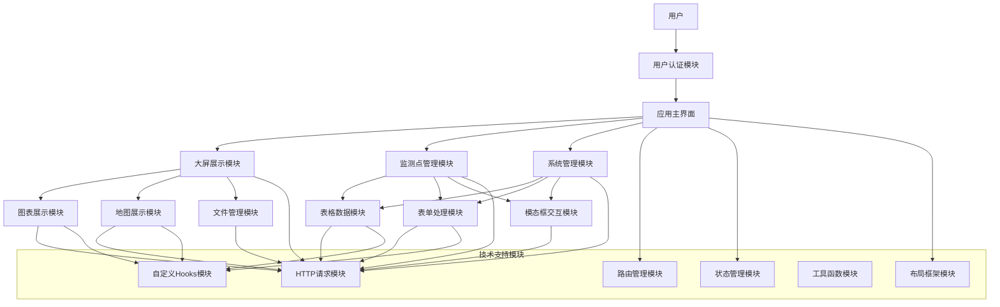
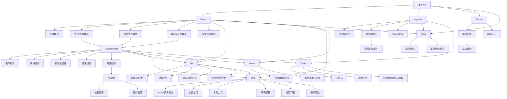
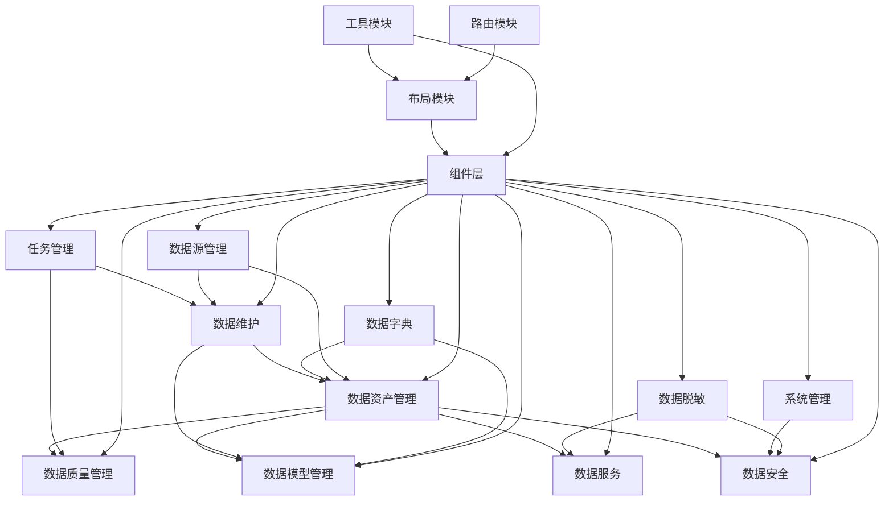

# 总统计

包括项目的技术栈、代码量、模块内容的简报。

| 项目名称                                                                    | 代码量 | 主要模块                                                                                                                   | 技术栈                                                        |
| :-------------------------------------------------------------------------- | ------ | -------------------------------------------------------------------------------------------------------------------------- | ------------------------------------------------------------- |
| 盐碱地重大盐碱地重大病虫害监测预警平台的多源异构数据管理系统-大屏可视化源码 | 6310   | 用户认证、大屏展示、监测点管理、系统管理、表单处理、表格数据、图表展示、地图展示                                           | vue3、vite、Ant-Design-Vue、less、WindiCss、pinia、vue-router |
| 盐碱地重大病虫害监测预警平台的多源异构数据管理系统-数据中台源码             | 185783 | 数据资产管理、数据质量管理、数据模型管理、数据服务、数据安全、数据维护、系统管理、任务管理、数据字典、数据源管理、数据脱敏 |                                                               |

## 盐碱地重大盐碱地重大病虫害监测预警平台的多源异构数据管理系统-大屏可视化源码

Date : 2025-03-13 14:26:11

Directory /home/ithedslonnie/Projects/tmp/盐碱地重大盐碱地重大病虫害监测预警平台的多源异构数据管理系统-大屏可视化源码

### 技术栈

技术栈:vue3、vite、Ant-Design-Vue、less、WindiCss、pinia、vue-router

### 模块组成

#### 模块结构

##### 核心模块
- **视图层 (Views)**
  - 登录模块 (Login)
  - 首页/大屏模块 (Index)
  - 系统管理模块 (System-Manage)
  - Demo示例模块 (Demo)
  - 异常页面模块 (Exception)

- **组件层 (Components)**
  - 表单组件 (Form)
  - 表格组件 (Table)
  - 模态框组件 (Modal)
  - 图表组件 (Chart)
  - 地图组件 (Map)

- **布局模块 (Layouts)**
  - 主布局 (Index)
  - 顶部导航栏 (Header)
  - 侧边菜单栏 (Sider)
  - 递归菜单组件 (RecursiveMenu)
  - iframe布局 (IframeIndex)

#### 功能模块
- **API接口模块 (API)**
  - 基础表格API (baseTable)
  - 演示API (demo)
  - 大屏指标API (largeScreenIndex)
  - 监测点管理API (monitorPointManage)

- **路由模块 (Router)**
  - 路由配置 (routes)
  - 路由守卫 (guard)
  - 路由模块 (modules)

- **状态管理模块 (Store)**
  - 演示状态 (demo)
  - 菜单状态管理 (menu)

- **工具类模块 (Utils)**
  - HTTP请求模块 (axios)
  - 加密工具 (cipher)
  - 日期工具 (dateUtil)
  - 环境配置 (env)
  - 类型判断 (is)
  - 通用函数 (index)

- **Hooks模块 (Hooks)**
  - 自动适配Hook (useAutoFit)
  - 其他通用Hooks (index)

- **样式模块 (Styles)**
  - 主样式 (main)
  - 通用样式 (common)
  - Ant Design样式覆盖 (ant_design_overwrite)

- **构建配置模块 (Build)**
  - Vite插件配置 (plugin)
  - 构建脚本 (script)
  - 工具函数 (utils)

- **资源模块 (Assets)**
  - 地图资源 (map_resources)
  - 图标资源 (icons)

#### 模块关系图

##### 业务模块图

##### 编程模块图

### 代码量

Total : 83 files,  5302 codes, 578 comments, 430 blanks, all 6310 lines

#### Languages

| language | files | code | comment | blank | total |
| :--- | ---: | ---: | ---: | ---: | ---: |
| JavaScript | 50 | 2,704 | 399 | 292 | 3,395 |
| Vue | 22 | 2,362 | 164 | 96 | 2,622 |
| Less | 5 | 109 | 8 | 12 | 129 |
| Markdown | 1 | 55 | 0 | 22 | 77 |
| JavaScript JSX | 1 | 43 | 0 | 0 | 43 |
| Django HTML | 1 | 13 | 0 | 1 | 14 |
| JSON | 1 | 8 | 0 | 0 | 8 |
| Properties | 1 | 7 | 7 | 6 | 20 |
| SVG | 1 | 1 | 0 | 1 | 2 |

各文件代码量详情见附件1.

## 盐碱地重大病虫害监测预警平台的多源异构数据管理系统-数据中台源码

### 技术栈

- **Vue 3**: 采用Vue 3作为核心框架，使用Composition API进行组件开发
- **Vite**: 项目构建工具，提供快速的开发环境和优化的生产构建
- **TypeScript**: 大部分代码使用TypeScript编写，提供类型检查和更好的开发体验
- **Pinia/Vuex**: 状态管理库，管理应用的全局状态

#### UI组件库
- **Ant Design Vue**: 主要UI组件库，提供丰富的UI组件
- **自定义组件**: 系统包含大量自定义组件，如表格、表单、模态框等

#### 数据可视化
- **ECharts**: 用于数据统计图表展示
- **G6**: 用于数据地图和关系图展示

#### 工具库
- **Axios**: HTTP请求库，封装了请求拦截、响应拦截等功能
- **dayjs**: 日期处理库
- **lodash**: 工具函数库
- **mitt**: 事件总线，用于组件间通信

#### 编辑器
- **Tinymce**: 富文本编辑器
- **CodeMirror**: 代码编辑器，用于SQL编辑等功能

#### 文件处理
- **PDF.js**: PDF文件预览
- **file-saver**: 文件下载
- **xlsx**: Excel文件处理

#### 流程图
- **JSPlumb**: 用于流程图和关系图的绘制

#### 国际化
- **vue-i18n**: 国际化解决方案，支持中英文切换

### 模块结构

#### 视图层 (Views)
- **数据资产管理模块 (data-assets-manage)**
  - 资产全景 (asset-panorama)
  - 资产列表 (assets-list)
  - 元数据管理 (assets-metadata)
  - 数据地图 (data-map)
  - 数据视图 (data-view)
  - SQL搜索 (sqlsearch)
  - 统计分析 (statistics)

- **数据质量管理模块 (data-quality)**
  - 异常数据 (abnormaldata)
  - 质量规则 (quality-rules)
  - 质量评估 (quality-evaluation)
  - 质量报告 (quality-report)
  - 质量统计 (quality-statistics)
  - 质量验证结果 (quality-verify-result)
  - 告警管理 (warn-current, warn-history, warn-user)

- **数据模型管理模块 (data-model)**
  - 数据模型管理 (data-model-manage)
  - 数据标签 (data-tag)
  - 识别模型 (identify-model)
  - 版本对比 (data-model-version-contrast)

- **数据服务模块 (data-service)**
  - 数据目录 (data-catalog)
  - 数据申请 (data-apply)
  - 数据发布 (data-publish)
  - 数据分析 (data-analysis)
  - 数据统计 (data-statistics)
  - 接口管理 (interface)

- **数据安全模块 (data-security)**
  - 用户管理 (user-manage)
  - 权限管理 (permission-manage)
  - 数据备份 (data-backup)
  - 备份文件管理 (backup-file-manage)
  - 操作日志 (operation-log)
  - 审计日志 (audit-log)
  - API日志 (api-log)

- **数据维护模块 (data-maintenance)**
  - 业务数据 (business)
  - 数据标签 (data-label)
  - 主数据维护 (data-master-maintenance)
  - 主数据模型 (data-master-model)
  - 文件管理 (file-manage)
  - 操作日志 (operation-log)

- **系统管理模块 (system-manage)**
  - 用户管理 (user-manage)
  - 角色管理 (role-manage)
  - 菜单管理 (menu-manage)
  - 服务管理 (service-manage)
  - 授权管理 (empower-manage)
  - 网关配置 (gateway-config-manage)
  - 接口URL管理 (interface-url-manage)

- **任务管理模块 (task-manage)**
  - 任务信息 (task-info)
  - 任务列表 (task-list)

- **数据字典模块 (dictionary)**
  - 业务字典 (business)
  - 代码规则 (code-rules)
  - 数据元素管理 (data-element-manage)
  - 领域管理 (domain)
  - 元数据管理 (metadata)
  - 参数设置 (param-setting)

- **模型标准模块 (modelStandards)**
  - 集成数据 (integratedData)
  - 参数标准 (parameterStandards)

- **标准设计模块 (standardDesign)**
  - 算法设计 (algorithmDesign)
  - 标准化文档 (standardizedDocuments)

- **系统页面模块 (sys)**
  - 错误日志 (error-log)
  - 异常页面 (exception)
  - iframe页面 (iframe)
  - 锁屏页面 (lock)
  - 登录页面 (login)
  - 重定向页面 (redirect)

#### 组件层 (Components)
- **基础组件**
  - 表单组件 (Form)
  - 表格组件 (Table)
  - 模态框组件 (Modal)
  - 抽屉组件 (Drawer)
  - 上传组件 (Upload)
  - 树形控件 (Tree)
  - 图标组件 (Icon)
  - 菜单组件 (Menu)
  - 简易菜单组件 (SimpleMenu)

- **功能组件**
  - 编辑器组件 (Tinymce, CodeEditor)
  - 图表组件 (FlowChart)
  - 预览组件 (Preview)
  - 验证组件 (Verify)
  - 时间组件 (Time)
  - 转场动画组件 (Transition)
  - 虚拟滚动组件 (VirtualScroll)
  - 图像识别组件 (imageRecognition)
  - Swagger组件 (Swagger)
  - PDF查看组件 (PdfView)
  - 二维码组件 (Qrcode)

#### 布局模块 (Layouts)
- **默认布局 (default)**
  - 内容区域 (content)
  - 特性区域 (feature)
  - 页脚 (footer)
  - 页眉 (header)
  - 菜单 (menu)
  - 设置抽屉 (setting)
  - 侧边栏 (sider)
  - 标签页 (tabs)
  - 触发器 (trigger)

- **iframe布局 (iframe)**
- **页面布局 (page)**

#### 工具模块 (Utils)

- **HTTP请求 (http/axios)**
- **缓存 (cache)**
- **认证 (auth)**
- **文件操作 (file)**
- **辅助函数 (helper)**
- **事件处理 (event)**
- **工厂函数 (factory)**
- **库封装 (lib)**

#### 路由模块 (Router)
- **路由守卫 (guard)**
- **路由助手 (helper)**
- **菜单 (menus)**
- **路由 (routes)**

#### 状态管理 (Store)
- **应用模块 (app)**
- **资产模块 (asset)**
- **错误日志模块 (errorLog)**
- **本地化模块 (locale)**
- **锁屏模块 (lock)**
- **多标签页模块 (multipleTab)**
- **权限模块 (permission)**
- **用户模块 (user)**

#### 样式模块 (Design)
- **Ant Design样式 (ant)**
- **过渡动画 (transition)**
- **变量定义 (var)**

#### 指令模块 (Directives)
- **点击外部指令 (clickOutside)**
- **加载指令 (loading)**
- **权限指令 (permission)**
- **重复点击指令 (repeatClick)**
- **水波纹指令 (ripple)**

#### 钩子函数 (Hooks)
- **组件钩子 (component)**
- **核心钩子 (core)**
- **事件钩子 (event)**
- **工厂钩子 (factory)**
- **设置钩子 (setting)**
- **Web钩子 (web)**

#### 本地化模块 (Locales)
- **英文 (en)**
- **中文 (zh-CN)**

#### API接口模块 (API)
- **系统管理API (system-manage)**
- **数据资产管理API (data-assets-manage)**
- **数据质量API (data-quality)**
- **数据模型API (data-model)**
- **数据服务API (data-service)**
- **数据安全API (data-security)**
- **数据维护API (data-maintenance)**
- **数据字典API (dictionary)**
- **数据源管理API (data-source-manage)**
- **数据脱敏API (data-desensitization)**
- **系统API (sys)**
- **任务管理API (task-manage)**

### 模块关系图

#### 功能模块图

#### 编程模块图

```mermaid
graph TD
    A[视图层] --> B[数据资产管理]
    A --> C[数据质量管理]
    A --> D[数据模型管理]
    A --> E[数据服务]
    A --> F[数据安全]
    A --> G[数据维护]
    A --> H[系统管理]
    A --> I[任务管理]
    A --> J[数据字典]
    A --> K[模型标准]
    A --> L[标准设计]
    A --> M[系统页面]
    
    N[组件层] --> O[基础组件]
    N --> P[功能组件]
    
    Q[布局模块] --> R[默认布局]
    Q --> S[iframe布局]
    Q --> T[页面布局]
    
    U[工具模块] --> V[HTTP请求]
    U --> W[缓存]
    U --> X[认证]
    U --> Y[文件操作]
    U --> Z[辅助函数]
    
    AA[路由模块] --> AB[路由守卫]
    AA --> AC[路由助手]
    AA --> AD[菜单]
    AA --> AE[路由]
    
    AF[状态管理] --> AG[应用模块]
    AF --> AH[资产模块]
    AF --> AI[权限模块]
    AF --> AJ[用户模块]
    
    AK[样式模块] --> AL[Ant Design样式]
    AK --> AM[过渡动画]
    AK --> AN[变量定义]
    
    AO[指令模块] --> AP[点击外部指令]
    AO --> AQ[加载指令]
    AO --> AR[权限指令]
    
    AS[钩子函数] --> AT[组件钩子]
    AS --> AU[核心钩子]
    AS --> AV[事件钩子]
    AS --> AW[Web钩子]
    
    AX[本地化模块] --> AY[英文]
    AX --> AZ[中文]
    
    BA[API接口模块] --> BB[系统管理API]
    BA --> BC[数据资产管理API]
    BA --> BD[数据质量API]
    BA --> BE[数据模型API]
    
    A --> N
    A --> Q
    A --> U
    A --> AA
    A --> AF
    A --> BA
    
    N --> U
    N --> AK
    N --> AO
    N --> AS
    
    Q --> N
    Q --> AK
    
    AA --> AF
```

### 核心功能模块

1. **数据资产管理**:管理和展示数据资产，包括资产全景、资产列表、元数据管理等功能。

2. **数据质量管理**:监控和管理数据质量，包括异常数据检测、质量规则设置、质量评估、质量报告等功能。

3. **数据模型管理**:管理数据模型，包括数据模型管理、数据标签、识别模型、版本对比等功能。

4. **数据服务**:提供数据服务，包括数据目录、数据申请、数据发布、数据分析、接口管理等功能。

5. **数据安全**:保障数据安全，包括用户管理、权限管理、数据备份、操作日志、审计日志等功能。

6. **数据维护**:维护数据，包括业务数据、数据标签、主数据维护、文件管理等功能。

7. **系统管理**:管理系统，包括用户管理、角色管理、菜单管理、服务管理、授权管理等功能。

8. **任务管理**:管理任务，包括任务信息、任务列表等功能。

这个项目是一个复杂的数据管理平台，主要用于盐碱地重大病虫害的监测预警。它采用了前端Vue框架构建，具有丰富的数据管理功能。系统架构采用了组件化和模块化的设计思想，有良好的代码组织结构。

### 代码量

Date : 2025-03-13 14:39:21

Directory /home/ithedslonnie/Projects/tmp/盐碱地重大病虫害监测预警平台的多源异构数据管理系统-数据中台源码

Total : 1371 files,  158186 codes, 11688 comments, 15909 blanks, all 185783 lines

Summary / [Details](details.md) / [Diff Summary](diff.md) / [Diff Details](diff-details.md)

#### Languages
| language | files | code | comment | blank | total |
| :--- | ---: | ---: | ---: | ---: | ---: |
| Vue | 559 | 72,642 | 3,813 | 7,546 | 84,001 |
| TypeScript | 655 | 45,412 | 6,726 | 4,921 | 57,059 |
| JavaScript | 36 | 28,965 | 221 | 438 | 29,624 |
| CSS | 25 | 4,264 | 570 | 2,098 | 6,932 |
| Less | 38 | 3,186 | 214 | 675 | 4,075 |
| TypeScript JSX | 13 | 1,418 | 103 | 120 | 1,641 |
| JSON | 5 | 898 | 0 | 3 | 901 |
| Django HTML | 7 | 807 | 0 | 49 | 856 |
| SVG | 25 | 259 | 2 | 10 | 271 |
| Log | 1 | 204 | 0 | 0 | 204 |
| JSON with Comments | 2 | 58 | 0 | 2 | 60 |
| Markdown | 2 | 32 | 0 | 27 | 59 |
| Properties | 1 | 28 | 39 | 16 | 83 |
| Ignore | 1 | 7 | 0 | 3 | 10 |
| YAML | 1 | 6 | 0 | 1 | 7 |

各个文件代码量详情见附件2.

## 附件

### 附件 1

#### Directories
| path | files | code | comment | blank | total |
| :--- | ---: | ---: | ---: | ---: | ---: |
| . | 83 | 5,302 | 578 | 430 | 6,310 |
| . (Files) | 8 | 212 | 13 | 41 | 266 |
| build | 12 | 281 | 68 | 58 | 407 |
| build (Files) | 3 | 65 | 20 | 10 | 95 |
| build/script | 2 | 47 | 7 | 13 | 67 |
| build/vite | 7 | 169 | 41 | 35 | 245 |
| build/vite (Files) | 1 | 15 | 9 | 5 | 29 |
| build/vite/plugin | 6 | 154 | 32 | 30 | 216 |
| src | 63 | 4,809 | 497 | 331 | 5,637 |
| src (Files) | 2 | 27 | 4 | 11 | 42 |
| src/api | 4 | 74 | 35 | 21 | 130 |
| src/assets | 6 | 110 | 8 | 13 | 131 |
| src/assets/icons | 1 | 1 | 0 | 1 | 2 |
| src/assets/styles | 5 | 109 | 8 | 12 | 129 |
| src/assets/styles (Files) | 1 | 5 | 0 | 1 | 6 |
| src/assets/styles/ant_design_overwrite | 3 | 67 | 2 | 4 | 73 |
| src/assets/styles/common | 1 | 37 | 6 | 7 | 50 |
| src/components | 8 | 1,053 | 91 | 45 | 1,189 |
| src/components/Chart | 1 | 52 | 0 | 8 | 60 |
| src/components/Form | 3 | 288 | 26 | 23 | 337 |
| src/components/Map | 1 | 255 | 23 | 2 | 280 |
| src/components/Modal | 1 | 106 | 1 | 2 | 109 |
| src/components/Table | 2 | 352 | 41 | 10 | 403 |
| src/hooks | 2 | 66 | 1 | 7 | 74 |
| src/layouts | 5 | 151 | 4 | 14 | 169 |
| src/layouts (Files) | 1 | 27 | 0 | 2 | 29 |
| src/layouts/header | 1 | 29 | 0 | 1 | 30 |
| src/layouts/iframe | 1 | 20 | 1 | 2 | 23 |
| src/layouts/sider | 2 | 75 | 3 | 9 | 87 |
| src/router | 6 | 147 | 17 | 16 | 180 |
| src/router (Files) | 1 | 26 | 10 | 3 | 39 |
| src/router/guard | 1 | 5 | 0 | 1 | 6 |
| src/router/routes | 4 | 116 | 7 | 12 | 135 |
| src/router/routes (Files) | 1 | 38 | 5 | 8 | 51 |
| src/router/routes/modules | 3 | 78 | 2 | 4 | 84 |
| src/store | 3 | 60 | 5 | 7 | 72 |
| src/store (Files) | 1 | 8 | 0 | 3 | 11 |
| src/store/modules | 2 | 52 | 5 | 4 | 61 |
| src/utils | 12 | 797 | 185 | 154 | 1,136 |
| src/utils (Files) | 5 | 278 | 48 | 75 | 401 |
| src/utils/axios | 7 | 519 | 137 | 79 | 735 |
| src/views | 15 | 2,324 | 147 | 43 | 2,514 |
| src/views/demo | 6 | 580 | 24 | 24 | 628 |
| src/views/demo (Files) | 1 | 56 | 0 | 0 | 56 |
| src/views/demo/form | 1 | 141 | 6 | 5 | 152 |
| src/views/demo/modal | 1 | 52 | 2 | 4 | 58 |
| src/views/demo/table | 3 | 331 | 16 | 15 | 362 |
| src/views/exception | 1 | 8 | 0 | 5 | 13 |
| src/views/index | 5 | 1,086 | 117 | 6 | 1,209 |
| src/views/index (Files) | 4 | 996 | 117 | 5 | 1,118 |
| src/views/index/components | 1 | 90 | 0 | 1 | 91 |
| src/views/login | 1 | 67 | 4 | 5 | 76 |
| src/views/system-manage | 2 | 583 | 2 | 3 | 588 |

### 附件 2

#### Directories

| path | files | code | comment | blank | total |
| :--- | ---: | ---: | ---: | ---: | ---: |
| . | 1,371 | 158,186 | 11,688 | 15,909 | 185,783 |
| . (Files) | 15 | 892 | 58 | 84 | 1,034 |
| build | 22 | 678 | 127 | 116 | 921 |
| build (Files) | 3 | 74 | 24 | 12 | 110 |
| build/config | 1 | 65 | 0 | 15 | 80 |
| build/generate | 2 | 95 | 6 | 13 | 114 |
| build/generate (Files) | 1 | 30 | 6 | 5 | 41 |
| build/generate/icon | 1 | 65 | 0 | 8 | 73 |
| build/script | 2 | 51 | 6 | 13 | 70 |
| build/vite | 14 | 393 | 91 | 63 | 547 |
| build/vite (Files) | 2 | 31 | 16 | 10 | 57 |
| build/vite/plugin | 12 | 362 | 75 | 53 | 490 |
| mock | 5 | 488 | 10 | 32 | 530 |
| mock (Files) | 2 | 60 | 8 | 12 | 80 |
| mock/demo | 1 | 69 | 0 | 3 | 72 |
| mock/sys | 2 | 359 | 2 | 17 | 378 |
| public | 30 | 17,720 | 422 | 1,933 | 20,075 |
| public/js | 5 | 859 | 43 | 2 | 904 |
| public/resource | 25 | 16,861 | 379 | 1,931 | 19,171 |
| public/resource/static | 13 | 14,473 | 319 | 350 | 15,142 |
| public/resource/static/jsplumb-template | 6 | 548 | 6 | 53 | 607 |
| public/resource/static/jsplumb-template (Files) | 3 | 304 | 3 | 25 | 332 |
| public/resource/static/jsplumb-template/task-node | 3 | 244 | 3 | 28 | 275 |
| public/resource/static/libs | 7 | 13,925 | 313 | 297 | 14,535 |
| public/resource/static/libs/jsplumb | 5 | 13,923 | 310 | 296 | 14,529 |
| public/resource/static/libs/swagger-ui | 2 | 2 | 3 | 1 | 6 |
| public/resource/tinymce | 12 | 2,388 | 60 | 1,581 | 4,029 |
| public/resource/tinymce/langs | 2 | 808 | 0 | 1 | 809 |
| public/resource/tinymce/skins | 10 | 1,580 | 60 | 1,580 | 3,220 |
| public/resource/tinymce/skins/ui | 10 | 1,580 | 60 | 1,580 | 3,220 |
| public/resource/tinymce/skins/ui/oxide | 5 | 790 | 30 | 790 | 1,610 |
| public/resource/tinymce/skins/ui/oxide-dark | 5 | 790 | 30 | 790 | 1,610 |
| src | 1,275 | 137,768 | 10,941 | 13,641 | 162,350 |
| src (Files) | 2 | 69 | 29 | 20 | 118 |
| src/api | 98 | 3,137 | 3,116 | 1,019 | 7,272 |
| src/api (Files) | 1 | 72 | 55 | 11 | 138 |
| src/api/data-assets-manage | 16 | 284 | 316 | 97 | 697 |
| src/api/data-assets-manage (Files) | 7 | 143 | 118 | 32 | 293 |
| src/api/data-assets-manage/abnormaldata | 1 | 29 | 11 | 7 | 47 |
| src/api/data-assets-manage/asset-details | 1 | 3 | 6 | 4 | 13 |
| src/api/data-assets-manage/asset-panorama | 4 | 41 | 96 | 32 | 169 |
| src/api/data-assets-manage/assets-list | 2 | 55 | 77 | 19 | 151 |
| src/api/data-assets-manage/metadata | 1 | 13 | 8 | 3 | 24 |
| src/api/data-catalog | 1 | 40 | 23 | 8 | 71 |
| src/api/data-catalog-new | 1 | 243 | 132 | 49 | 424 |
| src/api/data-desensitization | 1 | 46 | 28 | 8 | 82 |
| src/api/data-label | 2 | 30 | 14 | 6 | 50 |
| src/api/data-maintenance | 4 | 132 | 96 | 22 | 250 |
| src/api/data-master-manage | 2 | 26 | 38 | 12 | 76 |
| src/api/data-model | 6 | 134 | 213 | 30 | 377 |
| src/api/data-model (Files) | 1 | 14 | 19 | 8 | 41 |
| src/api/data-model-search | 1 | 27 | 9 | 6 | 42 |
| src/api/data-model/data-model-manage | 2 | 52 | 87 | 10 | 149 |
| src/api/data-model/data-model-version-contrast | 1 | 7 | 6 | 4 | 17 |
| src/api/data-model/task-manage | 2 | 61 | 101 | 8 | 170 |
| src/api/data-quality | 13 | 167 | 569 | 155 | 891 |
| src/api/data-security | 5 | 69 | 70 | 32 | 171 |
| src/api/data-service | 6 | 306 | 118 | 37 | 461 |
| src/api/data-source-manage | 1 | 33 | 65 | 8 | 106 |
| src/api/data-trace | 1 | 11 | 8 | 3 | 22 |
| src/api/demo | 1 | 5 | 4 | 4 | 13 |
| src/api/dictionary | 10 | 393 | 211 | 89 | 693 |
| src/api/manager | 8 | 321 | 242 | 97 | 660 |
| src/api/manager/data | 5 | 194 | 185 | 67 | 446 |
| src/api/manager/file | 1 | 102 | 42 | 15 | 159 |
| src/api/manager/monitor | 2 | 25 | 15 | 15 | 55 |
| src/api/model | 1 | 8 | 0 | 2 | 10 |
| src/api/notify-config | 1 | 8 | 35 | 8 | 51 |
| src/api/radical | 1 | 64 | 32 | 22 | 118 |
| src/api/standard | 1 | 186 | 458 | 198 | 842 |
| src/api/sys | 6 | 142 | 53 | 26 | 221 |
| src/api/sys (Files) | 3 | 104 | 36 | 19 | 159 |
| src/api/sys/model | 3 | 38 | 17 | 7 | 62 |
| src/api/system-manage | 8 | 390 | 327 | 89 | 806 |
| src/assets | 33 | 1,031 | 27 | 130 | 1,188 |
| src/assets/icons | 13 | 88 | 1 | 2 | 91 |
| src/assets/images | 1 | 126 | 1 | 1 | 128 |
| src/assets/images/login | 1 | 126 | 1 | 1 | 128 |
| src/assets/styles | 8 | 772 | 25 | 120 | 917 |
| src/assets/styles (Files) | 2 | 82 | 3 | 4 | 89 |
| src/assets/styles/iconfont | 5 | 661 | 19 | 110 | 790 |
| src/assets/styles/split | 1 | 29 | 3 | 6 | 38 |
| src/assets/svg | 11 | 45 | 0 | 7 | 52 |
| src/assets/svg (Files) | 6 | 40 | 0 | 2 | 42 |
| src/assets/svg/preview | 5 | 5 | 0 | 5 | 10 |
| src/bus | 2 | 13 | 1 | 5 | 19 |
| src/components | 276 | 21,961 | 1,570 | 3,001 | 26,532 |
| src/components (Files) | 1 | 93 | 0 | 1 | 94 |
| src/components/Application | 11 | 750 | 40 | 111 | 901 |
| src/components/Application (Files) | 1 | 12 | 0 | 4 | 16 |
| src/components/Application/src | 10 | 738 | 40 | 107 | 885 |
| src/components/Application/src (Files) | 5 | 276 | 28 | 43 | 347 |
| src/components/Application/src/search | 5 | 462 | 12 | 64 | 538 |
| src/components/Authority | 2 | 32 | 13 | 6 | 51 |
| src/components/Authority (Files) | 1 | 3 | 0 | 2 | 5 |
| src/components/Authority/src | 1 | 29 | 13 | 4 | 46 |
| src/components/Basic | 4 | 203 | 51 | 32 | 286 |
| src/components/Basic (Files) | 1 | 7 | 0 | 2 | 9 |
| src/components/Basic/src | 3 | 196 | 51 | 30 | 277 |
| src/components/Button | 4 | 95 | 18 | 13 | 126 |
| src/components/Button (Files) | 1 | 8 | 0 | 2 | 10 |
| src/components/Button/src | 3 | 87 | 18 | 11 | 116 |
| src/components/CardList | 3 | 188 | 16 | 11 | 215 |
| src/components/CardList (Files) | 1 | 3 | 0 | 2 | 5 |
| src/components/CardList/src | 2 | 185 | 16 | 9 | 210 |
| src/components/ClickOutSide | 2 | 20 | 0 | 5 | 25 |
| src/components/ClickOutSide (Files) | 1 | 3 | 0 | 2 | 5 |
| src/components/ClickOutSide/src | 1 | 17 | 0 | 3 | 20 |
| src/components/CodeEditor | 7 | 584 | 53 | 124 | 761 |
| src/components/CodeEditor (Files) | 1 | 6 | 2 | 3 | 11 |
| src/components/CodeEditor/src | 6 | 578 | 51 | 121 | 750 |
| src/components/CodeEditor/src (Files) | 2 | 54 | 1 | 6 | 61 |
| src/components/CodeEditor/src/codemirror | 3 | 514 | 50 | 112 | 676 |
| src/components/CodeEditor/src/json-preview | 1 | 10 | 0 | 3 | 13 |
| src/components/Container | 6 | 329 | 47 | 38 | 414 |
| src/components/Container (Files) | 1 | 8 | 0 | 3 | 11 |
| src/components/Container/src | 5 | 321 | 47 | 35 | 403 |
| src/components/Container/src (Files) | 3 | 209 | 27 | 22 | 258 |
| src/components/Container/src/collapse | 2 | 112 | 20 | 13 | 145 |
| src/components/ContextMenu | 4 | 276 | 2 | 46 | 324 |
| src/components/ContextMenu (Files) | 1 | 2 | 0 | 2 | 4 |
| src/components/ContextMenu/src | 3 | 274 | 2 | 44 | 320 |
| src/components/CountDown | 4 | 148 | 3 | 26 | 177 |
| src/components/CountDown (Files) | 1 | 5 | 0 | 2 | 7 |
| src/components/CountDown/src | 3 | 143 | 3 | 24 | 170 |
| src/components/CountTo | 2 | 91 | 9 | 16 | 116 |
| src/components/CountTo (Files) | 1 | 3 | 0 | 2 | 5 |
| src/components/CountTo/src | 1 | 88 | 9 | 14 | 111 |
| src/components/Cropper | 5 | 581 | 4 | 67 | 652 |
| src/components/Cropper (Files) | 1 | 6 | 0 | 2 | 8 |
| src/components/Cropper/src | 4 | 575 | 4 | 65 | 644 |
| src/components/Description | 4 | 202 | 32 | 35 | 269 |
| src/components/Description (Files) | 1 | 5 | 0 | 2 | 7 |
| src/components/Description/src | 3 | 197 | 32 | 33 | 262 |
| src/components/Drawer | 7 | 599 | 120 | 105 | 824 |
| src/components/Drawer (Files) | 1 | 5 | 0 | 2 | 7 |
| src/components/Drawer/src | 6 | 594 | 120 | 103 | 817 |
| src/components/Drawer/src (Files) | 4 | 456 | 120 | 83 | 659 |
| src/components/Drawer/src/components | 2 | 138 | 0 | 20 | 158 |
| src/components/Dropdown | 3 | 97 | 5 | 11 | 113 |
| src/components/Dropdown (Files) | 1 | 4 | 0 | 2 | 6 |
| src/components/Dropdown/src | 2 | 93 | 5 | 9 | 107 |
| src/components/Excel | 5 | 283 | 31 | 33 | 347 |
| src/components/Excel (Files) | 1 | 7 | 0 | 2 | 9 |
| src/components/Excel/src | 4 | 276 | 31 | 31 | 338 |
| src/components/Filter | 7 | 721 | 11 | 67 | 799 |
| src/components/Filter (Files) | 1 | 2 | 0 | 0 | 2 |
| src/components/Filter/src | 6 | 719 | 11 | 67 | 797 |
| src/components/Filter/src (Files) | 2 | 386 | 8 | 35 | 429 |
| src/components/Filter/src/components | 3 | 309 | 2 | 26 | 337 |
| src/components/Filter/src/hooks | 1 | 24 | 1 | 6 | 31 |
| src/components/FlowChart | 8 | 480 | 12 | 53 | 545 |
| src/components/FlowChart (Files) | 1 | 3 | 0 | 2 | 5 |
| src/components/FlowChart/src | 7 | 477 | 12 | 51 | 540 |
| src/components/Form | 24 | 2,373 | 263 | 329 | 2,965 |
| src/components/Form (Files) | 1 | 11 | 0 | 5 | 16 |
| src/components/Form/src | 23 | 2,362 | 263 | 324 | 2,949 |
| src/components/Form/src (Files) | 4 | 489 | 33 | 74 | 596 |
| src/components/Form/src/components | 7 | 1,017 | 24 | 96 | 1,137 |
| src/components/Form/src/hooks | 8 | 644 | 35 | 98 | 777 |
| src/components/Form/src/types | 4 | 212 | 171 | 56 | 439 |
| src/components/GrowCard | 3 | 86 | 0 | 7 | 93 |
| src/components/GrowCard (Files) | 2 | 48 | 0 | 3 | 51 |
| src/components/GrowCard/src | 1 | 38 | 0 | 4 | 42 |
| src/components/Icon | 5 | 1,141 | 6 | 46 | 1,193 |
| src/components/Icon (Files) | 1 | 5 | 0 | 3 | 8 |
| src/components/Icon/data | 1 | 793 | 0 | 1 | 794 |
| src/components/Icon/src | 3 | 343 | 6 | 42 | 391 |
| src/components/Loading | 5 | 183 | 1 | 29 | 213 |
| src/components/Loading (Files) | 1 | 4 | 0 | 2 | 6 |
| src/components/Loading/src | 4 | 179 | 1 | 27 | 207 |
| src/components/Markdown | 4 | 164 | 2 | 19 | 185 |
| src/components/Markdown (Files) | 1 | 6 | 0 | 2 | 8 |
| src/components/Markdown/src | 3 | 158 | 2 | 17 | 177 |
| src/components/Menu | 9 | 443 | 19 | 66 | 528 |
| src/components/Menu (Files) | 1 | 2 | 0 | 2 | 4 |
| src/components/Menu/src | 8 | 441 | 19 | 64 | 524 |
| src/components/Menu/src (Files) | 5 | 339 | 19 | 54 | 412 |
| src/components/Menu/src/components | 3 | 102 | 0 | 10 | 112 |
| src/components/Modal | 14 | 1,046 | 157 | 216 | 1,419 |
| src/components/Modal (Files) | 1 | 7 | 0 | 2 | 9 |
| src/components/Modal/src | 13 | 1,039 | 157 | 214 | 1,410 |
| src/components/Modal/src (Files) | 4 | 465 | 126 | 116 | 707 |
| src/components/Modal/src/components | 5 | 321 | 5 | 43 | 369 |
| src/components/Modal/src/hooks | 4 | 253 | 26 | 55 | 334 |
| src/components/Page | 3 | 218 | 0 | 30 | 248 |
| src/components/Page (Files) | 1 | 6 | 0 | 4 | 10 |
| src/components/Page/src | 2 | 212 | 0 | 26 | 238 |
| src/components/PdfView | 3 | 99 | 3 | 15 | 117 |
| src/components/PdfView (Files) | 1 | 4 | 0 | 0 | 4 |
| src/components/PdfView/src | 2 | 95 | 3 | 15 | 113 |
| src/components/Preview | 5 | 630 | 20 | 63 | 713 |
| src/components/Preview (Files) | 1 | 2 | 0 | 1 | 3 |
| src/components/Preview/src | 4 | 628 | 20 | 62 | 710 |
| src/components/Qrcode | 7 | 248 | 18 | 35 | 301 |
| src/components/Qrcode (Files) | 1 | 4 | 0 | 2 | 6 |
| src/components/Qrcode/src | 6 | 244 | 18 | 33 | 295 |
| src/components/Scrollbar | 5 | 345 | 6 | 46 | 397 |
| src/components/Scrollbar (Files) | 1 | 3 | 3 | 3 | 9 |
| src/components/Scrollbar/src | 4 | 342 | 3 | 43 | 388 |
| src/components/SimpleMenu | 15 | 1,389 | 8 | 206 | 1,603 |
| src/components/SimpleMenu (Files) | 1 | 2 | 0 | 1 | 3 |
| src/components/SimpleMenu/src | 14 | 1,387 | 8 | 205 | 1,600 |
| src/components/SimpleMenu/src (Files) | 6 | 420 | 0 | 59 | 479 |
| src/components/SimpleMenu/src/components | 8 | 967 | 8 | 146 | 1,121 |
| src/components/StrengthMeter | 2 | 128 | 0 | 20 | 148 |
| src/components/StrengthMeter (Files) | 1 | 3 | 0 | 2 | 5 |
| src/components/StrengthMeter/src | 1 | 125 | 0 | 18 | 143 |
| src/components/Swagger | 4 | 63 | 0 | 16 | 79 |
| src/components/Swagger (Files) | 1 | 3 | 0 | 0 | 3 |
| src/components/Swagger/src | 3 | 60 | 0 | 16 | 76 |
| src/components/Table | 41 | 4,081 | 464 | 590 | 5,135 |
| src/components/Table (Files) | 1 | 10 | 0 | 1 | 11 |
| src/components/Table/src | 40 | 4,071 | 464 | 589 | 5,124 |
| src/components/Table/src (Files) | 4 | 584 | 19 | 72 | 675 |
| src/components/Table/src/components | 17 | 1,688 | 35 | 208 | 1,931 |
| src/components/Table/src/components (Files) | 8 | 555 | 11 | 52 | 618 |
| src/components/Table/src/components/editable | 4 | 542 | 10 | 80 | 632 |
| src/components/Table/src/components/settings | 5 | 591 | 14 | 76 | 681 |
| src/components/Table/src/hooks | 14 | 1,452 | 40 | 202 | 1,694 |
| src/components/Table/src/types | 5 | 347 | 370 | 107 | 824 |
| src/components/Time | 2 | 92 | 6 | 16 | 114 |
| src/components/Time (Files) | 1 | 3 | 0 | 2 | 5 |
| src/components/Time/src | 1 | 89 | 6 | 14 | 109 |
| src/components/Tinymce | 5 | 486 | 5 | 54 | 545 |
| src/components/Tinymce (Files) | 1 | 3 | 0 | 2 | 5 |
| src/components/Tinymce/src | 4 | 483 | 5 | 52 | 540 |
| src/components/Transition | 4 | 224 | 7 | 40 | 271 |
| src/components/Transition (Files) | 1 | 22 | 0 | 6 | 28 |
| src/components/Transition/src | 3 | 202 | 7 | 34 | 243 |
| src/components/Tree | 8 | 925 | 16 | 124 | 1,065 |
| src/components/Tree (Files) | 1 | 6 | 0 | 2 | 8 |
| src/components/Tree/src | 5 | 876 | 15 | 111 | 1,002 |
| src/components/Tree/style | 2 | 43 | 1 | 11 | 55 |
| src/components/Upload | 11 | 907 | 87 | 88 | 1,082 |
| src/components/Upload (Files) | 1 | 3 | 0 | 2 | 5 |
| src/components/Upload/src | 10 | 904 | 87 | 86 | 1,077 |
| src/components/Verify | 5 | 624 | 3 | 77 | 704 |
| src/components/Verify (Files) | 1 | 6 | 0 | 2 | 8 |
| src/components/Verify/src | 4 | 618 | 3 | 75 | 696 |
| src/components/VirtualScroll | 2 | 170 | 0 | 26 | 196 |
| src/components/VirtualScroll (Files) | 1 | 3 | 0 | 2 | 5 |
| src/components/VirtualScroll/src | 1 | 167 | 0 | 24 | 191 |
| src/components/imageRecognition | 1 | 124 | 12 | 43 | 179 |
| src/design | 22 | 1,024 | 176 | 229 | 1,429 |
| src/design (Files) | 5 | 201 | 79 | 61 | 341 |
| src/design/ant | 7 | 561 | 69 | 85 | 715 |
| src/design/transition | 7 | 203 | 12 | 55 | 270 |
| src/design/var | 3 | 59 | 16 | 28 | 103 |
| src/directives | 7 | 348 | 15 | 57 | 420 |
| src/directives (Files) | 5 | 165 | 13 | 28 | 206 |
| src/directives/ripple | 2 | 183 | 2 | 29 | 214 |
| src/enums | 9 | 162 | 56 | 46 | 264 |
| src/hooks | 41 | 2,112 | 88 | 416 | 2,616 |
| src/hooks/component | 2 | 64 | 0 | 16 | 80 |
| src/hooks/core | 6 | 148 | 2 | 37 | 187 |
| src/hooks/event | 6 | 310 | 3 | 48 | 361 |
| src/hooks/factory | 1 | 57 | 3 | 2 | 62 |
| src/hooks/setting | 6 | 396 | 3 | 118 | 517 |
| src/hooks/web | 20 | 1,137 | 77 | 195 | 1,409 |
| src/layouts | 55 | 5,079 | 121 | 765 | 5,965 |
| src/layouts/default | 51 | 4,929 | 112 | 730 | 5,771 |
| src/layouts/default (Files) | 1 | 83 | 2 | 12 | 97 |
| src/layouts/default/content | 3 | 95 | 0 | 18 | 113 |
| src/layouts/default/feature | 1 | 72 | 0 | 12 | 84 |
| src/layouts/default/footer | 1 | 77 | 1 | 18 | 96 |
| src/layouts/default/header | 16 | 1,642 | 34 | 216 | 1,892 |
| src/layouts/default/header (Files) | 3 | 450 | 21 | 77 | 548 |
| src/layouts/default/header/components | 13 | 1,192 | 13 | 139 | 1,344 |
| src/layouts/default/header/components (Files) | 4 | 256 | 0 | 51 | 307 |
| src/layouts/default/header/components/api | 2 | 83 | 0 | 8 | 91 |
| src/layouts/default/header/components/lock | 1 | 107 | 1 | 16 | 124 |
| src/layouts/default/header/components/notify | 3 | 442 | 6 | 28 | 476 |
| src/layouts/default/header/components/token | 1 | 109 | 0 | 12 | 121 |
| src/layouts/default/header/components/user-dropdown | 2 | 195 | 6 | 24 | 225 |
| src/layouts/default/menu | 2 | 244 | 18 | 47 | 309 |
| src/layouts/default/setting | 11 | 1,192 | 10 | 162 | 1,364 |
| src/layouts/default/setting (Files) | 4 | 675 | 9 | 103 | 787 |
| src/layouts/default/setting/components | 7 | 517 | 1 | 59 | 577 |
| src/layouts/default/sider | 5 | 861 | 25 | 136 | 1,022 |
| src/layouts/default/tabs | 8 | 599 | 22 | 102 | 723 |
| src/layouts/default/tabs (Files) | 5 | 475 | 21 | 79 | 575 |
| src/layouts/default/tabs/components | 3 | 124 | 1 | 23 | 148 |
| src/layouts/default/trigger | 3 | 64 | 0 | 7 | 71 |
| src/layouts/iframe | 2 | 73 | 0 | 17 | 90 |
| src/layouts/page | 2 | 77 | 9 | 18 | 104 |
| src/locales | 19 | 1,154 | 24 | 168 | 1,346 |
| src/locales (Files) | 3 | 120 | 6 | 30 | 156 |
| src/locales/lang | 16 | 1,034 | 18 | 138 | 1,190 |
| src/locales/lang (Files) | 2 | 23 | 1 | 4 | 28 |
| src/locales/lang/en | 7 | 509 | 8 | 68 | 585 |
| src/locales/lang/en (Files) | 4 | 325 | 8 | 40 | 373 |
| src/locales/lang/en/routes | 3 | 184 | 0 | 28 | 212 |
| src/locales/lang/zh-CN | 7 | 502 | 9 | 66 | 577 |
| src/locales/lang/zh-CN (Files) | 4 | 319 | 9 | 46 | 374 |
| src/locales/lang/zh-CN/routes | 3 | 183 | 0 | 20 | 203 |
| src/logics | 9 | 326 | 67 | 60 | 453 |
| src/logics (Files) | 1 | 62 | 10 | 13 | 85 |
| src/logics/error-handle | 1 | 137 | 32 | 16 | 185 |
| src/logics/mitt | 1 | 21 | 3 | 8 | 32 |
| src/logics/theme | 6 | 106 | 22 | 23 | 151 |
| src/router | 25 | 2,196 | 130 | 194 | 2,520 |
| src/router (Files) | 3 | 80 | 13 | 29 | 122 |
| src/router/guard | 5 | 276 | 30 | 52 | 358 |
| src/router/helper | 2 | 220 | 19 | 28 | 267 |
| src/router/menus | 1 | 101 | 5 | 21 | 127 |
| src/router/routes | 14 | 1,519 | 63 | 64 | 1,646 |
| src/router/routes (Files) | 3 | 123 | 10 | 17 | 150 |
| src/router/routes/modules | 11 | 1,396 | 53 | 47 | 1,496 |
| src/settings | 6 | 186 | 98 | 51 | 335 |
| src/static | 11 | 14,438 | 316 | 348 | 15,102 |
| src/static/jsplumb-template | 6 | 515 | 6 | 52 | 573 |
| src/static/jsplumb-template (Files) | 3 | 304 | 3 | 25 | 332 |
| src/static/jsplumb-template/task-node | 3 | 211 | 3 | 27 | 241 |
| src/static/libs | 5 | 13,923 | 310 | 296 | 14,529 |
| src/static/libs/jsplumb | 5 | 13,923 | 310 | 296 | 14,529 |
| src/store | 9 | 906 | 116 | 116 | 1,138 |
| src/store (Files) | 1 | 7 | 0 | 4 | 11 |
| src/store/modules | 8 | 899 | 116 | 112 | 1,127 |
| src/utils | 34 | 2,529 | 525 | 379 | 3,433 |
| src/utils (Files) | 14 | 891 | 209 | 173 | 1,273 |
| src/utils/auth | 1 | 21 | 0 | 6 | 27 |
| src/utils/cache | 4 | 282 | 43 | 59 | 384 |
| src/utils/event | 1 | 34 | 3 | 6 | 43 |
| src/utils/factory | 2 | 46 | 30 | 4 | 80 |
| src/utils/file | 2 | 94 | 32 | 13 | 139 |
| src/utils/helper | 3 | 551 | 39 | 33 | 623 |
| src/utils/http | 6 | 560 | 169 | 79 | 808 |
| src/utils/http/axios | 6 | 560 | 169 | 79 | 808 |
| src/utils/lib | 1 | 50 | 0 | 6 | 56 |
| src/views | 617 | 81,097 | 4,466 | 6,637 | 92,200 |
| src/views/analogData | 3 | 689 | 21 | 28 | 738 |
| src/views/data-assets-manage | 144 | 14,643 | 731 | 1,315 | 16,689 |
| src/views/data-assets-manage (Files) | 2 | 95 | 27 | 19 | 141 |
| src/views/data-assets-manage/asset-panorama | 37 | 3,516 | 245 | 286 | 4,047 |
| src/views/data-assets-manage/asset-panorama/asset-portal | 22 | 2,735 | 221 | 238 | 3,194 |
| src/views/data-assets-manage/asset-panorama/asset-portal (Files) | 10 | 1,997 | 157 | 179 | 2,333 |
| src/views/data-assets-manage/asset-panorama/asset-portal/components | 3 | 463 | 15 | 31 | 509 |
| src/views/data-assets-manage/asset-panorama/asset-portal/data | 1 | 79 | 16 | 3 | 98 |
| src/views/data-assets-manage/asset-panorama/asset-portal/test | 8 | 196 | 33 | 25 | 254 |
| src/views/data-assets-manage/asset-panorama/asset-statistics | 5 | 271 | 10 | 20 | 301 |
| src/views/data-assets-manage/asset-panorama/asset-statistics (Files) | 2 | 120 | 2 | 12 | 134 |
| src/views/data-assets-manage/asset-panorama/asset-statistics/components | 3 | 151 | 8 | 8 | 167 |
| src/views/data-assets-manage/asset-panorama/asset-subject-domain | 1 | 9 | 0 | 4 | 13 |
| src/views/data-assets-manage/asset-panorama/assets-data-source | 1 | 9 | 0 | 4 | 13 |
| src/views/data-assets-manage/asset-panorama/panorama-statistics | 8 | 492 | 14 | 20 | 526 |
| src/views/data-assets-manage/asset-panorama/panorama-statistics (Files) | 2 | 128 | 7 | 5 | 140 |
| src/views/data-assets-manage/asset-panorama/panorama-statistics/components | 6 | 364 | 7 | 15 | 386 |
| src/views/data-assets-manage/assets-list | 66 | 7,074 | 307 | 627 | 8,008 |
| src/views/data-assets-manage/assets-list (Files) | 1 | 99 | 0 | 8 | 107 |
| src/views/data-assets-manage/assets-list/api | 17 | 1,718 | 60 | 103 | 1,881 |
| src/views/data-assets-manage/assets-list/api (Files) | 6 | 1,045 | 12 | 47 | 1,104 |
| src/views/data-assets-manage/assets-list/api/components | 3 | 477 | 15 | 31 | 523 |
| src/views/data-assets-manage/assets-list/api/test | 8 | 196 | 33 | 25 | 254 |
| src/views/data-assets-manage/assets-list/business | 4 | 503 | 10 | 34 | 547 |
| src/views/data-assets-manage/assets-list/catalog | 4 | 336 | 2 | 25 | 363 |
| src/views/data-assets-manage/assets-list/components | 27 | 2,827 | 224 | 355 | 3,406 |
| src/views/data-assets-manage/assets-list/components/leftTree | 1 | 175 | 23 | 29 | 227 |
| src/views/data-assets-manage/assets-list/components/rightView | 26 | 2,652 | 201 | 326 | 3,179 |
| src/views/data-assets-manage/assets-list/components/rightView (Files) | 7 | 702 | 19 | 65 | 786 |
| src/views/data-assets-manage/assets-list/components/rightView/Upload | 11 | 966 | 93 | 90 | 1,149 |
| src/views/data-assets-manage/assets-list/components/rightView/Upload (Files) | 1 | 3 | 0 | 2 | 5 |
| src/views/data-assets-manage/assets-list/components/rightView/Upload/src | 10 | 963 | 93 | 88 | 1,144 |
| src/views/data-assets-manage/assets-list/components/rightView/components | 8 | 984 | 89 | 171 | 1,244 |
| src/views/data-assets-manage/assets-list/file | 3 | 144 | 0 | 16 | 160 |
| src/views/data-assets-manage/assets-list/subject | 1 | 147 | 2 | 11 | 160 |
| src/views/data-assets-manage/assets-list/table | 9 | 1,300 | 9 | 75 | 1,384 |
| src/views/data-assets-manage/assets-metadata | 18 | 2,235 | 97 | 177 | 2,509 |
| src/views/data-assets-manage/assets-metadata/analysis | 5 | 883 | 45 | 76 | 1,004 |
| src/views/data-assets-manage/assets-metadata/analysis (Files) | 1 | 163 | 13 | 10 | 186 |
| src/views/data-assets-manage/assets-metadata/analysis/analyse | 4 | 720 | 32 | 66 | 818 |
| src/views/data-assets-manage/assets-metadata/business | 2 | 56 | 0 | 3 | 59 |
| src/views/data-assets-manage/assets-metadata/domain | 1 | 54 | 3 | 8 | 65 |
| src/views/data-assets-manage/assets-metadata/harvest | 5 | 641 | 41 | 57 | 739 |
| src/views/data-assets-manage/assets-metadata/harvest (Files) | 1 | 146 | 14 | 15 | 175 |
| src/views/data-assets-manage/assets-metadata/harvest/components | 4 | 495 | 27 | 42 | 564 |
| src/views/data-assets-manage/assets-metadata/store | 3 | 544 | 8 | 29 | 581 |
| src/views/data-assets-manage/assets-metadata/subject | 2 | 57 | 0 | 4 | 61 |
| src/views/data-assets-manage/components | 2 | 239 | 1 | 17 | 257 |
| src/views/data-assets-manage/data-map | 6 | 524 | 4 | 68 | 596 |
| src/views/data-assets-manage/data-view | 4 | 264 | 2 | 37 | 303 |
| src/views/data-assets-manage/data-view (Files) | 3 | 237 | 2 | 34 | 273 |
| src/views/data-assets-manage/data-view/hooks | 1 | 27 | 0 | 3 | 30 |
| src/views/data-assets-manage/hooks | 4 | 178 | 1 | 29 | 208 |
| src/views/data-assets-manage/sqlsearch | 2 | 288 | 45 | 39 | 372 |
| src/views/data-assets-manage/statistics | 3 | 230 | 2 | 16 | 248 |
| src/views/data-assets-manage/statistics (Files) | 1 | 40 | 0 | 3 | 43 |
| src/views/data-assets-manage/statistics/components | 2 | 190 | 2 | 13 | 205 |
| src/views/data-desensitization | 3 | 580 | 19 | 25 | 624 |
| src/views/data-maintenance | 80 | 9,335 | 664 | 921 | 10,920 |
| src/views/data-maintenance/business | 43 | 4,045 | 266 | 408 | 4,719 |
| src/views/data-maintenance/business (Files) | 2 | 242 | 0 | 12 | 254 |
| src/views/data-maintenance/business/components | 39 | 3,660 | 262 | 379 | 4,301 |
| src/views/data-maintenance/business/components (Files) | 6 | 689 | 49 | 58 | 796 |
| src/views/data-maintenance/business/components/data-file | 14 | 1,322 | 102 | 111 | 1,535 |
| src/views/data-maintenance/business/components/data-file (Files) | 3 | 356 | 9 | 21 | 386 |
| src/views/data-maintenance/business/components/data-file/Upload | 11 | 966 | 93 | 90 | 1,149 |
| src/views/data-maintenance/business/components/data-file/Upload (Files) | 1 | 3 | 0 | 2 | 5 |
| src/views/data-maintenance/business/components/data-file/Upload/src | 10 | 963 | 93 | 88 | 1,144 |
| src/views/data-maintenance/business/components/related-files | 2 | 175 | 2 | 18 | 195 |
| src/views/data-maintenance/business/components/threeModel | 17 | 1,474 | 109 | 192 | 1,775 |
| src/views/data-maintenance/business/components/threeModel (Files) | 3 | 194 | 10 | 27 | 231 |
| src/views/data-maintenance/business/components/threeModel/components | 12 | 1,061 | 93 | 139 | 1,293 |
| src/views/data-maintenance/business/components/threeModel/components (Files) | 1 | 121 | 0 | 47 | 168 |
| src/views/data-maintenance/business/components/threeModel/components/Upload | 11 | 940 | 93 | 92 | 1,125 |
| src/views/data-maintenance/business/components/threeModel/components/Upload (Files) | 1 | 3 | 0 | 2 | 5 |
| src/views/data-maintenance/business/components/threeModel/components/Upload/src | 10 | 937 | 93 | 90 | 1,120 |
| src/views/data-maintenance/business/components/threeModel/data | 2 | 219 | 6 | 26 | 251 |
| src/views/data-maintenance/business/hooks | 2 | 143 | 4 | 17 | 164 |
| src/views/data-maintenance/data-label | 4 | 130 | 1 | 21 | 152 |
| src/views/data-maintenance/data-label/category | 1 | 17 | 0 | 2 | 19 |
| src/views/data-maintenance/data-label/model-dag | 1 | 8 | 0 | 5 | 13 |
| src/views/data-maintenance/data-label/object | 2 | 105 | 1 | 14 | 120 |
| src/views/data-maintenance/data-master-maintenance | 3 | 218 | 23 | 24 | 265 |
| src/views/data-maintenance/data-master-maintenance (Files) | 1 | 19 | 0 | 5 | 24 |
| src/views/data-maintenance/data-master-maintenance/components | 2 | 199 | 23 | 19 | 241 |
| src/views/data-maintenance/data-master-model | 5 | 670 | 43 | 50 | 763 |
| src/views/data-maintenance/data-master-model (Files) | 1 | 274 | 32 | 32 | 338 |
| src/views/data-maintenance/data-master-model/components | 4 | 396 | 11 | 18 | 425 |
| src/views/data-maintenance/data-view | 1 | 74 | 1 | 9 | 84 |
| src/views/data-maintenance/file-log | 1 | 84 | 0 | 8 | 92 |
| src/views/data-maintenance/file-manage | 21 | 3,950 | 329 | 383 | 4,662 |
| src/views/data-maintenance/file-manage (Files) | 6 | 1,760 | 232 | 169 | 2,161 |
| src/views/data-maintenance/file-manage/components | 14 | 2,152 | 90 | 210 | 2,452 |
| src/views/data-maintenance/file-manage/hooks | 1 | 38 | 7 | 4 | 49 |
| src/views/data-maintenance/operation-log | 2 | 164 | 1 | 18 | 183 |
| src/views/data-model | 35 | 5,901 | 250 | 343 | 6,494 |
| src/views/data-model/data-model-manage | 22 | 3,925 | 173 | 204 | 4,302 |
| src/views/data-model/data-model-manage (Files) | 8 | 1,014 | 70 | 91 | 1,175 |
| src/views/data-model/data-model-manage/components | 14 | 2,911 | 103 | 113 | 3,127 |
| src/views/data-model/data-model-manage/components/compare-modal | 1 | 27 | 0 | 3 | 30 |
| src/views/data-model/data-model-manage/components/data-model-statistics | 1 | 170 | 1 | 4 | 175 |
| src/views/data-model/data-model-manage/components/data-table-item | 6 | 1,883 | 93 | 66 | 2,042 |
| src/views/data-model/data-model-manage/components/identity-modal | 1 | 27 | 0 | 4 | 31 |
| src/views/data-model/data-model-manage/components/relate-file-datasource | 2 | 270 | 1 | 12 | 283 |
| src/views/data-model/data-model-manage/components/tag-manage | 3 | 534 | 8 | 24 | 566 |
| src/views/data-model/data-model-version-contrast | 2 | 297 | 1 | 21 | 319 |
| src/views/data-model/data-tag | 6 | 925 | 32 | 46 | 1,003 |
| src/views/data-model/identify-model | 5 | 754 | 44 | 72 | 870 |
| src/views/data-quality | 55 | 5,449 | 331 | 456 | 6,236 |
| src/views/data-quality/abnormaldata | 3 | 333 | 87 | 15 | 435 |
| src/views/data-quality/abnormaldata (Files) | 2 | 284 | 79 | 14 | 377 |
| src/views/data-quality/abnormaldata/components | 1 | 49 | 8 | 1 | 58 |
| src/views/data-quality/evaluate-data | 1 | 5 | 0 | 3 | 8 |
| src/views/data-quality/job | 2 | 178 | 7 | 21 | 206 |
| src/views/data-quality/quality-chart | 3 | 407 | 6 | 31 | 444 |
| src/views/data-quality/quality-evaluation | 3 | 260 | 2 | 18 | 280 |
| src/views/data-quality/quality-report | 4 | 529 | 6 | 80 | 615 |
| src/views/data-quality/quality-report (Files) | 1 | 397 | 6 | 57 | 460 |
| src/views/data-quality/quality-report-manage | 1 | 103 | 3 | 13 | 119 |
| src/views/data-quality/quality-report/components | 3 | 132 | 0 | 23 | 155 |
| src/views/data-quality/quality-rules | 3 | 554 | 59 | 31 | 644 |
| src/views/data-quality/quality-statistics | 9 | 462 | 1 | 30 | 493 |
| src/views/data-quality/quality-statistics (Files) | 2 | 70 | 0 | 5 | 75 |
| src/views/data-quality/quality-statistics/components | 7 | 392 | 1 | 25 | 418 |
| src/views/data-quality/quality-verify-result | 2 | 181 | 5 | 12 | 198 |
| src/views/data-quality/result | 2 | 98 | 14 | 16 | 128 |
| src/views/data-quality/rule | 13 | 1,422 | 90 | 127 | 1,639 |
| src/views/data-quality/rule (Files) | 2 | 157 | 15 | 19 | 191 |
| src/views/data-quality/rule-base | 3 | 453 | 22 | 24 | 499 |
| src/views/data-quality/rule-temp | 3 | 309 | 8 | 17 | 334 |
| src/views/data-quality/rule/components | 4 | 649 | 41 | 52 | 742 |
| src/views/data-quality/rule/hooks | 7 | 616 | 34 | 56 | 706 |
| src/views/data-quality/warn-current | 1 | 69 | 7 | 8 | 84 |
| src/views/data-quality/warn-history | 1 | 43 | 7 | 5 | 55 |
| src/views/data-quality/warn-user | 1 | 43 | 7 | 5 | 55 |
| src/views/data-security | 14 | 990 | 30 | 62 | 1,082 |
| src/views/data-security/api-log | 2 | 74 | 0 | 5 | 79 |
| src/views/data-security/audit-log | 2 | 113 | 1 | 5 | 119 |
| src/views/data-security/backup-file-manage | 3 | 262 | 10 | 19 | 291 |
| src/views/data-security/data-backup | 3 | 407 | 18 | 22 | 447 |
| src/views/data-security/operation-log | 2 | 124 | 1 | 5 | 130 |
| src/views/data-security/permission-manage | 1 | 5 | 0 | 3 | 8 |
| src/views/data-security/user-manage | 1 | 5 | 0 | 3 | 8 |
| src/views/data-service | 66 | 9,299 | 475 | 787 | 10,561 |
| src/views/data-service/data-analysis | 3 | 433 | 13 | 26 | 472 |
| src/views/data-service/data-apply | 5 | 1,213 | 72 | 56 | 1,341 |
| src/views/data-service/data-apply (Files) | 3 | 489 | 36 | 22 | 547 |
| src/views/data-service/data-apply/component | 2 | 724 | 36 | 34 | 794 |
| src/views/data-service/data-catalog | 21 | 3,478 | 207 | 438 | 4,123 |
| src/views/data-service/data-catalog (Files) | 3 | 300 | 18 | 24 | 342 |
| src/views/data-service/data-catalog/components | 18 | 3,178 | 189 | 414 | 3,781 |
| src/views/data-service/data-catalog/components/leftTree | 2 | 521 | 27 | 77 | 625 |
| src/views/data-service/data-catalog/components/rightView | 16 | 2,657 | 162 | 337 | 3,156 |
| src/views/data-service/data-catalog/components/rightView (Files) | 2 | 639 | 17 | 71 | 727 |
| src/views/data-service/data-catalog/components/rightView/components | 11 | 1,969 | 136 | 256 | 2,361 |
| src/views/data-service/data-catalog/components/rightView/components (Files) | 6 | 964 | 107 | 108 | 1,179 |
| src/views/data-service/data-catalog/components/rightView/components/fileManage | 1 | 373 | 13 | 57 | 443 |
| src/views/data-service/data-catalog/components/rightView/components/formDefinitionFunModel | 2 | 271 | 10 | 42 | 323 |
| src/views/data-service/data-catalog/components/rightView/components/tableModal | 2 | 361 | 6 | 49 | 416 |
| src/views/data-service/data-catalog/components/rightView/components/tableModal/FormDefine | 2 | 361 | 6 | 49 | 416 |
| src/views/data-service/data-catalog/components/rightView/data | 3 | 49 | 9 | 10 | 68 |
| src/views/data-service/data-publish | 9 | 1,319 | 83 | 92 | 1,494 |
| src/views/data-service/data-publish (Files) | 7 | 824 | 49 | 55 | 928 |
| src/views/data-service/data-publish/components | 2 | 495 | 34 | 37 | 566 |
| src/views/data-service/data-statistics | 8 | 532 | 6 | 29 | 567 |
| src/views/data-service/data-statistics (Files) | 3 | 274 | 6 | 13 | 293 |
| src/views/data-service/data-statistics/components | 5 | 258 | 0 | 16 | 274 |
| src/views/data-service/interface | 20 | 2,324 | 94 | 146 | 2,564 |
| src/views/data-service/interface (Files) | 6 | 1,287 | 43 | 44 | 1,374 |
| src/views/data-service/interface/TableModal | 3 | 268 | 3 | 43 | 314 |
| src/views/data-service/interface/components | 3 | 497 | 15 | 34 | 546 |
| src/views/data-service/interface/test | 8 | 272 | 33 | 25 | 330 |
| src/views/data-source-manage | 3 | 823 | 66 | 34 | 923 |
| src/views/dictionary | 37 | 4,224 | 517 | 334 | 5,075 |
| src/views/dictionary/business | 3 | 220 | 10 | 21 | 251 |
| src/views/dictionary/code-rules | 5 | 762 | 32 | 39 | 833 |
| src/views/dictionary/code-rules (Files) | 4 | 521 | 17 | 22 | 560 |
| src/views/dictionary/code-rules/components | 1 | 241 | 15 | 17 | 273 |
| src/views/dictionary/data-approve | 1 | 75 | 4 | 5 | 84 |
| src/views/dictionary/data-element-manage | 6 | 766 | 117 | 69 | 952 |
| src/views/dictionary/data-element-manage (Files) | 2 | 430 | 55 | 33 | 518 |
| src/views/dictionary/data-element-manage/component | 4 | 336 | 62 | 36 | 434 |
| src/views/dictionary/domain | 3 | 281 | 22 | 17 | 320 |
| src/views/dictionary/metadata | 6 | 529 | 27 | 53 | 609 |
| src/views/dictionary/param-setting | 2 | 126 | 14 | 15 | 155 |
| src/views/dictionary/radical | 4 | 581 | 137 | 40 | 758 |
| src/views/dictionary/standard-file | 4 | 694 | 154 | 57 | 905 |
| src/views/dictionary/tag | 3 | 190 | 0 | 18 | 208 |
| src/views/file-manage | 21 | 3,865 | 328 | 382 | 4,575 |
| src/views/file-manage (Files) | 6 | 1,675 | 231 | 168 | 2,074 |
| src/views/file-manage/components | 14 | 2,152 | 90 | 210 | 2,452 |
| src/views/file-manage/hooks | 1 | 38 | 7 | 4 | 49 |
| src/views/home | 3 | 1,692 | 57 | 319 | 2,068 |
| src/views/home (Files) | 1 | 699 | 19 | 154 | 872 |
| src/views/home/components | 1 | 331 | 33 | 11 | 375 |
| src/views/home/styles | 1 | 662 | 5 | 154 | 821 |
| src/views/main-data | 1 | 15 | 0 | 4 | 19 |
| src/views/manager | 41 | 5,258 | 156 | 403 | 5,817 |
| src/views/manager/data | 30 | 3,883 | 121 | 281 | 4,285 |
| src/views/manager/data (Files) | 3 | 254 | 1 | 38 | 293 |
| src/views/manager/data/data-backup | 6 | 1,174 | 39 | 45 | 1,258 |
| src/views/manager/data/data-backup (Files) | 1 | 217 | 0 | 15 | 232 |
| src/views/manager/data/data-backup/Cron | 5 | 957 | 39 | 30 | 1,026 |
| src/views/manager/data/data-backup/Cron (Files) | 1 | 789 | 39 | 25 | 853 |
| src/views/manager/data/data-backup/Cron/language | 4 | 168 | 0 | 5 | 173 |
| src/views/manager/data/data-recovery | 2 | 197 | 0 | 19 | 216 |
| src/views/manager/data/datasong-search | 9 | 949 | 55 | 69 | 1,073 |
| src/views/manager/data/datasong-search (Files) | 8 | 676 | 44 | 55 | 775 |
| src/views/manager/data/datasong-search/components | 1 | 273 | 11 | 14 | 298 |
| src/views/manager/data/db-tree | 4 | 435 | 0 | 36 | 471 |
| src/views/manager/data/edit-table | 1 | 254 | 6 | 19 | 279 |
| src/views/manager/data/sql-search | 3 | 270 | 13 | 14 | 297 |
| src/views/manager/data/table-detail | 1 | 219 | 7 | 21 | 247 |
| src/views/manager/data/table-status | 1 | 131 | 0 | 20 | 151 |
| src/views/manager/file | 5 | 571 | 20 | 54 | 645 |
| src/views/manager/monitor | 6 | 804 | 15 | 68 | 887 |
| src/views/manager/monitor/monitor-config | 1 | 9 | 0 | 4 | 13 |
| src/views/manager/monitor/server-monitor | 2 | 129 | 6 | 20 | 155 |
| src/views/manager/monitor/service-monitor | 3 | 666 | 9 | 44 | 719 |
| src/views/manager/monitor/service-monitor (Files) | 1 | 459 | 6 | 36 | 501 |
| src/views/manager/monitor/service-monitor/components | 2 | 207 | 3 | 8 | 218 |
| src/views/modelStandards | 11 | 3,416 | 50 | 167 | 3,633 |
| src/views/modelStandards/integratedData | 2 | 981 | 7 | 12 | 1,000 |
| src/views/modelStandards/integratedData (Files) | 1 | 73 | 7 | 11 | 91 |
| src/views/modelStandards/integratedData/data | 1 | 908 | 0 | 1 | 909 |
| src/views/modelStandards/parameterStandards | 9 | 2,435 | 43 | 155 | 2,633 |
| src/views/modelStandards/parameterStandards (Files) | 1 | 79 | 33 | 12 | 124 |
| src/views/modelStandards/parameterStandards/components | 6 | 540 | 10 | 141 | 691 |
| src/views/modelStandards/parameterStandards/components (Files) | 1 | 90 | 2 | 20 | 112 |
| src/views/modelStandards/parameterStandards/components/interfaceDefinition | 5 | 450 | 8 | 121 | 579 |
| src/views/modelStandards/parameterStandards/components/interfaceDefinition (Files) | 2 | 168 | 7 | 34 | 209 |
| src/views/modelStandards/parameterStandards/components/interfaceDefinition/components | 2 | 184 | 1 | 74 | 259 |
| src/views/modelStandards/parameterStandards/components/interfaceDefinition/data | 1 | 98 | 0 | 13 | 111 |
| src/views/modelStandards/parameterStandards/data | 2 | 1,816 | 0 | 2 | 1,818 |
| src/views/notify-config | 2 | 147 | 14 | 17 | 178 |
| src/views/standardDesign | 4 | 1,088 | 43 | 165 | 1,296 |
| src/views/standardDesign/algorithmDesign | 3 | 840 | 34 | 128 | 1,002 |
| src/views/standardDesign/algorithmDesign (Files) | 1 | 85 | 9 | 22 | 116 |
| src/views/standardDesign/algorithmDesign/components | 1 | 315 | 21 | 71 | 407 |
| src/views/standardDesign/algorithmDesign/data | 1 | 440 | 4 | 35 | 479 |
| src/views/standardDesign/standardizedDocuments | 1 | 248 | 9 | 37 | 294 |
| src/views/sys | 20 | 1,459 | 102 | 203 | 1,764 |
| src/views/sys/error-log | 3 | 172 | 1 | 17 | 190 |
| src/views/sys/exception | 2 | 131 | 1 | 19 | 151 |
| src/views/sys/iframe | 2 | 110 | 1 | 15 | 126 |
| src/views/sys/lock | 3 | 286 | 3 | 40 | 329 |
| src/views/sys/login | 9 | 735 | 96 | 106 | 937 |
| src/views/sys/redirect | 1 | 25 | 0 | 6 | 31 |
| src/views/system-manage | 40 | 4,873 | 288 | 409 | 5,570 |
| src/views/system-manage/empower-manage | 3 | 486 | 28 | 33 | 547 |
| src/views/system-manage/gateway-config-manage | 3 | 628 | 11 | 26 | 665 |
| src/views/system-manage/interface-url-manage | 3 | 286 | 36 | 21 | 343 |
| src/views/system-manage/interface-url-manage (Files) | 2 | 196 | 19 | 12 | 227 |
| src/views/system-manage/interface-url-manage/component | 1 | 90 | 17 | 9 | 116 |
| src/views/system-manage/menu-manage | 4 | 486 | 28 | 39 | 553 |
| src/views/system-manage/role-manage | 18 | 1,959 | 149 | 220 | 2,328 |
| src/views/system-manage/role-manage (Files) | 4 | 287 | 36 | 24 | 347 |
| src/views/system-manage/role-manage/component | 5 | 877 | 60 | 65 | 1,002 |
| src/views/system-manage/role-manage/components | 9 | 795 | 53 | 131 | 979 |
| src/views/system-manage/service-manage | 5 | 519 | 11 | 38 | 568 |
| src/views/system-manage/user-manage | 4 | 509 | 25 | 32 | 566 |
| src/views/task-manage | 31 | 7,073 | 290 | 243 | 7,606 |
| src/views/task-manage (Files) | 1 | 7 | 0 | 1 | 8 |
| src/views/task-manage/task-info | 28 | 6,730 | 271 | 219 | 7,220 |
| src/views/task-manage/task-info (Files) | 7 | 1,745 | 160 | 127 | 2,032 |
| src/views/task-manage/task-info/components | 20 | 2,356 | 111 | 92 | 2,559 |
| src/views/task-manage/task-info/components (Files) | 6 | 890 | 61 | 23 | 974 |
| src/views/task-manage/task-info/components/FusionComponent | 6 | 636 | 15 | 21 | 672 |
| src/views/task-manage/task-info/components/JoinComponent | 4 | 442 | 18 | 31 | 491 |
| src/views/task-manage/task-info/components/SpecialComponent | 3 | 380 | 15 | 13 | 408 |
| src/views/task-manage/task-info/components/TranspositionComponent | 1 | 8 | 2 | 4 | 14 |
| src/views/task-manage/task-info/test-data | 1 | 2,629 | 0 | 0 | 2,629 |
| src/views/task-manage/task-list | 2 | 336 | 19 | 23 | 378 |
| src/views/traceability | 3 | 278 | 34 | 20 | 332 |
| tests | 16 | 267 | 17 | 54 | 338 |
| tests (Files) | 1 | 3 | 11 | 3 | 17 |
| tests/__mocks__ | 3 | 7 | 0 | 3 | 10 |
| tests/server | 12 | 257 | 6 | 48 | 311 |
| tests/server (Files) | 8 | 161 | 6 | 28 | 195 |
| tests/server/controller | 2 | 25 | 0 | 10 | 35 |
| tests/server/service | 2 | 71 | 0 | 10 | 81 |
| types | 8 | 373 | 113 | 49 | 535 |

Summary / [Details](details.md) / [Diff Summary](diff.md) / [Diff Details](diff-details.md)
