## 架构图

```mermaid
graph TB
    %% 应用层
    subgraph "应用层 (API Layer)"
        API[API接口]
        SQL[SQL接口]
        Shell[命令行工具]
    end

    %% 会话管理层
    subgraph "会话管理层 (Session Layer)"
        DBInstance[DBInstance<br/>数据库实例管理器]
        Session[Session<br/>会话管理]
        SqlContext[SqlContext<br/>SQL上下文]
        McoContext[McoContext<br/>MCO上下文]
        SessionMgr[SessionMgr<br/>会话管理器]
    end

    %% 数据库实例内部组件
    subgraph "数据库实例内部组件"
        DBMapping[数据库映射<br/>dbs_map_]
        SessionMapping[会话映射<br/>sessions_map_]
        SessionCounter[会话计数器<br/>session_id_]
    end

    %% 分布式组件
    subgraph "分布式架构组件"
        subgraph "数据服务器"
            DS_NetPool[网络连接池<br/>NetPool]
            DS_RequestHandler[请求处理器<br/>RequestHandler]
            DS_ClientManager[客户端管理器<br/>ClientManager]
            DS_SyncManager[数据同步管理器<br/>SyncManager]
            DS_RoleManager[角色管理器<br/>RoleManager]
        end

        subgraph "元数据服务器"
            MS_NetPool[网络连接池<br/>NetPool]
            MS_ElectionManager[选举管理器<br/>ElectionManager]
            MS_ClusterManager[集群管理器<br/>ClusterManager]
            MS_MetaSync[元数据同步器<br/>MetaSync]
            MS_NodeRegistry[节点注册器<br/>NodeRegistry]
            MS_ClusterMeta[集群元数据<br/>edb_cluster_meta_t]
        end
    end

    %% SQL上下文内部组件
    subgraph "SQL上下文内部组件"
        Binder[SQL解析器<br/>Binder]
        Planner[查询规划器<br/>Planner]
        Optimizer[查询优化器<br/>Optimizer]
        ExecutorFactory[执行器工厂<br/>ExecutorFactory]
        ExecutorContext[执行上下文<br/>ExecutorContext]
        AbstractExecutor[抽象执行器<br/>AbstractExecutor]
        ResultWriter[结果写入器<br/>ResultWriter]
    end

    %% MCO上下文内部组件
    subgraph "MCO上下文内部组件"
        CursorManager[游标管理器<br/>CursorManager]
        Cursor[游标<br/>Cursor]
        McoRecord[记录管理<br/>McoRecord]
        McoFieldValues[字段值管理<br/>McoFieldValues]
        McoStructValue[结构值<br/>McoStructValue]
        TransactionOps[事务操作<br/>TransactionOps]
    end

    %% 查询处理层
    subgraph "查询处理层 (Query Layer)"
        QueryBinder[Binder<br/>语法绑定]
        QueryPlanner[Planner<br/>查询规划]
        QueryExecution[Execution<br/>执行引擎]
    end

    %% 核心层
    subgraph "核心层 (Kernel Layer)"
        DB[数据库核心<br/>DB]
        Catalog[元数据管理<br/>Catalog]
        TableHeap[表堆管理<br/>TableHeap]
        Index[索引管理<br/>Index]
        IndexFactory[索引工厂<br/>IndexFactory]
    end

    %% 事务管理层
    subgraph "事务管理层 (Transaction Layer)"
        TxnManager[Transaction Manager<br/>事务管理器]
        TxnInterface[Transaction Interface<br/>事务接口]
        MVCC[MVCC事务]
        TwoPL[2PL事务]
        MRSW[MRSW事务]
        WAL[WAL日志]
    end

    %% 存储引擎层
    subgraph "存储引擎层 (Storage Layer)"
        DiskStorage[磁盘存储<br/>Disk Storage]
        MemStorage[内存存储<br/>Memory Storage]
        BustubStorage[Bustub存储<br/>Bustub Storage]
    end

    %% 操作系统层
    subgraph "操作系统层 (OS Layer)"
        Linux[Linux]
        Windows[Windows]
        MacOS[macOS]
        ACoreOS3[ACoreOS3]
        File[文件系统]
        Network[网络通信]
        ThreadSync[线程同步]
    end

    %% 连接关系 - 应用层到会话层
    API --> DBInstance
    SQL --> DBInstance
    Shell --> DBInstance

    %% 会话层内部连接
    DBInstance --> DBMapping
    DBInstance --> SessionMapping
    DBInstance --> SessionCounter
    DBInstance --> Session
    Session --> SqlContext
    Session --> McoContext
    Session --> SessionMgr

    %% 分布式组件连接
    DBInstance --> DS_NetPool
    DS_NetPool --> DS_RequestHandler
    DS_RequestHandler --> DS_ClientManager
    DS_RequestHandler --> DS_SyncManager
    DS_RequestHandler --> DS_RoleManager

    DBInstance --> MS_NetPool
    MS_NetPool --> MS_ElectionManager
    MS_NetPool --> MS_ClusterManager
    MS_NetPool --> MS_MetaSync
    MS_NetPool --> MS_NodeRegistry

    %% 服务器间交互
    DS_SyncManager --> MS_MetaSync
    DS_RoleManager --> MS_ElectionManager
    MS_ClusterManager --> MS_ClusterMeta

    %% SQL上下文连接
    SqlContext --> Binder
    Binder --> Planner
    Planner --> Optimizer
    Optimizer --> ExecutorFactory
    ExecutorFactory --> ExecutorContext
    ExecutorContext --> AbstractExecutor
    SqlContext --> ResultWriter

    %% MCO上下文连接
    McoContext --> CursorManager
    McoContext --> McoRecord
    McoContext --> TransactionOps
    CursorManager --> Cursor
    McoRecord --> McoFieldValues
    McoFieldValues --> McoStructValue

    %% 查询处理层连接
    SqlContext --> QueryBinder
    QueryBinder --> QueryPlanner
    QueryPlanner --> QueryExecution

    %% 核心层连接
    DBMapping --> DB
    SessionMapping --> Session
    TransactionOps --> DB
    AbstractExecutor --> DB
    QueryExecution --> DB

    DB --> Catalog
    DB --> TableHeap
    DB --> Index
    DB --> IndexFactory

    %% 事务层连接
    DB --> TxnManager
    TxnManager --> TxnInterface
    TxnInterface --> MVCC
    TxnInterface --> TwoPL
    TxnInterface --> MRSW
    MVCC --> WAL
    TwoPL --> WAL
    MRSW --> WAL

    %% 存储层连接
    TableHeap --> MVCC
    TableHeap --> TwoPL
    TableHeap --> MRSW

    MVCC --> DiskStorage
    MVCC --> MemStorage
    MVCC --> BustubStorage
    TwoPL --> DiskStorage
    TwoPL --> MemStorage
    TwoPL --> BustubStorage
    MRSW --> DiskStorage
    MRSW --> MemStorage
    MRSW --> BustubStorage

    %% 操作系统层连接
    DiskStorage --> File
    MemStorage --> File
    BustubStorage --> File

    DS_NetPool --> Network
    MS_NetPool --> Network

    MVCC --> ThreadSync
    TwoPL --> ThreadSync
    MRSW --> ThreadSync

    %% 样式定义
    classDef appLayer fill:#e1f5fe,stroke:#01579b,stroke-width:2px
    classDef sessionLayer fill:#f3e5f5,stroke:#4a148c,stroke-width:2px
    classDef instanceLayer fill:#e3f2fd,stroke:#0d47a1,stroke-width:2px
    classDef distributedLayer fill:#e8f5e8,stroke:#1b5e20,stroke-width:2px
    classDef sqlContextLayer fill:#e8f5e8,stroke:#2e7d32,stroke-width:2px
    classDef mcoContextLayer fill:#fff8e1,stroke:#f57f17,stroke-width:2px
    classDef queryLayer fill:#fce4ec,stroke:#880e4f,stroke-width:2px
    classDef coreLayer fill:#fff3e0,stroke:#e65100,stroke-width:2px
    classDef transactionLayer fill:#f1f8e9,stroke:#33691e,stroke-width:2px
    classDef storageLayer fill:#fce4ec,stroke:#ad1457,stroke-width:2px
    classDef osLayer fill:#fafafa,stroke:#424242,stroke-width:2px

    %% 应用样式
    class API,SQL,Shell appLayer
    class DBInstance,Session,SqlContext,McoContext,SessionMgr sessionLayer
    class DBMapping,SessionMapping,SessionCounter instanceLayer
    class DS_NetPool,DS_RequestHandler,DS_ClientManager,DS_SyncManager,DS_RoleManager,MS_NetPool,MS_ElectionManager,MS_ClusterManager,MS_MetaSync,MS_NodeRegistry,MS_ClusterMeta distributedLayer
    class Binder,Planner,Optimizer,ExecutorFactory,ExecutorContext,AbstractExecutor,ResultWriter sqlContextLayer
    class CursorManager,Cursor,McoRecord,McoFieldValues,McoStructValue,TransactionOps mcoContextLayer
    class QueryBinder,QueryPlanner,QueryExecution queryLayer
    class DB,Catalog,TableHeap,Index,IndexFactory coreLayer
    class TxnManager,TxnInterface,MVCC,TwoPL,MRSW,WAL transactionLayer
    class DiskStorage,MemStorage,BustubStorage storageLayer
    class Linux,Windows,MacOS,ACoreOS3,File,Network,ThreadSync osLayer
```

## 架构说明

### 1. 应用层 (API Layer)

- **API接口**: 提供C++ API调用
- **SQL接口**: 支持标准SQL查询
- **命令行工具**: 提供交互式命令行界面

### 2. 会话管理层 (Session Layer)

- **DBInstance**: 单例模式管理多个数据库实例
- **Session**: 管理单个用户连接的状态和上下文
- **SqlContext**: 管理SQL查询的执行上下文
- **McoContext**: 管理MCO操作上下文
- **SessionMgr**: 全局会话生命周期管理

### 3. 分布式架构组件

- **数据服务器**: 处理数据操作请求，管理主从节点数据同步
- **元数据服务器**: 管理集群元数据，处理节点选举和状态管理

### 4. 查询处理层 (Query Layer)

- **Binder**: SQL解析和语法绑定
- **Planner**: 查询规划
- **Execution**: 执行引擎

### 5. 核心层 (Kernel Layer)

- **DB**: 整个系统的协调中心
- **Catalog**: 元数据管理
- **TableHeap**: 表堆管理
- **Index**: 索引管理
- **IndexFactory**: 索引工厂

### 6. 事务管理层 (Transaction Layer)

- **Transaction Manager**: 事务管理器
- **MVCC**: 多版本并发控制
- **2PL**: 两阶段锁定
- **MRSW**: 多读单写模式
- **WAL**: 预写日志

### 7. 存储引擎层 (Storage Layer)

- **磁盘存储**: 基于磁盘的持久化存储
- **内存存储**: 基于内存的高性能存储
- **Bustub存储**: 基于Bustub的存储引擎

### 8. 操作系统层 (OS Layer)

- **文件系统**: 底层文件操作
- **网络通信**: 节点间通信
- **线程同步**: 同步原语

## 关键特性

- **会话管理**: 完整的会话生命周期管理，支持多用户并发访问
- **分布式支持**: 主从架构，自动选举，数据同步
- **多存储引擎**: 支持多种存储模式
- **多事务模式**: 支持不同的事务处理策略
- **插件化架构**: 各层之间通过接口解耦
- **跨平台兼容**: 支持多种操作系统 
