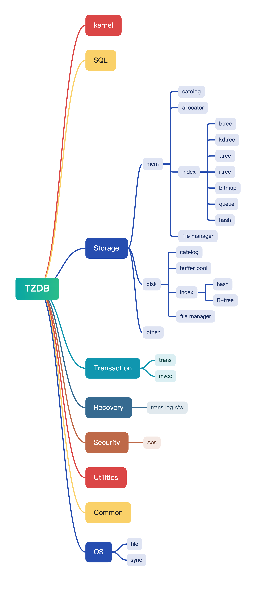

---
title: "TZDB整体架构设计"
description: "project-tzdb-rebuild 文档整理稿(源: raw_snapshot/docs/arch/TZDB_arch.md)"
---

## 寮曡█

TZDB椤圭洰鏃ㄥ湪鎻愪緵涓€涓珮鏁堛€佸彲鎵╁睍鐨勬暟鎹簱绯荤粺锛屾敮鎸佸绉嶅瓨鍌ㄦā寮忓拰浜嬪姟澶勭悊銆傛湰鏂囨。璇︾粏鎻忚堪浜員ZDB鐨勬灦鏋勮璁★紝鍖呮嫭鍚勪釜妯″潡鐨勮璁″師鐞嗐€佺粍浠朵氦浜掋€佹妧鏈€夊瀷绛夈€?

## 鎬讳綋鏋舵瀯

TZDB璁捐涓轰竴涓彲瀹氬埗鍖栫殑鎻掍欢绯荤粺锛岀敤鎴峰彲浠ュ湪宸茬粡閾炬帴浜嗘牳蹇冨簱鐨勫熀纭€涓婇殢鎰忔坊鍔?绉婚櫎鎵╁睍缁勪欢锛岃€屾棤闇€鍋氬嚭浠讳綍淇敼銆?

## API

## 浼氳瘽绠＄悊

## SQL

## 鏍稿績妯″潡

## 瀛樺偍寮曟搸

## 浜嬪姟澶勭悊

## 鎵╁睍妯″潡

## 鍏朵粬妯″潡

## 鎻掍欢璁捐鍘熺悊

鎻掍欢璁捐鍩轰簬瀹忓畾涔夊拰宸ュ巶妯″紡锛屾敮鎸佸姩鎬佸姞杞藉拰寮辩鍙锋満鍒躲€?

- [鍩轰簬瀹忓畾涔夌殑鎻掍欢璁捐](TZDB%201cee24abe22a8063af2fd9cfbff68fc0/鍩轰簬瀹忓畾涔夌殑鎻掍欢璁捐.md)
- [宸ュ巶妯″紡+鍔ㄦ€佽繛鎺ュ簱](TZDB%201cee24abe22a8063af2fd9cfbff68fc0/宸ュ巶妯″紡+鍔ㄦ€佽繛鎺ュ簱.md)

## 缁勪欢浜や簰

鍚勭粍浠朵箣闂撮€氳繃瀹氫箟濂界殑鎺ュ彛杩涜浜や簰锛屾暟鎹祦鍥惧涓?

## 鎶€鏈€夊瀷

TZDB閲囩敤C++缂栫▼璇█锛屼娇鐢⊿QLite浣滀负SQL寮曟搸锛屾敮鎸佸绉嶅瓨鍌ㄦā寮忋€?

## 閮ㄧ讲鏋舵瀯

TZDB鍙互閮ㄧ讲鍦ㄥ绉嶇幆澧冧腑锛屽寘鎷湰鍦版湇鍔″櫒鍜屼簯绔€傞儴缃叉祦绋嬪涓?

1. 涓嬭浇婧愮爜
2. 缂栬瘧鏍稿績搴撳拰鎻掍欢
3. 閰嶇疆鏈嶅姟鍣ㄧ幆澧?
4. 閮ㄧ讲骞跺惎鍔ㄦ湇鍔?

## 鎵╁睍鎬у拰鍙淮鎶ゆ€?

TZDB鐨勬彃浠剁郴缁熻璁′娇鍏跺叿鏈夎壇濂界殑鎵╁睍鎬э紝妯″潡鍖栬璁″拰浠ｇ爜瑙勮寖淇濊瘉浜嗙郴缁熺殑鍙淮鎶ゆ€с€?

## 瀹夊叏鎬?

TZDB閲囩敤澶氱瀹夊叏璁捐鍘熷垯锛岀‘淇濇暟鎹繚鎶ゅ拰鏉冮檺绠＄悊銆?

## 鎬ц兘浼樺寲

TZDB鐨勬€ц兘浼樺寲绛栫暐鍖呮嫭鍐呭瓨绠＄悊銆佺鐩業/O浼樺寲鍜屼簨鍔″鐞嗕紭鍖栥€傛€ц兘娴嬭瘯鏂规硶濡備笅:

- 鍩哄噯娴嬭瘯
- 鍘嬪姏娴嬭瘯
- 鎬ц兘鍒嗘瀽

## 鎬荤粨

TZDB鏋舵瀯璁捐鏃ㄥ湪鎻愪緵涓€涓珮鏁堛€佸彲鎵╁睍鐨勬暟鎹簱绯荤粺锛屾敮鎸佸绉嶅瓨鍌ㄦā寮忓拰浜嬪姟澶勭悊銆傛湭鏉ュ皢缁х画浼樺寲鎬ц兘鍜屾墿灞曞姛鑳姐€?

