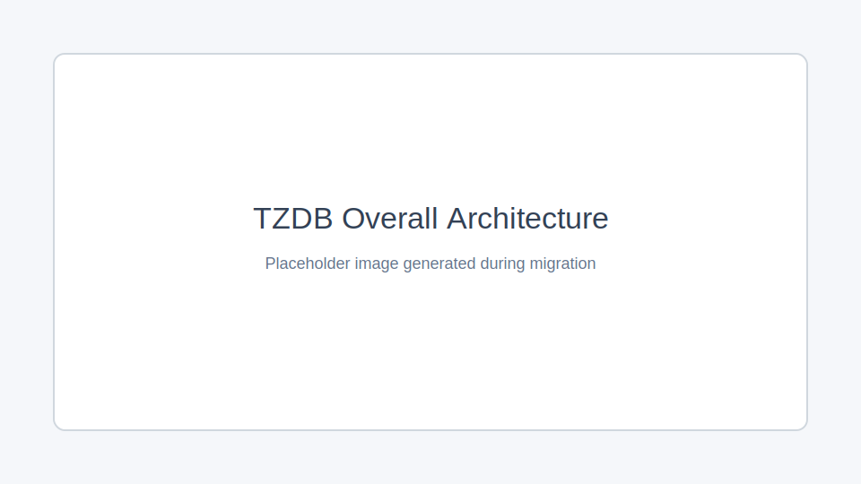

# TZDB 架构设计

## 引言

TZDB项目旨在提供一个高效、可扩展的数据库系统，支持多种存储模式和事务处理。本文档详细描述了TZDB的架构设计，包括各个模块的设计原理、组件交互、技术选型等。

## 总体架构

TZDB设计为一个可定制化的插件系统，用户可以在已经链接了核心库的基础上随意添加/移除扩展组件，而无需做出任何修改。

## API

## 会话管理

## SQL

## 核心模块

## 存储引擎

## 事务处理

## 扩展模块

## 其他模块

## 插件设计原理

插件设计基于宏定义和工厂模式，支持动态加载和弱符号机制。

- [基于宏定义的插件设计](TZDB%201cee24abe22a8063af2fd9cfbff68fc0/%E5%9F%BA%E4%BA%8E%E5%AE%8F%E5%AE%9A%E4%B9%89%E7%9A%84%E6%8F%92%E4%BB%B6%E8%AE%BE%E8%AE%A1%201d1e24abe22a8049ab50e896879bd7ac.md)
- [工厂模式+动态连接库](TZDB%201cee24abe22a8063af2fd9cfbff68fc0/%E5%B7%A5%E5%8E%82%E6%A8%A1%E5%BC%8F+%E5%8A%A8%E6%80%81%E8%BF%9E%E6%8E%A5%E5%BA%93%201d1e24abe22a800cbd65f6dccbb96582.md)

## 组件交互

各组件之间通过定义好的接口进行交互，数据流图如下：

## 技术选型

TZDB采用C++编程语言，使用SQLite作为SQL引擎，支持多种存储模式。

## 部署架构

TZDB可以部署在多种环境中，包括本地服务器和云端。部署流程如下：

1. 下载源码
2. 编译核心库和插件
3. 配置服务器环境
4. 部署并启动服务

## 扩展性和可维护性

TZDB的插件系统设计使其具有良好的扩展性，模块化设计和代码规范保证了系统的可维护性。

## 安全性

TZDB采用多种安全设计原则，确保数据保护和权限管理。

## 性能优化

TZDB的性能优化策略包括内存管理、磁盘I/O优化和事务处理优化。性能测试方法如下：

- 基准测试
- 压力测试
- 性能分析

## 总结

TZDB架构设计旨在提供一个高效、可扩展的数据库系统，支持多种存储模式和事务处理。未来将继续优化性能和扩展功能。
