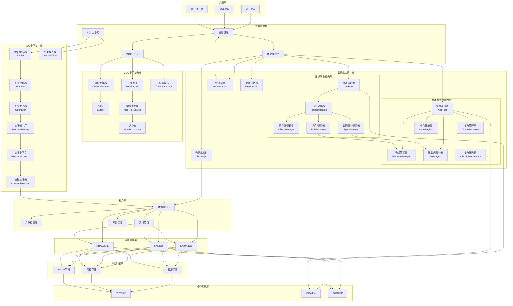

# TZDB 架构图

## 架构说明

### 1. 应用层

- **API接口**：提供C++ API调用
- **SQL接口**：支持标准SQL查询
- **命令行工具**：提供交互式命令行界面

### 2. 会话管理层

- **会话管理**：管理用户连接和会话状态
- **数据库实例**：单例模式管理多个数据库实例

### 2.3 数据库实例内部组件

- **数据库映射(dbs_map_)**：维护数据库名称到数据库对象的映射关系
- **会话映射(sessions_map_)**：维护会话ID到会话对象的映射关系
- **会话计数器(session_id_)**：生成唯一的会话ID

### 2.4 数据服务器内部组件

- **网络连接池(NetPool)**：管理TCP连接，处理客户端连接请求
- **请求处理器(RequestHandler)**：解析和处理客户端数据操作请求
- **客户端管理器(ClientManager)**：管理客户端连接状态和会话
- **数据同步管理器(SyncManager)**：负责主从节点间的数据同步
- **角色管理器(RoleManager)**：管理节点角色（主节点/从节点）

### 2.5 元数据服务器内部组件

- **网络连接池(NetPool)**：管理集群节点间的网络连接
- **选举管理器(ElectionManager)**：负责主节点选举，处理选举请求和投票
- **集群管理器(ClusterManager)**：管理集群节点信息，维护集群状态
- **元数据同步器(MetaSync)**：负责集群元数据的同步和广播
- **节点注册器(NodeRegistry)**：处理新节点的注册和节点状态更新
- **集群元数据(edb_cluster_meta_t)**：维护集群的元数据信息，包括集群状态、主节点、从节点等

### 2.1 SQL上下文内部组件

- **SQL解析器(Binder)**：解析SQL语句，生成语法树，绑定变量
- **查询规划器(Planner)**：将语法树转换为查询执行计划
- **查询优化器(Optimizer)**：优化查询执行计划，包括投影合并、连接优化等
- **执行器工厂(ExecutorFactory)**：根据计划类型创建对应的执行器
- **执行上下文(ExecutorContext)**：为执行器提供事务、目录等上下文信息
- **抽象执行器(AbstractExecutor)**：实现Volcano迭代器模型，支持多种执行器类型
- **结果写入器(ResultWriter)**：格式化输出查询结果

### 2.2 MCO上下文内部组件

- **游标管理器(CursorManager)**：管理查询结果集的游标，支持游标的分配和删除
- **游标(Cursor)**：表示查询结果集的迭代器，支持Next()、HasNext()等操作
- **记录管理(McoRecord)**：管理数据库记录的结构和操作，支持记录的构造、重置和字段访问
- **字段值管理(McoFieldValues)**：抽象基类，提供字段值的统一访问接口
- **结构值(McoStructValue)**：处理复杂结构类型的字段值，支持嵌套结构
- **事务操作(TransactionOps)**：提供事务的开始、提交、回滚等操作接口

### 3. 核心层

- **数据库核心**：整个系统的协调中心
- **元数据管理**：管理表、索引等元数据信息
- **表堆管理**：管理数据的逻辑存储，通过事务层访问物理存储
- **索引管理**：管理B+树、哈希表等索引结构

### 4. 存储引擎层

- **磁盘存储**：基于磁盘的持久化存储
- **内存存储**：基于内存的高性能存储
- **Bustub存储**：基于Bustub的存储引擎

### 5. 事务管理层

- **MVCC**：多版本并发控制
- **2PL**：两阶段锁定
- **MRSW**：多读单写模式

### 6. 操作系统层

- **文件系统**：底层文件操作
- **网络通信**：节点间通信
- **线程同步**：互斥锁(TZMutex)、信号量(TZSemaphore)、事件(TZEvent)等同步原语

## 分布式特性

- **主从架构**：支持一主多从的部署模式，主节点处理写请求，从节点处理读请求
- **自动选举**：通过元数据服务器的选举管理器实现主节点的自动选举和故障转移
- **数据同步**：数据服务器负责主从节点间的数据同步，确保数据一致性
- **元数据同步**：元数据服务器负责集群元数据的同步和广播
- **节点管理**：支持动态添加和移除节点，自动更新集群状态
- **故障恢复**：当主节点故障时，自动选举新的主节点，恢复服务

## 设计特点

- **插件化架构**：各层之间通过接口解耦，支持插件式扩展
- **多存储引擎**：支持多种存储模式，可根据需求选择
- **多事务模式**：支持不同的事务处理策略
- **事务驱动的存储访问**：核心层通过事务管理层访问存储引擎，确保数据一致性和并发控制
- **实时性支持**：针对实时应用场景优化
- **跨平台兼容**：支持多种操作系统和硬件平台
- **分布式扩展**：支持从单体模式平滑扩展到分布式模式 
