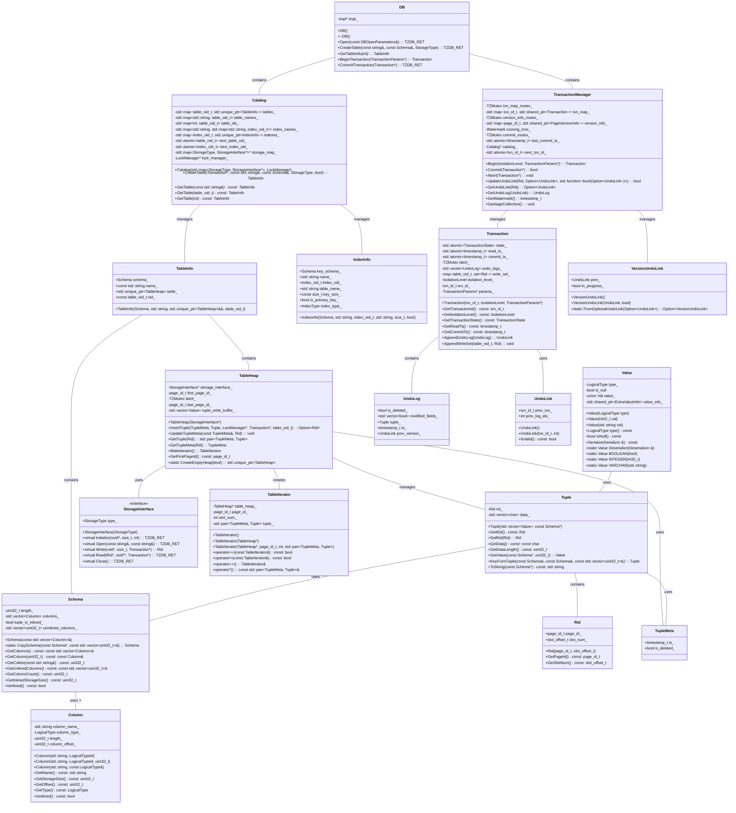

```mermaid
classDiagram
    Value -- Tuple : uses
    Schema -- Column : uses >
    Tuple -- Schema : uses
    TableHeap -- Tuple : manages
    TableHeap -- StorageInterface : uses
    Tuple -- Rid : contains
    DB -- Catalog : contains
    DB -- TransactionManager : contains
    Catalog -- TableInfo : manages
    Catalog -- IndexInfo : manages
    TableInfo -- Schema : contains
    TableInfo -- TableHeap : contains
    Transaction -- UndoLog : contains
    TransactionManager -- Transaction : manages
    TableHeap -- TableIterator : creates
    Transaction -- UndoLink : uses
    TransactionManager -- VersionUndoLink : manages
    
    class Value {
        -LogicalType type_
        -bool is_null
        -union Val value_
        -std::shared_ptr~ExtraValueInfo~ value_info_
        +Value(LogicalType type)
        +Value(int32_t val)
        +Value(std::string val)
        +LogicalType type() const
        +bool IsNull() const
        +Serialize(Serializer &) const
        +static Value Deserialize(Deserializer &)
        +static Value BOOLEAN(bool)
        +static Value INTEGER(int32_t)
        +static Value VARCHAR(std::string)
    }
    
    class Tuple {
        -Rid rid_
        -std::vector~char~ data_
        +Tuple(std::vector~Value~, const Schema*)
        +GetRid() const: Rid
        +SetRid(Rid): Rid
        +GetData() const: const char*
        +GetDataLength() const: uint32_t
        +GetValue(const Schema*, uint32_t): Value
        +KeyFromTuple(const Schema&, const Schema&, const std::vector~uint32_t~&): Tuple
        +ToString(const Schema*) const: std::string
    }
    
    class Schema {
        -uint32_t length_
        -std::vector~Column~ columns_
        -bool tuple_is_inlined_
        -std::vector~uint32_t~ uninlined_columns_
        +Schema(const std::vector~Column~&)
        +static CopySchema(const Schema*, const std::vector~uint32_t~&): Schema
        +GetColumns() const: const std::vector~Column~&
        +GetColumn(uint32_t) const: const Column&
        +GetColIdx(const std::string&) const: uint32_t
        +GetUnlinedColumns() const: const std::vector~uint32_t~&
        +GetColumnCount() const: uint32_t
        +GetInlinedStorageSize() const: uint32_t
        +IsInlined() const: bool
    }
    
    class Column {
        -std::string column_name_
        -LogicalType column_type_
        -uint32_t length_
        -uint32_t column_offset_
        +Column(std::string, LogicalTypeId)
        +Column(std::string, LogicalTypeId, uint32_t)
        +Column(std::string, const LogicalType&)
        +GetName() const: std::string
        +GetStorageSize() const: uint32_t
        +GetOffset() const: uint32_t
        +GetType() const: LogicalType
        +IsInlined() const: bool
    }
    
    class TableHeap {
        -StorageInterface* storage_interface_
        -page_id_t first_page_id_
        -TZMutex latch_
        -page_id_t last_page_id_
        -std::vector~Value~ tuple_write_buffer_
        +TableHeap(StorageInterface*)
        +InsertTuple(TupleMeta, Tuple, LockManager*, Transaction*, table_oid_t): Option~Rid~
        +UpdateTupleMeta(const TupleMeta&, Rid): void
        +GetTuple(Rid): std::pair~TupleMeta, Tuple~
        +GetTupleMeta(Rid): TupleMeta
        +MakeIterator(): TableIterator
        +GetFirstPageId() const: page_id_t
        +static CreateEmptyHeap(bool): std::unique_ptr~TableHeap~
    }
    
    class Rid {
        +page_id_t page_id_
        +slot_offset_t slot_num_
        +Rid(page_id_t, slot_offset_t)
        +GetPageId() const: page_id_t
        +GetSlotNum() const: slot_offset_t
    }
    
    class StorageInterface {
        <<interface>>
        +StorageType type_
        +StorageInterface(StorageType)
        +virtual Initialize(void*, size_t, int): TZDB_RET
        +virtual Open(const string&, const string&): TZDB_RET
        +virtual Write(void*, size_t, Transaction*): Rid
        +virtual Read(Rid*, void**, Transaction*): TZDB_RET
        +virtual Close(): TZDB_RET
    }
    
    class TupleMeta {
        +timestamp_t ts_
        +bool is_deleted_
    }
    
    class DB {
        -Impl* impl_
        +DB()
        +~DB()
        +Open(const DBOpenParameters&): TZDB_RET
        +CreateTable(const string&, const Schema&, StorageType): TZDB_RET
        +GetTableInfo(int): TableInfo*
        +BeginTransaction(TransactionParams*): Transaction*
        +CommitTransaction(Transaction*): TZDB_RET
    }
    
    class Catalog {
        -std::map~table_oid_t, std::unique_ptr~TableInfo~~ tables_
        -std::map~std::string, table_oid_t~ table_names_
        -std::map~int, table_oid_t~ table_ids_
        -std::map~std::string, std::map~std::string, index_oid_t~~ index_names_
        -std::map~index_oid_t, std::unique_ptr~IndexInfo~~ indexes_
        -std::atomic~table_oid_t~ next_table_oid_
        -std::atomic~index_oid_t~ next_index_oid_
        -std::map~StorageType, StorageInterface*~* storage_map_
        -LockManager* lock_manager_
        +Catalog(std::map~StorageType, StorageInterface*~*, LockManager*)
        +CreateTable(Transaction*, const std::string&, const Schema&, StorageType, bool): TableInfo*
        +GetTable(const std::string&) const: TableInfo*
        +GetTable(table_oid_t) const: TableInfo*
        +GetTable(int) const: TableInfo*
    }
    
    class TableInfo {
        +Schema schema_
        +const std::string name_
        +std::unique_ptr~TableHeap~ table_
        +const table_oid_t oid_
        +TableInfo(Schema, std::string, std::unique_ptr~TableHeap~&&, table_oid_t)
    }
    
    class IndexInfo {
        +Schema key_schema_
        +std::string name_
        +index_oid_t index_oid_
        +std::string table_name_
        +const size_t key_size_
        +bool is_primary_key_
        +IndexType index_type_
        +IndexInfo(Schema, std::string, index_oid_t, std::string, size_t, bool)
    }
    
    class TableIterator {
        -TableHeap* table_heap_
        -page_id_t page_id_
        -int slot_num_
        -std::pair~TupleMeta, Tuple~ tuple_
        +TableIterator()
        +TableIterator(TableHeap*)
        +TableIterator(TableHeap*, page_id_t, int, std::pair~TupleMeta, Tuple~)
        +operator==(const TableIterator&) const: bool
        +operator!=(const TableIterator&) const: bool
        +operator++(): TableIterator&
        +operator*(): const std::pair~TupleMeta, Tuple~&
    }
    
    class Transaction {
        -std::atomic~TransactionState~ state_
        -std::atomic~timestamp_t~ read_ts_
        -std::atomic~timestamp_t~ commit_ts_
        -TZMutex latch_
        -std::vector~UndoLog~ undo_logs_
        -map~table_oid_t, set~Rid~~ write_set_
        -IsolationLevel isolation_level_
        -txn_id_t txn_id_
        -TransactionParams* params_
        +Transaction(txn_id_t, IsolationLevel, TransactionParams*)
        +GetTransactionId() const: txn_id_t
        +GetIsolationLevel() const: IsolationLevel
        +GetTransactionState() const: TransactionState
        +GetReadTs() const: timestamp_t
        +GetCommitTs() const: timestamp_t
        +AppendUndoLog(UndoLog): UndoLink
        +AppendWriteSet(table_oid_t, Rid): void
    }
    
    class TransactionManager {
        -TZMutex txn_map_mutex_
        -std::map~txn_id_t, std::shared_ptr~Transaction~~ txn_map_
        -TZMutex version_info_mutex_
        -std::map~page_id_t, std::shared_ptr~PageVersionInfo~~ version_info_
        -Watermark running_txns_
        -TZMutex commit_mutex_
        -std::atomic~timestamp_t~ last_commit_ts_
        -Catalog* catalog_
        -std::atomic~txn_id_t~ next_txn_id_
        +Begin(IsolationLevel, TransactionParams*): Transaction*
        +Commit(Transaction*): bool
        +Abort(Transaction*): void
        +UpdateUndoLink(Rid, Option~UndoLink~, std::function~bool(Option~UndoLink~)~): bool
        +GetUndoLink(Rid): Option~UndoLink~
        +GetUndoLog(UndoLink): UndoLog
        +GetWatermark(): timestamp_t
        +GarbageCollection(): void
    }
    
    class UndoLog {
        +bool is_deleted_
        +std::vector~bool~ modified_fields_
        +Tuple tuple_
        +timestamp_t ts_
        +UndoLink prev_version_
    }
    
    class UndoLink {
        +txn_id_t prev_txn_
        +int prev_log_idx_
        +UndoLink()
        +UndoLink(txn_id_t, int)
        +IsValid() const: bool
    }
    
    class VersionUndoLink {
        +UndoLink prev_
        +bool in_progress_
        +VersionUndoLink()
        +VersionUndoLink(UndoLink, bool)
        +static FromOptionalUndoLink(Option~UndoLink~): Option~VersionUndoLink~
    }
    
    Tuple -- TupleMeta : uses
    TableHeap -- TupleMeta : uses
```
