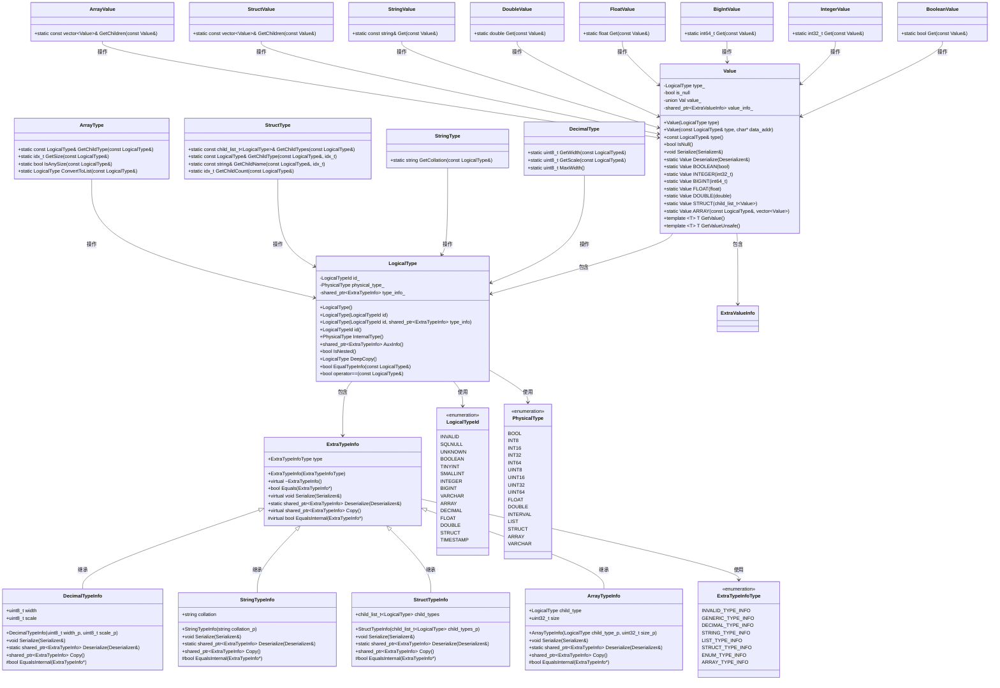

```mermaid
classDiagram
    class LogicalType {
        -LogicalTypeId id_
        -PhysicalType physical_type_
        -shared_ptr~ExtraTypeInfo~ type_info_
        +LogicalType()
        +LogicalType(LogicalTypeId id)
        +LogicalType(LogicalTypeId id, shared_ptr~ExtraTypeInfo~ type_info)
        +LogicalTypeId id()
        +PhysicalType InternalType()
        +shared_ptr~ExtraTypeInfo~ AuxInfo()
        +bool IsNested()
        +LogicalType DeepCopy()
        +bool EqualTypeInfo(const LogicalType&)
        +bool operator==(const LogicalType&)
    }

    class Value {
        -LogicalType type_
        -bool is_null
        -union Val value_
        -shared_ptr~ExtraValueInfo~ value_info_
        +Value(LogicalType type)
        +Value(const LogicalType& type, char* data_addr)
        +const LogicalType& type()
        +bool IsNull()
        +void Serialize(Serializer&)
        +static Value Deserialize(Deserializer&)
        +static Value BOOLEAN(bool)
        +static Value INTEGER(int32_t)
        +static Value BIGINT(int64_t)
        +static Value FLOAT(float)
        +static Value DOUBLE(double)
        +static Value STRUCT(child_list_t~Value~)
        +static Value ARRAY(const LogicalType&, vector~Value~)
        +template ~T~ T GetValue()
        +template ~T~ T GetValueUnsafe()
    }

    class ExtraTypeInfo {
        +ExtraTypeInfoType type
        +ExtraTypeInfo(ExtraTypeInfoType)
        +virtual ~ExtraTypeInfo()
        +bool Equals(ExtraTypeInfo*)
        +virtual void Serialize(Serializer&)
        +static shared_ptr~ExtraTypeInfo~ Deserialize(Deserializer&)
        +virtual shared_ptr~ExtraTypeInfo~ Copy()
        #virtual bool EqualsInternal(ExtraTypeInfo*)
    }

    class DecimalTypeInfo {
        +uint8_t width
        +uint8_t scale
        +DecimalTypeInfo(uint8_t width_p, uint8_t scale_p)
        +void Serialize(Serializer&)
        +static shared_ptr~ExtraTypeInfo~ Deserialize(Deserializer&)
        +shared_ptr~ExtraTypeInfo~ Copy()
        #bool EqualsInternal(ExtraTypeInfo*)
    }

    class StringTypeInfo {
        +string collation
        +StringTypeInfo(string collation_p)
        +void Serialize(Serializer&)
        +static shared_ptr~ExtraTypeInfo~ Deserialize(Deserializer&)
        +shared_ptr~ExtraTypeInfo~ Copy()
        #bool EqualsInternal(ExtraTypeInfo*)
    }

    class StructTypeInfo {
        +child_list_t~LogicalType~ child_types
        +StructTypeInfo(child_list_t~LogicalType~ child_types_p)
        +void Serialize(Serializer&)
        +static shared_ptr~ExtraTypeInfo~ Deserialize(Deserializer&)
        +shared_ptr~ExtraTypeInfo~ Copy()
        #bool EqualsInternal(ExtraTypeInfo*)
    }

    class ArrayTypeInfo {
        +LogicalType child_type
        +uint32_t size
        +ArrayTypeInfo(LogicalType child_type_p, uint32_t size_p)
        +void Serialize(Serializer&)
        +static shared_ptr~ExtraTypeInfo~ Deserialize(Deserializer&)
        +shared_ptr~ExtraTypeInfo~ Copy()
        #bool EqualsInternal(ExtraTypeInfo*)
    }

    %% 枚举类型
    class LogicalTypeId {
        <<enumeration>>
        INVALID
        SQLNULL
        UNKNOWN
        BOOLEAN
        TINYINT
        SMALLINT
        INTEGER
        BIGINT
        VARCHAR
        ARRAY
        DECIMAL
        FLOAT
        DOUBLE
        STRUCT
        TIMESTAMP
    }

    class PhysicalType {
        <<enumeration>>
        BOOL
        INT8
        INT16
        INT32
        INT64
        UINT8
        UINT16
        UINT32
        UINT64
        FLOAT
        DOUBLE
        INTERVAL
        LIST
        STRUCT
        ARRAY
        VARCHAR
    }

    class ExtraTypeInfoType {
        <<enumeration>>
        INVALID_TYPE_INFO
        GENERIC_TYPE_INFO
        DECIMAL_TYPE_INFO
        STRING_TYPE_INFO
        LIST_TYPE_INFO
        STRUCT_TYPE_INFO
        ENUM_TYPE_INFO
        ARRAY_TYPE_INFO
    }

    %% 辅助类
    class DecimalType {
        +static uint8_t GetWidth(const LogicalType&)
        +static uint8_t GetScale(const LogicalType&)
        +static uint8_t MaxWidth()
    }

    class StringType {
        +static string GetCollation(const LogicalType&)
    }

    class StructType {
        +static const child_list_t~LogicalType~& GetChildTypes(const LogicalType&)
        +static const LogicalType& GetChildType(const LogicalType&, idx_t)
        +static const string& GetChildName(const LogicalType&, idx_t)
        +static idx_t GetChildCount(const LogicalType&)
    }

    class ArrayType {
        +static const LogicalType& GetChildType(const LogicalType&)
        +static idx_t GetSize(const LogicalType&)
        +static bool IsAnySize(const LogicalType&)
        +static LogicalType ConvertToList(const LogicalType&)
    }

    %% 值类型辅助类
    class BooleanValue {
        +static bool Get(const Value&)
    }

    class IntegerValue {
        +static int32_t Get(const Value&)
    }

    class BigIntValue {
        +static int64_t Get(const Value&)
    }

    class FloatValue {
        +static float Get(const Value&)
    }

    class DoubleValue {
        +static double Get(const Value&)
    }

    class StringValue {
        +static const string& Get(const Value&)
    }

    class StructValue {
        +static const vector~Value~& GetChildren(const Value&)
    }

    class ArrayValue {
        +static const vector~Value~& GetChildren(const Value&)
    }

    %% 关系
    LogicalType --> LogicalTypeId : 使用
    LogicalType --> PhysicalType : 使用
    LogicalType --> ExtraTypeInfo : 包含

    ExtraTypeInfo <|-- DecimalTypeInfo : 继承
    ExtraTypeInfo <|-- StringTypeInfo : 继承
    ExtraTypeInfo <|-- StructTypeInfo : 继承
    ExtraTypeInfo <|-- ArrayTypeInfo : 继承
    ExtraTypeInfo --> ExtraTypeInfoType : 使用

    Value --> LogicalType : 包含
    Value --> ExtraValueInfo : 包含

    DecimalType --> LogicalType : 操作
    StringType --> LogicalType : 操作
    StructType --> LogicalType : 操作
    ArrayType --> LogicalType : 操作

    BooleanValue --> Value : 操作
    IntegerValue --> Value : 操作
    BigIntValue --> Value : 操作
    FloatValue --> Value : 操作
    DoubleValue --> Value : 操作
    StringValue --> Value : 操作
    StructValue --> Value : 操作
    ArrayValue --> Value : 操作
```
