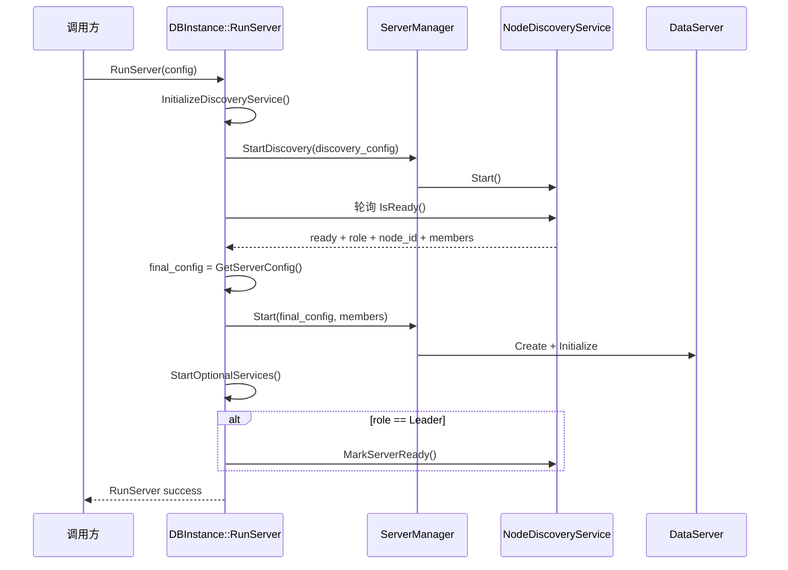
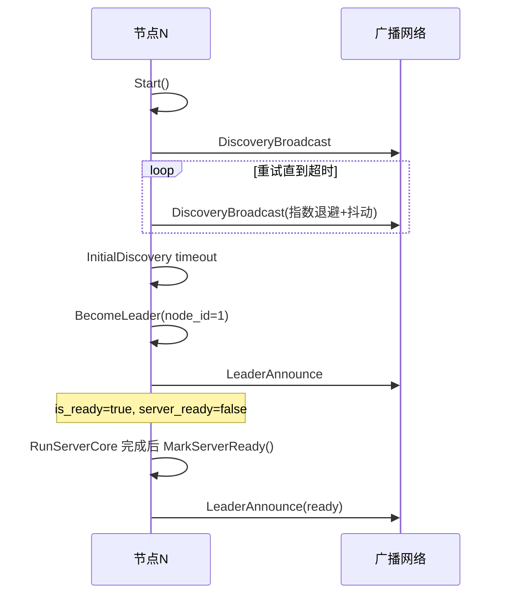
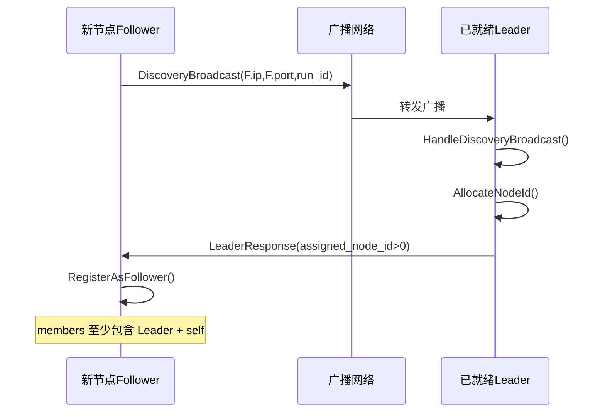
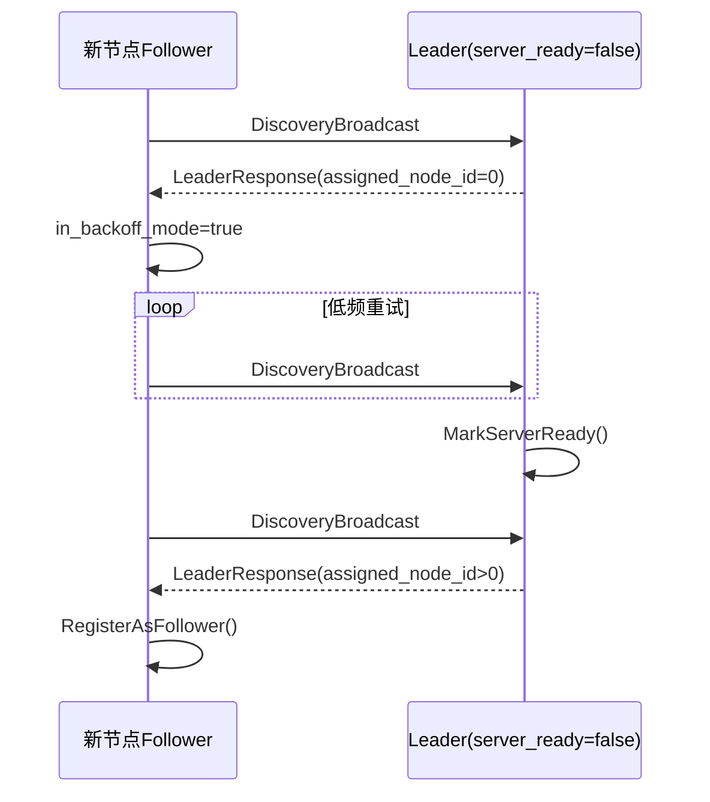
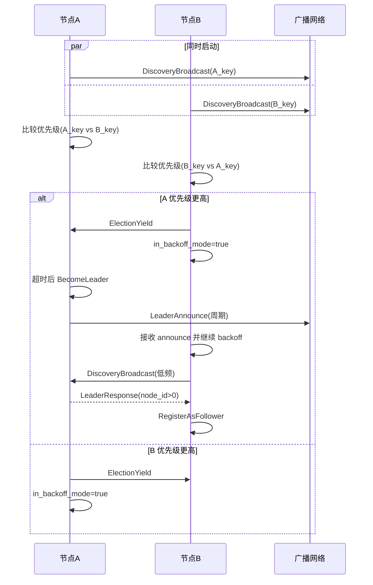
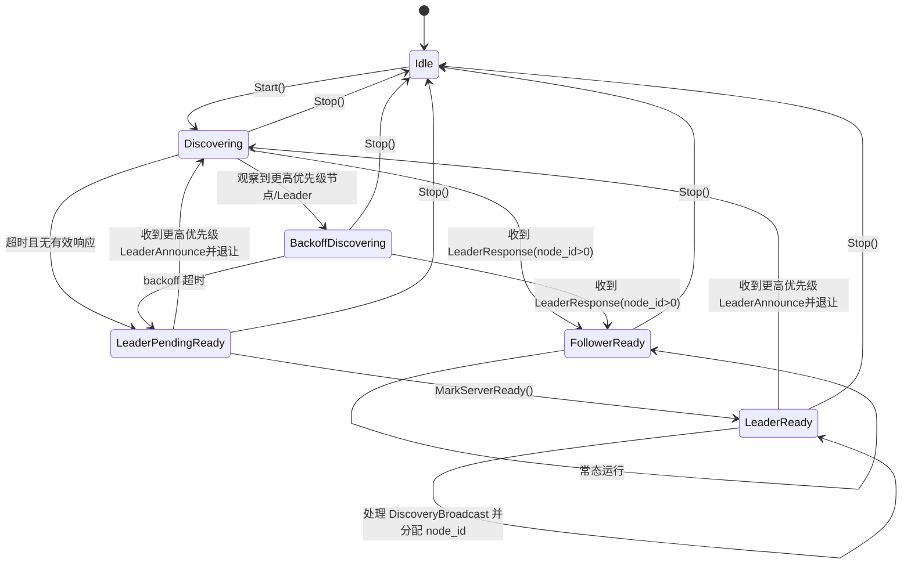

## 1. 入口与整体调用链

当前自动发现由 `DataServerConfig.discovery.enable=true` 触发，主流程在：

- `src/server/db_instance_server_entry.cpp`
    - `DBInstance::RunServer(...)`
    - `DBInstance::InitializeDiscoveryService(...)`
    - `DBInstance::StartOptionalServices(...)`

执行顺序：

1. `RunServer` 先调用 `InitializeDiscoveryService`。
2. `ServerManager::StartDiscovery` 创建并启动 `NodeDiscoveryService`。
3. 等待 `discovery_service->IsReady()`。
4. 通过 `GetServerConfig()` 和 `GetMembers()` 回填最终 `DataServerConfig` 与成员列表。
5. `RunServerCore` 启动真正的数据服务。
6. 若本节点是 Leader，`StartOptionalServices` 调用 `MarkServerReady()`，允许后续新节点正式注册。

要点：发现服务是“先于 DataServer 启动”，并在后台持续运行，不是一次性任务。

### 时序图：RunServer 与 Discovery 的整体关系

## 2. 发现服务核心对象与状态

核心实现：

- `src/inc/server/node_discovery_service.h`
- `src/server/node_discovery_service.cpp`

关键状态：

- `is_leader_`：当前角色（Leader/Follower）
- `is_ready_`：本节点是否完成初始发现
- `server_ready_`：仅 Leader 使用，表示 DataServer 已经真正启动完成
- `my_node_id_`：当前节点 ID
- `members_`：已知成员表（`node_id -> ip:port`）
- `run_id`：运行隔离 ID（不同 run_id 互不发现）

## 3. 消息协议（UDP）

发现服务注册了 4 类消息（`NodeDiscovery` 服务）：

1. `DiscoveryBroadcast`
    - 节点启动后周期广播自己的 `ip/port/startup_time_ns/uuid/run_id`。
2. `LeaderResponse`
    - Leader 单播响应，分配 `assigned_node_id`。
    - 特殊值：`assigned_node_id=0` 表示 Leader 尚未 `server_ready`，Follower 继续低频重试。
3. `ElectionYield`
    - 低优先级候选者向高优先级候选者发送“退让”通知（辅助收敛）。
4. `LeaderAnnounce`
    - Leader 周期广播（500ms）宣告，帮助并发启动场景收敛单主。

## 4. 选主与收敛规则

优先级规则（`IsRemoteNodeHigherPriority`）：

1. `startup_time_ns` 更小者优先（更早启动优先）。
2. 若相同，`uuid` 字典序更小者优先。

初始发现（`InitialDiscovery`）：

- 超时窗口：`discovery_timeout_seconds * 1000 + random(0, discovery_timeout_jitter_ms)`。
- 候选节点会持续广播，重试间隔指数退避（含抖动）。
- 若观察到更高优先级候选者/Leader，进入 `backoff` 低频重试模式。
- 在有效窗口内收到 LeaderResponse：注册为 Follower。
- 超时仍未收到可用响应：本节点 `BecomeLeader()`（node_id=1）。

并发启动时避免双主的机制：

- 候选者优先级比较 + 退让。
- Leader 定期 `LeaderAnnounce`。
- 已是 Leader 但收到更高优先级 LeaderAnnounce 时，会降级为 Follower 模式（清空本地 leader 状态并等待收敛）。

### 时序图：单节点启动并超时成为 Leader

### 时序图：Follower 入群（Leader 已就绪）

### 时序图：Leader 未就绪时的门控（assigned_node_id=0）

### 时序图：两个节点并发启动后的收敛

## 5. Leader/Follower 具体行为

### Leader

- `BecomeLeader()` 时：
    - `my_node_id=1`
    - `members` 初始化仅自己
    - 立即广播 `LeaderAnnounce`
    - `is_ready=true`，但 `server_ready=false`
- 在 `server_ready=false` 时，收到新节点 `DiscoveryBroadcast` 不会正式分配 ID，而返回
  `LeaderResponse(assigned_node_id=0)`。
- `MarkServerReady()` 后：
    - `server_ready=true`
    - 广播一次 `LeaderAnnounce`
    - 才开始给新节点分配有效 node_id。

### Follower

- 收到有效 `LeaderResponse(assigned_node_id>0)` 后 `RegisterAsFollower()`。
- 当前实现下 Follower 的 `members` 仅保证包含：
    - Leader（node_id=1）
    - 自己（my_node_id）

## 6. 配置语义（DiscoveryConfig）

定义在 `src/inc/server/data_server.h`：

- `local_ip`
    - 空字符串：自动选本机可用 IP（优先非 `127.0.0.1`）
    - 支持前缀模式：`192.168.3.x` / `192.168.3.*`
- `local_port=0`：自动分配随机动态端口（49152-65535）
- `broadcast_bind_ip`：广播监听绑定地址（默认 `0.0.0.0`）
- `broadcast_address`：广播目标地址（默认 `255.255.255.255`）
- `broadcast_port`：广播端口
- `discovery_timeout_seconds` / `discovery_timeout_jitter_ms` / `retry_interval_ms`
- `run_id`：运行隔离（不一致则互相忽略消息）

## 7. 通过测试可确认的现状

相关测试：

- `tests/distribution_unit_test/registration/node_discovery_test.cpp`
- `tests/distribution_unit_test/registration/node_discovery_multi_test.cpp`

覆盖点包括：

- 单节点超时后成为 Leader。
- 两节点/多节点发现与 follower 注册。
- 并发启动后收敛为单主（含重复轮次）。
- `run_id` 隔离（不同 run_id 可各自独立选主）。

## 8. 当前实现边界（文档结论）

1. 这是“轻量级自动发现 + 主节点分配 node_id”机制，不等同于完整成员一致性协议。
2. Leader 是否接受新节点由 `server_ready_` 显式门控，避免 DataServer 未完成初始化时提前入群。
3. `members` 视图不是全量强一致视图；Follower 侧当前主要用于最小可运行信息（Leader + self）。
4. 若编译为 `TZDB_NO_DISTRIBUTION`，`ServerManager` 的 discovery 相关接口为 stub（不生效）。

## 9. 状态图（NodeDiscoveryService 视角）

