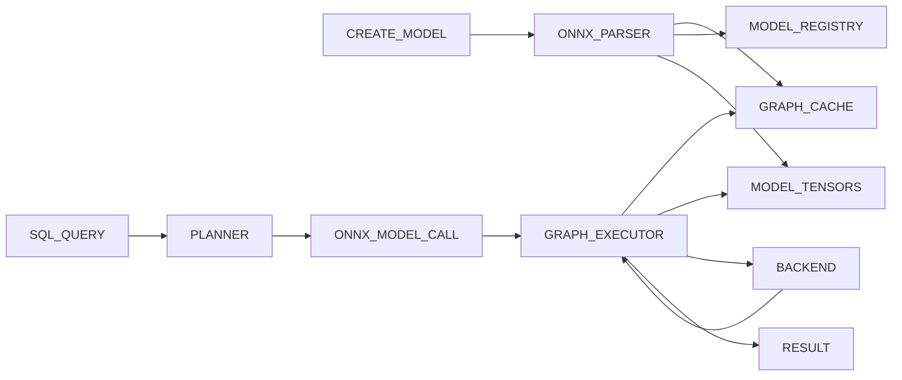
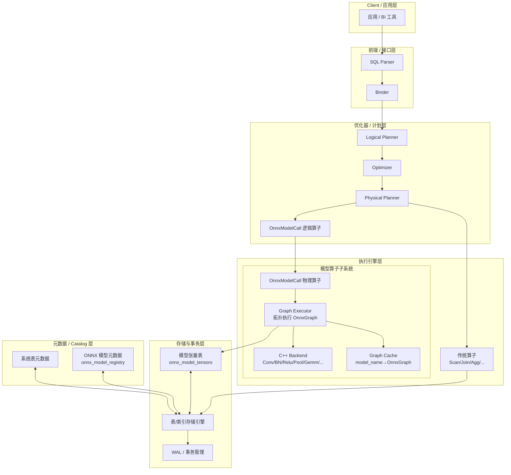

# AI 模型在数据库中的存储与推理设计

> 目标：在现有数据库系统中，实现视觉为主的深度学习模型（如 MNIST CNN、ResNet18、VGG16、AlexNet、TextCNN 等）的**统一存储与推理执行**能力，并为后续的量化、剪枝、多模型调度等研究打基础。

---

## 1. 总体架构概览

整体系统分为三层：

1. **模型解析与存储层**（ONNX → Graph & Table）
2. **图执行引擎层（Graph Executor）**
3. **算子后端层（C++ Backend，Burn-style）**

数据和调用路径（简化）：



- **模型解析与存储层**：负责从 ONNX 文件中解析出计算图、模型输入输出信息、权重张量，并分别写入内存中的 `OnnxGraph` 和数据库表。
- **Graph Executor**：在推理时按拓扑顺序遍历 `OnnxGraph` 的节点，依次调用 Backend 算子，维护中间张量映射，实现从输入到输出的完整前向计算。
- **C++ Backend**：提供 `conv2d / batch_norm / relu / max_pool / avg_pool / gemm / flatten / (log)softmax / add` 等算子实现，接口和张量形状设计参考 Burn 的 ndarray 后端，但用 C++ 实现，以适配当前工程。

---

## 2. 模型解析与存储设计

### 2.1 ONNX Graph 结构

从 ONNX 模型解析后，在内存中构建 `OnnxGraph` 结构（参考 Burn Import 设计）：

```rust
pub struct OnnxGraph {
    pub nodes:   Vec<Node>,
    pub inputs:  Vec<Argument>,
    pub outputs: Vec<Argument>,
}

pub struct Node {
    pub node_type: NodeType,      // Conv2d, Relu, BatchNormalization, Gemm, Add, MaxPool, ...
    pub name:      String,
    pub inputs:    Vec<Argument>,
    pub outputs:   Vec<Argument>,
    pub attrs:     Attributes,
}

pub struct Argument {
    pub name:  String,
    pub ty:    ArgType,           // TensorType 等
    pub value: Option<Data>,      // Some(…) 则表示常量 Tensor（如权重、偏置）
    pub passed: bool,
}

pub enum Data {
    Float32s(Vec<f32>),
    Int64s(Vec<i64>),
    // ... 其他类型省略
}
```

该 Graph 作为**推理时的拓扑结构**，同时也是把 ONNX 模型下推为数据库内部算子的中间表示。

### 2.2 模型元数据表 onnx_model_registry

用于管理模型级的静态信息（元数据）：

```sql
CREATE TABLE onnx_model_registry (
    model_id           BIGINT PRIMARY KEY,
    model_name         VARCHAR,          -- 'mnist', 'resnet18_cifar10' 等
    version            INTEGER,          -- 模型版本
    onnx_path          VARCHAR,          -- 原始 ONNX 文件路径
    input_names        VARCHAR[],        -- ['input1']
    input_shapes       INT[][],          -- [[1,1,28,28]]
    output_names       VARCHAR[],        -- ['logits']
    output_shapes      INT[][],          -- [[1,10]]
    quantization_level SMALLINT,         -- 量化级别（0=fp32, 1=int8 等）
    created_at         TIMESTAMP,
    last_accessed      TIMESTAMP
);
```

### 2.3 模型张量表 onnx_model_tensors

用于存储模型算子关联的权重、偏置和 BatchNorm 统计量等张量数据。采用“每个 (model, node, param) 一行”的通用设计：

```sql
CREATE TABLE onnx_model_tensors (
    model_id   BIGINT,              -- 外键 -> onnx_model_registry
    node_name  VARCHAR,             -- 'conv1', 'norm1', 'fc1' 等
    param_name VARCHAR,             -- 'weight','bias','running_mean','running_var' 等
    elem_type  SMALLINT,            -- 0=float32,1=float16,2=int8...
    shape      INT[],               -- [64,3,3,3] 等
    values     DOUBLE PRECISION[],  -- flatten 存储（未来可扩展为 BLOB/Arrow Tensor）
    PRIMARY KEY (model_id, node_name, param_name)
);
```

示例：

| model_id | node_name | param_name    | shape             | values           |
|----------|-----------|--------------|-------------------|------------------|
| 1        | conv1     | weight       | [64,3,3,3]        | [w0,w1,...]      |
| 1        | conv1     | bias         | [64]              | [b0,b1,...]      |
| 1        | norm1     | weight       | [64]              | [...]            |
| 1        | norm1     | running_var  | [64]              | [...]            |

---

## 3. SQL 接口设计

### 3.1 扩展安装与加载

```sql
INSTALL onnx;      -- 安装扩展
LOAD onnx;         -- 当前会话加载扩展
```

### 3.2 模型注册与管理

注册模型：

```sql
CREATE ONNX MODEL mnist
FROM '/path/to/mnist.onnx'
WITH (
    version = 1,
    quantization_level = 0
);
```

执行逻辑：

- 解析 ONNX Proto，构建 `OnnxGraph` 并放入内存缓存：`map<model_name, OnnxGraph>`。
- 抽取 graph 的输入/输出，写入 `onnx_model_registry`。
- 抽取各节点上的权重/偏置/BN 统计量，flatten 后写入 `onnx_model_tensors`。

模型信息查询与删除：

```sql
-- 获取所有模型
GET ONNX;                        -- 等价: SELECT * FROM onnx_model_registry;

-- 获取指定模型
GET ONNX mnist;                  -- 等价: SELECT * FROM onnx_model_registry WHERE model_name = 'mnist';

-- 删除全部模型
DELETE ONNX;

-- 删除指定模型
DELETE ONNX mnist;
```

删除操作需要：

- 清理 `onnx_model_registry` 中对应行；
- 清理 `onnx_model_tensors` 中对应模型数据；
- 清理 Graph Cache 中对应 `OnnxGraph`（可选择惰性回收）。

### 3.3 推理函数接口

通用推理函数（表达式级）：

```sql
SELECT model_inference(
    'mnist',
    {shape: [1,1,28,28], value: img_flatten}
) AS logits;
```

- 输入参数 `input` 类型：`STRUCT(shape INT[], value FLOAT[])`（未来可扩展为多输入：`MAP(VARCHAR, STRUCT(...))`）。
- 返回值同样为 `STRUCT(shape INT[], value FLOAT[])` 或多输出结构。

专用模型函数（注册后绑定）：

```sql
CREATE FUNCTION mnist(x FLOAT[]) AS
    model_inference('mnist', {shape: [1,1,28,28], value: x});

SELECT mnist(image_column) FROM images;
```

未来可以在优化器阶段把 `mnist()` 优化/绑定成物理 `OnnxModelCall` 算子，而不是一个普通 Scalar UDF。

---

## 4. Graph Executor（图执行引擎）设计

Graph Executor 是连接“模型存储”和“算子后端”的关键模块，负责按拓扑顺序在单线程环境下执行计算图节点。该设计可以统一支持简单 CNN（如 MNIST）、ResNet18/VGG/AlexNet 等包含残差和分支结构的网络。

### 4.1 核心职责

- 接受 `OnnxGraph` 与输入张量映射，顺序执行图中的每个节点。
- 维护 `TensorMap: name -> Tensor`，用于存放所有中间结果和最终输出。
- 为每个节点选择合适的 Backend 算子（通过 `node_type`），并将输入/输出张量在内存中正确路由。
- 自然支持分支、残差、Add/Concat 等多输入节点，只要图是一个有向无环图（DAG）。

### 4.2 执行流程（单线程拓扑执行）

伪代码示例：

```cpp
struct TensorMap {
    std::unordered_map<std::string, Tensor> map;

    const Tensor& get(const std::string& name) const;
    void set(const std::string& name, Tensor t);
};

Tensor run_graph(const OnnxGraph& graph,
                 const std::vector<Tensor>& input_tensors,
                 Backend& backend) {
    TensorMap values;

    // 1. 写入 graph.inputs 对应的张量
    for (size_t i = 0; i < graph.inputs.size(); ++i) {
        values.set(graph.inputs[i].name, input_tensors[i]);
    }

    // 2. 按拓扑顺序遍历节点执行
    for (const Node& node : graph.nodes_topo_sorted) {
        // 收集输入
        std::vector<const Tensor*> in;
        for (auto& arg : node.inputs) {
            in.push_back(&values.get(arg.name));
        }

        // 调用 Backend 执行当前节点
        Tensor out = execute_node(node, in, backend /*, attrs, 权重缓存等 */);

        // 写回输出（多数情况一个输出）
        for (auto& out_arg : node.outputs) {
            values.set(out_arg.name, out);
        }
    }

    // 3. 收集 graph.outputs 对应的张量
    // 多输出时可返回 map；此处示意单输出
    return values.get(graph.outputs[0].name);
}
```

其中，`execute_node` 内部根据 `node.node_type` 分发到不同算子，例如：

- `Conv2d`      → `backend.conv2d(...)`
- `Relu`        → `backend.relu(...)`
- `BatchNorm`   → `backend.batch_norm(...)`
- `MaxPool`     → `backend.max_pool2d(...)`
- `AvgPool`     → `backend.avg_pool2d(...)`
- `Gemm`/`Linear` → `backend.matmul(...)` 或专用 `linear`
- `Add`         → `backend.add(...)`（用于 ResNet 残差连接）
- `LogSoftmax`  → `backend.log_softmax(...)`

### 4.3 对 ResNet 等残差网络的支持

ResNet 的 BasicBlock 示例：

- 主分支：`conv1 -> bn1 -> relu1 -> conv2 -> bn2`
- 跳跃分支：`identity(x)` 或 `downsample(x)`（一般是 `1x1 conv + bn`）
- 汇合：`add(out_main, out_skip) -> relu2`

在 OnnxGraph 中表示为一个包含多输入节点（`Add`）的 DAG：

- `Add` 节点有两个输入：主分支输出和跳跃分支输出；
- Graph Executor 在拓扑排序后，顺序执行各节点，只要保证每个节点的输入已在 `TensorMap` 中即可。

因此，在“单线程 + 拓扑顺序执行”的设计下，ResNet18/VGG16/AlexNet 等网络无需额外特殊机制就可以自然支持。

---

## 5. C++ Backend（Burn-style）设计

Backend 层提供实际数值计算的算子实现，其接口和张量形状遵循 Burn 的 ndarray 后端风格，但用 C++ 重写，以便嵌入现有 C++ 数据库项目中。

### 5.1 Tensor 结构与布局

采用多维数组抽象：

- 数据：`std::vector<float>` 或其他标量类型；
- 形状：`std::vector<int64_t> shape`，如：
  - `x`：`[batch_size, channels_in, height, width]`
  - `weight`：`[channels_out, channels_in, kH, kW]`
  - `bias`：`[channels_out]`
- 可选 strides：`std::vector<int64_t> strides`，遵循 row-major 约定，
  便于支持切片和更复杂布局（与前面分析 `ArrayBase<S, D>` 一致）。

### 5.2 典型算子接口

示意接口：

```cpp
struct Conv2dOptions {
    int stride_h, stride_w;
    int pad_h, pad_w;
    int dilation_h, dilation_w;
};

class Backend {
public:
    Tensor conv2d(const Tensor& x,
                  const Tensor& weight,
                  const Tensor* bias,
                  const Conv2dOptions& opt);

    Tensor max_pool2d(const Tensor& x, /* kernel, stride, padding */);

    Tensor avg_pool2d(const Tensor& x, /* kernel, stride, padding */);

    Tensor matmul(const Tensor& a, const Tensor& b);

    Tensor relu(const Tensor& x);

    Tensor batch_norm(const Tensor& x,
                      const Tensor& gamma,
                      const Tensor& beta,
                      const Tensor& running_mean,
                      const Tensor& running_var,
                      float eps);

    Tensor add(const Tensor& a, const Tensor& b);

    Tensor log_softmax(const Tensor& x, int axis);
};
```

这些算子的 shape 约定与 Burn 保持一致，便于对照实现和后续测试验证。

---

## 6. 项目分阶段实施计划（宏观，工程视角）

> 下面的人月预估是假设 1–2 人全职参与的数量级，仅用于优先级和工作量感觉，不作为正式排期。

### Phase 0：调研与技术选型（约 0.5–1 人月）

- **主要目标**：定架构、定算子集合、定接口风格。
- **关键工作**：
  - **架构路线确定**：
    - 上层：ONNX 解析 + 自建 `OnnxGraph` 结构（参考 burn-import），并映射到内部存储表；
    - 中层：Graph Executor（单线程拓扑执行 DAG）；
    - 下层：自研 C++ Backend，接口/shape 对齐 burn-ndarray。
  - **SQL 接口风格确定**：
    - `INSTALL/LOAD onnx`；
    - `CREATE ONNX MODEL ...`；
    - `GET ONNX` / `DELETE ONNX`；
    - `model_inference(name, input)` 与基于它的自定义函数（如 `mnist(x)`）。
  - **首期支持范围确定**：
    - 模型：MNIST CNN → ResNet18（CIFAR10）→ VGG16 → AlexNet；
    - 算子：Conv2d / BatchNorm / Relu / MaxPool / AvgPool / Gemm / Flatten / (Log)Softmax / Add。
- **里程碑 M0**：
  - 架构设计文档完成（本 `ai.md` 初版）；
  - 仓库中建立扩展模块目录与基本骨架。

### Phase 1：ONNX 函数扩展（最小可用版，约 1–2 人月）

- **主要目标**：从 SQL 调用一个 ONNX 模型跑通推理（不要求模型入库）。
- **关键工作**：
  - **1.1 DuckDB 风格扩展骨架**：
    - 实现 C++ 扩展：`INSTALL onnx; LOAD onnx;`；
    - 注册一个简单 scalar function，原型例如：

      ```sql
      SELECT onnx_infer(
          '/path/mnist.onnx',
          {shape:[1,1,28,28], value: img_flatten}
      );
      ```

    - 实现点：临时可直接使用 onnxruntime C API，或内嵌一个极简 C++ MNIST CNN backend。

  - **1.2 输入输出结构与 C++ Tensor 结构**：
    - 在 C++ 侧定义统一 `Tensor` 结构（示意）：

      ```cpp
      struct Tensor {
          std::vector<float>   data;
          std::vector<int64_t> shape;
          // 可选: std::vector<int64_t> strides;
      };
      ```

    - 实现 SQL ↔ C++ Tensor 之间的转换：

      ```text
      STRUCT(shape INT[], value FLOAT[])  <->  Tensor
      ```

- **里程碑 M1**：
  - SQL 例子 `SELECT model_inference('/path/mnist.onnx', {...})` 可以在单机环境正确返回结果；
  - 有基础的单元测试和简单性能基线（例如单张 MNIST 推理延迟）。

### Phase 2：模型入库 & Graph Executor & Backend v1（约 3–5 人月）

- **主要目标**：模型完全托管到 DB 内部（元数据+权重），通过 Graph Executor + C++ Backend 完成推理。
- **关键工作**：
  - **2.1 模型注册与管理（DDL / DML）**：
    - 实现下面的 DDL 原型：

      ```sql
      CREATE ONNX MODEL mnist
      FROM '/path/mnist.onnx'
      WITH (
          version = 1,
          quantization_level = 0
      );
      ```

    - 后台逻辑：解析 ONNX → `OnnxGraph`；插入 `onnx_model_registry`（`model_id, model_name, version, onnx_path, input_names, input_shapes, ...`）；
      插入 `onnx_model_tensors`（每个 weight/bias/running_mean/running_var 一行）；
    - 再实现 `GET ONNX` / `GET ONNX name`、`DELETE ONNX` / `DELETE ONNX name`（级联删除张量和 Graph Cache）。
  - **2.2 Graph Cache（推理图缓存）**：
    - 在 C++ 扩展中维护：

      ```cpp
      static std::unordered_map<std::string,
                                std::shared_ptr<OnnxGraph>> g_model_graphs;
      ```

    - `CREATE ONNX MODEL` 时解析 ONNX 并放入缓存；
    - `model_inference('mnist', ...)` 先在缓存中查找图。
  - **2.3 C++ Backend v1（Burn-style）**：
    - 定义 Backend 接口（示意）：

      ```cpp
      struct Conv2dOptions {
          int stride_h, stride_w;
          int pad_h, pad_w;
      };

      class Backend {
      public:
          Tensor conv2d(const Tensor& x,
                        const Tensor& w,
                        const Tensor* b,
                        const Conv2dOptions& opt);

          Tensor max_pool2d(const Tensor& x /*, ... */);
          Tensor matmul(const Tensor& a, const Tensor& b);
          Tensor relu(const Tensor& x);
          Tensor batch_norm(const Tensor& x,
                            const Tensor& gamma,
                            const Tensor& beta,
                            const Tensor& mean,
                            const Tensor& var,
                            float eps);
          Tensor log_softmax(const Tensor& x, int axis);
      };
      ```

    - 参考 burn-ndarray 的 shape 和索引逻辑，用简单 for 循环实现，先保证正确性一致，不做复杂并行优化。
  - **2.4 SQL → 物理计划 → 执行路径**：
    - 实现如下查询的执行路径：

      ```sql
      SELECT model_inference(
          'mnist',
          {shape:[1,1,28,28], value:x}
      );
      ```

      - 从 `onnx_model_registry` / Graph Cache 取 `OnnxGraph`；
      - 从 `onnx_model_tensors` / 内存缓存加载权重张量，构建 `Tensor` 对象；
      - 在单线程内按拓扑顺序执行 Graph 节点（Conv → Relu → Conv → ... → LogSoftmax）；
      - 返回 `{shape, value}` 形式的输出；
    - 在物理计划层面，引入 `OnnxModelCall` 节点，哪怕初期只是一个“黑盒 Operator”。
- **里程碑 M2**：
  - MNIST CNN / ResNet18(on CIFAR10) 模型通过 `CREATE ONNX MODEL` 注册到 DB，并可通过 `model_inference('name', ...)` 正确推理；
  - onnxruntime 等外部运行时代码可以作为可选依赖（或完全移除），核心路径依赖自研 C++ Backend；
  - 有端到端回归测试（固定模型 + 固定输入），确保结果数值正确。

### Phase 3：算子优化、量化与调度（约 3–6 人月，偏研究）

- **主要目标**：在自研 Backend 基础上提升性能与资源利用率，探索量化与多模型调度策略。
- **关键工作**：
  - **3.1 算子优化与算子融合**：
    - 对 Conv/BN/Relu 做模式匹配，融合为 `FusedConvBnRelu` 等高效算子；
    - 为融合后算子缓存合并权重（可选写回 `onnx_model_tensors` 形成优化版本）；
    - 引入 OpenMP 或线程池，对 Conv2d / Gemm 做出批量/通道维度上的并行化。
  - **3.2 模型量化与压缩**：
    - 扩展 `onnx_model_tensors.elem_type`，支持 `int8/float16` 等；
    - 提供离线量化工具：基于现有权重表做伪量化，写入新的模型版本；
    - Online 量化推理：Backend 对 `int8` 提供专门实现（或先 dequant 到 fp32 再计算）。
  - **3.3 多模型共享与缓存管理**：
    - 统一模型缓存策略：基于 `last_accessed` + 权重大小做 LRU/LFU；
    - 支持多模型流水线场景下的批量合并与共享执行；
    - 探索张量生命周期管理和 Graph Cache 的置换策略。
- **里程碑 M3**：
  - 在典型 CNN 模型上，相比 Phase 2 baseline，有 2–5x 的推理性能提升；
  - 完成至少一套量化方案（例如 int8）在真实负载上的效果评估报告；
  - 形成多模型共享与缓存策略的原型实现和实验结果。

### Phase 4：生态与高级应用（长期演进，按需增加人月）

- **主要目标**：与外部生态集成、提升可用性与可观测性，扩展到更多模型类型。
- **关键工作**：
  - 与 PyTorch/Burn 等训练框架的一键集成（导出 ONNX → 直接 `CREATE ONNX MODEL`）；
  - 推理性能可视化与分析工具（算子级统计、图级 timeline）；
  - 扩展到更多模型类型（TextCNN、RNN/Transformer 等），丰富算子集；
  - 建立对外 API/文档与 demo 集合，支持内部/外部用户试用。
- **里程碑 M4**：
  - 至少一个端到端业务 demo（例如“在 DB 中直接对图像表做分类”）对外展示；
  - 形成较完整的文档体系和使用指南，支持非本项目成员上手使用。

---

本设计文档后续会在具体实现推进过程中不断细化，例如：

- 在单独章节详细描述 C++ Tensor 的内存布局与 API；
- 给出 ResNet18/VGG16 等模型在 `OnnxGraph` 中的典型节点序列示例；
- 定义 Graph Executor 的错误处理和诊断日志规范；
- 明确各阶段的测试基准（MNIST、CIFAR10 等）和性能指标。

---

## 7. 在整体数据库架构中的位置


从整个数据库系统视角来看，本模块主要涉及两层：

- **执行引擎层**：提供 OnnxModelCall 逻辑/物理算子、Graph Executor 以及 C++ Backend，作为“模型算子子系统”嵌入到现有算子框架中。
- **存储与元数据层**：通过系统表 `onnx_model_registry` 与 `onnx_model_tensors` 管理模型元数据与权重张量，依托现有存储引擎与 Catalog。

下图展示了本模块在整体 DB 架构中的位置：



可以看到：

- **模型算子子系统（MODEL_EXEC）** 位于执行引擎层，与传统算子并列；
- **模型元数据表与张量表** 则作为特殊系统表由存储引擎统一管理，与普通用户表共享同一存储/事务机制。

