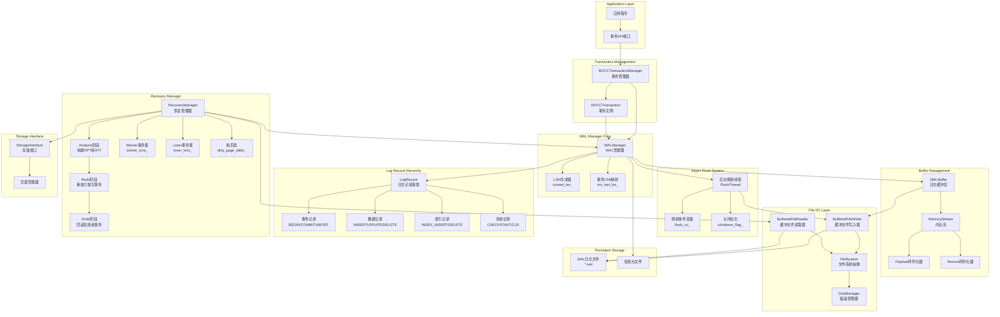

# TZDB 完整架构图

## 架构层次结构

```
┌─────────────────────────────────────────────────────────────┐
│                        API层                                │
│  ┌─────────────┐  ┌─────────────┐  ┌─────────────┐          │
│  │   SQL API   │  │   C API     │  │   Shell     │          │
│  └─────────────┘  └─────────────┘  └─────────────┘          │
└─────────────────────────────────────────────────────────────┘
┌─────────────────────────────────────────────────────────────┐
│                      会话管理层 (Session Layer)               │
│  ┌─────────────┐  ┌─────────────┐  ┌─────────────┐          │
│  │ DBInstance  │  │   Session   │  │ SqlContext  │          │
│  │ (实例管理)   │  │  (会话管理)  │  │ (SQL上下文)  │          │
│  └─────────────┘  └─────────────┘  └─────────────┘          │
│  ┌─────────────┐  ┌─────────────┐                           │
│  │ McoContext  │  │SessionMgr   │                           │
│  │ (MCO上下文)  │  │(会话管理器)  │                           │
│  └─────────────┘  └─────────────┘                           │
└─────────────────────────────────────────────────────────────┘
┌─────────────────────────────────────────────────────────────┐
│                      查询处理层 (query)                       │
│  ┌─────────────┐  ┌─────────────┐  ┌─────────────┐         │
│  │   Binder    │  │   Planner   │  │  Execution  │         │
│  │  (语法绑定)  │  │  (查询规划)   │  │  (执行引擎)  │         │
│  └─────────────┘  └─────────────┘  └─────────────┘         │
└─────────────────────────────────────────────────────────────┘
┌─────────────────────────────────────────────────────────────────┐
│                        核心层 (Kernel Layer)                    │
│  ┌─────────────┐  ┌─────────────┐  ┌─────────────┐             │
│  │     DB      │  │   Catalog   │  │ TableHeap   │             │
│  │  (协调器)    │  │ (元数据管理)  │  │ (表堆管理)   │             │
│  └─────────────┘  └─────────────┘  └─────────────┘             │
│  ┌─────────────┐  ┌─────────────┐                               │
│  │   Index     │  │IndexFactory │                               │
│  │  (索引)      │  │ (索引工厂)   │                               │
│  └─────────────┘  └─────────────┘                               │
└─────────────────────────────────────────────────────────────────┘
       
┌─────────────────────────────────────────────────────────────────┐
│                      事务层 (Transaction Layer)                 │
│  ┌─────────────┐  ┌─────────────┐  ┌─────────────┐             │
│  │Transaction  │  │Transaction  │  │   MVCC      │             │
│  │ Manager     │  │ Interface   │  │ Transaction │   wal       │
│  └─────────────┘  └─────────────┘  └─────────────┘             │
└─────────────────────────────────────────────────────────────────┘
                 
┌─────────────────────────────────────────────────────────────────┐
│                       存储层 (Storage Layer)                    │
│  ┌─────────────┐  ┌─────────────┐  ┌─────────────┐             │
│  │   Memory    │  │    Disk     │  │   Bustub    │             │
│  │  Storage    │  │  Storage    │  │  Storage    │             │
│  └─────────────┘  └─────────────┘  └─────────────┘             │
└─────────────────────────────────────────────────────────────────┘
┌─────────────────────────────────────────────────────────────┐
│                      操作系统层                               │
│  ┌─────────────┐  ┌─────────────┐  ┌─────────────┐           │
│  │   Linux     │  │   Windows   │  │   macOS     │         │
│  │   ACoreOS3  │  │             │  │             │         │
│  └─────────────┘  └─────────────┘  └─────────────┘         │
└─────────────────────────────────────────────────────────────┘
```

## 会话管理层详细说明

### 1. DBInstance (数据库实例管理器)

- **功能**: 单例模式管理多个数据库实例
- **核心组件**:
    - `dbs_map_`: 数据库名称到数据库对象的映射
    - `sessions_map_`: 会话ID到会话对象的映射
    - `session_id_`: 会话ID计数器
- **主要方法**:
    - `CreateSession()`: 创建新会话
    - `GetSession()`: 获取现有会话
    - `DisconnectSession()`: 断开会话连接
    - `AppendDb()`: 添加数据库实例

### 2. Session (会话管理)

- **功能**: 管理单个用户连接的状态和上下文
- **核心属性**:
    - `id_`: 会话唯一标识符
    - `db_`: 关联的数据库实例
    - `catalog_`: 数据库目录
    - `trans_`: 当前事务
    - `trans_params_`: 事务参数
- **主要方法**:
    - `BeginTransaction()`: 开始事务
    - `CommitTransaction()`: 提交事务
    - `Execute()`: 执行SQL语句
    - `Prepare()`: 预处理SQL语句
    - `Binder()`: 参数绑定

### 3. SqlContext (SQL上下文)

- **功能**: 管理SQL查询的执行上下文
- **核心组件**:
    - `Binder`: SQL解析和语法绑定
    - `Planner`: 查询规划
    - `Optimizer`: 查询优化
    - `ExecutorFactory`: 执行器工厂
    - `ResultWriter`: 结果写入器
- **主要方法**:
    - `Execute()`: 执行SQL查询
    - `Prepare()`: 预处理查询
    - `GetSchema()`: 获取结果模式

### 4. McoContext (MCO上下文)

- **功能**: 管理MCO (Memory-Centric Object) 操作上下文
- **核心组件**:
    - `CursorManager`: 游标管理器
    - `McoRecord`: 记录管理
    - `TransactionOps`: 事务操作
- **主要方法**:
    - 游标操作管理
    - 记录读写操作
    - 事务状态管理

### 5. SessionMgr (会话管理器)

- **功能**: 全局会话生命周期管理
- **核心功能**:
    - 会话创建和销毁
    - 会话状态监控
    - 会话资源清理
    - 连接池管理

### 6. WAL预写日志系统

TZDB的WAL(Write-Ahead Logging)预写日志系统是保证数据库ACID特性的核心组件，采用标准的ARIES恢复算法实现事务的原子性、一致性和持久性。该系统通过日志先行写入的策略，确保在系统崩溃后能够完整恢复数据库状态。

### 6.1 WAL系统完整架构



### 6.2 WAL管理器(WALManager)详细组件

**LSN管理系统**
- `current_lsn_`: 原子性的当前日志序列号，确保全局唯一性
- `flushed_lsn_`: 已持久化的最大LSN，用于确定刷盘进度
- `txn_last_lsn_`: 每个事务的最后LSN映射，支持ARIES的prev_lsn链式结构

**缓冲管理机制**
- `WALBuffer`: 高性能的环形缓冲区，支持并发写入
- `MemoryStream`: 可重用的内存流，避免频繁内存分配
- 双序列化器设计:payload_serializer用于校验和计算，record_serializer用于最终写入

**异步刷盘系统**
- `FlushThread`: 独立的后台线程，异步处理日志持久化
- `flush_cv_`: 条件变量协调刷盘时机，支持批量刷盘优化
- `shutdown_flag_`: 优雅关闭机制，确保所有日志安全持久化

**完整性保证机制**
- 校验和计算:CRC32算法确保日志记录完整性
- 原子写入:通过文件系统的原子操作保证日志记录的完整性
- 故障检测:启动时验证日志文件完整性，自动修复或报告损坏

### 6.3 日志记录体系(LogRecord)详细结构

**统一日志头部(LogRecordHeader)**
- `txn_id`: 事务标识符，关联事务上下文
- `timestamp`: 逻辑时间戳，支持MVCC版本控制
- `lsn`: 当前记录的日志序列号
- `prev_lsn`: 同事务前一条日志的LSN，形成事务内日志链
- `payload_size`: 负载大小，支持变长记录
- `checksum`: CRC32校验和，确保记录完整性

**事务控制记录**
- `BeginRecord`: 标记事务开始，记录事务ID和开始时间戳
- `CommitRecord`: 记录事务提交，包含提交时间戳`commit_ts_`
- `AbortRecord`: 标记事务中止，触发后续的撤销操作

**数据操作记录**
- `InsertRecord`: 记录插入操作，包含表ID、RID和完整数据镜像
- `UpdateRecord`: 记录更新操作，同时保存旧值(`old_data`)和新值(`new_data`)
- `DeleteRecord`: 记录删除操作，保存被删除记录的完整数据镜像

**索引操作记录(逻辑重做)**
- `IndexInsertRecord`: 记录索引插入，包含索引ID、键数据序列化和RID
- `IndexDeleteRecord`: 记录索引删除，支持逻辑重做的索引维护

**系统管理记录**
- `CheckpointRecord`: 检查点记录，包含活跃事务列表和脏页表快照
- `CompensationLogRecord`: 补偿日志记录(CLR)，确保撤销操作的幂等性

### 6.4 恢复管理器(RecoveryManager)三阶段算法

**分析阶段(Analysis Phase)**
- 从最后检查点开始向前扫描日志，重建系统崩溃时的状态
- 构建脏页表(DPT):记录每个脏页的最小recLSN
- 维护活跃事务表(ATT):跟踪崩溃时未完成的事务
- 区分Winner事务(已提交)和Loser事务(未提交)
- 更新系统的最大事务ID和提交时间戳

**重做阶段(Redo Phase)**
- 从脏页表中最小的recLSN开始重放日志
- 对每条日志记录判断是否需要重做:检查页面LSN vs 记录LSN
- 重做已提交事务的所有数据变更操作
- 逻辑重做:索引操作通过逻辑方式重新执行
- 物理重做:数据页操作直接应用到存储页面

**撤销阶段(Undo Phase)**
- 按LSN逆序回滚所有Loser事务的操作
- 为每个撤销操作生成CLR(补偿日志记录)
- 通过prev_lsn链式结构高效定位需要撤销的操作
- CLR确保撤销操作的幂等性，支持恢复过程的重入
- 撤销完成后将事务标记为ABORTED状态

### 6.5 ARIES算法核心特性实现

**Steal/No-Force策略**
- Steal:允许未提交事务的脏页写入磁盘，提高缓冲区利用率
- No-Force:事务提交时不强制刷新脏页，提升提交性能
- 通过WAL确保即使脏页提前写入，也能正确恢复

**LSN链式结构**
- 每条日志记录的prev_lsn指向同事务的前一条记录
- 支持高效的事务内日志遍历和撤销操作
- CLR记录的undo_next_lsn实现撤销操作的跳跃

**检查点优化**
- 模糊检查点:不阻塞正常事务处理
- 记录检查点时刻的活跃事务和脏页信息
- 显著减少恢复时需要扫描的日志范围

**逻辑重做与物理撤销**
- 逻辑重做:索引操作重新执行，适应页面结构变化
- 物理撤销:数据操作精确回滚到原始状态
- 平衡恢复效率和正确性的最优策略

## 分布式架构组件

### 数据服务器内部组件

- **网络连接池(NetPool)**: 管理TCP连接，处理客户端连接请求
- **请求处理器(RequestHandler)**: 解析和处理客户端数据操作请求
- **客户端管理器(ClientManager)**: 管理客户端连接状态和会话
- **数据同步管理器(SyncManager)**: 负责主从节点间的数据同步
- **角色管理器(RoleManager)**: 管理节点角色(主节点/从节点)

### 元数据服务器内部组件

- **网络连接池(NetPool)**: 管理集群节点间的网络连接
- **选举管理器(ElectionManager)**: 负责主节点选举，处理选举请求和投票
- **集群管理器(ClusterManager)**: 管理集群节点信息，维护集群状态
- **元数据同步器(MetaSync)**: 负责集群元数据的同步和广播
- **节点注册器(NodeRegistry)**: 处理新节点的注册和节点状态更新
- **集群元数据(edb_cluster_meta_t)**: 存储集群的元数据信息，如主节点、从节点列表等

## SQL上下文内部组件

- **SQL解析器(Binder)**: 解析SQL语句，生成语法树，绑定变量
- **查询规划器(Planner)**: 将语法树转换为查询执行计划
- **查询优化器(Optimizer)**: 优化查询执行计划，包括投影合并、连接优化等
- **执行器工厂(ExecutorFactory)**: 根据计划类型创建对应的执行器
- **执行上下文(ExecutorContext)**: 为执行器提供事务、目录等上下文信息
- **抽象执行器(AbstractExecutor)**: 实现Volcano迭代器模型，支持多种执行器类型
- **结果写入器(ResultWriter)**: 格式化输出查询结果

## MCO上下文内部组件

- **游标管理器(CursorManager)**: 管理查询结果集的游标，支持游标的分配和删除
- **游标(Cursor)**: 表示查询结果集的迭代器，支持Next()、HasNext()等操作
- **记录管理(McoRecord)**: 管理数据库记录的结构和操作，支持记录的构造、重置和字段访问
- **字段值管理(McoFieldValues)**: 抽象基类，提供字段值的统一访问接口
- **结构值(McoStructValue)**: 处理复杂结构类型的字段值，支持嵌套结构
- **事务操作(TransactionOps)**: 提供事务的开始、提交、回滚等操作接口

## 数据流说明

1. **连接建立**: API层 → DBInstance → Session创建
2. **查询处理**: Session → SqlContext → Binder → Planner → Execution
3. **事务管理**: Session → Transaction Manager → 具体事务实现
4. **数据访问**: Execution → DB → Storage Layer
5. **结果返回**: Storage → DB → Execution → SqlContext → Session → API

## 会话管理的关键特性

- **线程安全**: 使用互斥锁保护共享资源
- **生命周期管理**: 自动管理会话的创建和销毁
- **资源隔离**: 每个会话有独立的上下文和状态
- **事务隔离**: 支持多会话并发事务处理
- **连接池**: 高效的连接复用机制

## 分布式特性

- **主从架构**: 支持一主多从的部署模式，主节点处理写请求，从节点处理读请求
- **自动选举**: 通过元数据服务器的选举管理器实现主节点的自动选举和故障转移
- **数据同步**: 数据服务器负责主从节点间的数据同步，确保数据一致性
- **元数据同步**: 元数据服务器负责集群元数据的同步和广播
- **节点管理**: 支持动态添加和移除节点，自动更新集群状态
- **故障恢复**: 当主节点故障时，自动选举新的主节点，恢复服务

## 设计特点

- **插件化架构**: 各层之间通过接口解耦，支持插件式扩展
- **多存储引擎**: 支持多种存储模式，可根据需求选择
- **多事务模式**: 支持不同的事务处理策略
- **事务驱动的存储访问**: 核心层通过事务管理层访问存储引擎，确保数据一致性和并发控制
- **实时性支持**: 针对实时应用场景优化
- **跨平台兼容**: 支持多种操作系统和硬件平台
- **分布式扩展**: 支持从单体模式平滑扩展到分布式模式

## 核心层组件

- **数据库核心**: 整个系统的协调中心
- **元数据管理**: 管理表、索引等元数据信息
- **表堆管理**: 管理数据的逻辑存储，通过事务层访问物理存储
- **索引管理**: 管理B+树、哈希表等索引结构

## 存储引擎层

- **磁盘存储**: 基于磁盘的持久化存储
- **内存存储**: 基于内存的高性能存储
- **Bustub存储**: 基于Bustub的存储引擎

## 事务管理层

- **MVCC**: 多版本并发控制
- **2PL**: 两阶段锁定
- **MRSW**: 多读单写模式

*注意:事务管理层作为核心层与存储引擎层之间的桥梁，负责协调数据访问和并发控制*

## 操作系统层

- **文件系统**: 底层文件操作
- **网络通信**: 节点间通信
- **线程同步**: 互斥锁(TZMutex)、信号量(TZSemaphore)、事件(TZEvent)等同步原语

这个完整的架构图现在包含了您提到的会话管理层，它是连接API层和核心层的重要桥梁，负责管理用户连接、查询上下文和事务状态。整个系统采用分层设计，支持分布式部署，具有良好的扩展性和可维护性。
