# TZDB元数据服务设计与实现

## 1. 核心概念与术语

在深入了解TZDB元数据服务之前，让我们先明确几个关键概念:

- **元数据(Metadata)**: 描述数据库系统结构、配置和状态的信息，包括数据库模式、表结构、分片信息等。
- **时间桶(Bucket)**: 按时间范围划分的数据分片单元，每个桶包含特定时间段内的所有数据。
- **虚拟节点(Vnode)**: 数据存储的逻辑单元，映射到物理节点上，用于数据分布和负载均衡。
- **复制集(ReplicationSet)**: 一组虚拟节点的集合，用于实现数据冗余和高可用性。
- **状态机(StateMachine)**: 用于处理和应用元数据操作的组件，确保分布式环境下的一致性。
- **操作日志(OperationLog)**: 记录对元数据的修改操作，用于复制和恢复。

## 2. 系统架构

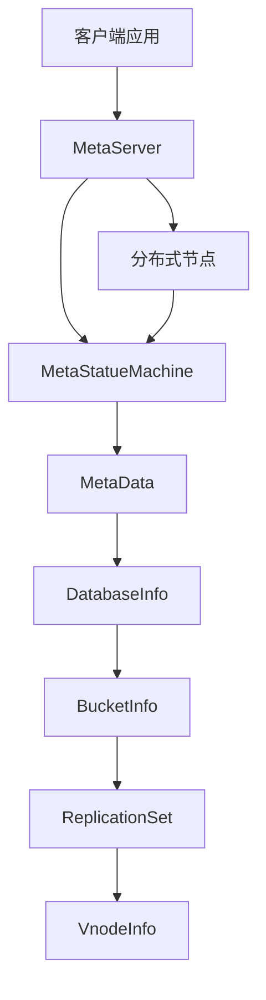

TZDB元数据服务采用分层架构设计，主要包括以下核心组件:

1. **MetaServer**: 对外提供元数据服务的入口，处理客户端请求并协调内部组件。
2. **MetaStatueMachine**: 元数据状态机，负责应用操作日志并维护元数据状态。
3. **MetaData**: 元数据存储和管理，包含所有数据库的元数据信息。
4. **CLNode**: 分布式节点，负责集群通信和一致性协议实现。

## 3. 核心组件详解

### 3.1 MetaServer

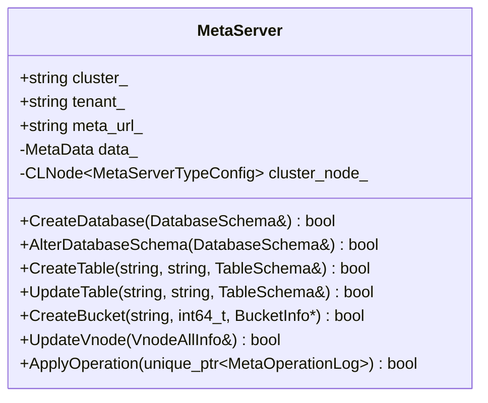

**MetaServer**是元数据服务的核心组件，负责:
- 管理数据库的创建、修改和删除
- 处理表结构的操作
- 管理时间桶和虚拟节点
- 协调分布式操作和一致性

它通过`ApplyOperation`方法将操作转发给底层的状态机，确保在分布式环境中的一致性。

### 3.2 MetaStatueMachine

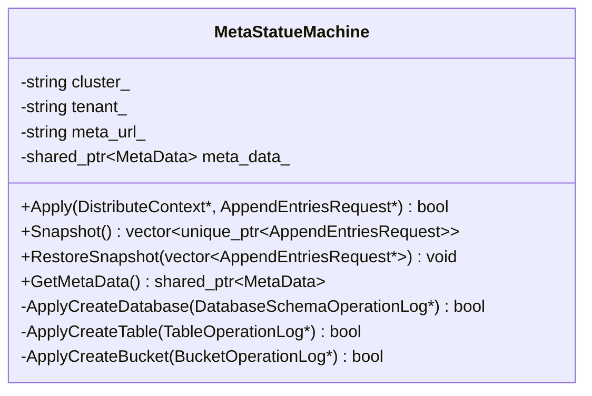

**MetaStatueMachine**是实现分布式一致性的核心，它:
- 应用操作日志到元数据状态
- 创建和恢复快照，用于状态恢复
- 处理各种元数据操作，如创建数据库、表和桶等
- 维护元数据的一致性和完整性

### 3.3 MetaData

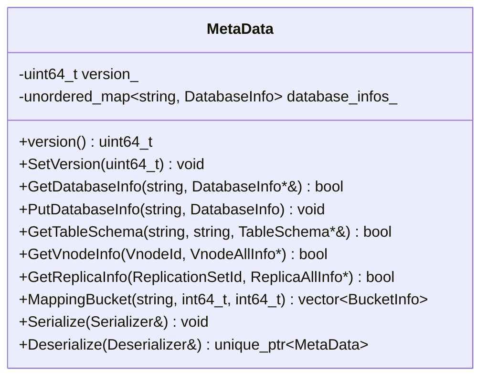

**MetaData**是元数据的实际存储容器，它:
- 存储所有数据库的元数据信息
- 提供元数据的查询和修改接口
- 支持序列化和反序列化，用于持久化和恢复
- 管理元数据的版本控制

### 3.4 DatabaseInfo

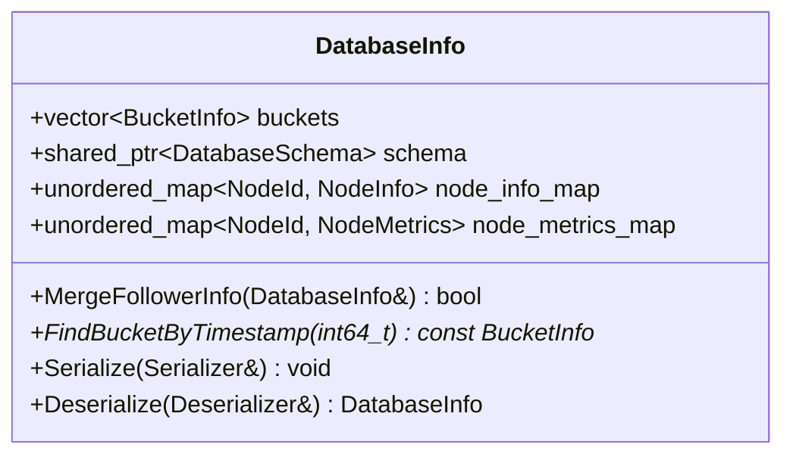

**DatabaseInfo**包含单个数据库的完整元数据:
- 数据库的时间桶信息
- 数据库模式和表结构
- 节点信息和度量数据
- 提供按时间戳查找桶的功能

## 4. 元数据操作流程

### 4.1 创建数据库

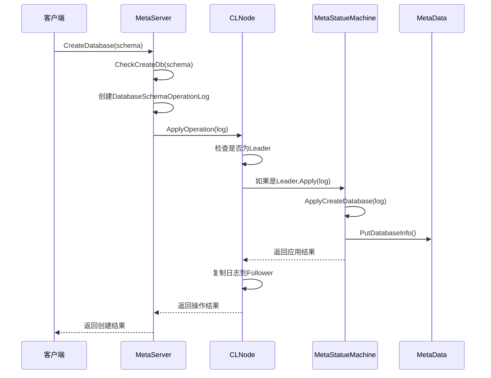

创建数据库的过程展示了元数据操作的典型流程:
1. 客户端发送请求到MetaServer
2. MetaServer检查请求的有效性
3. 创建操作日志并通过分布式节点应用
4. 状态机处理操作并更新元数据
5. 操作结果返回给客户端

### 4.2 时间桶管理

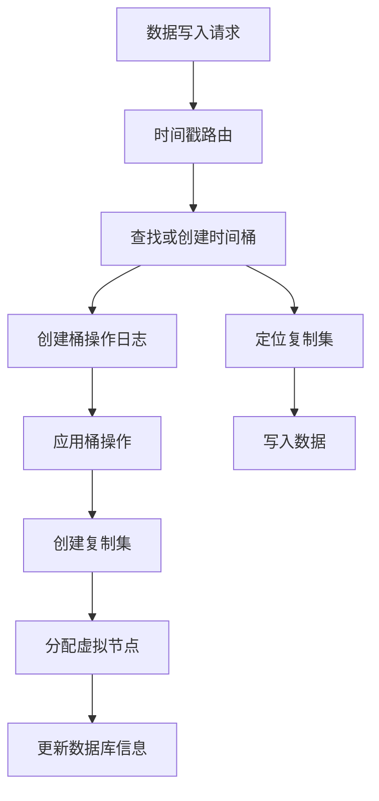

时间桶管理是TZDB的特色功能，它:
1. 根据数据时间戳自动路由到对应桶
2. 在需要时动态创建新桶
3. 为每个桶分配复制集和虚拟节点
4. 确保数据按时间范围有序存储

## 5. 元数据结构关系

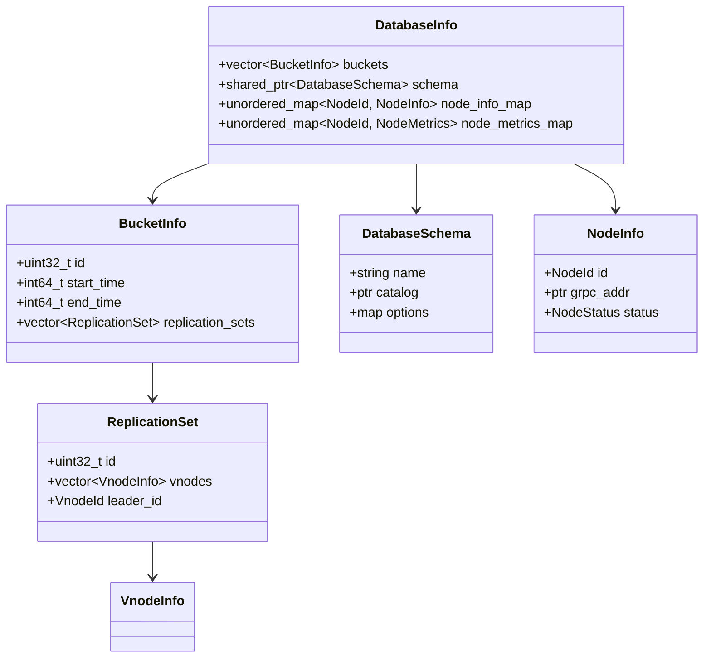

元数据结构呈现层次化关系:
- **DatabaseInfo**是顶层容器，包含数据库的所有元数据
- **BucketInfo**表示时间桶，每个桶有自己的时间范围和复制集
- **ReplicationSet**定义了数据复制组，包含多个虚拟节点
- **VnodeInfo**表示虚拟节点，映射到物理节点上

## 6. 操作日志体系

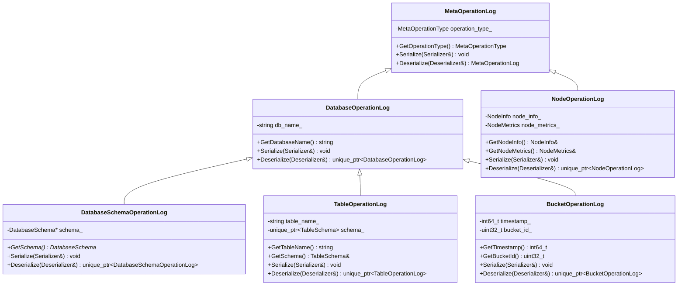

操作日志体系采用继承结构设计:
- **MetaOperationLog**是所有操作日志的基类
- 各种特定操作有自己的日志类型，如DatabaseOperationLog、TableOperationLog等
- 每种日志类型包含操作所需的特定数据
- 所有日志类型都支持序列化和反序列化，用于持久化和网络传输

## 7. 分布式一致性

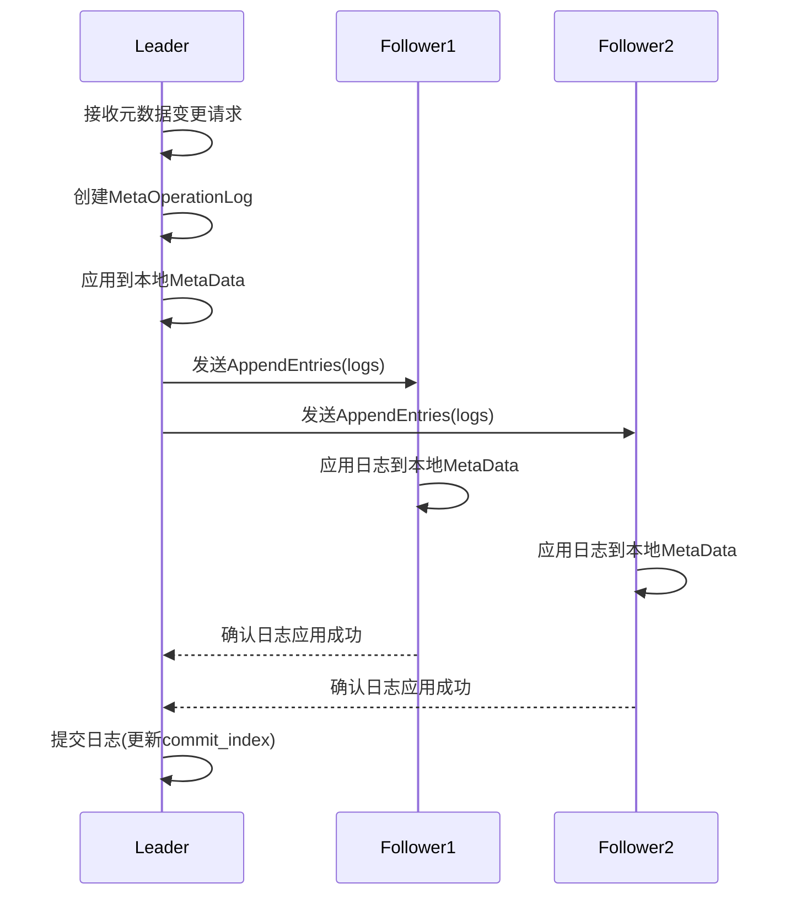

TZDB元数据服务使用基于Raft的一致性协议:
1. Leader接收并处理所有写操作
2. 操作被记录为日志并复制到Follower节点
3. 大多数节点确认后，操作被视为提交
4. 所有节点最终应用相同的操作序列，确保状态一致

## 8. 时间桶与复制集

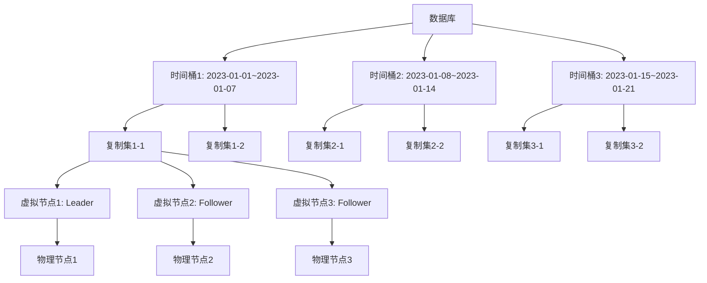

时间桶和复制集是TZDB数据分布的核心概念:
- 每个数据库包含多个时间桶，按时间范围划分
- 每个桶包含多个复制集，用于数据分片
- 每个复制集包含多个虚拟节点，实现数据复制
- 虚拟节点映射到物理节点，实现实际存储

## 9. 元数据服务功能模块

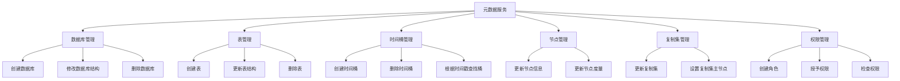

元数据服务提供全面的功能模块:
- **数据库管理**:创建、修改和删除数据库
- **表管理**:处理表结构和表操作
- **时间桶管理**:创建和管理时间范围分片
- **节点管理**:跟踪物理节点状态和度量
- **复制集管理**:管理数据复制和高可用
- **权限管理**:控制访问权限和安全性

## 10. 故障恢复机制

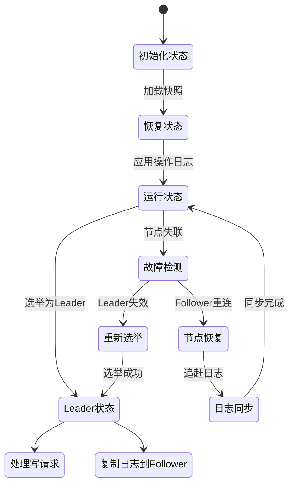

TZDB元数据服务具有完善的故障恢复机制:
1. **快照和日志**:通过快照和操作日志实现状态恢复
2. **Leader选举**:当Leader节点失效时自动选举新Leader
3. **日志复制**:确保所有节点最终一致性
4. **节点恢复**:支持节点重新加入集群并同步状态
5. **自动修复**:检测和修复数据不一致

## 11. 性能与优化

TZDB元数据服务针对性能进行了多方面优化:

1. **批量操作**:支持批量处理元数据操作，减少网络开销
2. **缓存机制**:频繁访问的元数据在内存中缓存
3. **异步复制**:Leader确认后立即返回，异步复制到Follower
4. **压缩日志**:定期创建快照，压缩历史操作日志
5. **并行处理**:多线程处理不同数据库的元数据操作

## 12. 总结

TZDB元数据服务是一个功能完备、高度可扩展的分布式元数据管理系统，它通过以下特性支持大规模时序数据库的运行:

1. **分层架构**:清晰的组件分层，便于扩展和维护
2. **分布式一致性**:基于Raft协议的强一致性保证
3. **时间分片**:通过时间桶机制实现高效的时序数据管理
4. **复制与高可用**:通过复制集实现数据冗余和服务可用性
5. **完善的操作日志**:支持状态恢复和审计跟踪
6. **权限管理**:细粒度的访问控制机制

通过这些设计，TZDB元数据服务能够支持大规模分布式时序数据库的稳定运行，为用户提供高性能、高可用的数据管理服务。