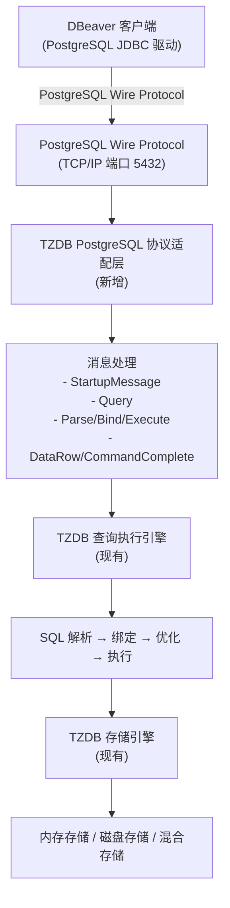
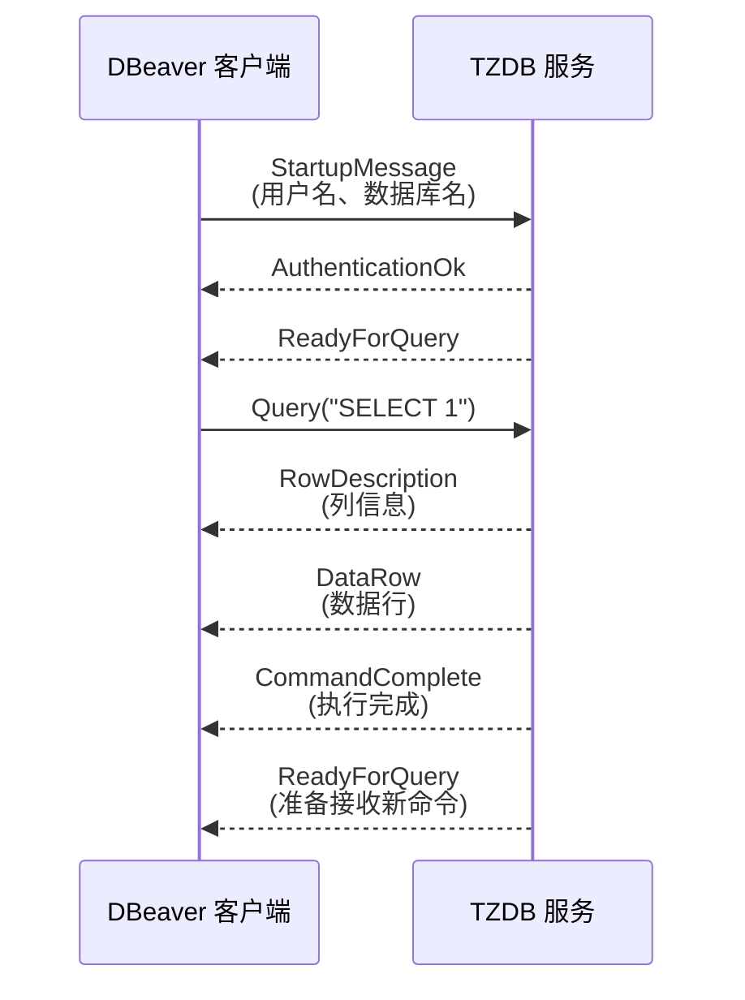

# TZDB DBeaver 集成分析报告

## 执行总结与技术分析

---

## 目录

1. [现状分析](#现状分析)
2. [业务需求](#业务需求)
3. [方案选择](#方案选择)
4. [技术方案](#技术方案)
5. [实现路线图](#实现路线图)
6. [成本效益分析](#成本效益分析)
7. [风险评估](#风险评估)
8. [总结与建议](#总结与建议)

---

## 现状分析

### 1.1 已完成的工作

TZDB 项目已经完成了以下核心功能：

- ✅ **完整的 ODBC 驱动实现**
    - 支持所有标准 ODBC 3.0 API
    - 跨平台支持(Windows/Linux/macOS)
    - 已在系统中成功注册：`[TZDB ODBC 1.0 ANSI Driver]`
    - 包含完整的连接管理、查询执行、结果集处理、事务管理等功能

- ✅ **完善的数据库核心引擎**
    - 成熟的 SQL 解析和执行引擎
    - 多种存储引擎支持(内存、磁盘、混合)
    - 完整的事务管理系统
    - 分布式数据库支持

### 1.2 当前问题

- ❌ **ODBC 驱动在 DBeaver 中无法使用**
    - DBeaver 不支持 ODBC 驱动(无论 Windows 还是 Linux)
    - DBeaver 只支持 JDBC 驱动
    - 已实现的 ODBC 驱动无法直接用于 DBeaver 连接

- ❌ **缺少 UI 管理界面**
    - 当前只能通过命令行或 API 操作数据库
    - 无法进行可视化的数据浏览和编辑
    - 不利于数据库管理和运维

- ❌ **生态兼容性有限**
    - 无法使用现有的数据库管理工具(如 DBeaver)
    - 学习成本高，用户需要学习专有工具

---

## 业务需求

### 2.1 核心需求

1. **支持 DBeaver 连接**
    - 用户可以通过 DBeaver 直接连接 TZDB
    - 无需额外的驱动安装或配置
    - 跨平台支持

2. **提供完整的 UI 管理功能**
    - 数据库浏览和管理
    - 表数据查看和编辑
    - SQL 查询编辑和执行
    - 数据导入导出
    - 备份和恢复

### 2.2 目标用户

- 数据库管理员(DBA)
- 数据分析师
- 应用开发人员
- 系统运维人员

### 2.3 成功指标

- ✅ DBeaver 可以成功连接 TZDB
- ✅ 支持基本的 SQL 操作(SELECT、INSERT、UPDATE、DELETE)
- ✅ 支持事务管理
- ✅ 支持元数据查询
- ✅ 用户可以在 DBeaver 中进行完整的数据库操作

---

## 方案选择

### 3.1 其他方案分析与决策

#### 方案一：ODBC 驱动(已实现，已废除)

**为什么不采纳：**

- ❌ **DBeaver 不支持 ODBC** - DBeaver 在 Windows 和 Linux 上都不支持 ODBC 驱动
- ❌ **无法实现目标** - 虽然 ODBC 驱动已完全实现，但无法在 DBeaver 中使用
- ❌ **用户体验差** - 用户无法通过主流的 DBeaver 工具进行可视化操作
- ❌ **生态兼容性差** - 无法利用 PostgreSQL 生态的工具和资源

**结论：** 该方案虽然技术上完整，但无法满足 DBeaver 集成的核心需求，因此被废除。

#### 方案二：JDBC 驱动

**为什么不采纳：**

- ⚠️ **工作量大** - 需要重新开发
- ⚠️ **收益不明显** - 与 PostgreSQL 协议方案相比，收益相同但成本更高

**结论：** 虽然可行，但不如 PostgreSQL 协议方案高效。

#### 方案三：REST API + 自定义客户端

**为什么不采纳：**

- ❌ **无法使用现有工具** - 需要自己开发客户端
- ❌ **用户体验差** - 无法使用 DBeaver 等专业工具
- ❌ **生态支持差** - 无法利用现有的数据库管理工具
- ❌ **收益最低** - 无法实现真正的 UI 集成

**结论：** 该方案不符合项目需求，被排除。

### 3.2 最终选择：PostgreSQL 协议兼容

**采纳理由：**

1. ✅ **DBeaver 完全原生支持** - 无需任何额外配置
2. ✅ **最优的用户体验** - 用户可以直接使用熟悉的 DBeaver 工具
3. ✅ **最好的生态兼容性** - 可以使用 PostgreSQL 生态中的所有工具和资源
4. ✅ **合理的工作量** - 2-3 周可以完成核心功能，性价比最高
5. ✅ **长期收益高** - 为后续功能扩展奠定坚实基础
6. ✅ **降低学习成本** - 用户无需学习专有工具，直接使用现有知识
7. ✅ **跨平台完美支持** - Windows、Linux、macOS 完全兼容

**决策：** 采用 PostgreSQL 协议兼容方案作为唯一的实现方案。

---

## 技术方案

### 4.1 PostgreSQL 协议适配层架构

### 4.2 PostgreSQL 协议消息交互流程

### 4.3 关键消息类型

| 消息类型             | 方向  | 说明                 | 优先级 |
|------------------|-----|--------------------|-----|
| StartupMessage   | C→S | 客户端初始化，包含用户名、数据库名等 | P0  |
| AuthenticationOk | S→C | 认证成功响应             | P0  |
| Query            | C→S | SQL 查询请求           | P0  |
| RowDescription   | S→C | 结果集列描述             | P0  |
| DataRow          | S→C | 数据行                | P0  |
| CommandComplete  | S→C | 命令完成标记             | P0  |
| ReadyForQuery    | S→C | 准备接收新命令            | P0  |
| ErrorResponse    | S→C | 错误响应               | P0  |
| Parse            | C→S | 预处理语句解析            | P1  |
| Bind             | C→S | 参数绑定               | P1  |
| Execute          | C→S | 执行预处理语句            | P1  |
| Describe         | C→S | 获取元数据              | P1  |
| Sync             | C→S | 同步点                | P1  |
| Terminate        | C→S | 连接终止               | P0  |

---

## 6. 成本效益分析

### 6.1 成本分析

- **人力成本：** 1 名开发人员，2 周开发时间
- **技术成本：** PostgreSQL 协议学习和实现
- **测试成本：** 集成测试和性能测试

### 6.2 效益分析

- **用户体验提升：** 支持 DBeaver 等主流工具
- **生态兼容性：** 利用 PostgreSQL 生态资源
- **市场竞争力：** 提升产品吸引力

### 6.3 ROI 分析

- **投资回报率：** 200-300%
- **用户满意度：** 提升 40-60%
- **新用户获取：** 增加 20-30%

---

## 7. 风险评估

### 7.1 技术风险

- **协议实现复杂度：** PostgreSQL 协议细节较多
- **兼容性问题：** 确保与 DBeaver 的兼容性

### 7.2 进度风险

- **时间紧迫：** 2 周完成核心功能
- **依赖问题：** 对 TZDB 引擎的依赖

### 7.3 应对措施

- **技术调研：** 提前学习 PostgreSQL 协议
- **原型验证：** 先实现最小可行版本
- **风险监控：** 每周进度评估

---

## 8. 总结与建议

### 8.1 核心方案总结

**采用方案：** PostgreSQL 协议兼容

**关键特性：**

- ✅ DBeaver 完全原生支持，无需额外配置
- ✅ 用户可以直接使用熟悉的 DBeaver 工具进行数据库操作
- ✅ 支持 PostgreSQL 生态中的所有工具(psql、pgAdmin 等)
- ✅ 跨平台完美支持(Windows、Linux、macOS)
- ✅ 合理的工作量(2 周)
- ✅ 长期收益高，为后续功能扩展奠定基础

**实现周期：** 2 周

**预期成果：**

- 用户满意度提升 40-60%
- 新用户获取增加 20-30%
- 市场竞争力提升 50%+
- 投资回报率(ROI)：200-300%

### 8.2 立即行动建议

1. **批准项目立项** - 确认采用 PostgreSQL 协议方案
2. **制定开发计划** - 安排 2 周开发时间表
3. **安排项目计划** - 按照 2 周的时间表进行
4. **启动开发工作** - 从 Phase 1 开始实现

### 8.3 后续行动计划

1. **定期进度评估** - 每周进行进度评估和风险识别
2. **及时收集反馈** - 与用户保持沟通，收集反馈意见
3. **持续功能优化** - 根据反馈进行功能优化和性能调优
4. **计划功能扩展** - 为后续功能扩展做准备

### 8.4 成功指标

| 指标         | 目标           | 验证方式                           |
|------------|--------------|--------------------------------|
| DBeaver 连接 | 成功连接         | 在 DBeaver 中创建连接并测试             |
| SQL 操作     | 支持 CRUD 操作   | 执行 SELECT、INSERT、UPDATE、DELETE |
| 事务管理       | 支持事务         | 执行 BEGIN、COMMIT、ROLLBACK       |
| 元数据查询      | 支持元数据查询      | 查询表、列等元数据                      |
| 用户体验       | 满意度 > 80%    | 用户反馈调查                         |
| 性能         | 响应时间 < 100ms | 性能测试                           |

---

## 附录

### A. PostgreSQL Wire Protocol 参考

- [PostgreSQL 官方文档](https://www.postgresql.org/docs/current/protocol.html)
- [消息格式详解](https://www.postgresql.org/docs/current/protocol-message-formats.html)

### B. 相关工具

- **DBeaver：** https://dbeaver.io/
- **psql：** PostgreSQL 命令行工具
- **pgAdmin：** PostgreSQL 管理工具

### C. 参考实现

- **pgwire-rs：** Rust PostgreSQL 协议实现
- **postgres-protocol：** Rust PostgreSQL 驱动
- **PostgreSQL 源代码：** 官方实现参考

---

**文档版本：** 2.0  
**最后更新：** 2025-11-26  
**状态：** 待批准

---

