## 锐华编程环境使用手册

### 一. 环境准备
锐华编程环境可以在虚拟机或物理机上的windows7系统中运行,为了方便测试,将其打包在`vm`虚拟机中.

#### 1.1 虚拟机下载与安装
直接访问:https://www.vmware.com/go/getworkstation-win 进行下载windows版本  
直接访问:https://www.vmware.com/go/getworkstation-linux 进行下载:linux版本

需要下载哪一版本根据当前工作的主机系统进行选择.

激活密钥:ZF71R-DMX85-08DQY-8YMNC-PPHV8 (如果这个过期,随便百度一个就可以)

#### 1.2 打开虚拟机
打开`VMware Workstation`，点击`打开虚拟机`
按下图所示连接好开发板  
<div align=center>
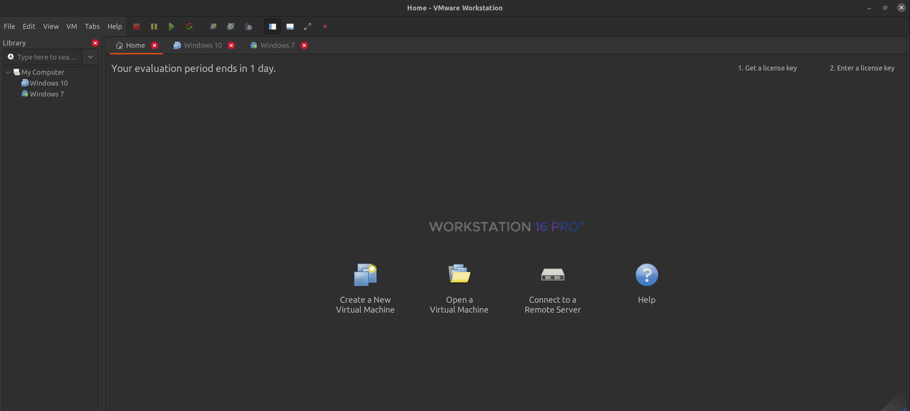  
</div>  

找到`win7vm` - `Windows 7.vmx`双击即可。
注意：当第一次开启这个虚拟机弹出的提示，请点击`我已移动`。
#### 1.3 目标板开机前准备
按下图所示连接好开发板  
<div align=center>
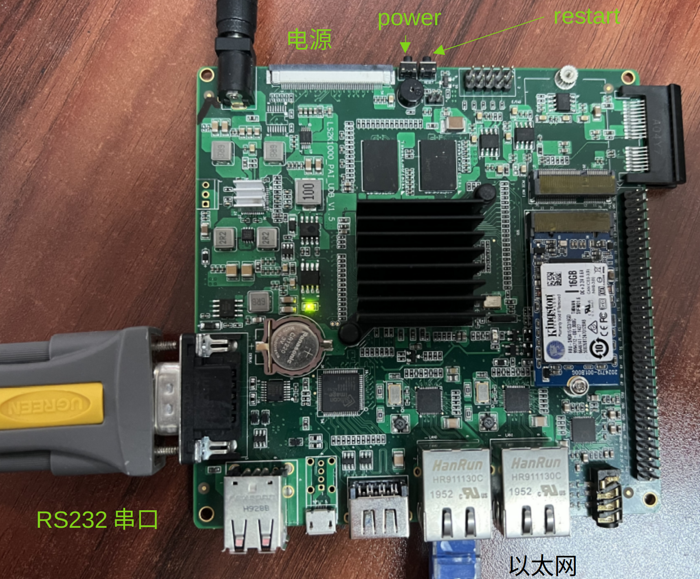  
</div>  
 
注：开发板的以太网口和物理机的以太网口直连。
#### 1.4 检查串口
- step1:打开`Windows7`虚拟机中的ReDe开发环境：  
<div align=center>
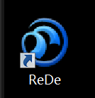  
</div>

- step2:如下图所示，依次点击`窗口`、`显示视图`、`其他` -> `终端`以调出终端显示窗口:  
  
<div align=center>
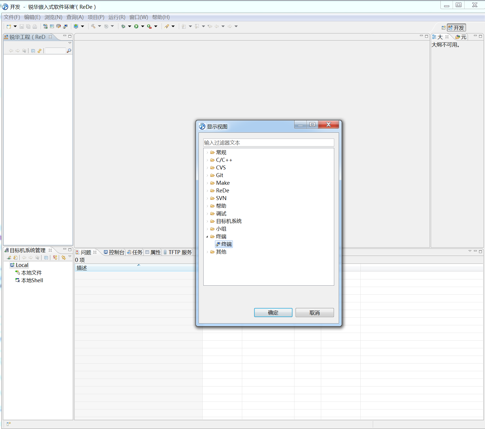  
</div>  

调出的终端将在IDE下部分显示：
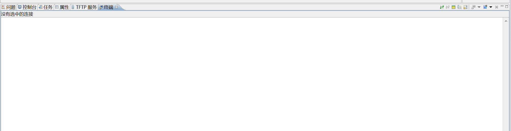

- step3:将串口从主机断开，连接到win7虚拟机
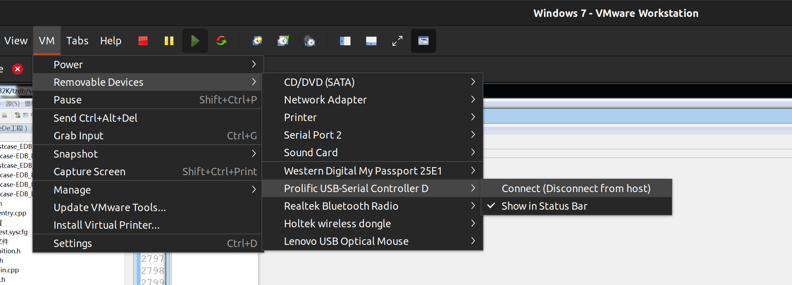
- step4:配置端口信息
点击下图标记的图标
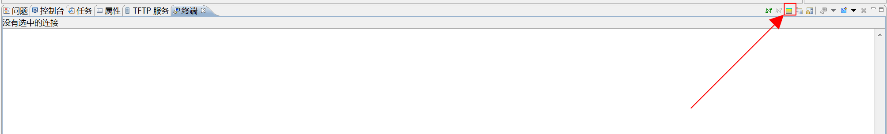
进行如下配置，具体是串口几还要根据自身情况进行判断
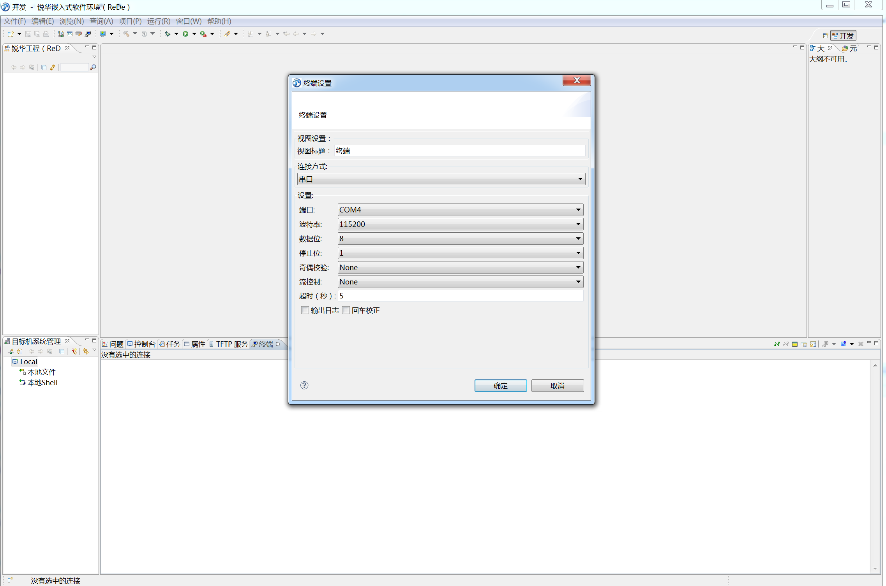
- step5:配置完毕之后点击下图的按钮进行连接，如果连接成功，则会打印出系统开机的log信息:
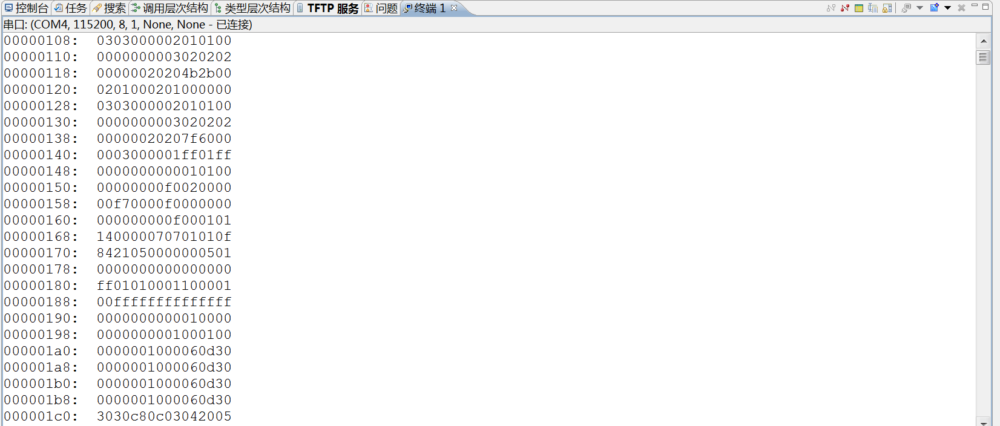


#### 1.5 配置网络通信
开发板与物理机及虚拟机的组网方式如下图所示：
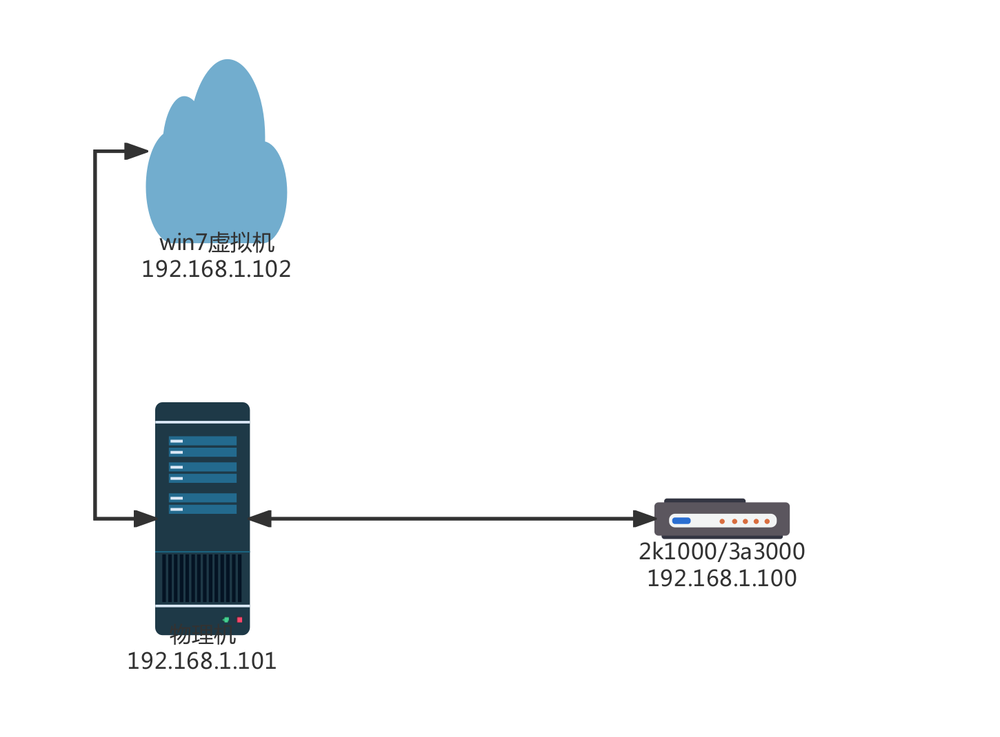
虚拟机、物理机、开发板的ip地址根据上图配置即可（只要可以通信就可以，不一定固定这几个ip）。

### 二. 建立项目
#### 2.1 建立静态库项目
要创建库项目，首先打开IDE，点击`文件` -> `新建` -> `库工程`
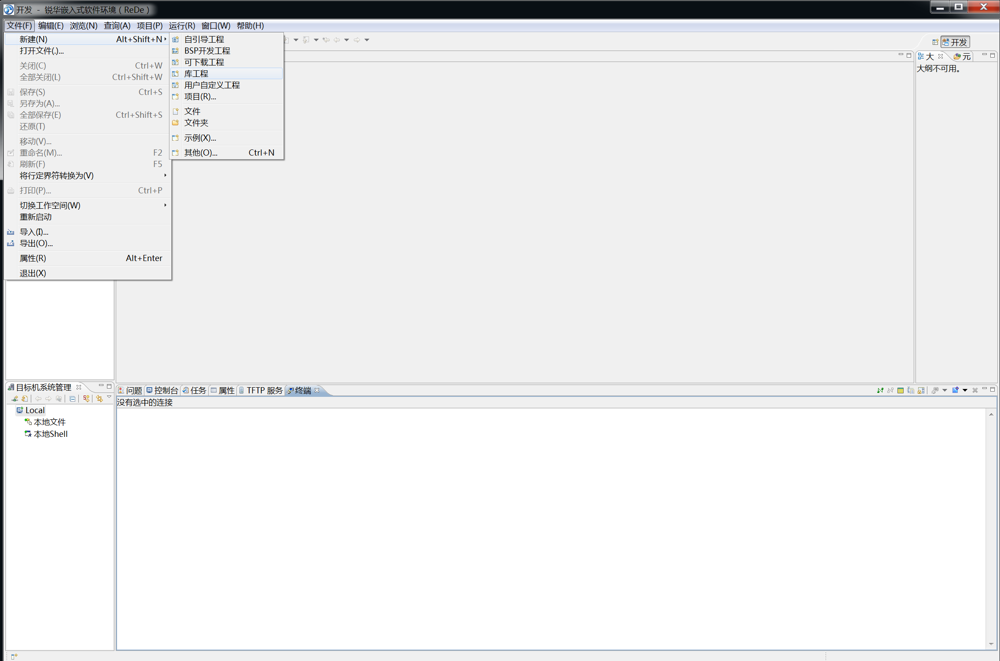
当点击库工程后，将弹出如下窗口,这里将库工程取名为`TZDB`
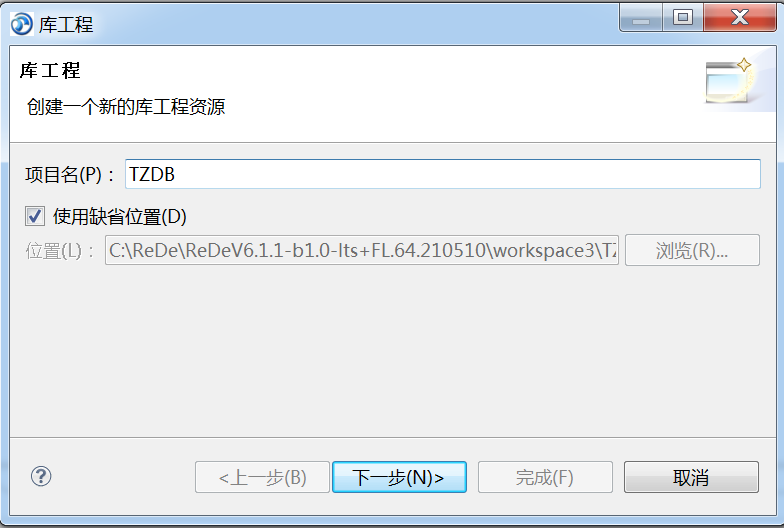
点击下一步：
这里会让选择工具链，如果希望建立`2k1000`的项目则勾选`gnumips64`。
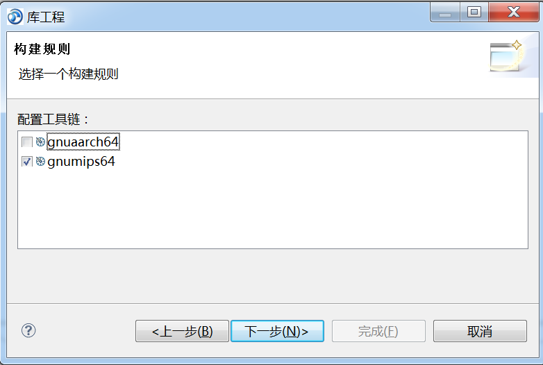
点击下一步：
勾选`龙芯2k1000多核开发板资源`，若建立`3A`的工程则勾选下方的。
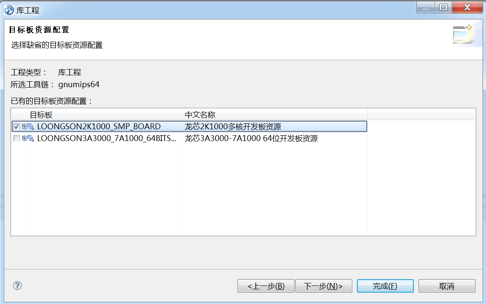
勾选之后直接点击`完成`即可。
#### 2.2 建立自引导项目
自引导项目是启动ReWorks的关键，其中包含了程序入口以及相关的系统资源配置，编译自引导项目后产生的`elf`文件最终通过`FTP`被板子读取，最终运行起来。

### 三. 项目配置及运行
此次配置实例以2k1000的自引导项目为例(一般来说都是通用的)。  
#### 3.1 路径配置
根据`2.1`中的步骤创建好库项目之后，直接将`TZDB`内核源码中的`inc`、`src`、`sqlengine`拖入工程中去：  
<div align=center>  
  
</div>  
完成后如下图所示：  
<div align=center>  
  
</div>  

此时还不能编译通过，还需要配置相关路径以让编译器能够寻找到依赖的头文件，如下图所示，右键工程名，找到`属性`,点击打开：  

<div align=center>  
  
</div>  

点开属性可以看到`C/C++常规`->`路径与符号`
<div align=center>  
  
</div>  

在上图中，需要配置的项有：
- C源文件
- C++源文件

开始配置：
- step1:点击下图标记的`添加按钮`
<div align=center>  
  
</div>  

弹出窗口后，点击`工作空间`  
<div align=center>  
  
</div>  

点开后并展开找到`(源码目录) -> inc`，单击确定  
<div align=center>  
  
</div>  

再次点击`确定`(其中，“这是一个工作空间路径”在这种添加方式下是一定要被勾选的，绝对路径的添加方式则不需要)  

<div align=center>  
  
</div>  

库项目添加完毕后的头文件包含目录如下：
<div align=center>  
  
</div>  

因为是库项目，在添加好包含路径后即可直接编译，`右键库项目` -> `重新编译`,编译成功的`控制台`log如下：
<div align=center>  
  
</div>  


#### 3.2 自引导项目资源配置
资源配置在`项目` -> `资源配置` -> `项目名.syscfg`中双击点开，分别勾选以下配置:
- 核心模块
<div align=center>  
  
</div>   

- LOONGSON2K 64 CSP  
<div align=center>  
  
</div>   

- I/O模块
<div align=center>  
  
</div>  

- 龙芯2K1000多核板级开发包
<div align=center>  
  
</div>  

- PCI 总线、网络服务、开发与运行支持的配置
<div align=center>  
  
</div>  

当勾选完上面的配置后， `Ctrl` + `s`进行保存,然后右键工程名，点击`重构项目`，所作的更改才能生效：  
<div align=center>  
  
</div>  

#### 3.3 运行前准备
由于大部分测试用例都是`C++`进行编写的，为了更好的适应`C`的环境，因此，在做测试时，添加一个作为缓冲的文件-`test_main.cpp`。
右键项目->`新建`->`·文件`,点击后选中`自引导工程`,填入文件名后点击完成:
<div align=center>  
  
</div> 

为其内容添加为如下：
```C++
#include <stdio.h>

void test_case_main();
extern "C" void test_main();
extern "C" void test_main()
{
	if(1)
	{
		for(int i=0;i<10;i++) putchar('\n');
		printf("-------------------------------------------------------------------------\n");
		printf("------------------------------TZDB TEST----------------------------------\n");
		printf("-------------------------------------------------------------------------\n");

		/*************COM ENTRY*****************/
		test_case_main();

		printf("-------------------------------------------------------------------------\n");
		printf("------------------------------END  TEST----------------------------------\n");
		printf("-------------------------------------------------------------------------\n");
		//	printf("press any key to test again...");fflush(stdout);
		getchar();
	
	}//while
}
```
添加完这个文件后，还需要适当修改`自引导工程`中自带的`usrInit.c`文件，这个文件是`ReWorks`用来初始化的，我们在这个文件的`UserInit()`函数中添加上一步的`test_main()`函数的调用：  
```C++
void UserInit(void)
{
	satadev_create(0,0,"/dev/ahci");
	//format("fatfs","/dev/ahcip1");
	mount("fatfs","/dev/ahcip1","/sata");
	int ret =chdir("/sata");

	test_main();
	return;
}
```
将以上内容复制粘贴即可。

在配置好以上步骤后，现在将测试用例拖入`自引导工程`:

<div align=center>

</div>  

这个`testcase`是一个测试用例文件夹，里面包含了数十个测试用例，展开这个文件夹可以看到一个名为`test_entry.cpp`的文件，打开这个文件可以看到一个名为`test_case_main()`的函数，如下图需要测试`BOOL`类型数据的支持情况，就将其注释打开即可。

<div align=center>

</div>  


一切准备完毕之后，`右键工程` -> `重新构建` ,注意，因为新添加了文件夹`testcase`， 其中可能有一些文件没有被`包含`在路径中，此时不能编译成功，还需要再次添加路径，`右键testcase文件夹`(注意是右键文件夹) -> `属性` -> `C/C++常规` -> `路径与符号`,需要更改的项有`C源文件`、`C++源文件`,其步骤和`3.1`中介绍的一致，添加好的路径如下：
<div align=center>

</div>  

**添加连接库**
step1:`右键工程` -> `属性` -> `C/C++常规` -> `路径与符号` -> `库` 点击添加，直接键入`TZDB`:
<div align=center>

</div>   

step2:指定连接库路径，`右键工程` -> `属性` -> `C/C++构建` -> `设置` -> `GCC C++ Linker` -> `库` 点击如下图所示的`添加`按钮:
<div align=center>

</div>   

在点击完后弹出的窗口中点击`工作空间`，在`文件夹选择`中选择`TZDB`-`gnumips64`-`LOOGSON2K1000_SMP_BOARD`，点击确定即可。
<div align=center>

</div>   

以上步骤全部完成后，就可以进行编译了，`右键工程` -> `重构项目`，等待完成即可，成功编译的日志如下：
<div align=center>

</div>   

编译完成后，`右键自引导工程` -> `gnumips64` - `LOONGSON2K1000_SMP_BOARD` 右键这个文件夹，点击`配置TFTP服务路径`:
<div align=center>

</div>  

当弹出成功后，点击确定即可。

**烧录**
因为前面已经配置好`TFTP`服务了，所以`烧录`过程直接按下板子的`RESET`按键即可，当看到下图所示的读取过程，则说明板子成功读取到`elf`文件：
<div align=center>

</div>  

因为本次测试的是`SQLTool`用例，运行成功可看到如下：
<div align=center>

</div>  

### 四. 其他

#### 4.1 串口工具

由于自身的串口工具可能出现中文乱码等问题，在测试不需要交互的用例时(测试交互用例时尽量使用IDE中的终端)，可以使用其他第三方串口工具，如`SSCOM`、`SecureCRT`等。

#### 4.2 常见的编译错误
- xx not find 错误发生在编译阶段，解决方法是寻找该文件有没有被正确包含
- xx undefine 发生在链接阶段，解决方案是该对象有没有被实现。


#### 4.3  其他路径包含
如果在编译网络相关的文件时，有报错显示`xxx.h`找不到，则在IDE所在文件夹中搜索该文件名，将其路径复制到`包含路径`中即可。