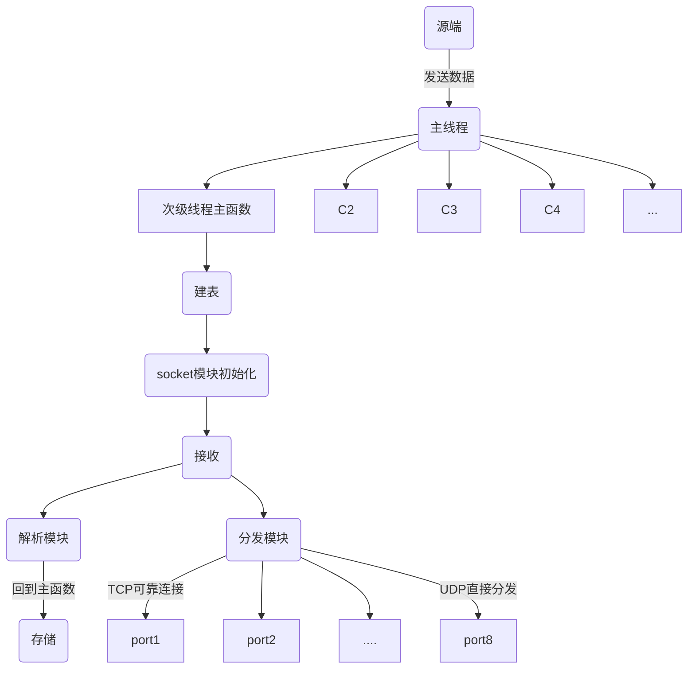
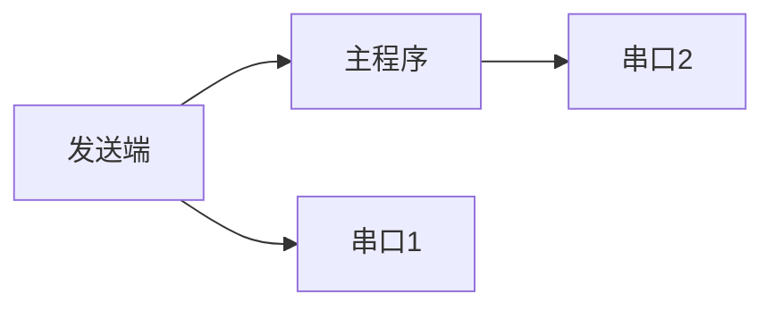

# 三亚船舶项目

项目关键字：
RecAIS_GPS_HDT

## 后续优化日志

[10.14]
项目问题仍然存在，本次接收到反馈，项目上船之后出现AIS、GPS数据只能短暂维持连接的情况，并且另外两个数据无误。
针对此类情况确定之后的完善目标：

1. 定位并解决GPS和AIS连接问题。猜测本地与上游数据端有问题。
2. 将程序封装成软件并且完成一个QT或者MFC界面，以方便调试。

NMEAParser;NMEAParser/NMEAParser;include;include/inc;include/inc/include;include/inc/include/tzdbcom;ais;src;%(
AdditionalIncludeDirectories)

### 备用方案

4. 串口动态分配。其实一个端口可以响应多个连接。本程序不存在对下端接收值，所以不用考虑缓冲区。
5. 服务器防火设置。

sendto 在5分钟左右 ，间歇性返回0。如果是短线那么就会出现这种情况。

## 技术调研方案

### 船舶项目远程更新方案

远程建立git仓库。
git clone ssh://git@holer.cc:50509/home/git/radar630.git

通过system()函数git pull仓库。

使用_findfirst()函数得到本地文件路径下内容，与static描述符进行比对验证。

通过一个时间线程实现。

### 船舶项目时统方案

方案基要：

1. 通过得到一个绝对正确的时间，进而在内部进行计时。

方案提要：

1. 船舶接收数据AIS与GPS中存在时间数据。是通过特殊设备得出的，可以保证正确性。
2. 连接网络获取数据。

技术概要：

1. 通过访问网站获取绝对时间：
   标准网站http://bjtime.cn/nt4.php
   通过socket实现。

```C++
SOCKET sockfd = socket(AF_INET, SOCK_STREAM, 0);
char szWeb[1024] = "bjtime.cn"; 
HOSTENT* pHost = gethostbyname(szWeb);
const char* pIPAddr = inet_ntoa(*((struct in_addr*)pHost->h_addr));

//填充sockaddr_in结构
address.sin_family = AF_INET;
address.sin_addr.S_un.S_addr = inet_addr(pIPAddr);
address.sin_port = htons(80);

int nRet = connect(sockfd, (struct sockaddr*)&address, sizeof(sockaddr_in));
//发包内容
sprintf(szHttpRest, 
	"GET /nt4.php HTTP/1.1\r\nHost: bjtime.cn\r\nUpgrade-Insecure-Requests: 1\r\nUser-Agent: Mozilla/5.0 (Windows NT 10.0; Win64; x64) AppleWebKit/537.36 (KHTML, like Gecko) Chrome/91.0.4472.114 Safari/537.36\r\nAccept: text/html,application/xhtml+xml,application/xml;q=0.9,image/avif,image/webp,image/apng,*/*;q=0.8,application/signed-exchange;v=b3;q=0.9\r\nAccept-Encoding: gzip, deflate\r\nAccept-Language: zh-CN,zh;q=0.9\r\nConnection: close\r\n\r\n" );

nRet = send(sockfd, szHttpRest, strlen(szHttpRest) + 1, 0);
while (1)
{
	char szRecvBuf[2] = { 0 };
	nRet = recv(sockfd, szRecvBuf, 1, 0);
}
```

2. 内部时间统计：

QueryPerformanceFrequency()可以得知计算机系统最小时间单位频率。
QueryPerformanceCounter()时间差。
依赖头文件 <windows.h>， 或者直接使用Sleep();

```C++
//计算频率
QueryPerformanceFrequency(&freq_);
//begin和end时间节点
QueryPerformanceCounter(&end_time);
//得出时间差值
elapsed_ += (end_time.QuadPart - begin_time_.QuadPart) * 1000000 / freq_.QuadPart;
```

### 取数据调研方案

2.4s可产生10条左右数据。
每天可能产生36w条数据，20天共计，720w条数据。
测试，从720w条数据中取出36w条数据所需要的时间单位。
flags = 1 Btree
flags = 4 kbtree

测试1：
无索引数据库，时间为固定20个值 :TRA202107221015.aed

input filename:
> > FIle name  :TRA202107221015.aed
> > Datatype :4280916
> > AgilorE version 2.0.1
> > Create database successful!
> > Table has already created
> > select * from Testtable7 where nTime = 1626920149
> > TRACK | count | id | aisFusionMmsi | createTime | rangeMetres | azimuthDegrees | speedMps | courseDegrees |
> > sizeMetres |
> > sizeDegrees | nTime |
-------------------------------
数据总条数 ：7200020
查询数据条数 ：360001
用时 : 3.00389秒

测试2：
建立B数索引，为时间，时间为固定20个值 : TRA202107221133.aed

input filename:
> > FIle name  :TRA202107221133.aed
> > Datatype :4280916
> > AgilorE version 2.0.1
> > Create database successful!
> > Table has already created
> > select * from Testtable7
> > TRACK | count | id | aisFusionMmsi | createTime | rangeMetres | azimuthDegrees | speedMps | courseDegrees |
> > sizeMetres |
> > sizeDegrees | nTime |
> > TRACK | 1 | 84 | 0 | 1626924813 | 145.805496 |
> > TRACK | 360001 | 84 | 0 | 1626924813 | 145.805496 |
> > TRACK | 720001 | 84 | 0 | 1626924814 | 145.769135 |
> > TRACK | 1080001 | 84 | 0 | 1626924816 | 145.802414 |
> > TRACK | 1440001 | 84 | 0 | 1626924818 | 145.744644 |
> > TRACK | 1800001 | 84 | 0 | 1626924819 | 145.774445 |
> > TRACK | 2160001 | 84 | 0 | 1626924820 | 145.992523 |
> > TRACK | 2520001 | 84 | 0 | 1626924823 | 146.109955 |
> > TRACK | 2880001 | 84 | 0 | 1626924824 | 146.183105 |
> > TRACK | 3240001 | 84 | 0 | 1626924825 | 146.120819 |
> > TRACK | 3600001 | 84 | 0 | 1626924826 | 146.098114 |
> > TRACK | 3960001 | 84 | 0 | 1626924827 | 146.097580 |
> > TRACK | 4320001 | 84 | 0 | 1626924828 | 146.097031 |
> > TRACK | 4680001 | 84 | 0 | 1626924832 | 145.919907 |
> > TRACK | 5040001 | 84 | 0 | 1626924833 | 145.863693 |
> > TRACK | 5400001 | 84 | 0 | 1626924834 | 145.808929 |
> > TRACK | 5760001 | 84 | 0 | 1626924835 | 145.754135 |
> > TRACK | 6120001 | 84 | 0 | 1626924836 | 145.927231 |
> > TRACK | 6480001 | 84 | 0 | 1626924836 | 145.910126 |
> > TRACK | 6840001 | 84 | 0 | 1626924837 | 145.648636 |
> > TRACK | 7200001 | 84 | 0 | 1626924838 | 145.706131 |
-------------------------------
数据总条数 ：7200020
查询数据条数 ：7200041
用时 : 1.85379秒

测试3：
TRA202107221515.aed
有索引，最新版

后续以时间为索引，进行加速查询。

后期拟开发，嵌入式数据库加入抽析模块，提供通信端口进行访问数据。

## 项目结构

包名： db_Mem
文件名：
公用文件：
db_RecAIS_GPS_HDT.cpp
db_RecAIS_GPS_HDT.h
配置文件：
dbconfig.h
数据体下的文件： ais_table.cpp
数据体下的文件： ...
函数名 ：
主线程函数 | db_main() |
次级线程函数 | DWORD WINAPI db_Storage(LPVOID args) | 主要负责建表，接收，以及存储
Socket初始化与连接 ：  
init_socket
*分析函数，数据解析：  
ais_table_trans(_AISData aisData, AIS_table ais)
分发函数：

结构体 ：
判断结构体标识枚举： Data_type
指令集合： thread_data
各个数据结构体： AIS_table
结构体描述： ais_descriptor

说明：
1 .64个端口，并且优化选项
2 .IP地址预留优化

socket 接收数据的时候需要connect，不需要额外bind；发送数据时需要bind，但是并没有写connect。

## 模块设计

1. 程序结构设计完成。

1. 主模块。负责数据库创建 - 接收数据 - 存储数据

    - [x] 已完成。目前只需要传递指令结构体void*指针。

2. socket模块。初始化，与源端取得连接

    - [x] TCP方式已完成。

3. 解析模块。与数据项数相同，负责解析 - 分配内存空间

    - [x] 完成了三个数据的解析模块。

4. 分发模块。发送到8个不同端口

    - [x] 初步完成TCP端设计和原始代码。

5. 管道模块。将程序状态发送到管道，由监控程序进行接收。并且从管道接收监控程序命令。

    - [x] 完成。

6. 监控程序。远程更新。

7. 时统模块。

### 主程序流程



## 数据细节

### 服务器端口

本机IP : 192.168.1.154
接受数据 : 192.168.1.254

vlw和vbw数据在同一端口，转发，但只保存vlw。

GPS : 4001
AIS : 4005
HDT : 4006
VLW : 4003

## 监控程序设计

功能点：

1. 重启，更新。
2. 提供远程信息。
3. 修改配置文件内容。
4. 查看端口情况。
5. 另开辟一个线程用于与其他地方进行通信。

如何嵌入现有项目中：
全局变量继承管道参数。向管道内写入数据。

开辟一个线程，增加一个记录状态的数据结构，增加管道。

### 监控程序设计概要

1. 读写模块，拥有文件写权限。考虑文件锁。
2. 主程序运行，不再等待而是双工通信。能够单项写就能够双向写。
   分配好内存与线程之后，进入shell。
3. 次级线程，运行主要程序部分，保证子程序宕机之后仍然可以重启。
4. 第二线程程序，负责向其他程序进行通信。
5. shell。主程序中运行。调度命令。

### 模块设计

1. 读写模块
2. 管道通信
3. shell界面
4. 日志文件读写
5. 协议解析模块

### 项目文件结构

资源文件 : dbR_monitor
公用文件 : 	
global.cpp
global.h
配置文件 :
config.h
主程序文件 :
dbr_main.h
dbr_main.cpp

### 协议准则

发送n字节字符串。

1. 时间戳
2. 包验证
3. 端口运行状态

### 指令支持

start , 开始命令，一般在执行close命令后需要开启则使用该命令。
status , 查看当前的运行状态。
reset , 通过强制的命令，对主程序进行关闭重启。
update , 更新配置文件内容。格式为 update 标识符 值
install , 远程更新或者下载程序。
restart , 以和平的方式通知主要程序，进行关闭重启。
close, 以和平的方式进行关闭程序，并不重启。
sleep, 持续提供程序当前状态，按q唤醒。
exit , 和平关闭主程序，退出所有资源程序。
help , 显示指令帮助信息。

```C++
    {start , 0, "start" , "Start cycle management"},//开始一个程序
    {status , 0, "status" ,"Show a status"},//展示目前情况
    {restart , 0, "reset" ,"Forcibly stop relying on cycle management to start"},//和平重启
    {update_ini , 0 ,"update" , "Update the content of the configuration file"},//更新配置文件
    {install , 0 , "install" , "Download main file, or update the main exe file" },
    {restart_ , 0, "restart" , "Peaceful communications restart"},//和平关闭
    {close_, 0 ,"close", "Peaceful communications close"},
    {sleep, 0, "sleep" , "Keep the output status, press q to exit"},
    {exit_db , 0, "exit" ,"Peaceful communication, close all resources" },//强制关闭
    {help , 0, "help" ,"Command line and description"},//帮助，显示所有命令
```

## 时统模块设计

定义一个类，满足以下功能：

1. 初始化时得到绝对正确的时间。
2. 调用一个方法得到目前的时间。
3. 可以暂停时间，开始，或者重新开始。即对某一段位置时间做计算。

在整个程序中传递一个类，该类中含有绝对正确的时间。
想要计时，重新定义一个类进行计算即可。
这个类的获取绝对时间函数可以重写。
自动校验时间开放接口。

保留最源的时间，并且生成源时间时就赋予绝对时间。

### 时统模块详细设计

定义一个类，DB_Time。该类可以进行计时，停止，得到最近的一次计时的时间，以及获取从最初到目前的时间。

定义类如下：

```C++
class DB_Time
{
private:
	LARGE_INTEGER freq_;//性能计数器频率，表示每秒执行计数器次数
	LARGE_INTEGER orign_time_;//对象起始计数单位
	LARGE_INTEGER begin_time_;
	LARGE_INTEGER end_time;
	long long elapsed_;//以微秒为单位的时间
public:
	DB_Time(): elapsed_(0){
		QueryPerformanceFrequency(&freq_);
		QueryPerformanceCounter(&orign_time_);
	}
	~DB_Time() {}
public:
	//-------------------------
	void ini() {
		QueryPerformanceCounter(&orign_time_);
	}
	void set() {
		QueryPerformanceCounter(&end_time);
		//其中1000*1000 为秒到微秒的转换
		elapsed_ += (end_time.QuadPart - begin_time_.QuadPart) * 1000000 / freq_.QuadPart;
		begin_time_ = end_time;
	}
	void start(){
		QueryPerformanceCounter(&begin_time_);
	}
	void stop(){//产生一个和上一次reset或者restart的差值
		QueryPerformanceCounter(&end_time);
		//其中1000*1000 为秒到微秒的转换
		elapsed_ += (end_time.QuadPart - begin_time_.QuadPart) * 1000000 / freq_.QuadPart;
	}
	//产生一个和源时间的差值
	void reset(){
		QueryPerformanceCounter(&end_time);
		//其中1000*1000 为秒到微秒的转换
		elapsed_ = (end_time.QuadPart - orign_time_.QuadPart) * 1000000 / freq_.QuadPart;
		begin_time_ = end_time;
	}
	//微秒
	double elapsed(){
		return static_cast<double>(elapsed_);
	}
	//毫秒
	double elapsed_ms(){
		return elapsed_ / 1000.0;
	}
	//秒
	double elapsed_second(){
		return elapsed_ / 1000000.0;
	}
};
```

使用方式：

1. 计时
2. 获取当前相对时间

## 缓冲区设计

目前版本采用直接处理的方式。
使用循环队列。但是其中必须要考虑的情况是队尾未有截断。

## 优化日志

6月20日开始计算。

[6.20]

1. 需要一个用户手册。
2. 设计监控程序。
3. 远程更新。
6. gps数据也存在多种数据，需要过滤，考虑返回值问题解决，data->table不在接受指针。

[7.01]
解决数据丢失问题

### BUG记录

1. 数据丢失。
2. 配置文件读取。
3. 线程资源分配。

## 测试细节

### 测试方案



### 测试

\| *[0-9]* *\|

[0624 11:04]
测试1 | 40
发送端和串口2进行对比: 20/34392 = 0.087%
主程序和串口2：居然多了3数据。

测试2 | 40
发送端和串口1对比：
验证GPS和HDT无丢包。3930。

测试3 | 0
发送端与主程序比较：
AIS 223/33587 = 0.6639%
DBT 287/33587 = 0.8544%
GPS 6/6898 = 0.08%

测试4 | 0
发送端与串口1对比：无丢包。

测试6 | 0 | 无解析存储，无send
丢包率更大了。

关于主程序和串口2对比丢包率更大可能时因为粘包。
即一条数据中有多个包。

[0625 09:04]

测试1 | 0 | 无解析存储，无send，无UPD
丢包率变小，但是仍然存在，其中GPS存在丢包。
直接使用串口工具测量，都没有出现丢包的问题，说明还是程序有问题。

会不会是线程的问题呢。一个线程在阻塞，其他线程也会跟着阻塞。但是即使是这样也存在缓冲区。

测试2 | 0 | 无解析存储，无send，无UPD， 单个AIS线程

测试3 | 0 | 无解析存储，无send，无UPD， 单个AIS线程， 无管道线程
仍然存在丢包。

测试7 | TCP通信自测， 接收字节 2
AIS无丢包。但是有许多数据"!"符号不存在了。
会出现接收字节单位数据缺失。

测试8 | TCP通信自测， 接收字节 BUFFER_SIZE，阻塞
大量数据缺失产生，都可见。在同一个包后面。

测试9 | TCP通信自测， 接收字节 BUFFER_SIZE，阻塞
无任何处理过程，只需要将数据写入文件即可。
无丢失，但是在数据需要处理时，因为在缓冲区中，一次性全部读出，%s进行了截断，所以数据缺失。

# 附录

## 设备信息

服务器，密码为dell@2021

到底是谁买的服务器

### 船1

目标机 ：192.168.1.254
本机IP ：192.168.1.145

风速风向，4007
ais，4005
船首，4006
GPS ， 4001 ， 4004

## 船舶项目数据结构

数据采集，数据解析，
软件功能放在第一章，第三张着重讲述软件使用。

设备生成，串口接收：
AIS(船舶自动识别系统：周边船的位置信息),
GPS(定位系统：船只目前经纬度坐标),
HDT(船首指向),
VHW(计程仪：船舶速度),
VLW(相对水的里程), MWV(风速风向) ,
DBT(测深仪：深度)。

系统产生：
PLOT(点迹：雷达图像检测出来的目标位置和大小),
TRACK(航迹：点迹跟踪的结果，有速度，方向，ID)。

```C++
//数据类型枚举
enum Data_type {
	_ais = 5458241,//存储AIS字符串，公式为 [8, x00][8, S][8, I][8, A]
	_gps = 5460039,
	_hdt = 5522504,
	
	_vhw = 5720150,
	_mwv = 5658445,
	_dbt = 5521988,

	_plot = 5196880,
	_track = 4280916,  
};
```

010101110100110001010110 = 5721174 = vlw
010101110100001001010110 = 5718614 = vbw

```C++
	$VDVLW,100072.48,N,92882.55,N*6E
	$VDVBW,-0.0,,A,,,V*45
```

目前无法逆推自造验证的数据有AIS，PLOT，TRACK。
其中代码块中含有的类"-----------^---------"为验证码标识，指向验证数据。

### AIS

主要是使用第五个数据。但是第四个数据来看该数据应该有A和B两种类型。

	!AIVDO,1,1,,,16:5R=1000Wm2I6:KEcFq2:F0000,0*5A

	!AIVDM,1,1,,B,H68s6M@446222222222222222200,0*1D

	!AIVDM,1,1,,B,16:E;40P03WmTc2:JSN;BRdD2<1D,0*13

	!AIVDO,1,1,,,16:5R=1000Wm2I6:KEcFq2<H0000,0*52

	!AIVDM,1,1,,A,1000000P007m=Lf:Mm=unOvB0<0C,0*32

| 名称      | 数据类型        | 标识         | 备注           | 记录数据 | 完整性约束 | 字节数 |
|:--------|:------------|:-----------|:-------------|:-----|:------|:----|
| 信号类型    | aeci_int4_t | nType      |
| 船只和货物类型 | aeci_int4_t | nShipType  |
| 船舶识别号   | aeci_int4_t | nMmsi      |
| Imo编号   | aeci_int4_t | nImo       |
| 航行状态    | aeci_int4_t | nState     |
| 时间标记    | aeci_int4_t | nTimestamp |
|         |             |
| 纬度      | aeci_int4_t | nLatitude  | 需要除以600000   
| 经度      | aeci_int4_t | nLongitude | 需要除以600000   
| 行驶速度    | aeci_int4_t | nSpeed     |
| 对地航向    | aeci_int4_t | nCourse    |
| 船头航向    | aeci_int4_t | nHeading   | 相对于正北方的顺时针度数 
| 转向率     | aeci_int4_t | nROT       |
|         |             |
| 时间      | aeci_int4_t | nYear      |
| 时间      | aeci_int4_t | nMonth     |
| 时间      | aeci_int4_t | nDay       |
| 时间      | aeci_int4_t | nHour      |
| 时间      | aeci_int4_t | nMinute    |
| 时间      | aeci_int4_t | nSecond    |
| name    | char*       | szShipname |
|         |             |
| 中心到船头   | aeci_int4_t | nShipSizeA |
| 中心到船尾   | aeci_int4_t | nShipSizeB |
| 中心到左舷   | aeci_int4_t | nShipSizeC |
| 中心到右舷   | aeci_int4_t | nShipSizeD |

### GPS

此数据传输文件cpr中只有一个是变化的。

	$GPRMC,160309.00,A,1813.3707,N,10927.1978,E,0.0,176.4,101020,1.7,W,D,S*52
	$GPRMC,160310.00,A,1813.3707,N,10927.1978,E,0.0,176.4,101020,1.7,W,D,S*5A
	$GPRMC,160309.00,A,1813.3707,N,10927.1978,E,0.0,176.4,101020,1.7,W,D,S*52
	$GPRMC,160304.00,A,1815.3707,N,10926.1978,E,0.0,176.4,101020,1.7,W,D,S*5E
	------------^---------^------------^------------------------------------^

| 名称                                       | 数据类型         | 标识                    | 备注 | 记录数据 | 完整性约束 | 字节数 |
|:-----------------------------------------|:-------------|:----------------------|:---|:-----|:------|:----|
| < Time in GGA sentence                   | aeci_time_t  | m_timeGGA;            
| < hour                                   | aeci_int4_t  | m_nHour;              
| < Minute                                 | aeci_int4_t  | m_nMinute;            |
| < Second                                 | aeci_int4_t  | m_nSecond;            |
|                                          |              |
| < Fractional second                      | aeci_real8_t | m_dSecond;            |
| < Latitude (Decimal degrees, S < 0 > N)  | aeci_real8_t | 	m_dLatitude;         |
| < Longitude (Decimal degrees, W < 0 > E) | aeci_real8_t | 	m_dLongitude;        |
| < Altitude (Meters)                      | aeci_real8_t | m_dAltitudeMSL;       |
|                                          |              |
| < Status                                 | aeci_bool_t  | m_nStatus;            |
| < Speed over the ground in knots         | aeci_real8_t | 	m_dSpeedKnots;       |
| < Track angle in degrees True North      | aeci_real8_t | 	m_dTrackAngle;       |
| < Month                                  | aeci_int4_t  | m_nMonth;             |
|                                          |              |
| < Day                                    | aeci_int4_t  | m_nDay;               |
| < Year                                   | aeci_int4_t  | m_nYear;              |
| < Magnetic Variation                     | aeci_real8_t | m_dMagneticVariation; |

### HDT

	$HEHDT,069.9,T*29
	$HEHDT,069.9,T*29
	$HEHDT,070.2,T*2A
	$HEHDT,061.9,T*2B
	---------^------^

| 名称 | 数据类型   | 标识          | 备注 | 记录数据 | 完整性约束 | 字节数 |
|:---|:-------|:------------|:---|:-----|:------|:----|
|    | UINT64 | Timestamp   |
|    | char*  | HeadDegrees |

### VHW = 5720150

	$--VHW,2.2,T,3.0,M,2.2,N,2.2,K*h*h
	$--VHW,2.2,T,3.1,M,2.2,N,2.2,K*h*h
	---------------^------------------

	$VDVLW,100072.48,N,92882.55,N*6E
	$VDVBW,-0.0,,A,,,V*45
	
	010101110100110001010110 = 5721174 = vlw
	010101110100001001010110 = 5718614 = vbw

| 名称 | 数据类型         | 标识                | 备注 | 记录数据 | 完整性约束 | 字节数 |
|:---|:-------------|:------------------|:---|:-----|:------|:----|
|    | aeci_real8_t | Degress_True;     
|    | char         | T;                
|    | aeci_real8_t | Degrees_Magnetic; 
|    | char         | M;                
|    | aeci_real8_t | Knots;            
|    | char         | N;                
|    | aeci_real8_t | Kilometers;       
|    | char         | K;                
|    | aeci_bool_t  | Checksum;         

### MWV = 5658445

	$--MWV,1.0,a,2.2,a*hh
	$--MWV,1.1,a,2.2,a*hh
	$--MWV,1.2,a,2.2,a*hh
	$--MWV,1.3,a,2.2,a*hh
	$--MWV,1.4,a,2.2,a*hh
	$--MWV,1.5,a,2.2,a*hh
	---------^-----------

| 名称                      | 数据类型         | 标识                | 备注 | 记录数据 | 完整性约束 | 字节数 |
|:------------------------|:-------------|:------------------|:---|:-----|:------|:----|
| 0~360°  风角度             | aeci_real8_t | nWindAngle;       
| R=Relative,T=True 相对，绝对 | aeci_int1_t  | nReference;       
| 风速                      | aeci_real8_t | nWindSpeed;       
| K/M/N                   | aeci_int1_t  | nWindSpeedUnits;	 
| A=Data Valid            | aeci_int1_t  | nStatus;          
|                         | aeci_int4_t  | nChecksum;        

### DBT = 5521988

	$SDDBT,00305.0,f,0093.2,M,0050.9,F*03
	$SDDBT,00305.1,f,0093.2,M,0050.9,F*03
	$SDDBT,00305.2,f,0093.2,M,0050.9,F*03
	$SDDBT,00305.1,f,0093.2,M,0050.9,F*03
	-------------^-----------------------

| 名称     | 数据类型         | 标识             | 备注 | 记录数据 | 完整性约束 | 字节数 |
|:-------|:-------------|:---------------|:---|:-----|:------|:----|
| 深度，英尺  | aeci_real8_t | nDepthFeet;    
|        | aeci_int1_t  | f;             
| 深度，米   | aeci_real8_t | nDepthMeters;  
|        | aeci_int1_t  | M;             
| 深度，6英尺 | aeci_real8_t | nDepthFathoms; 
|        | aeci_int1_t  | F;             
| 检查     | aeci_real8_t | nChecksum;     

### PLOT = 5196880

| 名称                               | 数据类型            | 标识                   | 备注                  | 记录数据 | 完整性约束 | 字节数 |
|:---------------------------------|:----------------|:---------------------|:--------------------|:-----|:------|:----|
 /* Polar position */             | aeci_real4_t    | rangeMetres;         
 /* Polar position */aeci_real4_t | azimuthDegrees; 
|                                  |                 |                      | /* Bounding box. */ 
|                                  | aeci_real4_t    | startRangeMetres;    
|                                  | aeci_real4_t    | endRangeMetres;      
|                                  | aeci_real4_t    | startAzimuthDegrees; 
|                                  | aeci_real4_t    | endAzimuthDegrees;   
| /* 置信度*/                         | aeci_int4_t     | reserved04;          

### TRACK = 4280916

| 名称                                       | 数据类型        | 标识              | 备注                                                                              | 记录数据 | 完整性约束 | 字节数 |
|:-----------------------------------------|:------------|:----------------|:--------------------------------------------------------------------------------|:-----|:------|:----|
 /* Track ID (public) 航迹号*/               | aeci_int4_  | id;             
 /* 关联AIS的MMSI，如果没有AIS关联则为0*/             | aeci_int4_  | aisFusionMmsi;  
 //航迹起批时间                                 | aeci_int4_  | createTime;     
| //未启用                                    | //UINT8     | status;         | /* Track status (enum TrackState {Tentative = 1, Confirmed = 2, Deleted = 3})*/ 
| //未启用                                    | //UINT8     | numCoasts;      | /* Number of consecutive coasts */                                              
 /* Tracked Range 目标中心点距离 米*/             | aeci_real4_ | rangeMetres;    
 /* Tracked Azimuth  目标中心点方位角 度*/         | aeci_real4_ | azimuthDegrees; 
 /* Speed 航速*/                            | aeci_real4_ | speedMps;       
 /* Course 航向*/                           | aeci_real4_ | courseDegrees;  
 /* Smoothed size in metres 目标距离向长度 米*/   | aeci_real4_ | sizeMetres;     
 /* Smoothed size in degrees 目标方位向长度  度*/ | aeci_real4_ | sizeDegrees;    

## 代码存留

```C++
int printf_command(char* command ,char *nex) {
	int i = 0;
	int datatype = 0;
	char datatypestr[4] = { 0 };
	int port = 0;

	int cur = 5;
	char vec[8][6] = { 0 };
	char sendss = 0;

	char tmp[10] = { 0 };

	memcpy(&vec, &command[2], 8 * 6);
	//printf("%3d  %3d |", command[0] & 0xff, command[1]);
	_itoa(command[0] & 0xff, tmp, 10);
	memcpy(nex, tmp, 3);
	_itoa(command[1] & 0xff, tmp, 10);
	memcpy(&nex[3], tmp, 4 );

	for (i = 0;i < 8;i++) {
		//printf("[ ");
		nex[ 7+ i*6 ] = '[';

		datatype = 0;
		for (int i2 = 0; i2 < 3;i2++) {
			datatype += vec[i][i2] * (1 << (i2 * 8));
			datatypestr[i2] = vec[i][i2];
		}
		datatypestr[3] = '\0';
		//printf("%s ", datatypestr);
		memcpy(&nex[7+ i * 6 +1], datatypestr, 3);

		port = 0;
		port = vec[i][3] + vec[i][4] * (1 << (1 * 8));
		//printf("%d ", port);
		_itoa(port, tmp, 10);
		memcpy(&nex[7 + i * 6 + 1 + 3 + 1], tmp, 4);

		//for (int j = 0;j < 8;j++) {
		sendss = vec[i][5];
		//printf("%02x ", sendss&0xff);
		_itoa(sendss & 0xff, tmp, 10);
		memcpy(&nex[7 + i * 6 + 1 + 3 + 1 + 4], tmp, 4);
		//}
		
		//printf("] ");
		nex[7 + i * 6 + 1 + 3 + 1 + 4 + 4] = ']';
	}

	int timeL = 0;
	memcpy(&timeL, &command[50], 4);
	//printf("%d ", timeL);
	_itoa(timeL & 0xff, tmp, 10);
	strcat(nex, (tmp));

	//printf("\n");
	printf("%s", nex);

	return 1;
}
```

### 自造海量数据数据库

```C++
//次级线程函数
DWORD WINAPI db_Storage(LPVOID args)
{
	int code = 0;
	int rc1 = 0;//建表会话
	aeci_oid_t oid1 = NULL;
	int session = 0;//建库会话
	thread_data* data = (struct thread_data*)args;//主线程指令容纳
	struct thread_send send_data;
	int buffer_size = 200;//该数字小于BUFFER_SIZE
	//const int buffer_size = 200;//该数字小于BUFFER_SIZE
	char buffer[BUFFER_SIZE] = { 0 };//中间空间，用于socket接收数据//TODO
	SOCKET_BUFFER data_buffer;//数据缓冲区，循环队列，方便之后拆分线程//TODO
	HANDLE sendthread = NULL; //拟分发线程，UDP中为空，监听性质的阻塞资源
	SOCKET socket_send_udp = NULL;//UDP发送socket

	data_buffer.emtpyQueue();
	int size_count = 0;
	int count = -1;

	//初始化
	int sockfd = 0;
	int ret = 0;
	if (data->tcp_udp_type == _TCP_TYPE) {
		if (code = init_socket_tcp(&sockfd,  data->port , data->ip) < 0) {//建立向上连接的socket
			log_output("TCP init_socket_tcp initialization error! ", code);
			return code;
		}
		sendthread = Create_send_thread(data->socketall , &send_data, data->tcp_udp_type);//TCP发送线程监听连接
	}
	else {
		if (code = init_socket_udp(&sockfd, &ret, data->port) < 0) {
			log_output("UDP init_socket_udp initialization error! ", code);
			return code;
		}
		socket_send_udp = socket(AF_INET, SOCK_DGRAM, IPPROTO_UDP);
		if (socket_send_udp == -1)
		{
			log_output("UDP Socket initialization error! ", -3);
			return -3;
		}
		//sendthread = Create_send_thread(data->socketall, &send_data , data->tcp_udp_type);//UDP发送线程发送数据//方式1
		init_send_tcp_2(data->socketall);//UDP直接发送方式

		//设置缓冲区
		//int nSendBuf = 1 * 1024 * 1024;//设置为32K
		//setsockopt(socket_send_udp, SOL_SOCKET, SO_SNDBUF, (const char*)&nSendBuf, sizeof(int));
		//设置接收超时
		int nNetTimeout = RCV_OUT_TIME;
		setsockopt(sockfd, SOL_SOCKET, SO_RCVTIMEO, (char*)&nNetTimeout, sizeof(int));
	}

	//建库建表
	session = aeci_create((char_t*)data->dbname, (char_t*)data->fname, 0, 0x04, 4 * 1024 * 1024, 4 * 1024 * 1024, 512 * 1024, 0);
	if (session >= 0)
	{
		//log_output("AgilorE version 2.0.1" , data->datatype);
		log_output("Creating database!" , data->datatype);
		rc1 = aeci_create_table(session, data->tablename , data->des_size / sizeof(aeci_field_descriptor), data->descriptor);
		if (rc1 >= 0)
		{
			log_output("Create table successful.", data->datatype);
		}
		else if (rc1 == -19)
		{
			log_output("Table has already created.", data->datatype);
		}
		else
		{
			log_output("Create table failed with db code.", rc1);
			return rc1;
		}
	}

	while (swi == 1)//主要循环资源
	{

		//***************************************************
		
		//重新置为初始
		if (data_buffer.isEmtpy()) {
			data_buffer.emtpyQueue();
		}
		data_buffer.insertSetQueue(data_buffer.writePointer(), code);

#ifdef _TEST_ON
		cout << "***************************************" << endl;
		printf("Recv length : %d , port : %d\n", code , data->port);

		printf("isEnd : %d , length : %d\n", data_buffer.isEnd, data_buffer.length);
		printf("front : %d , rear : %d\n", data_buffer.front, data_buffer.rear);
#endif // _TEST_ON

		if (data->tcp_udp_type == _TCP_TYPE) {//TCP和UDP的不同处理方式//TODO
			size_count = data_buffer.coutQueue();
		}
		else {
			size_count = code;
		}

		while ((size_count) > 0) {
			count++;

#ifdef TEST_MORE
			if (count >= 20) {
				aeci_close(session);
				return 1;
			}
#endif // TEST_MORE

			data_buffer.takeOueue(buffer, size_count);

		//***************************************************
#ifdef _VERIFICATION_PACKGE_
			//if(datatype != _plot && datatype != _track)
			buffer_fetch(buffer, data->datypestr, count , data->path_v);
#endif //!_VERIFICATION_PACKGE_

			//分发模块：TCP选择性分发，UDP泛式分发
			db_send(data->socketall, buffer, data->tcp_udp_type, socket_send_udp);

			//data_buffer.delectOueue(size_count);
			//continue;

			//解析模块
			rc1 = table_trans(buffer , data->datatype , data->table);
			if (rc1 != 0) {

				//插入数据
				rc1 = aeci_insert_struct(session, data->tablename, data->table, &oid1);//table参数位置，可以解析未知结构结构体
#ifdef TEST_MORE	
				void* p = NULL;
				//(TRACK_table*)p.nTime = 0;
				TRACK_table* pt = NULL;

				for (int tq = 0;tq < 360000; tq++) {
					pt = (TRACK_table*)data->table;
					pt->nTime = count + tq;
					rc1 = aeci_insert_struct(session, data->tablename, pt, &oid1);
				}
				int x = aeci_commit(session);
#endif // TEST_MORE

				if (rc1 < 0)
				{
					aeci_commit(session);
					log_output("Insert record failed with db code,but continue.", rc1);
					//break;
				}
				//count++;
				if (FETCH_FRE(count , FRE_WRITE)) {//间隔提交<=100
					//aeci_commit(session);
				}
			}
			//***************************************************
			if (data->tcp_udp_type == _TCP_TYPE) {//TCP和UDP的不同处理方式//TODO
				data_buffer.delectOueue(size_count);
				size_count = data_buffer.coutQueue();
			}
			else {
				data_buffer.emtpyQueue();
				size_count = 0;
			}
		}
		//***************************************************

		buffer_size = data_buffer.absoulteSize();

		//接收模块
		if ((code = rev(data_buffer.writePointer(), buffer_size, &sockfd, data->tcp_udp_type, data->datatype, data->port, data->ip)) <= 0) {
			continue;
		}
		//查询
		//query_test(session ,  data->table ,data->tablename , data->datatype);
	}

	log_output("db_Storage out, info datatype.", data->datatype);
	log_output("The date count.", count);

	if (!FETCH_FRE(count, FRE_WRITE)) {//间隔提交<=100
		aeci_commit(session);
	}

	//TCP模式下强制终止该监听线程
	if (sendthread != NULL) {
		//TerminateThread(sendthread , -1);
		CloseHandle(sendthread);
		log_output("CloseHandle.", 1);
	}
	return NULL;
}
```

### 无线电数据存入

无线电：

文件存储目录：
雷达信号采集文件、IFF/TACAN信号采集文件、通信信号采集文件、卫星业务数据文件

文件路径入库：
雷达原始采集文件编目表
IFF/TACAN信号原始采集文件编目表
通信信号采集文件编目表

数据库表格：
雷达信号侦测数据表
通信定频信号侦测数据表
数据链信号侦测数据表
IFF信号侦测数据表
TACAN信号侦测数据表
AIS解析态势表
ACARS解译态势表
ADS-B态势表
重点雷达信号表
重点IFF信号表
超短波设备健康状态表
电子设备健康状态表
卫星设备健康状态表

## 脚本

```bash
open '_AISData';
select * from _AISData;
open 'HEHDT_Struct';
select * from HEHDT_Struct;
open 'Infrared_L_Path';
select * from Infrared_L_Path;
open 'Infrared_R_Path';
select * from Infrared_R_Path;
open 'MergeMes';
select * from MergeMes;
open 'Multimodal_Path';
select * from Multimodal_Path;
open 'RadarMultimodal';
select * from RadarMultimodal;
open 'Radar_S_Path';
select * from Radar_S_Path;
open 'Radar_X_Path';
select * from Radar_X_Path;
open 'RMC_Struct';
select * from RMC_Struct;
open 'SailDatabase';
select * from SailTable;
open 'TestPYDB_sonar_image';
select * from SignalSonarTarget;
select * from ImageSonarTarget;
open 'TrackPacket';
select * from TrackPacket;
open 'UserRadarIMG';
select * from UserRadarIMG;
open 'UserRectInfo';
select * from UserRectInfo;
open 'UserTarget';
select * from UserTarget;
open 'UserTargetIMG';
select * from UserTargetIMG;
open 'UserVedioIMG';
select * from UserVedioIMG;
open 'Visible_L_Path';
select * from Visible_L_Path;
open 'Visible_R_Path';
select * from Visible_R_Path;
open 'Wind_Struct';
select * from Wind_Struct;
exit;
exit;
```

```bash
open 'CETC_10_DB';
select * from GL_JK_CDBSBJK;
select * from GL_JK_DZSBJK;
select * from GL_JK_WXSBJK;
select * from XH_ZC_ADSGTZNSBJG;
select * from XH_ZC_AISDTB;
select * from XH_ZC_AISJTB;
select * from XH_ZC_ARGOUS;
select * from XH_ZC_CGDP;
select * from XH_ZC_CGSJL;
select * from XH_ZC_LD;
select * from XH_ZC_MZIFF;
select * from XH_ZC_SINCGARS;
select * from XH_ZC_SINCGARSPLJ;
select * from XH_ZC_SJLZNSBJG;
select * from XH_ZC_TACAN;
select * from XH_ZC_TP;
select * from XH_ZC_TPPLJ;
select * from XH_ZC_ZDIFF;
select * from XH_ZC_ZDLD;
select * from XX_JYTS_ACARS;
select * from XX_JYTS_ADSB;
select * from XX_JYTS_AIS;
select * from XX_YY_DTF;
select * from XX_YY_DX;
select * from XX_YY_HY;
select * from XX_YY_TSWZ;
select * from XX_YY_YJ;
select * from YS_DWTK;
select * from YS_LD;
select * from YS_TX;
exit;
exit;
```

## 数据查验存留[2023.3.14]

HEHDT_Struct - 13733519
'_AISData' - 3437673
'Infrared_L_Path' - 827
'Infrared_R_Path' - 739
'MergeMes' - 90
'Multimodal_Path' - 59047
'RadarMultimodal' - 56094
'Radar_S_Path' - 776
'Radar_X_Path' - 191
'RMC_Struct' - 1138942
'SailDatabase' - 6240299
'TrackPacket' - 3457018
'UserRadarIMG' - 0
'UserRectInfo' - 0
'UserTarget' - 0
'UserTargetIMG' - 0
'UserVedioIMG' - 0
'Visible_L_Path' - 1024
'Visible_R_Path' - 781
'Wind_Struct' - 2086095

SignalSonarTarget - 420620
ImageSonarTarget - 5388

GL_JK_CDBSBJK - 0
GL_JK_DZSBJK - 0
GL_JK_WXSBJK - 219
XH_ZC_ADSGTZNSBJG - 0
XH_ZC_AISDTB - 0
XH_ZC_AISJTB - 0
XH_ZC_ARGOUS - 0
XH_ZC_CGDP - 3317629
XH_ZC_CGSJL - 7312
XH_ZC_LD - 4230799
XH_ZC_MZIFF - 0
XH_ZC_SINCGARS - 0
XH_ZC_SINCGARSPLJ - 0
XH_ZC_SJLZNSBJG - 0
XH_ZC_TACAN - 0
XH_ZC_TP - 0
XH_ZC_TPPLJ - 0
XH_ZC_ZDIFF - 0
XH_ZC_ZDLD - 910646
XX_JYTS_ACARS - 12246
XX_JYTS_ADSB - 6356897
XX_JYTS_AIS - 379447
XX_YY_DTF - 364
XX_YY_DX - 35
XX_YY_HY - 46
XX_YY_TSWZ - 17390
XX_YY_YJ - 280
YS_DWTK - 0
YS_LD - 0
YS_TX - 0

# EOF
