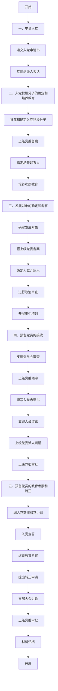

# 入党指南与思想汇报合集

## 入党流程图

## 入党主要流程

### 申请入党
**递交入党申请书**
- **条件**：年满十八岁的中国公民，承认党的纲领和章程，愿意参加党的组织并履行党员义务。
- **要求**：向所在单位党组织或居住地党组织递交书面申请。
- **注意**：本人提出，必须为书面申请。
- **材料模板**：
  - [入党申请书模板](http://download.people.com.cn/dangwang/one15559816091.doc)
  - [入党申请书撰写说明](http://download.people.com.cn/dangwang/one15559816411.doc)

**党组织派人谈话**
- **时间**：收到申请书1个月内。
- **主体**：党支部书记或组织委员。
- **内容**：了解申请人基本情况，介绍入党条件和程序。
- **材料模板**：
  - [谈话记录模板1](http://download.people.com.cn/dangwang/one15559816541.doc)
  - [谈话记录模板2](http://download.people.com.cn/dangwang/one15559816641.doc)

---

### 入党积极分子的确定和培养教育
**推荐和确定入党积极分子**
- **方式**：党员推荐、群团组织推优等。
- **决定**：由支部委员会讨论决定。
- **材料模板**：
  - [入党积极分子人选推荐表](http://download.people.com.cn/dangwang/one15559816911.doc)
  - [关于吸收为入党积极分子的决议](http://download.people.com.cn/dangwang/one15559817231.doc)

**上级党委备案**
- **内容**：提交入党申请人基本情况及支部意见。
- **材料模板**：
  - [备案报告模板](http://download.people.com.cn/dangwang/one15559817441.doc)

**指定培养联系人**
- **数量**：1-2名正式党员。
- **任务**：指导入党积极分子学习党的知识，定期汇报培养情况。
- **材料模板**：
  - [培养联系人资格审查表](http://download.people.com.cn/dangwang/one15559817641.doc)

**培养考察教育**
- **方法**：听党课、参加党内活动、集中培训等。
- **要求**：党支部每半年考察一次，基层党委每年分析一次。
- **材料模板**：
  - [培养考察登记表](http://download.people.com.cn/dangwang/one15559817771.doc)
  - [思想汇报撰写要求](http://download.people.com.cn/dangwang/one15559817881.doc)

---

### 发展对象的确定和考察
**确定发展对象**
- **条件**：培养考察一年以上，基本具备党员条件。
- **要求**：听取党小组、培养联系人及群众意见。
- **材料模板**：
  - [发展对象公示模板](http://download.people.com.cn/dangwang/one15559818311.docx)

**报上级党委备案**
- **要求**：提交发展对象的培养教育情况及支部意见。
- **材料模板**：
  - [预审请示模板](http://download.people.com.cn/dangwang/one15559819801.doc)

**确定入党介绍人**
- **数量**：两名正式党员。
- **注意**：介绍人需认真完成培养教育任务。

**进行政治审查**
- **内容**：审查政治历史、现实表现及主要社会关系。
- **材料模板**：
  - [政治审查报告模板](http://download.people.com.cn/dangwang/one15559819091.doc)

**开展集中培训**
- **时间**：不少于三天或24学时。
- **材料模板**：
  - [结业证书模板](http://download.people.com.cn/dangwang/one15559819281.doc)

### 预备党员的接收
**支部委员会审查**
- **要求**：征求党员和群众意见，集体讨论是否合格。
- **材料模板**：
  - [综合审查报告模板](http://download.people.com.cn/dangwang/one15559819691.doc)

**上级党委预审**
- **要求**：审查发展对象条件及手续是否完备。
- **材料模板**：
  - [预审意见模板](http://download.people.com.cn/dangwang/one15559819901.doc)

**填写入党志愿书**
- **要求**：由本人如实填写。
- **材料模板**：
  - [入党志愿书模板](http://download.people.com.cn/dangwang/one15559820001.doc)

**支部大会讨论**
- **程序**：汇报情况、介绍人意见、审查报告、讨论表决。
- **注意**：表决需无记名投票，赞成人数超过半数方可通过。
- **材料模板**：
  - [支部大会记录模板](http://download.people.com.cn/dangwang/one15559821101.docx)

**上级党委派人谈话**
- **目的**：进一步了解发展对象，提高其认识。
- **材料模板**：
  - [谈话记录模板](http://download.people.com.cn/dangwang/one15559821391.doc)

**上级党委审批**
- **要求**：集体讨论表决，三个月内完成审批。
- **材料模板**：
  - [批准入党通知书模板](http://download.people.com.cn/dangwang/one15559821631.doc)

---

### 预备党员的教育考察和转正
**编入党支部和党小组**
- **要求**：继续进行教育和考察。

**入党宣誓**
- **组织**：基层党委或党支部。
- **程序**：奏《国际歌》、宣誓、发言、讲话。
- **材料模板**：
  - [入党宣誓主持词模板](http://download.people.com.cn/dangwang/one15559821851.doc)

**继续教育考察**
- **方式**：参加组织生活、听汇报、集中培训等。
- **时间**：预备期为一年。

**提出转正申请**
- **要求**：预备期满，书面提出转正申请。
- **材料模板**：
  - [转正申请书模板](http://download.people.com.cn/dangwang/one15559822261.doc)

**支部大会讨论**
- **程序**：参照接收预备党员程序。
- **结果**：按期转正、延长预备期或取消资格。
- **材料模板**：
  - [支部大会讨论记录模板](http://download.people.com.cn/dangwang/one15559823481.doc)

**上级党委审批**
- **时间**：三个月内完成审批。
- **材料模板**：
  - [转正通知书模板](http://download.people.com.cn/dangwang/one15559824061.doc)

**材料归档**
- **内容**：《入党志愿书》、申请书、政审材料、转正申请书等。
- **要求**：存入人事档案或建立党员档案。

## 思想汇报

## 日志

[12.26]
提交申请。

[3.20]
后续要经常联系。