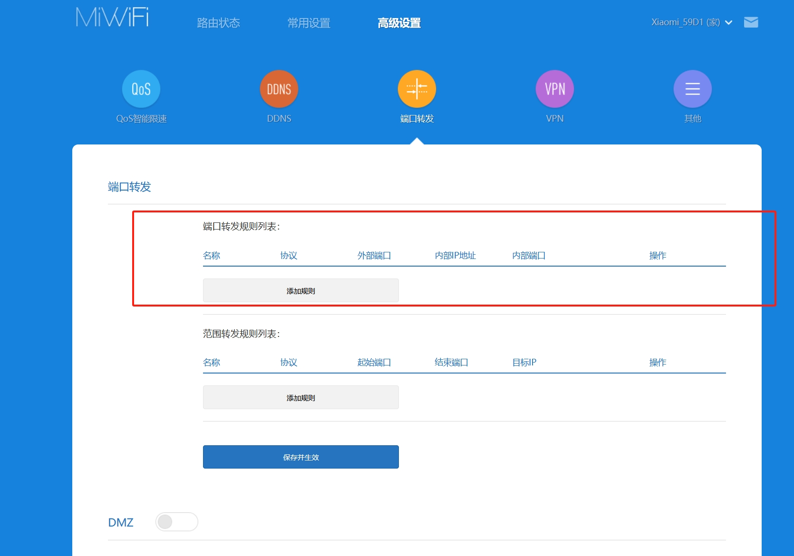

<link rel="stylesheet" type="text/css" href="../../auto-number-title.css" />

# 公网 ip 映射问题

在内网环境下，内网连接了互联网，目前内网环境的主机 A 启动了一个软件服务，其可以通过 192.168.1.104:2030 访问。
但是需要从互联网进行访问。如何进行运维工作。

## 基本原理

首先，内部设备通过一个路由器/路由软件与互联网相连是一个基本的网络架构。
软件在底层编程时，能够绑定到本机的指定网卡端口 host:{ip:port}，使用基本的 TCP/UDP 协议进行开发，也可使用更底层的 socket（RAW）原数据发送。
在此基础上，软件响该网卡端口的请求，即响应外部的数据包，并且双方以 HTTP/HTTPS 进行通信。
这样一来，通过浏览器 host:{ip:port}，就能够访问到该软件所提供的服务。
此时，只要在路由器中，将连接互联网的 ip 地址(公网 ip)指定端口，做*端口转发*，转发到部署软件的设备的指定 host:{ip:port} 即可。
这样，互联网上的其他设备能通过此 host:{公网ip:port} 访问到指定软件。

### 步骤

#### step1 搞定一个公网 ip

凡是连接到互联网，运营商有些会给定一个公网 IP，有些则是通过分配一个 100、10 等开头的内网 ip， 通过[网站](https://www.lddgo.net/network/getmyip)，能够检测到当前设备相对互联网 IP 地址。如果是 100、10 等开头的内网 ip，需要打电话给客服说你需要固定的公网 IP 就行，客服会直接帮你操作，一般来说 24 小时内就能搞定。
一般的，内网在重新连接到互联网的时候，有可能公网 ip 不是固定的，可以要求运营商客服给固定 ip；或者针对不固定的公网 ip ，可以使用动态域名服务 DDNS 进行解决，DDNS 一般路由器也会提供该功能。

#### step2 端口转发

通过路由器进行完成，登入路由器，路由器一般会有端口转发功能。

## 最简单的方案

采用第三方内网穿透工具，例如花生壳等，其包括各种诸如 `DDSN\内网穿透` 等技术。

## 其他储备

### 公网 IP

通过[网站](https://www.lddgo.net/network/getmyip)，能够检测到当前设备相对互联网 IP 地址。
如果是 100、10 等开头的 ip 则为内网，无法通过此 ip 进行访问；
如果是其他的，则为公网 ip。

私网地址有三个类别，分别是A类、B类和C类地址。它们的范围如下：

* A类地址：10.0.0.0-10.255.255.255，其中10.0.0.0是网络地址，10.255.255.255是广播地址。
* B类地址：172.16.0.0-172.31.255.255，其中172.16.0.0是网络地址，172.31.255.255是广播地址。
* C类地址：192.168.0.0-192.168.255.255，其中192.168.0.0是网络地址，192.168.255.255是广播地址。

Private Ip address space :

|    from     |       to        |
| :---------: | :-------------: |
|  10.0.0.0   | 10.255.255.255  |
| 172.16.0.0  | 172.31.255.255  |
| 192.168.0.0 | 192.168.255.255 |

### 网络地址转换(NAT)

NAT 允许将私有IP地址映射到公网地址，以减缓IP地址空间的消耗
* 需要连接Internet，但主机没有公网IP地址
* 更换了一个新的ISP，需要重新组织网络时，可使用NAT转换
* 需要合并两个具有相同网络地址的内网

### 端口映射

端口映射主要是解决连接了互联网的主机，将自身设备的端口映射到互联网 ip 的情形。
端口映射有三种情况，DDNS、内网穿透、直接绑定。

#### 直接绑定

即采用路由器直接绑定。

#### 内网穿透

内网穿透，也即 NAT 穿透，进行 NAT 穿透是为了使具有某一个特定源 IP 地址和源端口号的数据包不被 NAT 设备屏蔽而正确路由到内网主机。下面就相互通信的主机在网络中与 NAT 设备的相对位置介绍内网穿透方法。目前较为成熟稳定的是花生壳和神卓互联，花生壳的技术是 PHtunnel，神卓互联使用的是 WanGooe tunnel，和 nginx 架构一样都是采用 C 语言编写，性能上是比较优异的，适合很多嵌入式的设备搭载使用，而 frp 采用的是 Go 语言。

UDP 内网穿透的实质是利用路由器上的 NAT 系统。NAT 是一种将私有（保留）地址转化为合法 IP 地址的转换技术，它被广泛应用于各种类型 Internet 接入方式和各种类型的网络中。NAT 可以完成重用地址，并且对于内部的网络结构可以实现对外隐蔽。

网络地址转换（Network Address Translation，NAT）机制的问题在于，NAT 设备自动屏蔽了非内网主机主动发起的连接，也就是说，从外网发往内网的数据包将被 NAT 设备丢弃，这使得位于不同 NAT 设备之后的主机之间无法直接交换信息。这一方面保护了内网主机免于来自外部网络的攻击，另一方面也为 P2P 通信带来了一定困难。Internet 上的 NAT 设备大多是地址限制圆锥形 NAT 或端口限制圆锥形 NAT，外部主机要与内网主机相互通信，必须由内网主机主动发起连接，使 NAT 设备产生一个映射条目，这就有必要研究一下内网穿透技术。

#### 动态域名服务 DDNS

针对不固定的公网 ip ，可以使用动态域名服务 DDNS 进行解决，DDNS 一般路由器也会提供该功能。
但是用此方法，需要有一个域名。
