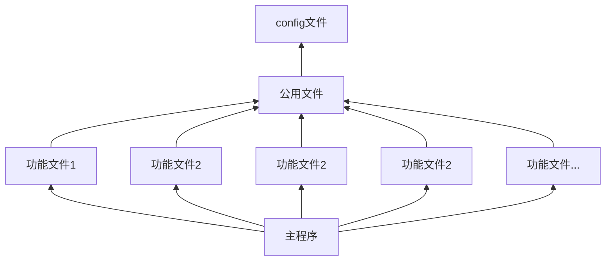

# C++基本项目开发思路

基本的开发思路

## 概要设计

从模块化的思想上进行，尽可能的明确系统中细分的各个主要模块。并且明确之间的联系。
其实一开始开发项目的时候不建议定义太多的文件，编码混乱并且会分散精力，而且初期的文件系统即使有充足的经验后期也是需要进行修正的。如果长期维护的话可能需要在前中期就进行重构。
所以比较好的方式是：在前期构建尽量少的文件系统，在需要的时候进行纵向扩展，在前中期的时候进行重构文件系统，获得比较健壮的项目体系。

## 项目文件结构

项目在创立初期需要考虑文件的引用结构。

一个.cpp文件，会伴随一个同名的.h头文件。

* .cpp文件内容:
    include"同名.h"，函数的定义。
* .h文件内容:
    函数的声明，宏定义，结构体。有时候也可以放全局变量，全局变量一般在公用文件中。
	特别的，无论是否在公用文件中定义了一个宏，在.h文件中都必要将文件中的宏额外定义出来。

### 文件引用结构

文件的流向问题。

最经典的结构是：


## 资源处理

涵盖了所有循环、监听以及阻塞资源

## Config文件优化

使用一个读函数，对配置文件进行读写。

## 版本迭代

版本迭代时不可避免的。
在开发的整体流程里，调研过程，产生元单位代码，元单位代码简单，往往包含关键技术，是实现项目功能的最小子单位，或者是最简框架单位；
开始开发，初步布局之后，产生第一代整体代码，第一代代码往往拥有很优良的规范，所有目标都十分明确具体；
产生了第一代整体代码后，必然会有需求改动或者

## 模块化思想

模块和功能之间的区别：
1. 功能侧重于描述软件的过程性，对应需求。
2. 模块侧重于描述软件的操作性，元操作组合之后成为模块。元操作体现为接口。

划分模块需要考虑：
1. 隔离模块边界
2. 模块间的跳转
3. 模块间的通信

### 接口回调

C语言中指针回调：表示指针变量中存放了一个变量地址，该指针变量可以间接调用存放变量地址的变量。

接口回调。指的是可以把实现某一接口的类创建的对象的引用赋值给该接口声明的接口变量，那么该接口变量就可以调用被类实现的接口方法。(其实当`接口变量`在调用被类实现的接口方法时，就是在通知相应的对象调用这个方法)

但是接口变量无法调用类中其他的非接口方法；
(类似于上转型对象调用子类重写的方法)

接口回调与多态
把实现接口的类的实例的引用赋值给接口变量后，该接口变量就可以回调类重写的接口方法。
不同的类在实现同一个接口时可能具有不同的实现方式，那么接口变量就在回调接口方法时可能具有多种形态。

### 模块合并

## 错误处理

建立自己的错误处理代码体系。

### 日志文件

将错误写到日志文件中。最直观的方法是，打开文件，追加写入，关闭文件。但是这样只能一条一条写入。

```C++
int output_log(const char* fmt, ...) {
	char fmtBuf[128];
	char msgBuf[1024];

	va_list args;
	va_start(args, fmt);
	FILE* fp;
	fp = fopen("/var/log/program.log", "a+" );
	if (fp != NULL)
	{
		memset(fmtBuf, 0x00, sizeof(fmtBuf));
		memset(msgBuf, 0x00, sizeof(msgBuf));
		snprintf(fmtBuf, sizeof(fmtBuf), "%s\n", fmt);
		vsnprintf(msgBuf, sizeof(msgBuf), fmtBuf, args);
		fprintf(fp, "%s", msgBuf);
		fclose(fp);
		fp = NULL;
	}
	va_end(args);
	return 1;
}
```

```C++
cout, rdbuf

void main( ) 
{
   ofstream file( "rdbuf.txt" );
   streambuf *x = cout.rdbuf( file.rdbuf( ) );
   cout << "test" << endl;   
   cout.rdbuf(x);
   cout << "test2" << endl;
}
```

## 规范化

### 初始化

无论什么数据都需要初始化，特别是指针。

### 函数返回值

函数返回值永远是错误码，而不是返回某个数据。或者返回指针结构体。

有一个启示，我们可以在 C++ 编程中使用类似的手段，不进行返回值作为错误码，而是以抛出异常的方式来进行错误分析。
在设计 C++ 接口时，我们将返回值和参数做有机的结合，而不将错误码归并到一起。

### 使用ifdef防止重定义，提高编译速度

使用的场景为头文件中，一般可以包含头文件引用，也可以不包含。主要是防止重复定义。

    #ifndef AIS_TABLE_H_
    #define AIS_TABLE_H_

    #endif //!AIS_TABLE_H_

### 版权声明

```C++
/**********************************************************************************
* @file     DBBTree.h
* @brief       BTree索引头文件
* @author      XXX
* @date        2020-06-19
* @version     V1.0
* @copyright   Copyright (c) 2020-2025  单位
**********************************************************************************
* @par 修改日志:
* <table>
* <tr><th>Date        <th>Version  <th>Author    <th>Description
* <tr><td>2020/06/09  <td>1.0      <td>XXX  <td>创建初始版本
* </table>
*
**********************************************************************************
*/
```

## 问题总结

1. 项目中为了底层接口的升级对现有接口进行重新封装再使用，封装函数中基本不做任何改动，有必要吗？
2. 头文件之间相互包含，合理吗
3. 头文件引用结构是线性的，合理吗

# EOF