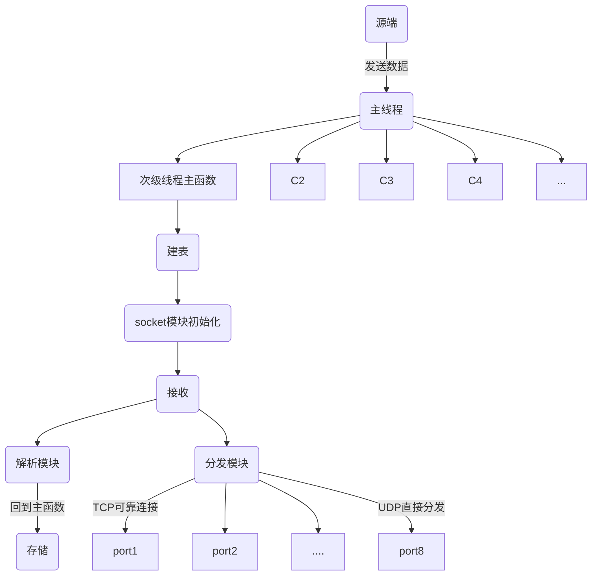

# 202104月项目报告

汇报人： 严林涛
汇报日期： 2021年4月30日

## 工作内容：

##### 一、eXtremeDB数据库测试方案：

1. 编写测试程序，对该方案中的告警数据库测试用例进行测试。并记录程序运行时间。

##### 二、 三亚船舶项目：

1. 依照既定方案进行设计主程序体系，编写程序。完成接收--存储--分发流程，并协同进行测试。
2. 编写模块：主程序设计、接收模块、分发线程模块、存储模块。协同完善顶层发送模拟器程序。
3. 数据调查：整理AIS，PLOT、TRACK数据，合并另外6个数据。
4. 扩展功能：配置文件、错误检查、包验证测试模块。
5. 理论支持：协同组员配合赵老师进行知识收集包含：socket在TCP与UDP方向编程(UDP两种方案)、socket编程I/O重叠模型监听多个端口、线程阻塞问题等。

##### 三、 后续工作

1. 进行RUST调研：RUST是否可以导出类C++库文件，在国产操作系统上运行；RUST在国产操作系统中的移植兼容等问题。
2. ODBC连接自主编写入DB，需求：提供远程接口进行访问。并后续测试C++、Python、Java语言对该种接口的连接问题与功能测试。
3. 完善三亚船舶项目：配置log日志文件，与测试组进行联系完成收尾工作。

## 附录

##### 1. 程序主体流程



##### 2. 船舶项目数据结构

```C++
//数据类型枚举
enum Data_type {
	_ais = 5458241,//存储AIS字符串，公式为 [8, x00][8, S][8, I][8, A]
	_gps = 5460039,
	_hdt = 5522504,
	
	_vhw = 5720150,
	_mwv = 5658445,
	_dbt = 5521988,

	_plot = 5196880,
	_track = 4280916,  
};
```

目前无法逆推自造验证的数据有AIS，PLOT，TRACK。
其中代码块中含有的类"-----------^---------"为验证码标识，指向验证数据。

###### AIS

主要是使用第五个数据。但是第四个数据来看该数据应该有A和B两种类型。

	!AIVDO,1,1,,,16:5R=1000Wm2I6:KEcFq2:F0000,0*5A

	!AIVDM,1,1,,B,H68s6M@446222222222222222200,0*1D

	!AIVDM,1,1,,B,16:E;40P03WmTc2:JSN;BRdD2<1D,0*13

	!AIVDO,1,1,,,16:5R=1000Wm2I6:KEcFq2<H0000,0*52

	!AIVDM,1,1,,A,1000000P007m=Lf:Mm=unOvB0<0C,0*32

|名称|数据类型|标识|备注|记录数据|完整性约束|字节数|
|:-|:-|:-|:-|:-|:-|:-|
|信号类型|aeci_int4_t |nType|
|船只和货物类型|aeci_int4_t |nShipType|
|船舶识别号|aeci_int4_t |nMmsi|
|Imo编号|aeci_int4_t |nImo|
|航行状态|aeci_int4_t |nState|
|时间标记|aeci_int4_t |nTimestamp|
|||
|纬度|aeci_int4_t |nLatitude|需要除以600000 
|经度|aeci_int4_t |nLongitude|需要除以600000
|行驶速度|aeci_int4_t |nSpeed|
|对地航向|aeci_int4_t |nCourse|
|船头航向|aeci_int4_t |nHeading| 相对于正北方的顺时针度数
|转向率|aeci_int4_t |nROT|
|||
|时间|aeci_int4_t |nYear|
|时间|aeci_int4_t |nMonth|
|时间|aeci_int4_t |nDay|
|时间|aeci_int4_t |nHour|
|时间|aeci_int4_t |nMinute|
|时间|aeci_int4_t |nSecond|
|name|char* |szShipname|
|||
|中心到船头|aeci_int4_t |nShipSizeA|
|中心到船尾|aeci_int4_t |nShipSizeB|
|中心到左舷|aeci_int4_t |nShipSizeC|
|中心到右舷|aeci_int4_t |nShipSizeD|

###### GPS

此数据传输文件cpr中只有一个是变化的。

	$GPRMC,160309.00,A,1813.3707,N,10927.1978,E,0.0,176.4,101020,1.7,W,D,S*52
	$GPRMC,160310.00,A,1813.3707,N,10927.1978,E,0.0,176.4,101020,1.7,W,D,S*5A
	$GPRMC,160309.00,A,1813.3707,N,10927.1978,E,0.0,176.4,101020,1.7,W,D,S*52
	$GPRMC,160304.00,A,1815.3707,N,10926.1978,E,0.0,176.4,101020,1.7,W,D,S*5E
	------------^---------^------------^------------------------------------^

|名称|数据类型|标识|备注|记录数据|完整性约束|字节数|
|:-|:-|:-|:-|:-|:-|:-|
|< Time in GGA sentence|aeci_time_t|m_timeGGA;
|< hour|aeci_int4_t|m_nHour;
|< Minute|aeci_int4_t|m_nMinute;|
|< Second|aeci_int4_t|m_nSecond;|
|||
|< Fractional second|aeci_real8_t|m_dSecond;|
|< Latitude (Decimal degrees, S < 0 > N)|aeci_real8_t|	m_dLatitude;|
|< Longitude (Decimal degrees, W < 0 > E)|aeci_real8_t|	m_dLongitude;|
|< Altitude (Meters)|aeci_real8_t|m_dAltitudeMSL;|
|||
|< Status|aeci_bool_t|m_nStatus;|
|< Speed over the ground in knots|aeci_real8_t|	m_dSpeedKnots;|
|< Track angle in degrees True North|aeci_real8_t|	m_dTrackAngle;|
|< Month|aeci_int4_t|m_nMonth;|
|||
|< Day|aeci_int4_t|m_nDay;|	
|< Year|aeci_int4_t|m_nYear;|
|< Magnetic Variation|aeci_real8_t|m_dMagneticVariation;|

###### HDT

	$HEHDT,069.9,T*29
	$HEHDT,069.9,T*29
	$HEHDT,070.2,T*2A
	$HEHDT,061.9,T*2B
	---------^------^

|名称|数据类型|标识|备注|记录数据|完整性约束|字节数|
|:-|:-|:-|:-|:-|:-|:-|
| |UINT64|Timestamp|
| |char*|HeadDegrees|

###### VHW = 5720150

	$--VHW,2.2,T,3.0,M,2.2,N,2.2,K*h*h
	$--VHW,2.2,T,3.1,M,2.2,N,2.2,K*h*h
	---------------^------------------

|名称|数据类型|标识|备注|记录数据|完整性约束|字节数|
|:-|:-|:-|:-|:-|:-|:-|
| |aeci_real8_t|Degress_True;
| |char|T;
| |aeci_real8_t|Degrees_Magnetic;
| |char|M;
| |aeci_real8_t|Knots;
| |char |N;
| |aeci_real8_t|  Kilometers;
| |char|K;
| |aeci_bool_t|Checksum;

###### MWV = 5658445

	$--MWV,1.0,a,2.2,a*hh
	$--MWV,1.1,a,2.2,a*hh
	$--MWV,1.2,a,2.2,a*hh
	$--MWV,1.3,a,2.2,a*hh
	$--MWV,1.4,a,2.2,a*hh
	$--MWV,1.5,a,2.2,a*hh
	---------^-----------

|名称|数据类型|标识|备注|记录数据|完整性约束|字节数|
|:-|:-|:-|:-|:-|:-|:-|
|0~360°  风角度|aeci_real8_t|nWindAngle;
|R=Relative,T=True 相对，绝对|aeci_int1_t|nReference;
| 风速|aeci_real8_t|nWindSpeed;
|K/M/N|aeci_int1_t|nWindSpeedUnits;	
|A=Data Valid|aeci_int1_t|nStatus;
|   |aeci_int4_t|nChecksum;

###### DBT = 5521988

	$SDDBT,00305.0,f,0093.2,M,0050.9,F*03
	$SDDBT,00305.1,f,0093.2,M,0050.9,F*03
	$SDDBT,00305.2,f,0093.2,M,0050.9,F*03
	$SDDBT,00305.1,f,0093.2,M,0050.9,F*03
	-------------^-----------------------

|名称|数据类型|标识|备注|记录数据|完整性约束|字节数|
|:-|:-|:-|:-|:-|:-|:-|
|深度，英尺|aeci_real8_t|nDepthFeet;
|    |aeci_int1_t|f;
|深度，米|aeci_real8_t|nDepthMeters;
|    |aeci_int1_t|M;
|深度，6英尺|aeci_real8_t|nDepthFathoms;
|    |aeci_int1_t|F;
|检查|aeci_real8_t|nChecksum;

###### PLOT = 5196880

|名称|数据类型|标识|备注|记录数据|完整性约束|字节数|
|:-|:-|:-|:-|:-|:-|:-|
/* Polar position */|aeci_real4_t|rangeMetres;  
/* Polar position */aeci_real4_t|azimuthDegrees; 
||||/* Bounding box. */
|    |aeci_real4_t|startRangeMetres;
|    |aeci_real4_t|endRangeMetres;
|    |aeci_real4_t|startAzimuthDegrees;
|    |aeci_real4_t|endAzimuthDegrees;
|/* 置信度*/|aeci_int4_t|reserved04;

###### TRACK = 4280916

|名称|数据类型|标识|备注|记录数据|完整性约束|字节数|
|:-|:-|:-|:-|:-|:-|:-|
/* Track ID (public) 航迹号*/|aeci_int4_| id; 
/* 关联AIS的MMSI，如果没有AIS关联则为0*/|aeci_int4_| aisFusionMmsi;
//航迹起批时间|aeci_int4_| createTime;
|   //未启用|//UINT8 |status; | /* Track status (enum TrackState {Tentative = 1, Confirmed = 2, Deleted = 3})*/
|   //未启用|//UINT8 |numCoasts; |/* Number of consecutive coasts */
/* Tracked Range 目标中心点距离 米*/|aeci_real4_| rangeMetres; 
/* Tracked Azimuth  目标中心点方位角 度*/|aeci_real4_| azimuthDegrees; 
/* Speed 航速*/|aeci_real4_| speedMps; 
/* Course 航向*/|aeci_real4_| courseDegrees; 
/* Smoothed size in metres 目标距离向长度 米*/|aeci_real4_| sizeMetres; 
/* Smoothed size in degrees 目标方位向长度  度*/|aeci_real4_| sizeDegrees; 
