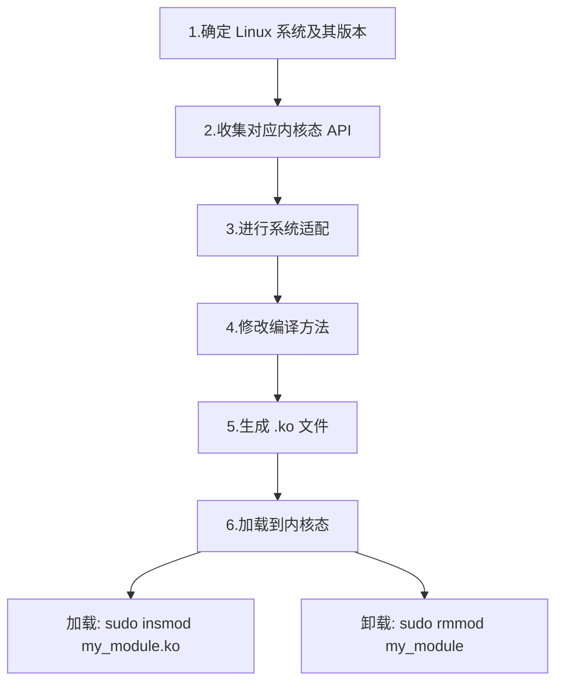
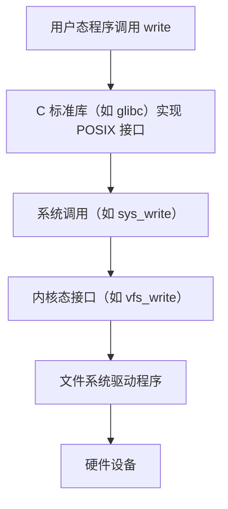
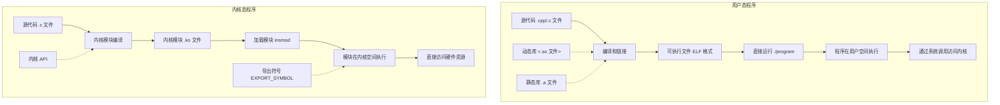
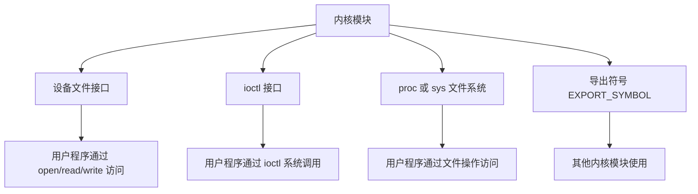

<link rel="stylesheet" type="text/css" href="../../auto-number-title.css" />

# UNIX 内核态

在UNIX操作系统中，内核态（Kernel Mode）是指操作系统运行在最高权限级别的状态，能够直接访问硬件资源和执行特权指令。与内核态相对立的是用户态（User Mode），其是运行普通应用程序的状态，权限受到限制，无法直接操作硬件或访问关键系统资源。

具体体现是：
当进程运行在内核空间时就处于内核态，而进程运行在用户空间时则处于用户态。

## 项目修改意见

对于现存已经适配 linux 系统 POSIX 接口的 C++ 项目。
其修改到内核态流程为：



在上述流程中：

1. **确定 Linux 系统及版本**：不同版本的 Linux 内核 API 可能有差异
2. **收集内核态 API**：查找用户态 API 对应的内核态替代函数
3. **系统适配**：将代码中的用户态函数替换为对应的内核态函数
4. **修改编译方法**：创建适用于内核模块的 Makefile
5. **生成 .ko 文件**：编译生成内核模块对象
6. **加载到内核态**：使用 insmod 加载模块，使用 rmmod 卸载模块

## 总结

| **特性**           | **用户态程序**                              | **内核态程序**                              |
|---------------------|---------------------------------------------|---------------------------------------------|
| **运行环境**       | 用户空间                                    | 内核空间                                    |
| **编译产物**       | 可执行文件（如 ELF 格式）                   | 内核模块（`.ko` 文件）或内核映像的一部分    |
| **运行方式**       | 直接运行（如 `./program`）                  | 通过加载器加载（如 `insmod` 或 `modprobe`） |
| **库文件形式**     | 动态库（`.so` 文件）或静态库（`.a` 文件）   | 内核模块或导出符号（不使用 `.so` 文件）     |
| **权限**           | 受限，不能直接访问硬件                      | 完全权限，直接操作硬件                      |
| **错误影响**       | 通常只影响当前进程                          | 可能导致整个系统崩溃                        |

---

> **注意事项**
> - 用户态程序和内核态程序的运行机制是完全不同的，不能直接互换。
> - 如果需要用户态程序与内核态程序交互，可以通过以下方式：
>   - **系统调用**：用户态通过标准系统调用访问内核功能。
>   - **`ioctl` 接口**：用于用户态与内核模块的通信。
>   - **`/proc` 或 `/sys` 文件系统**：用户态可以通过这些虚拟文件系统与内核交互。


## 内核态与用户态区别

在内核状态下，进程运行在内核地址空间中，此时 CPU 可以执行任何指令。运行的代码也不受任何的限制，可以自由地访问任何有效地址，也可以直接进行端口的访问。
在用户状态下，进程运行在用户地址空间中，被执行的代码要受到 CPU 的诸多检查，其们只能访问映射其地址空间的页表项中规定的在用户态下可访问页面的虚拟地址，且只能对任务状态段(TSS)中 I/O 许可位图(I/O Permission Bitmap)中规定的可访问端口进行直接访问。

对于以前的 DOS 操作系统来说，是没有内核空间、用户空间以及内核态、用户态这些概念的。可以认为所有的代码都是运行在内核状态的，因而用户编写的应用程序代码可以很容易地让操作系统崩溃掉。
对于 Linux 来说，通过区分内核空间和用户空间的设计，隔离了操作系统代码(操作系统的代码要比应用程序的代码健壮很多)与应用程序代码。即便是单个应用程序出现错误也不会影响到操作系统的稳定性，这样其其的程序还可以正常的运行(Linux 是个多任务系统)。
所以，区分内核空间和用户空间本质上是要提高操作系统的稳定性及可用性。

| **特性**     | **内核态 API**                                               | **用户态 API**                                 |
| ------------ | ------------------------------------------------------------ | ---------------------------------------------- |
| **权限**     | 运行在内核态，具有最高权限，可直接访问硬件资源。             | 运行在用户态，权限受限，不能直接访问硬件资源。 |
| **作用**     | 提供对系统底层功能（如硬件控制、内存管理等）的访问。         | 提供对操作系统服务的间接访问。                 |
| **调用方式** | 通常通过内核模块或驱动程序实现，直接操作硬件或内核数据结构。 | 通过系统调用接口间接访问内核功能。             |
| **接口形式** | 内核开发者使用的接口，例如 Linux 内核中的内核函数。          | 用户程序使用的标准库函数，例如 POSIX 函数。    |
| **安全性**   | 需要非常小心，错误可能导致整个系统崩溃。                     | 受到操作系统保护，错误通常只影响当前进程。     |
| **运行环境** | 运行在操作系统内核中，直接与硬件交互。                       | 运行在用户空间，不能直接操作硬件。             |
| **开发场景** | 用于开发内核模块、驱动程序或操作系统本身。                   | 用于开发普通用户程序，如应用软件。             |

### 编程区别

#### 与POSIX

内核态接口通常没有像 POSIX 这样明确的、跨平台的标准。内核态接口的设计和实现通常取决于具体的操作系统内核。



#### API 区别

主要体现在 API 区别上，API 兼容指的是我们用户程序编程调用的如：open(), read(), write(), malloc(), free()之类的调用的是glibc库提供的库函数。API直接提供给用户编程使用，运行在用户态。我们经常说到的POSIX（Portable Operating System Interface of Unix）是针对API的标准，即针对API的函数名，返回值，参数类型等。POSIX兼容也就指定这些接口函数兼容，但是并不管API具体如何实现。

内核态接口的设计和实现通常取决于具体的操作系统内核。以下是一般 LINUX 系统(Ubuntu)的内核态 API 示例。

| **功能**     | **用户态 API**                                                                                              | **内核态 API**                                                              |
| ------------ | ----------------------------------------------------------------------------------------------------------- | --------------------------------------------------------------------------- |
| **文件系统** | - **API**：`open()`、`write()`、`close()`、`std::ofstream`                                                  | - **API**：`filp_open()`、`kernel_write()`、`filp_close()`                  |
|              | - **头文件**：`<fcntl.h>`、`<unistd.h>`、`<fstream>`                                                        | - **头文件**：`<linux/fs.h>`、`<linux/uaccess.h>`                           |
|              | - **示例**：                                                                                                | - **示例**：                                                                |
|              | ```cpp                                                                                               | ```c |                                                                             |
|              | #include <fcntl.h>                                                                                          | #include <linux/fs.h>                                                       |
|              | int fd = open("example.txt", O_WRONLY                                                                       | O_CREAT, 0644);                                                             | struct file *filp = filp_open("/example.txt", O_WRONLY | O_CREAT, 0644);
|              | write(fd, "Hello", 5);                                                                                      | kernel_write(filp, "Hello", 5, &filp->f_pos);                               |
|              | close(fd);                                                                                                  | filp_close(filp, NULL);                                                     |
|              | ```                                                                                                  | ```  |                                                                             |
| **信号量**   | - **API**：`sem_init()`、`sem_wait()`、`sem_post()`、`sem_destroy()`                                        | - **API**：`sema_init()`、`down()`、`up()`                                  |
|              | - **头文件**：`<semaphore.h>`                                                                               | - **头文件**：`<linux/semaphore.h>`                                         |
|              | - **示例**：                                                                                                | - **示例**：                                                                |
|              | ```cpp                                                                                               | ```c |                                                                             |
|              | #include <semaphore.h>                                                                                      | #include <linux/semaphore.h>                                                |
|              | sem_t sem;                                                                                                  | struct semaphore sem;                                                       |
|              | sem_init(&sem, 0, 1);                                                                                       | sema_init(&sem, 1);                                                         |
|              | sem_wait(&sem);                                                                                             | down(&sem);                                                                 |
|              | sem_post(&sem);                                                                                             | up(&sem);                                                                   |
|              | sem_destroy(&sem);                                                                                          |                                                                             |
|              | ```                                                                                                  | ```  |                                                                             |
| **锁**       | - **API**：`pthread_mutex_init()`、`pthread_mutex_lock()`、`pthread_mutex_unlock()`                         | - **API**：`spin_lock()`、`spin_unlock()`、`mutex_lock()`、`mutex_unlock()` |
|              | - **头文件**：`<pthread.h>`、`<mutex>`                                                                      | - **头文件**：`<linux/spinlock.h>`、`<linux/mutex.h>`                       |
|              | - **示例**：                                                                                                | - **示例**：                                                                |
|              | ```cpp                                                                                               | ```c |                                                                             |
|              | #include <pthread.h>                                                                                        | #include <linux/spinlock.h>                                                 |
|              | pthread_mutex_t lock;                                                                                       | spinlock_t lock;                                                            |
|              | pthread_mutex_init(&lock, NULL);                                                                            | spin_lock(&lock);                                                           |
|              | pthread_mutex_lock(&lock);                                                                                  | // 临界区代码                                                               |
|              | // 临界区代码                                                                                               | spin_unlock(&lock);                                                         |
|              | pthread_mutex_unlock(&lock);                                                                                |                                                                             |
|              | pthread_mutex_destroy(&lock);                                                                               |                                                                             |
|              | ```                                                                                                  | ```  |                                                                             |
| **线程**     | - **API**：`pthread_create()`、`pthread_join()`、`std::thread`                                              | - **API**：`kthread_run()`                                                  |
|              | - **头文件**：`<pthread.h>`、`<thread>`                                                                     | - **头文件**：`<linux/kthread.h>`                                           |
|              | - **示例**：                                                                                                | - **示例**：                                                                |
|              | ```cpp                                                                                               | ```c |                                                                             |
|              | #include <pthread.h>                                                                                        | #include <linux/kthread.h>                                                  |
|              | void* thread_func(void* arg) {                                                                              | int thread_func(void *data) {                                               |
|              | // 线程代码                                                                                                 | // 线程代码                                                                 |
|              | return NULL;                                                                                                | return 0;                                                                   |
|              | }                                                                                                           | }                                                                           |
|              | pthread_t thread;                                                                                           | struct task_struct *task;                                                   |
|              | pthread_create(&thread, NULL, thread_func, NULL);                                                           | task = kthread_run(thread_func, NULL, "thread_name");                       |
|              | pthread_join(thread, NULL);                                                                                 |                                                                             |
|              | ```                                                                                                  | ```  |                                                                             |
| **网络通信** | - **API**：`socket()`、`connect()`、`send()`、`recv()`                                                      | - **API**：`sock_create()`、`kernel_connect()`、`kernel_sendmsg()`          |
|              | - **头文件**：`<sys/socket.h>`、`<netinet/in.h>`、`<arpa/inet.h>`                                           | - **头文件**：`<linux/net.h>`、`<linux/socket.h>`                           |
|              | - **示例**：                                                                                                | - **示例**：                                                                |
|              | ```cpp                                                                                               | ```c |                                                                             |
|              | #include <sys/socket.h>                                                                                     | #include <linux/net.h>                                                      |
|              | int sock = socket(AF_INET, SOCK_STREAM, 0);                                                                 | struct socket *sock;                                                        |
|              | struct sockaddr_in addr;                                                                                    | sock_create(PF_INET, SOCK_STREAM, IPPROTO_TCP, &sock);                      |
|              | addr.sin_family = AF_INET;                                                                                  | struct sockaddr_in addr;                                                    |
|              | addr.sin_port = htons(8080);                                                                                | addr.sin_family = AF_INET;                                                  |
|              | addr.sin_addr.s_addr = inet_addr("127.0.0.1");                                                              | addr.sin_port = htons(8080);                                                |
|              | connect(sock, (struct sockaddr*)&addr, sizeof(addr));                                                       | addr.sin_addr.s_addr = htonl(INADDR_LOOPBACK);                              |
|              | send(sock, "Hello", 5, 0);                                                                                  | kernel_connect(sock, (struct sockaddr*)&addr, sizeof(addr), 0);             |
|              | close(sock);                                                                                                | kernel_sendmsg(sock, &msg, &iov, 1, len);                                   |
|              | ```                                                                                                  | ```  |                                                                             |

## 内核态概念

使用 insmod 命令加载生成的 .ko 文件：

sudo insmod my_module.ko

查看已加载的驱动模块列表

lsmod

使用 dmesg 查看模块的初始化日志：

dmesg | tail

使用 rmmod 卸载模块：

sudo rmmod my_module

## 编译于运行

### 运行流程



### 用户态与内核态交互方式



这两个流程图清晰地展示了：

1. **用户态程序与内核态程序的完整生命周期**：
   - 从源代码到编译、链接
   - 生成的文件类型不同（可执行文件 vs. 内核模块）
   - 运行方式的差异（直接运行 vs. 加载到内核）
   - 执行环境的区别（用户空间 vs. 内核空间）

2. **内核模块与外部程序的交互方式**：
   - 设备文件接口（通过 /dev）
   - ioctl 系统调用
   - /proc 或 /sys 文件系统
   - 导出符号（供其他内核模块使用）

这些图表使得复杂的概念更加直观，帮助读者理解用户态和内核态程序在整个生命周期中的关键差异。

### 运行区别

#### **用户态运行**
- **运行环境**：
  - 用户态程序运行在用户空间（user space），是操作系统为普通应用程序分配的内存空间。
  - 用户态程序不能直接访问硬件资源，所有的硬件操作都必须通过系统调用与内核交互。

- **编译和生成**：
  - 用户态程序通常编译为可执行文件（例如 ELF 格式的二进制文件）。
  - **编译命令**：
    ```bash
    g++ -o my_program my_program.cpp
    ```
    - `my_program` 是一个可执行文件，运行时加载到用户空间。

- **运行方式**：
  - 用户态程序通过 shell 或其他方式启动，操作系统的加载器会将程序加载到用户空间并运行。
  - **运行命令**：
    ```bash
    ./my_program
    ```

- **库文件**：
  - 用户态程序可以动态链接共享库（`.so` 文件）或静态链接库（`.a` 文件）。
  - **动态库示例**：
    ```bash
    g++ -o my_program my_program.cpp -L/path/to/lib -lmylib
    ```
    - 动态库（`.so` 文件）在运行时由动态链接器加载。

---

#### **内核态运行**
- **运行环境**：
  - 内核态程序运行在内核空间（kernel space），是操作系统核心部分，拥有对硬件资源的完全控制权限。
  - 内核态程序不能像用户态程序一样直接运行，其必须被加载到内核中。

- **编译和生成**：
  - 内核态程序通常编译为模块文件（`.ko` 文件，在 Linux 上）或静态链接到内核映像。
  - **编译命令**：
    ```bash
    make -C /lib/modules/$(uname -r)/build M=$(pwd) modules
    ```
    - `/lib/modules/$(uname -r)/build` 是内核源码的构建目录。
    - 生成的文件通常是 `.ko` 文件（Kernel Object）。

> 命令拆解
>     
>     make -C /lib/modules/$(shell uname -r)/build:
> * -C 参数表示切换到指定目录后执行 make。
> 
> * /lib/modules/$(shell uname -r)/build 是 Linux 内核的构建目录，通常是 /usr/src/> kernels/<内核版本> 的符号链接。
> 
> $(shell uname -r) 会返回当前运行的内核版本，例如 5.15.0-60-generic。
> 
> * M=$(PWD):
> 
> M=\$(PWD) 告诉内核构建系统，模块的源代码在当前目录（$(PWD) 是当前路径）。
> 内核构建系统会在 M 指定的目录中查找模块的源代码（如 .c 文件）和 Makefile。
> 
> * modules:
> 
> modules 是内核构建系统的目标，表示编译内核模块（生成 .ko 文件）。

- **运行方式**：
  - 内核态程序不能直接运行，而是通过加载器加载到内核中。
  - 加载完成后自动运行。
  - **加载命令**：
    ```bash
    sudo insmod my_module.ko
    sudo rmmod my_module
    ```

- **库文件**：
  - 内核态程序不能直接使用用户态的动态库（`.so` 文件）。
  - 内核态程序只能使用内核提供的静态接口或内核模块之间的导出符号（`EXPORT_SYMBOL`）。

---

### **是否可以编译成一个可执行程序？**

#### **用户态程序**
- 用户态程序最终会编译成一个可执行程序（例如 ELF 格式的二进制文件）。
- 可执行程序可以直接运行。

#### **内核态程序**
- 内核态程序不会编译成可执行程序，而是编译成内核模块（通常是 `.ko` 文件）或内核映像的一部分。
- `.ko` 文件不能直接运行，而是通过加载器加载到内核中。

---

### **如果是库形式，是 `.so` 文件吗？**

#### **用户态库**
- 用户态程序的库通常是动态链接库（`.so` 文件）或静态库（`.a` 文件）。
- 动态库在运行时由动态链接器加载。

#### **内核态库**
- 内核态程序不能使用用户态的 `.so` 文件。
- 内核态的“库”通常是内核模块或内核导出的静态符号。
  - 内核模块其不是一能是库文件形式,单可以通过 `EXPORT_SYMBOL` 导出函数或变量，供其他模块使用。
  - **示例**：
    ```c
    // 在模块 A 中导出符号
    int my_function(int x) {
        return x * 2;
    }
    EXPORT_SYMBOL(my_function);

    // 在模块 B 中使用符号
    extern int my_function(int x);
    ```

---

### **如何将内核模块提供的功能给其他程序使用**

在 Linux 中，内核模块（通常是 `.ko` 文件）在加载后可以通过多种方式与用户态程序进行交互。以下是几种常见的方式及其实现方法：

---

#### **通过设备文件与模块交互**

##### **概述**
- 如果内核模块是一个设备驱动程序，加载模块后会在 `/dev` 目录下创建对应的设备文件。
- 用户态程序可以通过标准的文件操作（如 `open()`、`read()`、`write()`）访问设备文件，与模块交互。

##### **实现步骤**

###### **内核模块中创建设备文件**
在内核模块中注册字符设备，并实现 `read`、`write` 等操作：

```c
#include <linux/module.h>
#include <linux/fs.h>
#include <linux/uaccess.h>

#define DEVICE_NAME "my_device"
static int major;

// 设备文件的读操作
static ssize_t my_read(struct file *file, char __user *buf, size_t count, loff_t *pos) {
    char message[] = "Hello from kernel!";
    return simple_read_from_buffer(buf, count, pos, message, sizeof(message));
}

// 设备文件的写操作
static ssize_t my_write(struct file *file, const char __user *buf, size_t count, loff_t *pos) {
    char message[128];
    if (copy_from_user(message, buf, count)) {
        return -EFAULT;
    }
    printk(KERN_INFO "Received from user: %s\n", message);
    return count;
}

static const struct file_operations fops = {
    .read = my_read,
    .write = my_write,
};

static int __init my_module_init(void) {
    major = register_chrdev(0, DEVICE_NAME, &fops);
    if (major < 0) {
        printk(KERN_ERR "Failed to register device\n");
        return major;
    }
    printk(KERN_INFO "Device registered with major number %d\n", major);
    return 0;
}

static void __exit my_module_exit(void) {
    unregister_chrdev(major, DEVICE_NAME);
    printk(KERN_INFO "Device unregistered\n");
}

module_init(my_module_init);
module_exit(my_module_exit);

MODULE_LICENSE("GPL");
MODULE_AUTHOR("Your Name");
MODULE_DESCRIPTION("A simple device driver example");
```

#### **用户态程序访问设备文件**
通过用户态程序访问 `/dev/my_device`：

```c
#include <stdio.h>
#include <fcntl.h>
#include <unistd.h>

int main() {
    int fd = open("/dev/my_device", O_RDWR);
    if (fd < 0) {
        perror("Failed to open the device");
        return -1;
    }

    // 从设备读取数据
    char buffer[128];
    read(fd, buffer, sizeof(buffer));
    printf("Read from device: %s\n", buffer);

    // 向设备写入数据
    write(fd, "Hello Kernel", 12);

    close(fd);
    return 0;
}
```

---

#### **通过 `ioctl` 与模块交互**

##### **概述**
- `ioctl` 是一种系统调用，用于用户态程序向内核模块发送控制命令或传递数据。
- 适合用于实现复杂的控制操作。

##### **实现步骤**

###### **内核模块中实现 `ioctl`**
在内核模块中实现 `unlocked_ioctl` 方法：

```c
#include <linux/module.h>
#include <linux/fs.h>
#include <linux/uaccess.h>

#define DEVICE_NAME "my_device"
#define IOCTL_CMD_1 0x100
#define IOCTL_CMD_2 0x101

static int device_mode = 0;

static long my_ioctl(struct file *file, unsigned int cmd, unsigned long arg) {
    switch (cmd) {
        case IOCTL_CMD_1:
            printk(KERN_INFO "IOCTL_CMD_1 received\n");
            break;
        case IOCTL_CMD_2:
            if (copy_from_user(&device_mode, (int __user *)arg, sizeof(device_mode))) {
                return -EFAULT;
            }
            printk(KERN_INFO "Device mode set to %d\n", device_mode);
            break;
        default:
            return -EINVAL;
    }
    return 0;
}

static const struct file_operations fops = {
    .unlocked_ioctl = my_ioctl,
};

static int __init my_module_init(void) {
    int major = register_chrdev(0, DEVICE_NAME, &fops);
    if (major < 0) {
        printk(KERN_ERR "Failed to register device\n");
        return major;
    }
    printk(KERN_INFO "Device registered with major number %d\n", major);
    return 0;
}

static void __exit my_module_exit(void) {
    unregister_chrdev(0, DEVICE_NAME);
    printk(KERN_INFO "Device unregistered\n");
}

module_init(my_module_init);
module_exit(my_module_exit);

MODULE_LICENSE("GPL");
MODULE_AUTHOR("Your Name");
MODULE_DESCRIPTION("A simple ioctl example");
```

###### **用户态程序调用 `ioctl`**
通过用户态程序调用 `ioctl`：

```c
#include <stdio.h>
#include <fcntl.h>
#include <sys/ioctl.h>

#define IOCTL_CMD_1 0x100
#define IOCTL_CMD_2 0x101

int main() {
    int fd = open("/dev/my_device", O_RDWR);
    if (fd < 0) {
        perror("Failed to open the device");
        return -1;
    }

    // 发送 IOCTL 命令 1
    ioctl(fd, IOCTL_CMD_1);

    // 发送 IOCTL 命令 2，设置模式
    int mode = 1;
    ioctl(fd, IOCTL_CMD_2, &mode);

    close(fd);
    return 0;
}
```

---

#### **通过 `/proc` 或 `/sys` 文件与模块交互**

##### **概述**
- 内核模块可以通过 `/proc` 或 `/sys` 文件系统向用户态程序暴露接口。
- 用户态程序可以通过读取或写入这些文件与模块交互。

##### **实现步骤**

###### **在模块中创建 `/proc` 文件**
使用 `proc_create()` 创建 `/proc` 文件：

```c
#include <linux/module.h>
#include <linux/proc_fs.h>
#include <linux/uaccess.h>

#define PROC_NAME "my_proc_file"

static ssize_t my_proc_read(struct file *file, char __user *buf, size_t count, loff_t *pos) {
    char message[] = "Hello from kernel!";
    return simple_read_from_buffer(buf, count, pos, message, sizeof(message));
}

static const struct proc_ops proc_fops = {
    .proc_read = my_proc_read,
};

static int __init my_module_init(void) {
    if (!proc_create(PROC_NAME, 0, NULL, &proc_fops)) {
        printk(KERN_ERR "Failed to create /proc file\n");
        return -ENOMEM;
    }
    printk(KERN_INFO "/proc/%s created\n", PROC_NAME);
    return 0;
}

static void __exit my_module_exit(void) {
    remove_proc_entry(PROC_NAME, NULL);
    printk(KERN_INFO "/proc/%s removed\n", PROC_NAME);
}

module_init(my_module_init);
module_exit(my_module_exit);

MODULE_LICENSE("GPL");
MODULE_AUTHOR("Your Name");
MODULE_DESCRIPTION("A simple proc file example");
```

###### **用户态程序访问 `/proc` 文件**
通过用户态程序读取 `/proc/my_proc_file`：

```c
#include <stdio.h>

int main() {
    FILE *file = fopen("/proc/my_proc_file", "r");
    if (!file) {
        perror("Failed to open /proc file");
        return -1;
    }

    char buffer[128];
    fread(buffer, 1, sizeof(buffer), file);
    printf("Read from /proc: %s\n", buffer);

    fclose(file);
    return 0;
}
```


---

##### **使用 EXPORT_SYMBOL 的流程**

###### **概述**
- 默认情况下，内核模块中的符号（函数或变量）是私有的，其他模块无法直接访问。
- 使用 `EXPORT_SYMBOL` 或 `EXPORT_SYMBOL_GPL`，可以将模块中的符号导出到内核符号表中，使其对其他模块可见。

###### **两种导出方式**
1. **`EXPORT_SYMBOL`**：
   - 导出的符号对所有模块可用，无论模块是否是 GPL 兼容的。
2. **`EXPORT_SYMBOL_GPL`**：
   - 导出的符号仅对 GPL 兼容的模块可用，闭源模块无法使用。

###### **编写导出符号的模块**

在内核模块中，通过 `EXPORT_SYMBOL` 或 `EXPORT_SYMBOL_GPL` 导出函数或变量。

* **示例：导出函数**

```c
#include <linux/module.h>
#include <linux/kernel.h>

void my_function(void) {
    printk(KERN_INFO "my_function called from another module!\n");
}
EXPORT_SYMBOL(my_function); // 导出符号
```

* **示例：导出全局变量**

```c
#include <linux/module.h>
#include <linux/kernel.h>

int shared_variable = 42;
EXPORT_SYMBOL(shared_variable); // 导出全局变量
```

> **注意事项**
> - `EXPORT_SYMBOL` 必须放在符号定义的同一文件中，通常紧跟在符号定义之后。
> - 确保导出的符号名称唯一，避免与其他模块的符号冲突。

---

###### **编写使用导出符号的模块**

在另一个模块中，通过 `extern` 声明导出的符号，然后直接使用。

* **示例：调用导出的函数**

```c
#include <linux/module.h>
#include <linux/kernel.h>

// 声明外部函数
extern void my_function(void);

static int __init module_b_init(void) {
    printk(KERN_INFO "module_b loaded\n");
    my_function(); // 调用导出的函数
    return 0;
}

static void __exit module_b_exit(void) {
    printk(KERN_INFO "module_b unloaded\n");
}

module_init(module_b_init);
module_exit(module_b_exit);

MODULE_LICENSE("GPL");
MODULE_AUTHOR("Your Name");
MODULE_DESCRIPTION("A module that uses a function from another module");
```

* **示例：使用导出的全局变量**

```c
#include <linux/module.h>
#include <linux/kernel.h>

// 声明外部变量
extern int shared_variable;

static int __init module_b_init(void) {
    printk(KERN_INFO "module_b loaded, shared_variable = %d\n", shared_variable);
    return 0;
}

static void __exit module_b_exit(void) {
    printk(KERN_INFO "module_b unloaded\n");
}

module_init(module_b_init);
module_exit(module_b_exit);

MODULE_LICENSE("GPL");
MODULE_AUTHOR("Your Name");
MODULE_DESCRIPTION("A module that uses a variable from another module");
```

---

###### **加载模块**

1. 编译两个模块（`module_a` 和 `module_b`）：
   ```bash
   make
   ```

2. 先加载导出符号的模块（`module_a`）：
   ```bash
   sudo insmod module_a.ko
   ```

3. 再加载使用符号的模块（`module_b`）：
   ```bash
   sudo insmod module_b.ko
   ```

4. 查看内核日志，验证模块是否正常工作：
   ```bash
   dmesg
   ```

5. 卸载模块：
   ```bash
   sudo rmmod module_b
   sudo rmmod module_a
   ```

---

##### **EXPORT_SYMBOL_GPL 的使用**

如果使用 `EXPORT_SYMBOL_GPL` 导出符号，只有 GPL 兼容的模块可以使用该符号。

* **示例：导出函数**
```c
#include <linux/module.h>
#include <linux/kernel.h>

void my_function(void) {
    printk(KERN_INFO "my_function called from another module!\n");
}
EXPORT_SYMBOL_GPL(my_function); // 仅允许 GPL 模块使用
```

如果一个闭源模块尝试使用该符号，加载时会失败，并出现类似以下错误：
```
Unknown symbol: my_function
```

---

##### **EXPORT_SYMBOL 的工作原理**

###### **内核符号表**

- 当模块使用 `EXPORT_SYMBOL` 或 `EXPORT_SYMBOL_GPL` 导出符号时，内核会将这些符号记录到全局的符号表中。
- 符号表是一个内核维护的数据结构，包含了所有导出的符号及其地址信息。

###### **符号解析**

- 当使用符号的模块加载时，内核会在符号表中查找引用的符号。
- 如果找到匹配的符号，内核会完成符号链接，模块加载成功。
- 如果找不到符号，则模块加载失败，并报错 `Unknown symbol`。

---

##### **调试导出符号**

###### **查看内核符号表**
可以通过以下命令查看内核中的符号表：
```bash
cat /proc/kallsyms
```

###### **查看模块符号**
使用 `nm` 工具查看模块中导出的符号：
```bash
nm -g module_a.ko
```

---

##### **注意事项**

1. **模块加载顺序**：
   - 使用符号的模块必须在导出符号的模块加载之后。
   - 如果加载顺序不正确，可能会出现符号未定义的错误。

2. **符号冲突**：
   - 确保导出的符号名称唯一，避免与其他模块的符号冲突。

3. **GPL 限制**：
   - 如果使用 `EXPORT_SYMBOL_GPL`，确保使用符号的模块是 GPL 兼容的。

4. **模块依赖**：
   - 使用符号的模块会自动依赖于导出符号的模块，卸载时需要先卸载使用符号的模块。

---

##### **总结**

- **`EXPORT_SYMBOL`**：
  - 用于导出函数或变量，供其他模块使用。
  - 无限制，任何模块都可以使用。

- **`EXPORT_SYMBOL_GPL`**：
  - 仅允许 GPL 兼容的模块使用，保护内核的开源生态。

- **使用流程**：
  1. 在模块中通过 `EXPORT_SYMBOL` 或 `EXPORT_SYMBOL_GPL` 导出符号。
  2. 在其他模块中通过 `extern` 声明并使用符号。
  3. 确保模块加载顺序正确。

---

#### **总结**

- **设备文件**：通过 `/dev` 文件与模块交互，适合数据传输。
- **`ioctl`**：通过控制命令与模块交互，适合复杂的控制操作。
- **`/proc` 或 `/sys` 文件**：通过文件系统暴露接口，适合状态查询和简单配置。

根据模块的功能需求选择合适的交互方式。如果需要进一步指导，请随时联系！
